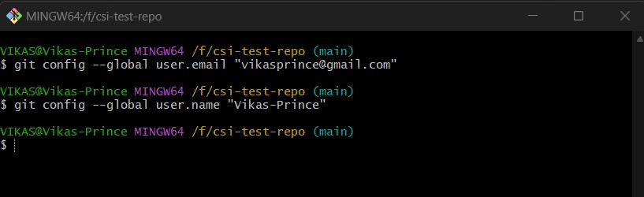
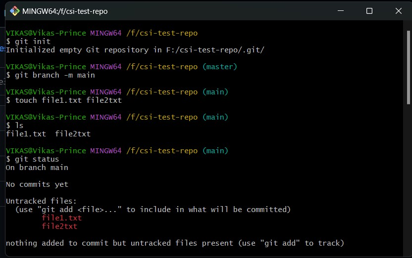
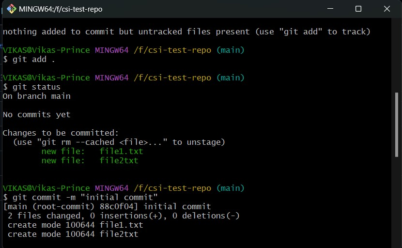
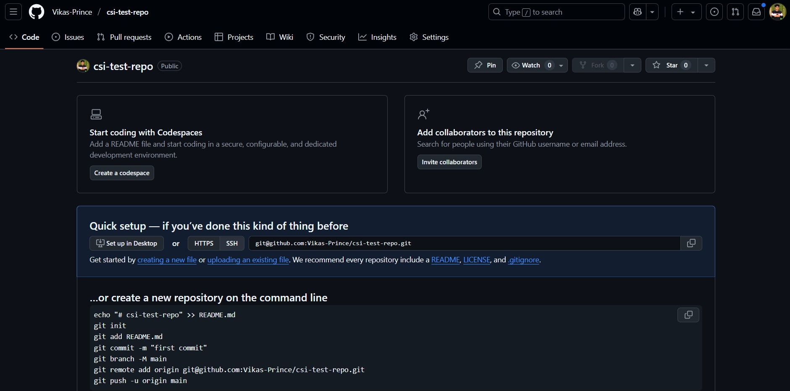
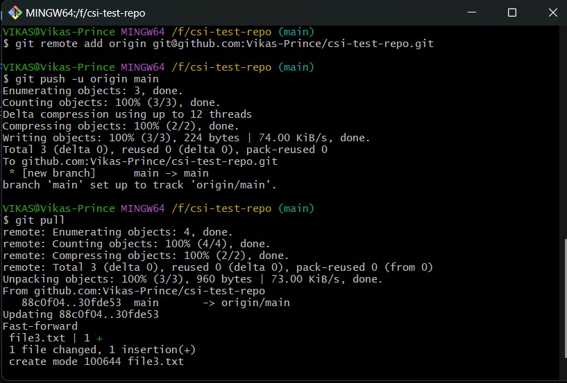

# 🗂️ Week 1 - Git: Task 1

## 📌 Task: Introduction to Version Control and Git Basics

### 🎯 Objective

Understand the need for version control in software development, learn Git installation and configuration, and practice basic Git commands.


## 🧠 Why Version Control?

Version control helps manage code changes, collaborate with others, track history, and revert mistakes. Git is a popular distributed version control system used widely in the DevOps and software engineering world.

---

## Git Installation

### On Amazon Linux (EC2)

```bash
sudo yum update -y
sudo yum install git -y
```

- This updates system and installs Git.

### Verify Installation

```bash
git --version
```

- Shows the installed Git version.

## Git Configuration

### Set Username and Email (global)

```bash
git config --global user.name "Your Name"
git config --global user.email "you@example.com"
```

### ✅ Check Configuration

```bash
git config --list
```

- Shows the Git user details and settings we set.



## 🔧 Basic Git Commands

### 1. **Initialize a New Repository**

```bash
git init
```

Creates a new local Git repository.

### 2. **Check Status**

```bash
git status
```

Displays the current state of the working directory and staging area.

**Untracked Files**



### 3. **Add Files to Staging Area**

```bash
git add <filename>
# or to add all
git add .
```

- Adds a specific file or current dir files to be included in the next commit.

### 4. **Commit Changes**

```bash
git commit -m "Initial commit"
```

- Saves changes to the local repository with a message.

**Track files and Commit Changes**



### 5. **Connect to Remote Repository**

```bash
git remote add origin https://github.com/yourusername/repo.git
```

- Connects your local Git project to GitHub.

**Central-repo**



### 6. **Push to Remote Repository**

```bash
git push -u origin main
```
- Upload Committed code to the main branch on GitHub repo.

### 7. **Pull Latest Changes**

```bash
git pull origin main
```

- Downloads any new changes from GitHub to local project.

**push and pull the changes**



---

## 🧾 Conclusion

This task builds the foundation for working with Git—setting up version control, managing changes, and collaborating via GitHub or other remotes. Mastery of these commands is essential for all DevOps workflows.

---
