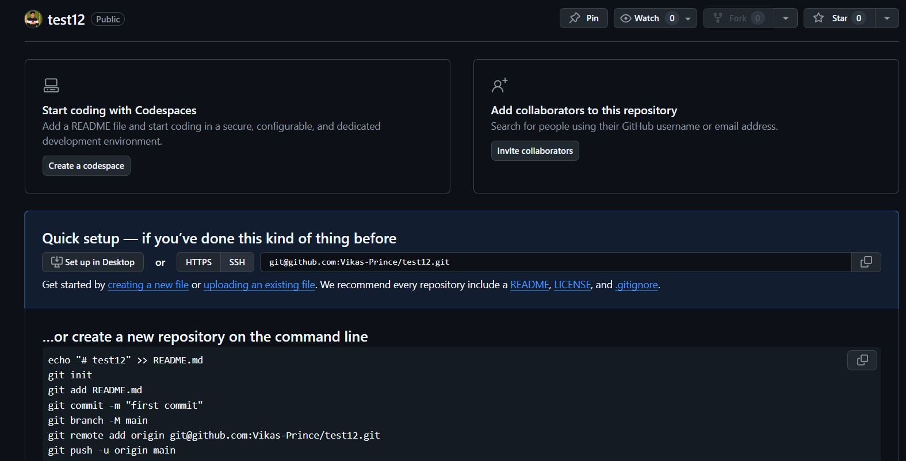
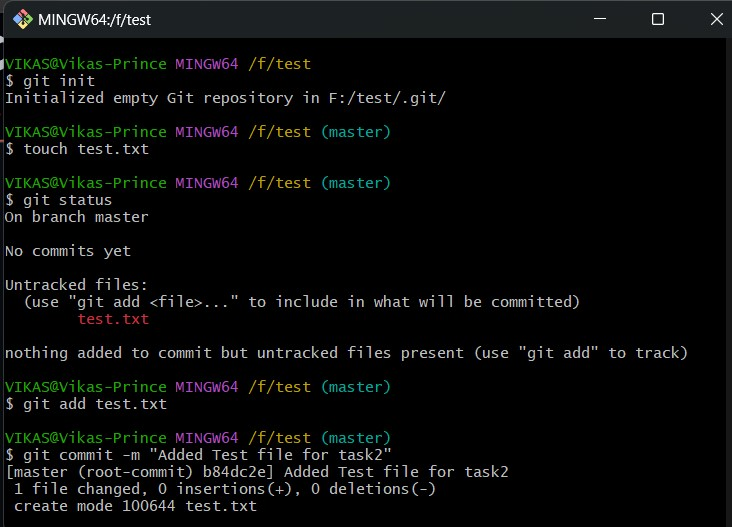
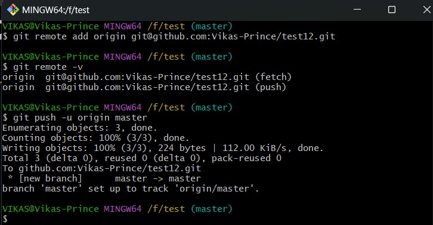
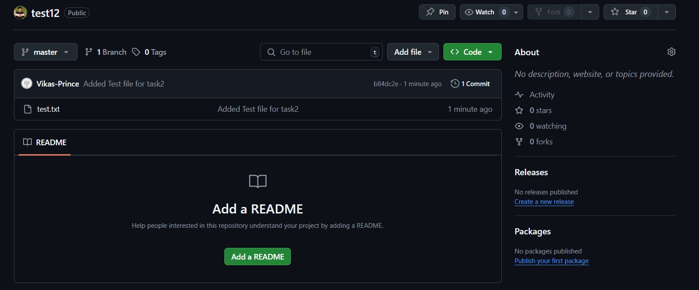

# 🗂️ Week 1 - Git: Task 2

## 📌 Task: Setup Remote Repository, Track & Commit Changes, Push to Master Branch

### 🎯 Objective

Learn how to connect a local Git repository to a remote GitHub repository, add and track a file, commit changes, and push them to the `master` branch.

## 🛠️ Steps

### 1. **Created Remote Repository on GitHub**

- I went to [GitHub](https://github.com/Vikas-Prince) and created a new repository.



### 2. **Initialized Local Repository**

Navigate to your project folder and initialize Git.

```bash
git init
```

### 3. Created a New File and Check Status

```bash
touch test.txt
git status
```

### 4. Added to stage and commit the changes

```bash
git add test.txt
```



### 5. Connect to Remote Repository

- Added the GitHub repo as a remote origin.

```bash
git remote add origin https://github.com/Vikas-Prince/test12.git
git remote -v
```

### 6. Push to Master Branch

```bash
git  push -u origin master
```



- Changes are successfully pushed to github remote repo



---

## Conclusion
Through this Task, I successfully created a remote repository on GitHub, initialized a local Git repository, tracked and committed a new file, and pushed the changes to the remote master branch.

---