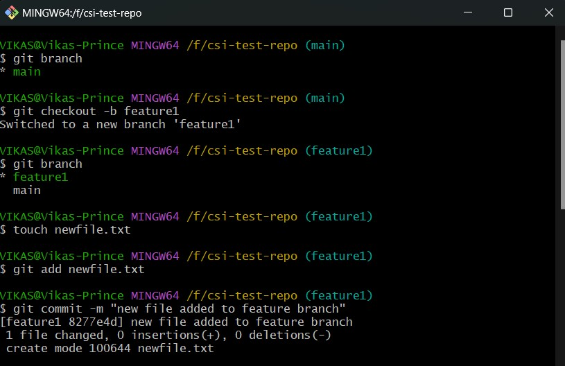
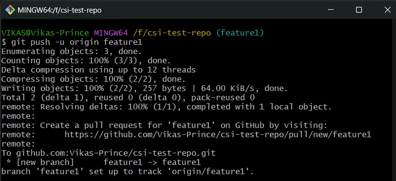
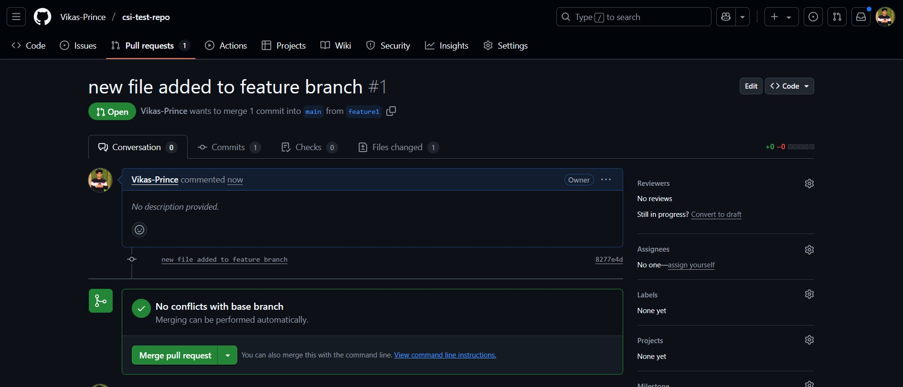
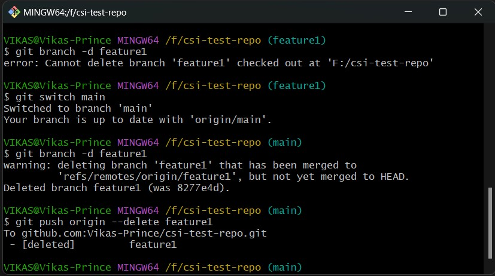
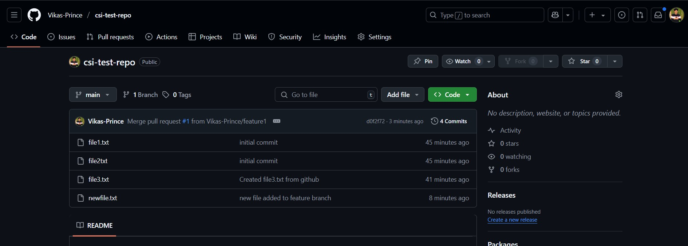

# Week 1 - Git: Task 3

## 📌 Task: Create a New Branch, Push Changes, and Merge via Pull Request

---

### 🎯 Objective

Understand Git branching workflows by creating a feature branch, pushing changes to GitHub, and merging them into the main/master branch using a pull request.

---

### Step 1: Create a New Branch Locally

```bash
git checkout -b feature1
```

- This command creates and switches to a new branch called feature1.

### Step 2: Add a New File in the Feature Branch

```bash
touch newfile.txt
```

- File created in the feature branch

### Step 3: Stage and Commit the File

```bash
git add newfile.txt
git commit -m "Added new file in feature1 branch"
```



### Step 4: Push Feature Branch to GitHub

```bash
git push -u origin feature1
```



### Step 5: Created Pull Request & Merge



### Step 6: Delete Feature Branch

```bash
git branch -d feature1                # Delete Branch Locally
git push origin --delete feature1     # Delete Branch in GitHub
```



### Step 6: Verify Changes in main branch updated via feature Branch in GitHub



---

## 🧾 Conclusion

In this task, I learned how to create a new branch, make changes, and push them to GitHub. I also practiced creating a pull request to merge changes into the main branch.

---
