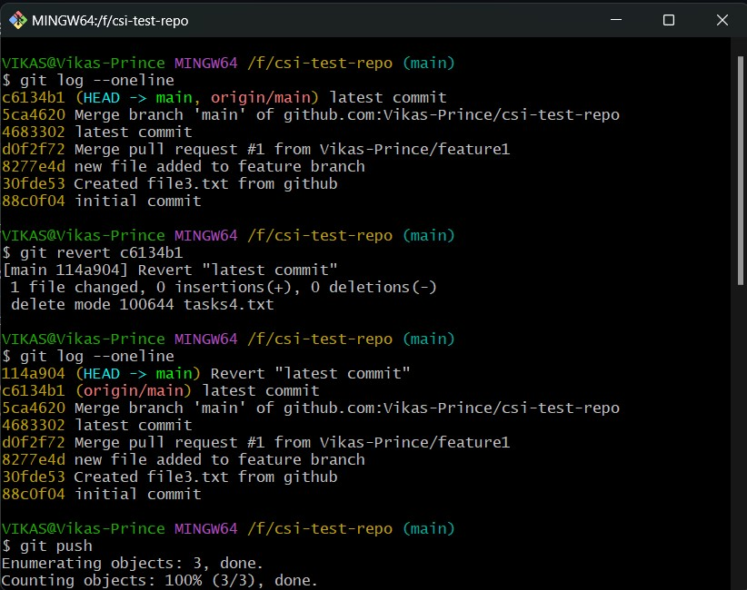
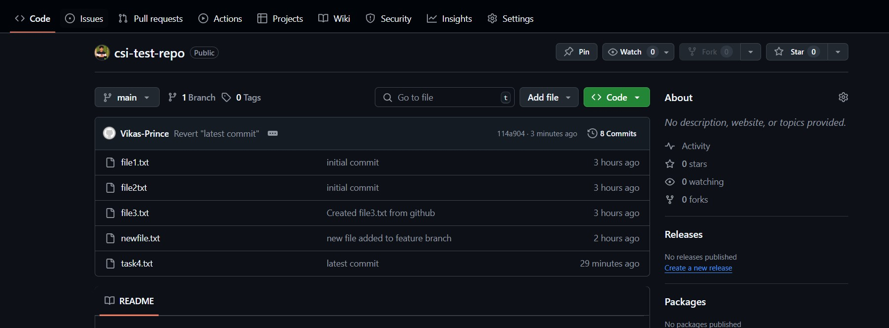
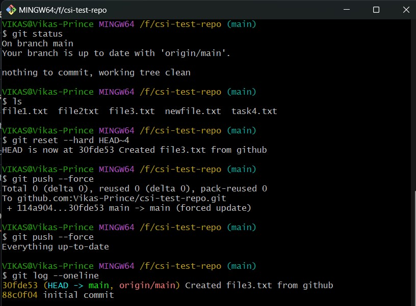
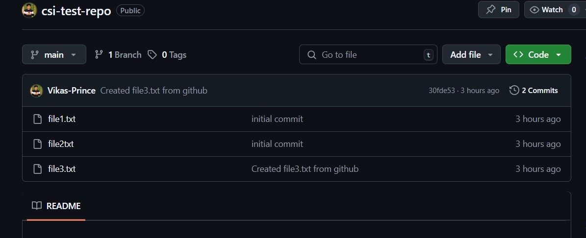

# ♻️ Week 1 - Git: Task 4

## 📌 Task: Undo the Last Commit or Remove a File from Remote Repository using CLI

### 🎯 Objective

Learn and practice how to undo a commit or remove a file from a remote Git repository using the CLI. This is very useful in real DevOps scenarios where code cleanup or reverting changes is frequently needed.

## What I Did

I explored two different ways to undo the last commit or remove a file:

### Option 1: Revert

I used `git revert` to undo the last commit safely.

```bash
git log --oneline              # To identify the latest commit hash
git revert <latest-commit-id>
git push
```

- This created a new commit that reverses the effect of the last one.

- The original commit still exists in history, but the new commit negates its effect.

- This is safe and traceable — perfect for team environments.



### Option 2: Reset
I experimented with git reset to explore all three types:

- **--soft Reset**
```bash
git reset --soft HEAD~1
git push --force
```
- It will delete committed changes from the remote repo but Keeps the changes staged in local.
- Good if we want to fix or edit and recommit.

- **--mixed Reset**
```bash
git reset --mixed HEAD~1
git push --force
```
- It will delete committed changes from the remote repo and also unstage the changes. but it will keeps the file in our working directory

- **--hard Reset**
```bash
git reset --hard HEAD~4
git push --force
```


- ⚠️ I did this just for fun in this assignment 😅
- It went back 4 commits and deleted everything from both local and remote.
- We have to make sure that before doing the reset in production environments


---
## Conclusion
This task gave me hands-on experience in cleaning up Git history and managing mistakes. While revert is the safest and preferred method, understanding reset (especially the dangers of --hard) is very useful for DevOps engineers dealing with critical deployments.

---
