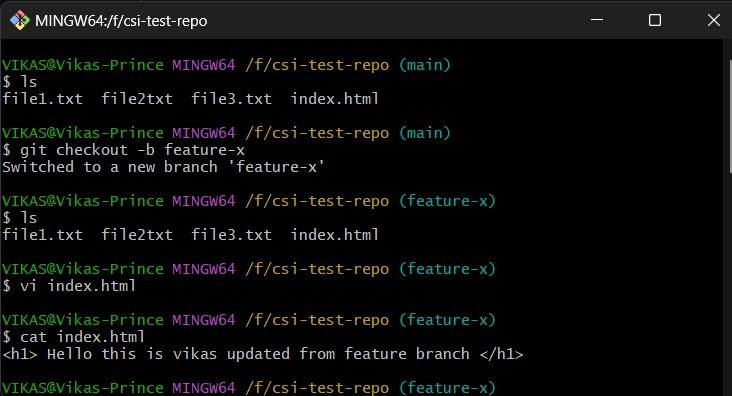
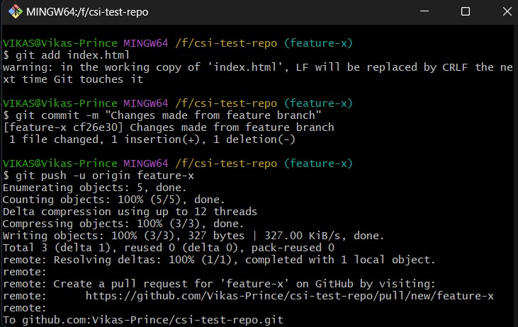
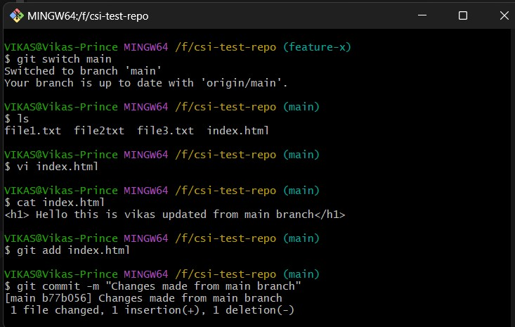
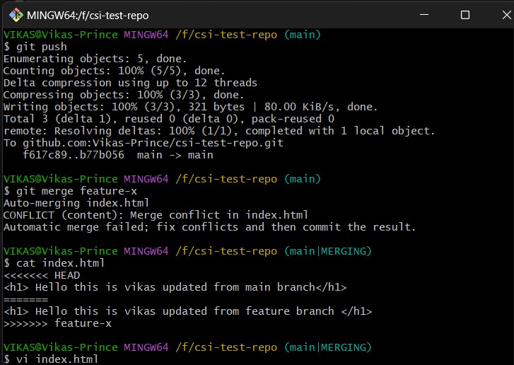
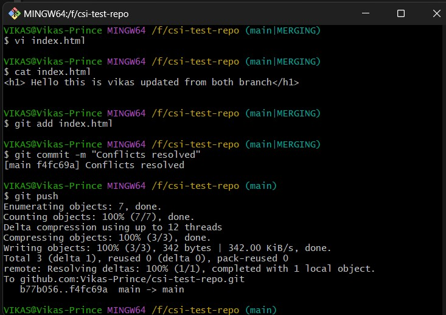

# Week 1 - Git: Task 5

## 📌 Task: Branching and Merging in Git, Resolve a Merge Conflict

### 🎯 Objective

To understand how Git handles multiple branches, practice creating conflicts, and resolve them manually using CLI. This is a key DevOps skill when working in collaborative repositories.

##  What I Did

### Step 1: Create and Switch to a New Branch

```bash
git checkout -b feature-x
```

### Step 2: Made Changes in the New Branch

```bash
vi index.html
  > This is vikas changes made from feature branch.

git add index.html
git commit -m "modified from feature branch"
git push -u origin feature branch
```




### Step 3: Switch to Main Branch

```bash
git switch main
```

### Step 4: Made Changes in Same file in Same line to get conflicts

```bash
vi index.html
    > This is vikas changes made from main branch.

git add index.html
git commit -m "modified from main-branch"
git push
git merge feature-x
```




### Step 5: Conflict Occur in Main Branch

How I Resolved the Merge Conflict

- I Opened index.html
- Git marked both changes like below

```bash
<<<<<<< HEAD
This is vikas updated from main branch
=======
This is vikas updated from feature branch
>>>>>>> feature-x
```

- I resolved the conflicts by combining both content without missing content

- Once update the conflict file, Added to staging and commit the resolved changes

```bash
git add index.html
git commit -m "Conflict resolved"
```

- once saved the changes in local repo then push to remote repo

```bash
git push
```


---

## Conclusion
This task helped me understand how to work with branches in Git and what happens when two people make changes to the same file. I got to see how a conflict looks and learned how to fix it step by step. Now I feel more confident handling merge conflicts in real projects.