# 📘 Week 1 - Git: Task 6

## 📌 Task: Practice More Git Commands (Real-Time Usage)


### 🧾 1. Git Logs & History

```bash
git log
```
- Shows detailed commit history with author, date, and message.

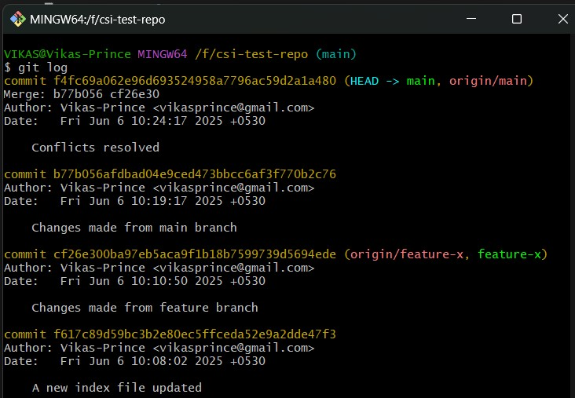

```bash
git log --oneline
```
- Simple view — just commit IDs and messages.

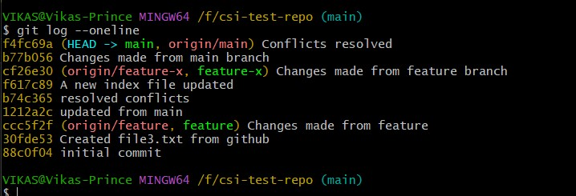

```bash
git show <commit-id>
```
- Displays the changes made in a specific commit.

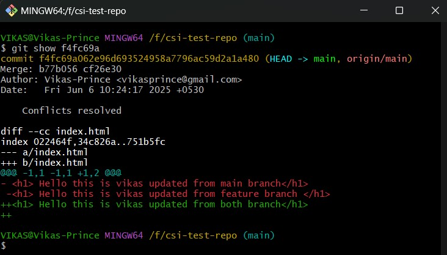

```bash
git diff <commit-id> <commit-id>
```
- Shows the differences between two commits.

```bash
git reflog
```
- Lists all actions performed on the repository, including commits, resets, and pushes.

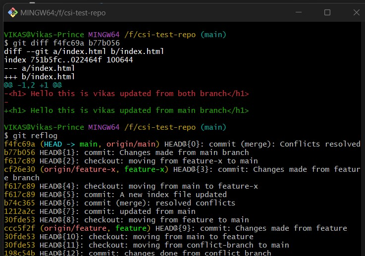

---

### Git Stashing - Temporary Storage

```bash
git stash
```
- While working with multiple branches if we move from one branch to another branch without commit the changes, because that particular task not completed yet to commit but requirement is to switch the branch. If we switch the branch then Those changes will appear on other branches as well so it would be messy. So it Saves the current changes and moves them to a temporary storage area.

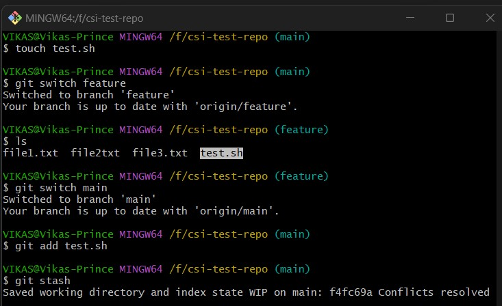

- In the above snapshot i created a file and switch to new branch without commit and stash, so those file would be appeared on feature branch as well

```bash
stash show
```
- Shows the changes that are currently stashed.

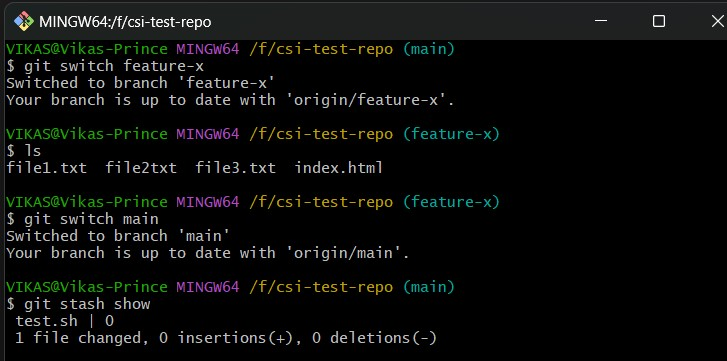

- Now i applied stash in the main branch and i tried to switch feature-x branch, Here those changes not be appeared because i stored those changes in stash memory

```bash
stash list
```
- Lists all stashes that have been made.

```bash
stash pop
```
- removed applied stash from the stash list.

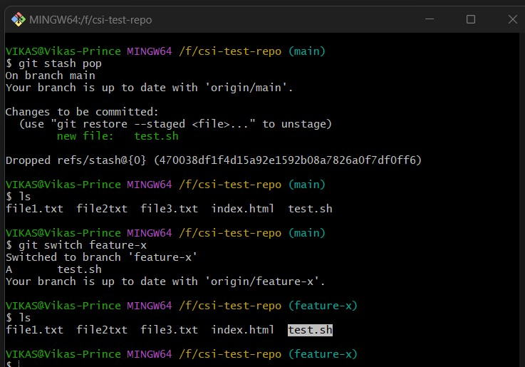

- Now finally removed applied stash using stash pop and tried to verify in another branch, here those changes are visible.

---

### Git Tagging - Proper Releases

```bash
git tag v1.1.0
```
- Created a new tag named v1.1.0 at the current commit. (typically used for releases).

```bash
git show v1.1.0
```
- Shows the commit that the tag points to.

```bash
git push origin v1.0.0
```
- Pushed the tag to the remote repository.

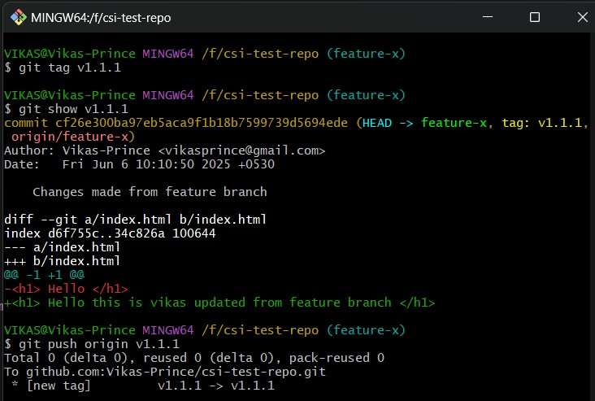

```bash
git tag -a v1.1.0 -m "Release v1.1.0
```
- Created a new annotated tag named v1.1.0 at the current commit with a message "

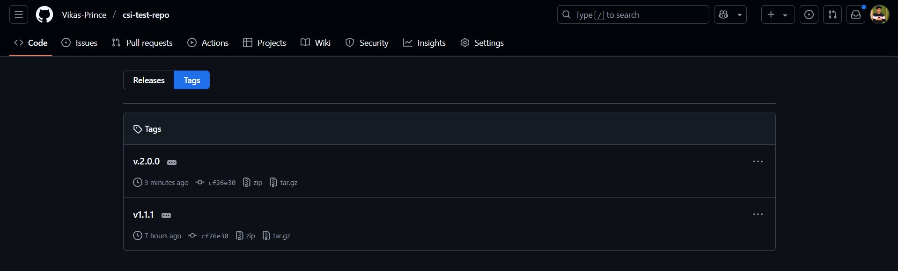

---

### Git Cherry-Pick - Pick specific commit to merge

```bash
git cherry-pick <commit-id>
```
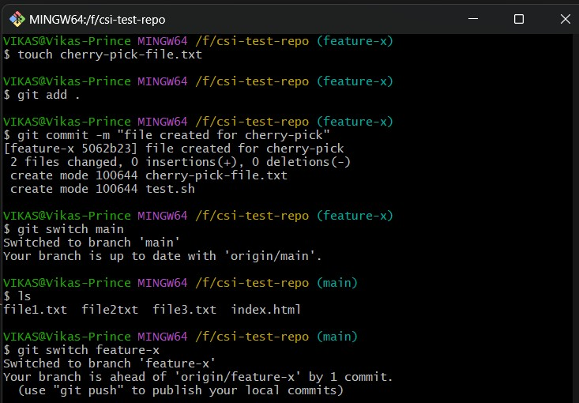

- it Applies a specific commit from another branch into your current one.


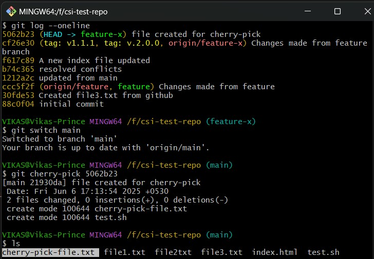

- Above snapshot i merged only specific commit to main branch which is very useful while working with microservices in production environment

---

### Conclusion
In this final Git task, I focused on learning real-world Git operations used in DevOps and team collaboration. Tools like commit histories, stash, tags, and cherry-pick are essential for clean commit history, rollback safety, and release workflows.

---