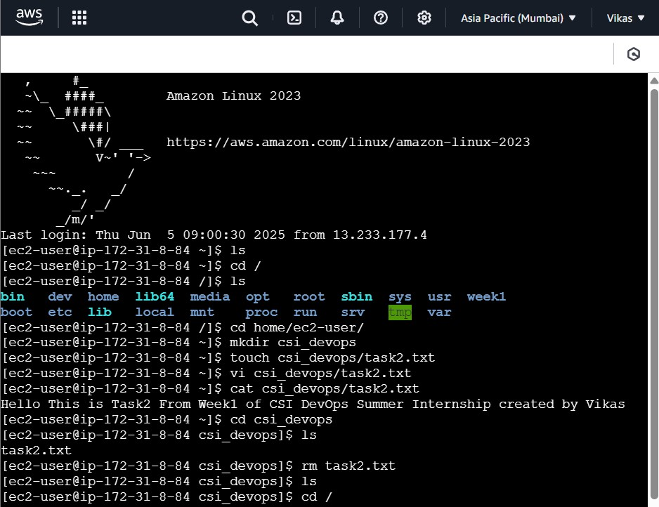

# 🛡️ Week 1 - Linux: Task 2

## 📌 Task: Execute Basic Linux File & Directory Commands

### 🎯 Objective

To practice and understand the use of essential Linux commands for file and directory manipulation.


## Commands and Usage

### `ls` - List Directory Contents

```bash
ls
```

- Displays the contents of the current directory.

### `cd` - Change Directory

```bash
cd /home/ec2-user
```

- Moves the terminal into the specified directory.


### `mkdir` - Make New Directory

```bash
mkdir csi_devops
```

- Creates a new directory named `csi_devops`.


### `touch` - Create an Empty File

```bash
touch csi_devops/task2.txt
```

- Creates an empty file named `task2.txt` inside `csi_devops`.


### `vi` - Create and Write to a File

```bash
vi csi_devops/task2.txt
```

- Opens the task2.txt file inside csi_devops using the vi editor.
- we can write content into the file by pressing i to enter insert mode, typing your content, and then saving with :wq.

### `cat` - Display File Content

```bash
cat csi_devops/task2.txt
```
- Displays the contents of task2.txt in the terminal. Useful for quickly reading what's inside the file.


###  `rm` - Remove Files

```bash
cd csi_devops
rm task2.txt
```

- Deletes the file `task2.txt`.


###  `rm -r` - Remove Directories Recursively

```bash
cd ..
rm -r csi_devops
```

- Deletes the `csi_devops` directory along with all its files and folders.


### 📸 Screenshots




## 🧾 Conclusion

Successfully executed basic Linux commands like `ls`, `cd`, `mkdir`, `touch`, `vi`, `cat`, and `rm` to manipulate files and directories. These commands are essential for navigating and managing any Linux environment, especially in DevOps roles.

---