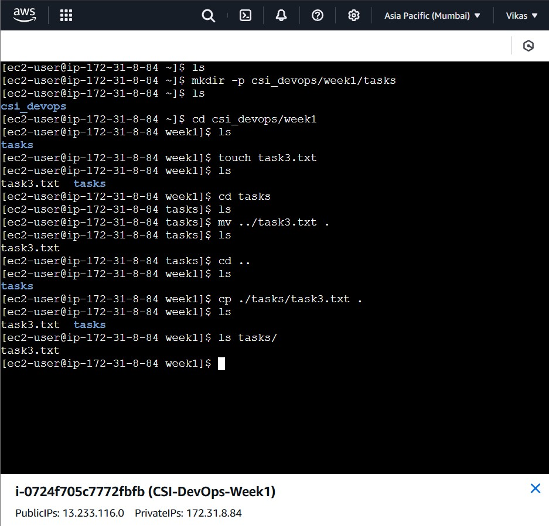

# 🛡️ Week 1 - Linux: Task 3

## 📌 Task: Directory Navigation & File Movement

### 🎯 Objective

To practice navigating through directories, listing their contents, and moving files to different locations using the terminal.

## Steps and Commands Used

### Step 1: Create Directories for Navigation

```bash
mkdir -p csi_devops/week1/tasks
```

- Creates nested directories: csi_devops/week1/tasks.

### Step 2: Navigate into the Directory

```bash
cd csi_devops/week1
```

- Navigates to the week1 directory.

### Step 3: List Contents

```bash
ls
```

- Displays contents of the current directory.

### Step 4: Create a File

```bash
touch task3.txt
```

- Creates a files named task3.txt in week1.

### Step 5: Move File to Another Directory

```bash
cd tasks
mv ../task3.txt .
```

- Moves task2.txt to the tasks directory.

### Step 6: Verify File Movement

```bash
ls
```

- Displays contents of the tasks directory.

### Step 7: Copy File back From Tasks directory to week1

```bash
cd ..
cp tasks/task3.txt .
```

- Copied task3.txt from tasks directory to week1 directory. So Task3 now available in both tasks and week1 directories.

### 📸 Screenshots



## 🧾 Conclusion

Successfully practiced directory navigation using cd, verified contents using ls, moved and copied files using mv, cp.

---
