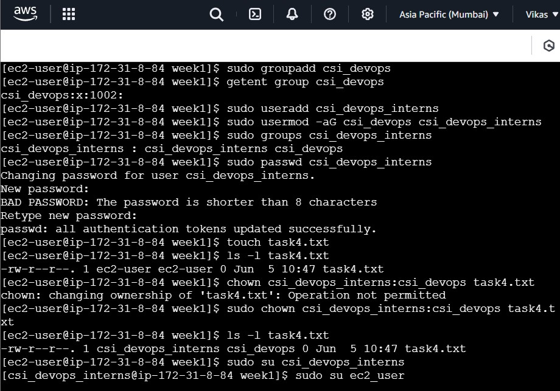

# 🛡️ Week 1 - Linux: Task 4

## 📌 Task: User & Group Management with Permissions

### 🎯 Objective

To explore user and group administration in Linux by:

- Creating a new user and group
- Modifying user properties
- Assigning file permissions
- Practicing user management commands (`useradd`, `usermod`, `userdel`)

## 🪛 Steps and Commands Used

### 👥 Step 1: Create a New Group

```bash
sudo groupadd csi_devops
```

- Creates a group named `csi_devops`.

### 👤 Step 2: Create a New User

```bash
sudo useradd csi_devops_intern
```

- Created a user named `csi_devops_intern`.

### 🔗 Step 3: Add User to Group

```bash
sudo usermod -aG csi_devops csi_devops_intern
```

- Added `csi_devops_intern` to the `csi_devops` group.

### Step 4: Verify the user groups

```bash
sudo groups csi_devops_intern
```

### 🔐 Step 5: Set Password for New User

```bash
sudo passwd csi_devops_intern
```

- Successfully Set a password for `csi_devops_intern` to allow login.

### 📝 Step 6: Create a Test File & Change Ownership

```bash
sudo touch task4.txt
sudo chown csi_devops_intern:csi_devops task4.txt
```

- Changed ownership of the file to the new user and group.

### Step 7: Delete User & Group

```bash
sudo userdel devopsuser
sudo groupdel devopsteam
```

- Deletes the user and group if no longer needed.

### 📸 Snapshots




## 🧾 Conclusion

Completed hands-on experience with user and group management in Linux. Covered creating users, adding them to groups, setting permissions, and deleted users and groups.

---
