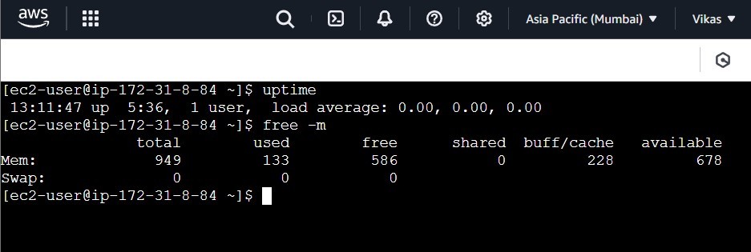
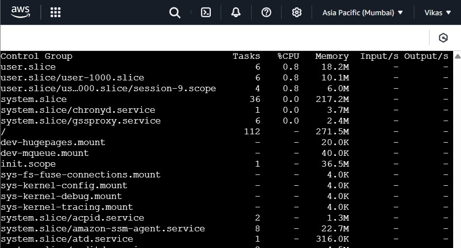

# 🛡️ Week 1 - Linux: Task 5

## 📌 Task: Practice More Linux Commands (Essential for DevOps)

### 🎯 Objective

To go beyond basic commands and explore system-level Linux operations using commands crucial for DevOps roles, categorized based on usage and real-world applicability.


## Downloading resources from internet

### Download Files from the Web

```bash
wget https://download.java.net/java/GA/jdk17/0d1cfde4252546c6931946de8db48ee2/35/GPL/openjdk-17_linux-x64_bin.tar.gz

```

### Transfer Data from or to a Server

```bash
curl http://13.233.116.0:80
```


---

## System Monitoring & Resource Usage

### Check Uptime
```bash
uptime
```
- Shows how long the system has been running, current time, number of users, and average load.

### Memory Usage
```bash
free -m
```
- Displays the amount of memory used and available on the system in megabytes.




### CPU & Process Monitoring
```bash
top
```
- Provides a real-time view of CPU usage, running processes, and memory load.


```bash
ps -aux
```
- Lists all running processes with details like process ID, user, and memory usage.


```bash
systemd-cgtop
```
- Monitors control groups and shows their CPU, memory, and I/O usage.



---

## 🔧 Service & Daemon Management

###  Manage Services
```bash
sudo systemctl status
```
-  Checks the status of all or a specific service.

```bash
sudo systemctl start nginx
```
- Starts the nginx service.


```bash
sudo systemctl stop nginx
```
- Stops the nginx service.

```bash
sudo systemctl restart nginx
```
- Restarts the nginx service.


```bash
sudo systemctl enable nginx
```
- Sets nginx to start automatically at boot.

```bash
sudo systemctl disable nginx
```
- Stops nginx from starting at boot.


---

## Package Management

### Install and Update Packages
```bash
sudo yum install <package-name>
sudo yum update
```

- Installs the specified software package.
- Updates all installed packages to their latest versions.


### Find Package Provider
```bash
yum whatprovides httpd
```
- Finds the package that offers the httpd file or command.


### Check Repository
```bash
yum repolist
```
-  Lists all enabled repositories that yum can use.

### RPM Package Queries
```bash
rpm -qa              # List all installed packages
rpm -q httpd         # check package installed or not.
rpm -qi httpd        # Detailed package info
```


---

## Network & Ports

### List Open Ports
```bash
sudo netstat -tulnp
```
- Displays all open ports and the services using them.


---

## User Sessions & Identity

### Who is Logged In
```bash
who
```
- Shows who is currently logged in to the system.

### Login History
```bash
last
```
- Displays a list of recent logins from users.


---

## Disk Management

### Disk Partitions
```bash
 df -h
 fdisk -l
```
- `df -h` displays disk space usage.
-  `fdisk` Lists all partitions and disk details on the system.


---

## Automation & Scheduling

### Cron Jobs
```bash
crontab -e       # Edit current user's cron jobs
crontab -l       # List current cron jobs
crontab -r       # Removes the current user's cron jobs
```


---

## Backup & Sync

### Rsync with Backup Option
```bash
rsync -av --backup /source/ /destination/
```
---

## Conclusion

This task covered important Linux commands used in DevOps practices. I practiced checking system info, installing packages, managing services, and setting up tasks. These commands are useful for working with servers and doing daily system tasks.

---
