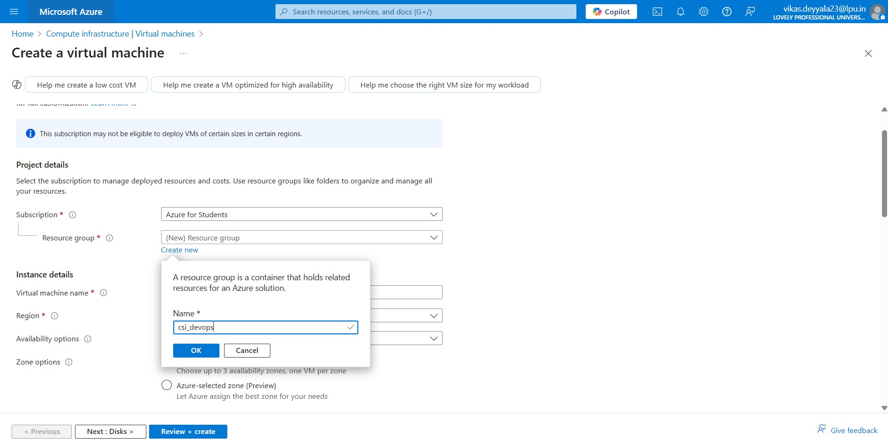

# ☁️ Week 2 – Azure Compute: Task 1

## 🚀 Task: Deploy Linux and Windows Virtual Machines & Access via SSH/RDP

## 📌 Objective

In this task, I deployed both a **Red Hat Linux** and a **Windows Server** virtual machine on Microsoft Azure. I accessed the Linux machine using **SSH keys** and the Windows machine using **Remote Desktop (RDP)**. I’ve included step-by-step screenshots and descriptions of everything I’ve done.

---

## Part 1: Deploying Linux VM and SSH Access

### Step 1: Open Azure Portal and Go to Virtual Machines

I logged in to the Azure portal and navigated to **Virtual Machines**.


### Step 2: Create Resource Group

Before creating any resource, We must need to create a resource group. So I created a resource group named `csi-devops` to logically group my resources.



### Step 3: Configure Linux VM Basics

I am going to create linux server 

- Chose OS: **Red Hat Enterprise Linux 9**
- VM Size: **Standard_B1ls** (1 core, 1 GiB RAM)
- Username: `csi_user`
- Authentication: **SSH Key**
- Key pair name: `csi-devops-linux_key.pem` (downloaded `.pem` file)


### Step 4: Networking Configuration

- Allowed **port 22** for (SSH)
- Attached **Public IP**, NSG, and default Virtual Network


### Step 5: Review and Create

After final review, I clicked **"Create"**. The deployment completed successfully.


### Step 6: SSH into the Linux VM

- Navigated to Pem File location and Changed permission of `.pem` file:

```bash
chmod 400 csi_keypair.pem
```

- Finally Logged into Virtual Machine using public IP

```bash
ssh -i csi-devops-linux_key.pem csi_user@20.2.67.140
```


---

## Part 2: Deploying Windows VM and RDP Access

### Step 1: Create a Windows Server VM

I went back to the Azure Portal and selected Create a virtual machine. This time, I set it up to run Windows Server 2019 Datacenter.

- OS Image: Windows Server 2022 Datacenter
- VM Size: Standard_B2s (2 vCPUs, 4 GiB RAM)
- Administrator Username: csi_user
- Authentication Type: Password
- Password: A strong password stored securely


### Step 2: Configure Networking

- To enable Remote Desktop access, I allowed port 3389 (RDP) through the Network Security Group (NSG). The VM was also assigned a public IP and added to the default virtual network.


### Step 3: Review and Deploy

- I reviewed all the configuration settings to make sure everything looked good, then clicked Create. Azure took a few minutes to deploy the VM.


### Step 4: Access Windows VM via RDP

Once the deployment was complete, I accessed the VM as follows:

- Navigated to the VM's Overview page in the portal.
- Clicked Connect > RDP and downloaded the .rdp file.
- Opened the .rdp file on my local machine.
- Entered the login credentials (azureadmin and the password) when prompted.


- I successfully logged into the Windows Server desktop environment via Remote Desktop.


---

## Conclusion

I deployed a Linux and a Windows virtual machine on Azure. The Linux VM was accessed using SSH keys, and the Windows VM was accessed using RDP. I configured the necessary settings, allowed required ports (22 for SSH and 3389 for RDP), and successfully connected to both VMs. This task provided practical experience with Azure VM deployment and remote access.
