# 🧱 Week 2 – Azure Compute: Task 10

## 📆 Task: Explore Azure Disk Storage Capabilities

I explored Azure Disk Storage features such as creating managed disks, attaching them to virtual machines, resizing disks, creating snapshots, and restored snapshots. Here's a detailed walkthrough of each step, accompanied by relevant screenshots.

> **Note:** Task 9 and Task 10 were the same in the CSI portal, but Task 10 had a link about disks, so I explored disk storage here.

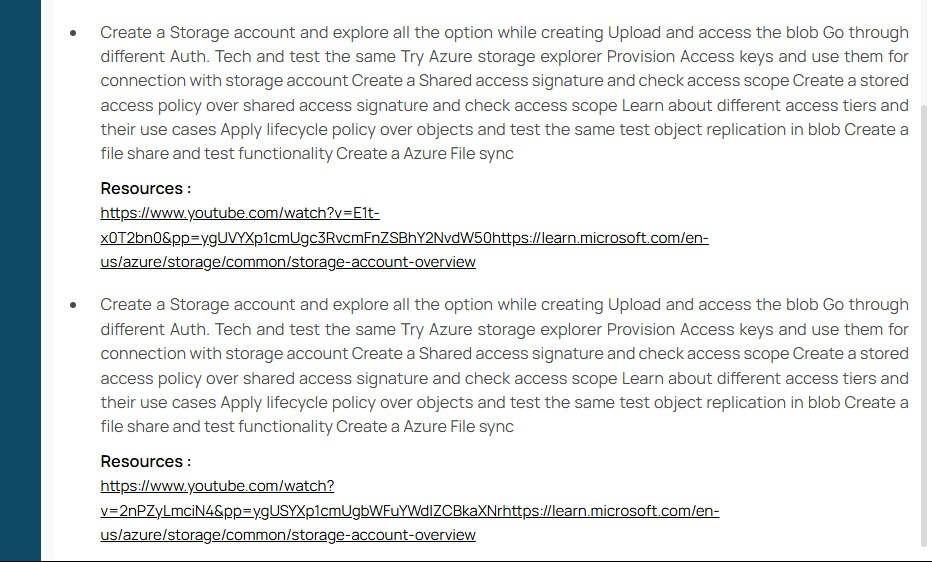
---

## Step 0: Deploy a Virtual Machine

Before anything else, I deployed a virtual machine (`csi-disk-test-vm`) in Azure that we'll use to attach and manage our disk.

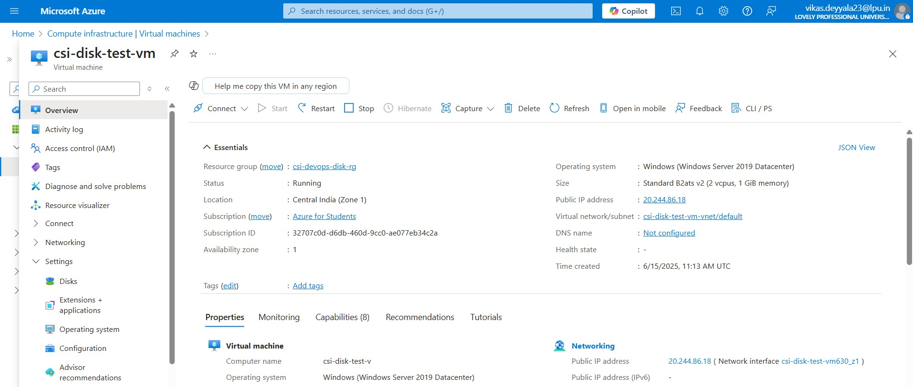

## Step 1: Create a Managed Disk

To create a new managed disk:

1. In the Azure Portal, go to **Create a resource** > **Storage** > **Disks**.
2. Configure the disk:
   - **Name**: `csi-task10-disk`
   - **Resource Group**: `csi-devops-disk-rg`
   - **Region**: `Central India`
   - **Size**: `32 GB`
   - **Performance**: `Standard SSD`
   - For testing, enabled public access (not recommended in production).

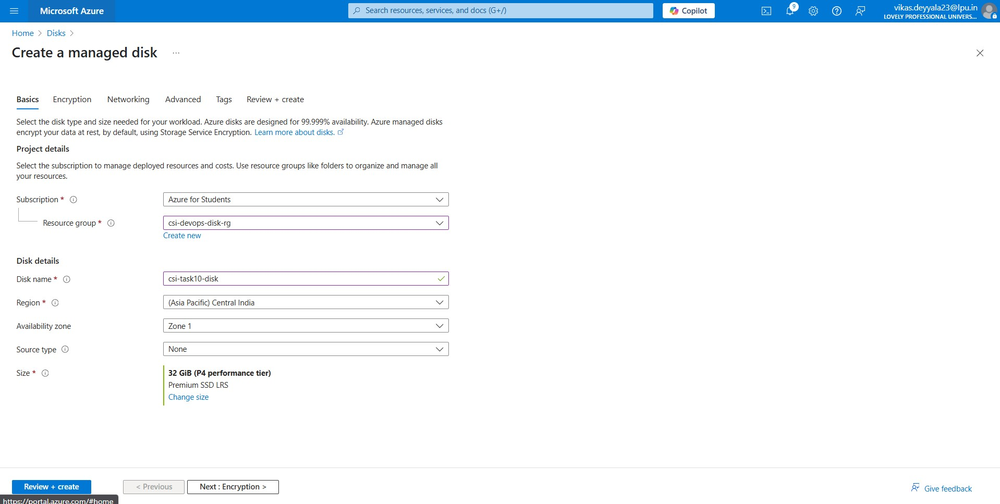

Azure also supports **shared managed disks**, which allow **multiple VMs** to access the same disk simultaneously — useful for clustering and high availability scenarios.

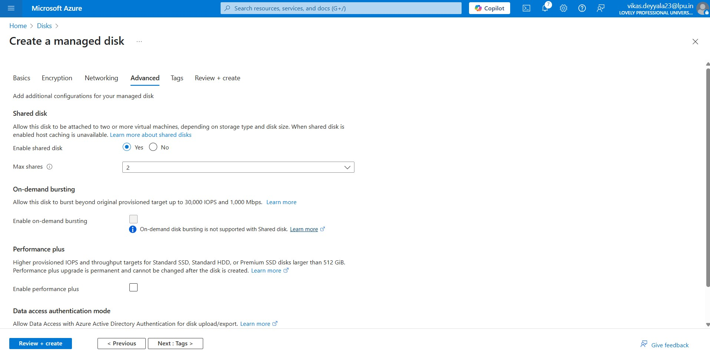

Once configured, I clicked **Review + Create**, then **Create**.

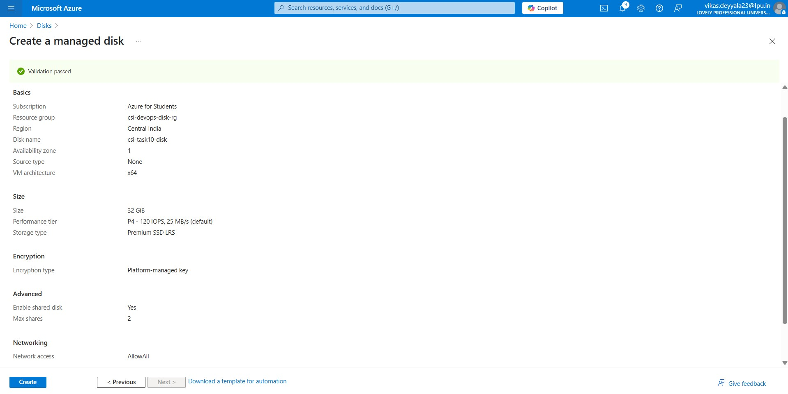

Successfully Deployed Disk

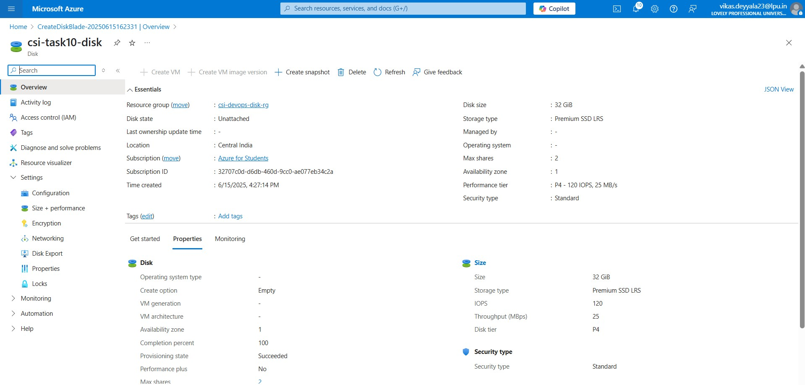

## Step 2: Attach the Disk to a Virtual Machine

After creating the disk, I attached it to the VM:

- Navigated to **Virtual machines** and selected `myVM`.
- Under **Settings**, chose **Disks**.
- Clicked **+ Add data disk**, selected `csi-task10-disk`, then clicked **Save**.

## Step 3: Initialize and Format the Disk

Once attached, the disk needs to be initialized inside the VM:

- Connected to the VM via **Remote Desktop (RDP)**.
- Opened **Disk Management**.

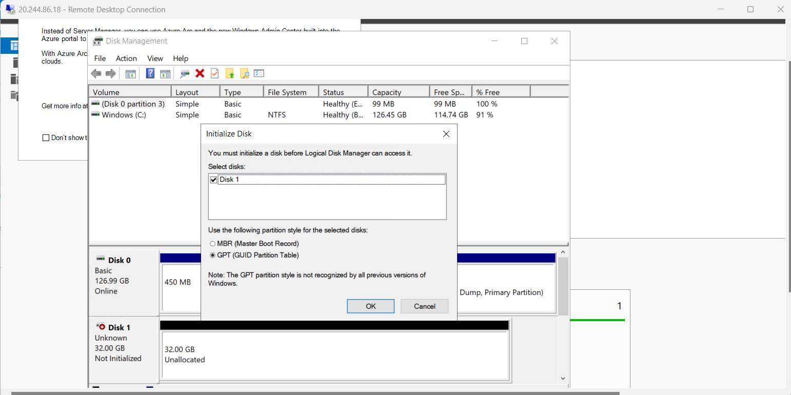

- Found the new disk (e.g., `Disk 1`), right-clicked and selected **Initialize Disk**.

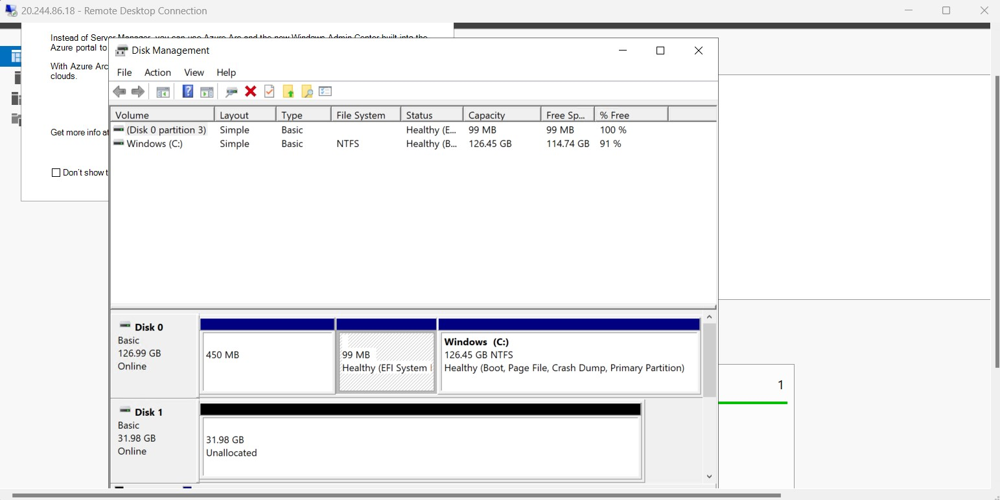

- Created a new volume by selecting **New Simple Volume**, formatted it, and assigned it a drive letter (`E:`).

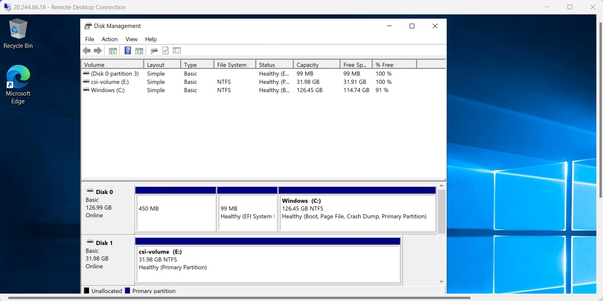

- After allocating the disk, I created a few test files on it. Later, I planned to verify these files when attaching the same shared disk to another VM, since the disk was configured for shared access between both VMs.

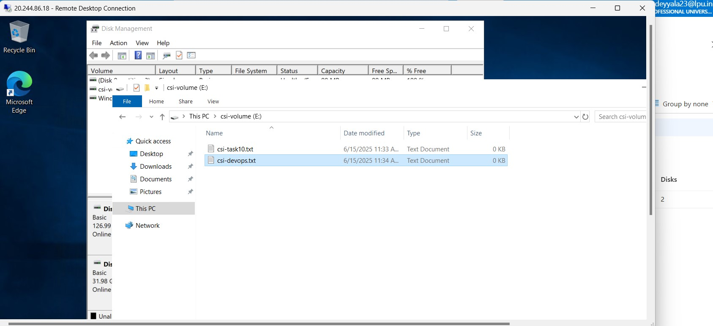

## Step 4: Resize the Managed Disk

To resize the disk:

- I Stopped the virtual machine.
- Navigated to **Disks** > selected `myManagedDisk`.
- Clicked **Size + performance**.
- Updated the disk size to `64 GB`.

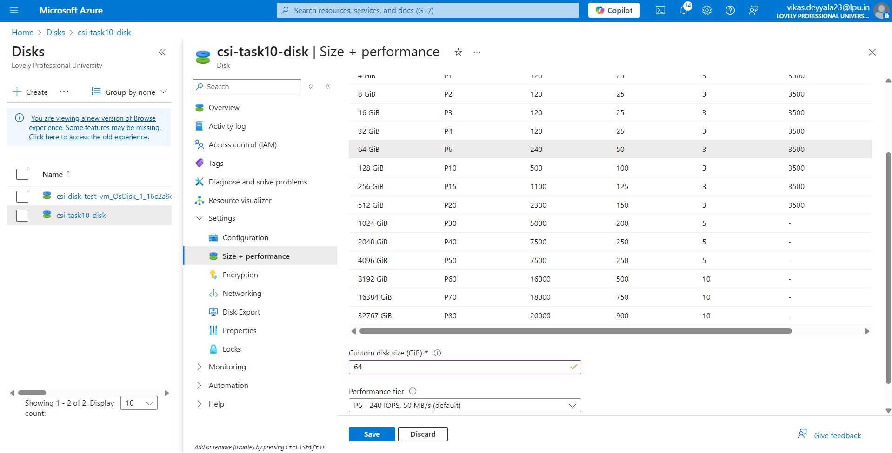

5. Clicked **Resize** to apply changes.

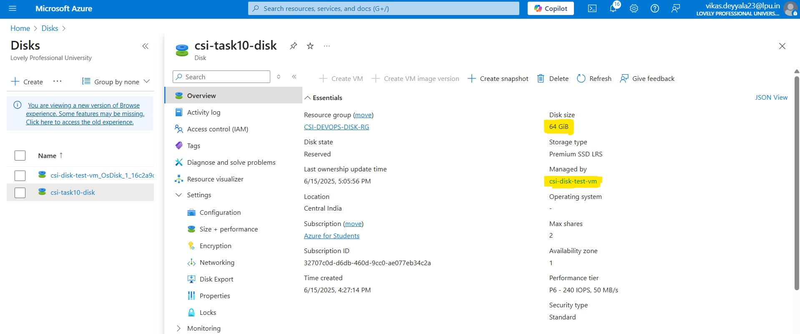

## Step 5: Share the Disk with Another VM

To test **shared disk access**, I deployed another VM named `csi-test-disk-vm2`.

- Went to **Disks** under the new VM.
- Attached the existing shared disk (`csi-task10-disk`).

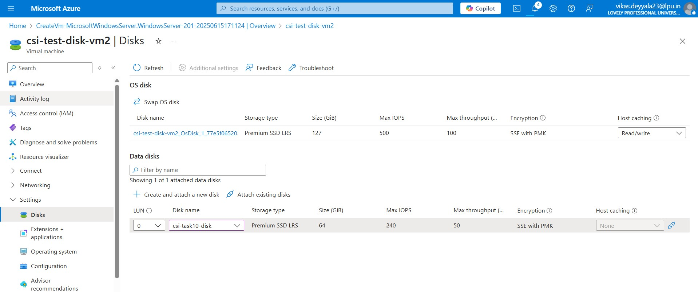

- Connected via RDP and verified that the disk and files created from `myVM` were accessible.

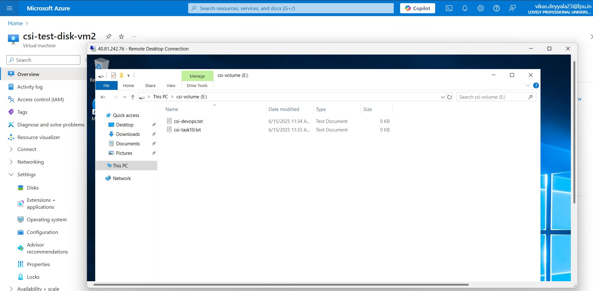

## Step 6: Create a Snapshot of the Disk

To back up the disk:

- Went to **Disks**, selected `csi-task10-disk`.
- Clicked **Create snapshot**.
- Configured:
   - **Name**: `csi-disk-snapshot`
   - **Snapshot type**: `Full` or `Incremental` I chosen Full 
- Clicked **Review + Create**, then **Create**.

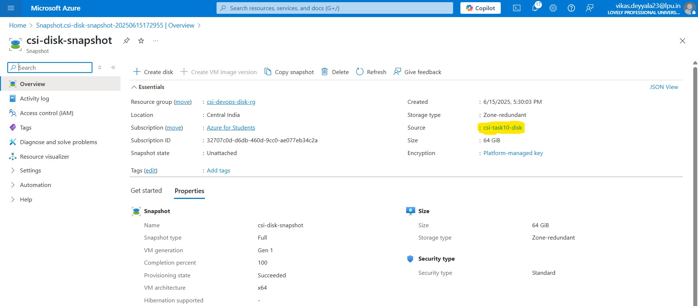

## Step 7: Restore Disk from a Snapshot

To restore from the snapshot:

- Navigated to **Snapshots** > selected `csi-disk-snapshot`.

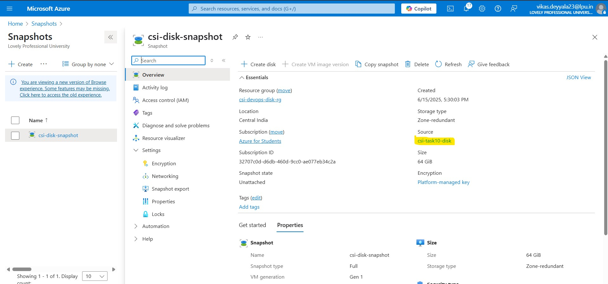

- Clicked **Create disk**.
   - Named it `csi-restored-disk-from-snapshot`.

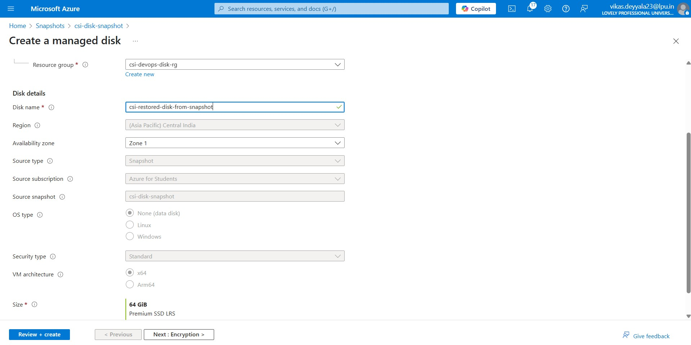

3. Clicked **Review + Create**, then **Create**.

This creates a new managed disk from the snapshot, which can now be attached to any VM.

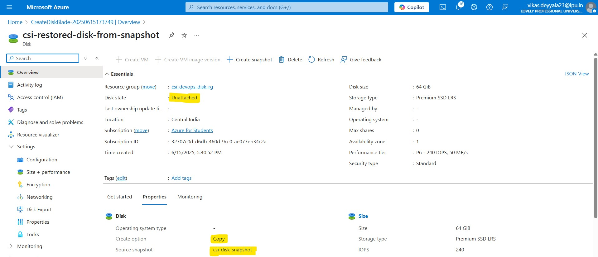

## Conclusion

This task provided a comprehensive understanding of Azure Disk Storage capabilities. I successfully created and managed managed disks, attached them to virtual machines, resized disks, created snapshots and restored disk. These skills are essential for managing storage resources effectively in Azure environments.
