# ☁️ Week 2 – Azure Compute: Task 2

## 📌 Task: Create App Service Plan & Deploy Static Web App

## 🎯 Objective

To understand and implement the deployment of a web application using Azure App Service Plan. In this task, I created a Linux-based **App Service Plan** and deployed a **Static Web App** using GitHub integration.

---

## 🧩 Step-by-Step Implementation

### Step 1: Navigate to App Service Plans

- From the Azure Portal home page, I searched and opened **App Service Plans**.

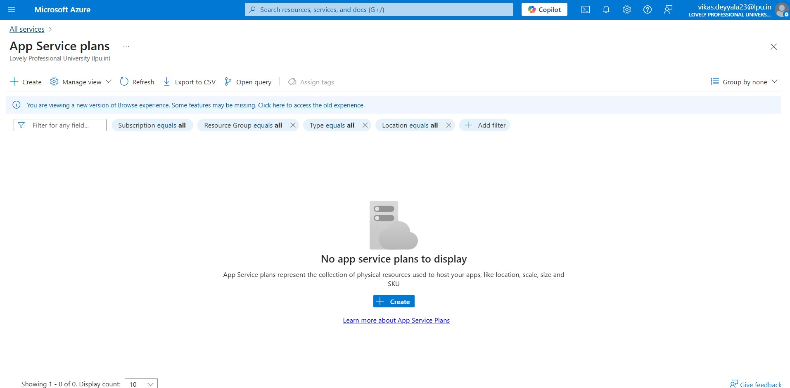

### Step 2: Create a New App Service Plan

- Clicked **Create** to initiate the creation of a new plan.
- **Resource Group:** `CSI-DevOps-AppServices` (created a new group)
- **Name:** `task2-service-plan`
- **OS:** Linux
- **Region:** Canada Central / Central India
- **Pricing Tier:** Basic Plan B1: To integrate Continous deployment

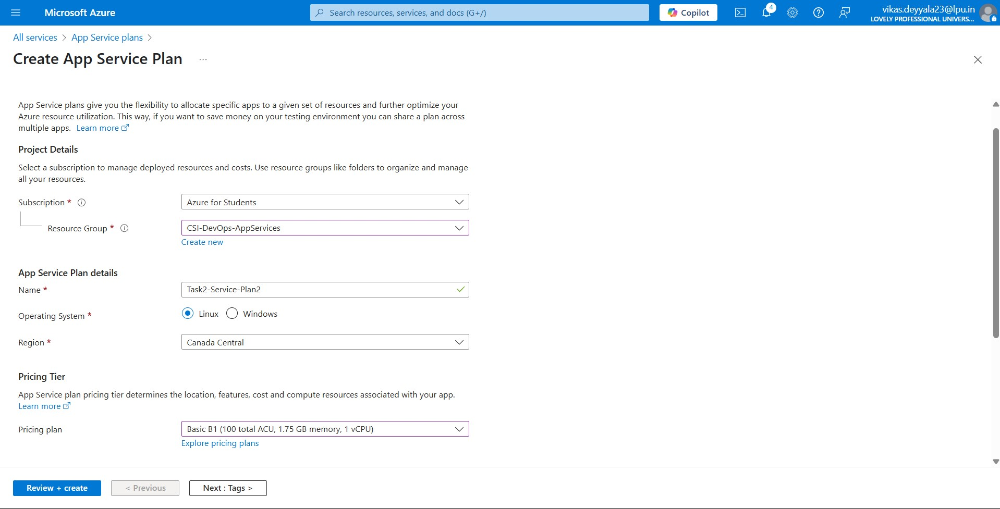

### Step 3: Review and Create

- After filling out the details, I clicked on **Review + Create** and verified all values.

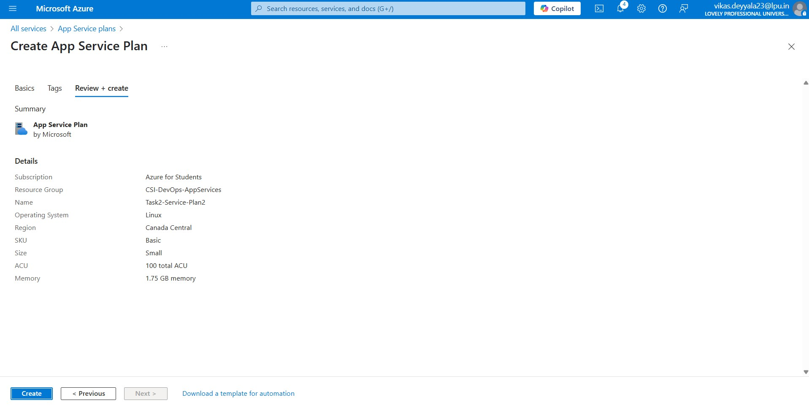

- Clicked **Create** and waited for successful deployment.

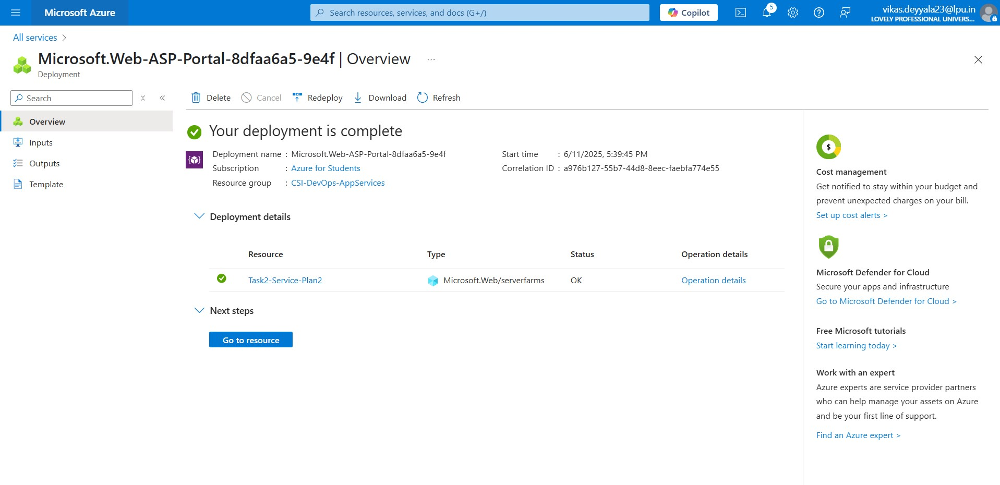

### Step 4: Navigate to App Services

- After creating the plan, I went to **App Services** in the Azure portal and selected **Create** to provision a new app.

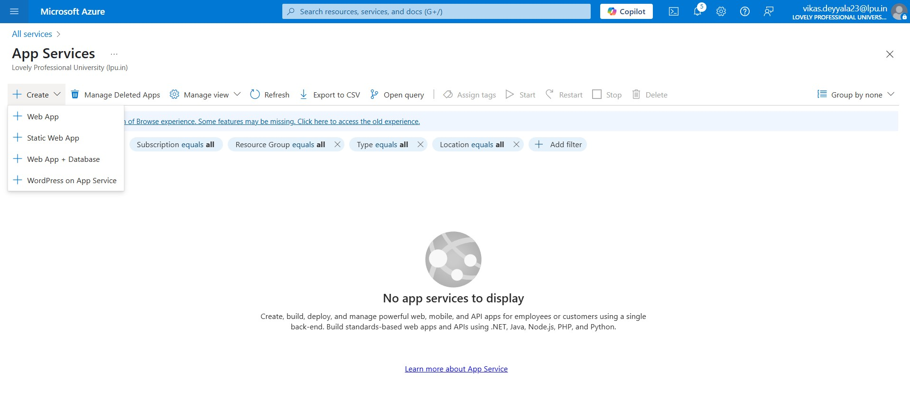

### Step 5: Create a Web App Using the Existing App Service Plan

- Navigated to **App Services** and clicked on **Create**.
- Chosen the following configuration:
  - **Subscription:** Selected existing subscription.
  - **Resource Group:** `CSI_DevOps_AppService` (same as earlier).
  - **Name:** `task2-simple-webapp`
  - **Publish:** Code
  - **Runtime stack:** Node.js 20 LTS
  - **Operating System:** Linux
  - **Region:** Central India / Canada Central
  - **App Service Plan:** Selected existing `task2-service-plan2`

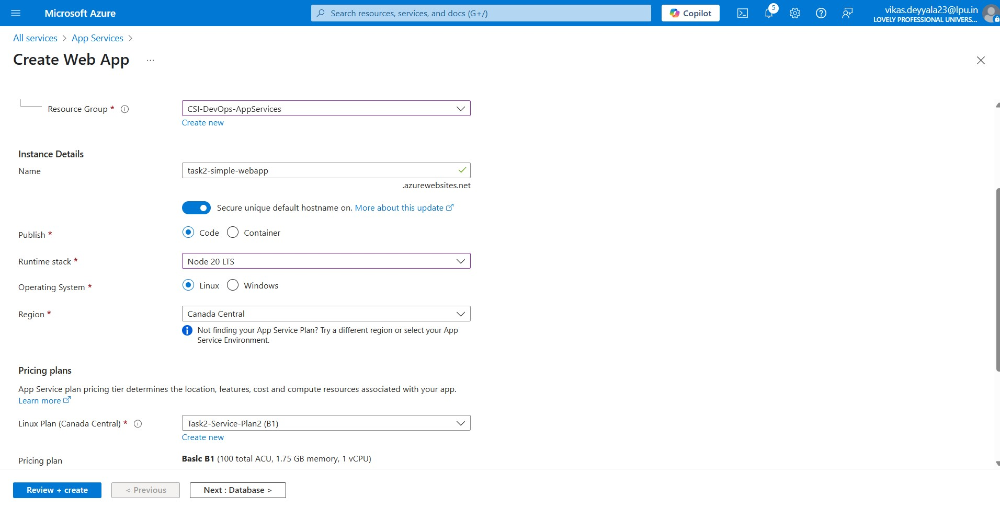

### Step 6: Deployment via GitHub Actions

- In the **Deployment** tab during Web App creation, selected:
  - **GitHub** as the deployment source.
  - Authorized and selected the `csi-test-repo` repository and branch (`main`).

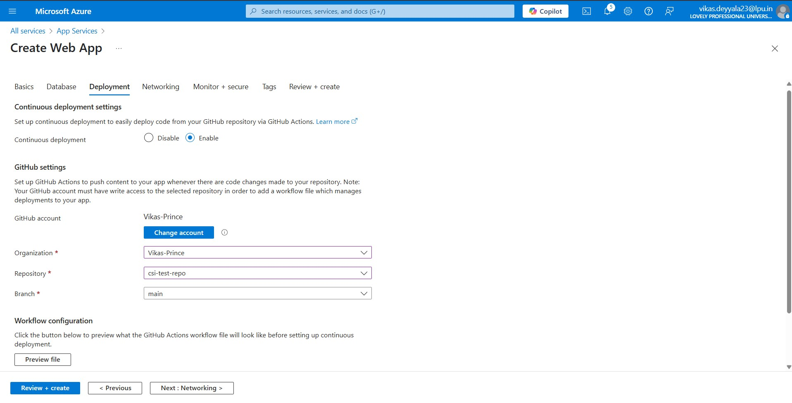

### Step 7: Review + Create

- Verified all the configuration details.
- Clicked on **Create** and waited for the deployment to complete.

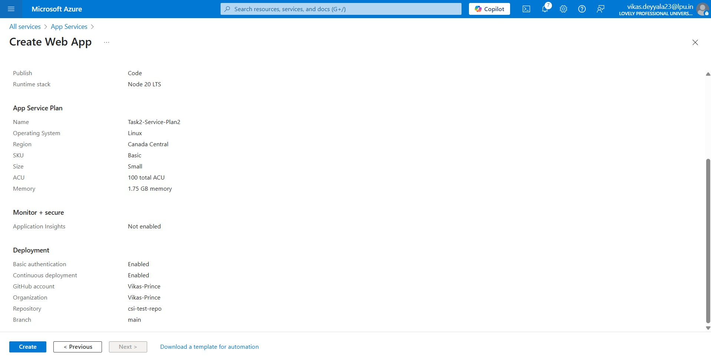

### ✅ Step 8: App Service Created Successfully

- After clicking **Create**, the Web App `task2-simple-webapp` was successfully provisioned using the selected App Service Plan.
- Navigated to **App Services > task2-simple-webapp** to confirm that the app was created.
- Azure automatically set up GitHub Actions for deployment as part of the selected deployment method.

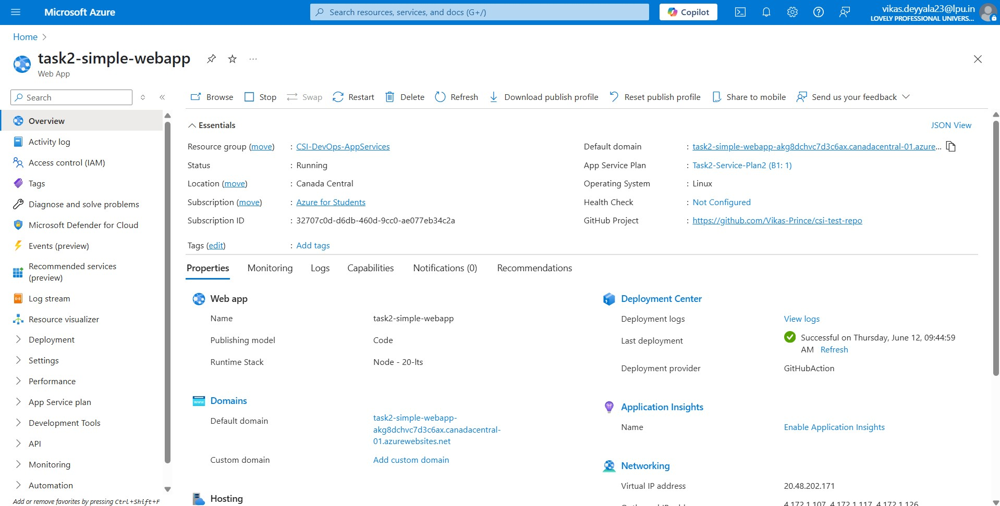

### ✅ Step 9: Azure App Service Started Deploying from GitHub

- Azure initiated deployment using the configured GitHub repository.
- Viewed deployment progress under **Deployment Center**.
- Verified that GitHub Actions workflow ran successfully, deploying the app code.

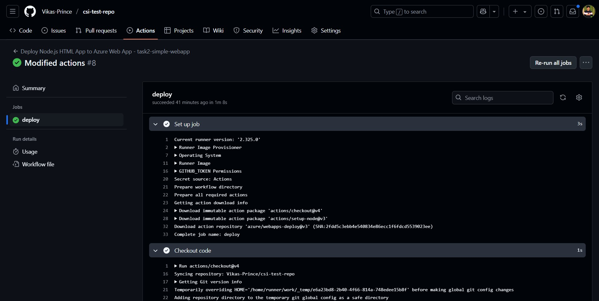

### ✅ Step 10: Final Web Page Rendered on Azure

- Accessed the Web App’s live URL (`https://task2-simple-webapp-akg8dchvc7d3c6ax.canadacentral-01.azurewebsites.net/`) by copying default domain.
- Confirmed that the static HTML page was served successfully from Azure App Service.

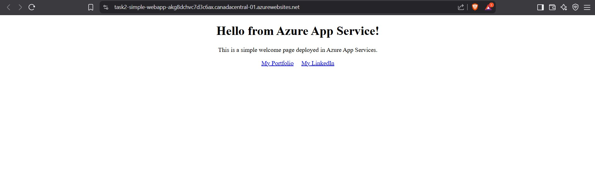

---

## Conclusion

This task helped me learn how to create an App Service Plan and deploy a simple HTML web app using Azure. I was able to set up everything from the portal, connect my GitHub repo, and see my webpage live on Azure.

---
