# 🐳 Week 2 – Azure Compute: Task 3

## 📌 Task: Create ACR, Push Image, and Deploy Container from ACR

## 🎯 Objective

The goal of this task was to understand how to use **Azure Container Registry (ACR)** to manage container images, and how to deploy containers in Azure using those images.

---

## Step-by-Step Implementation

### Step 1: Access Azure Container Registries

- From the Azure Portal, I searched for **Container Registries** and opened the service.

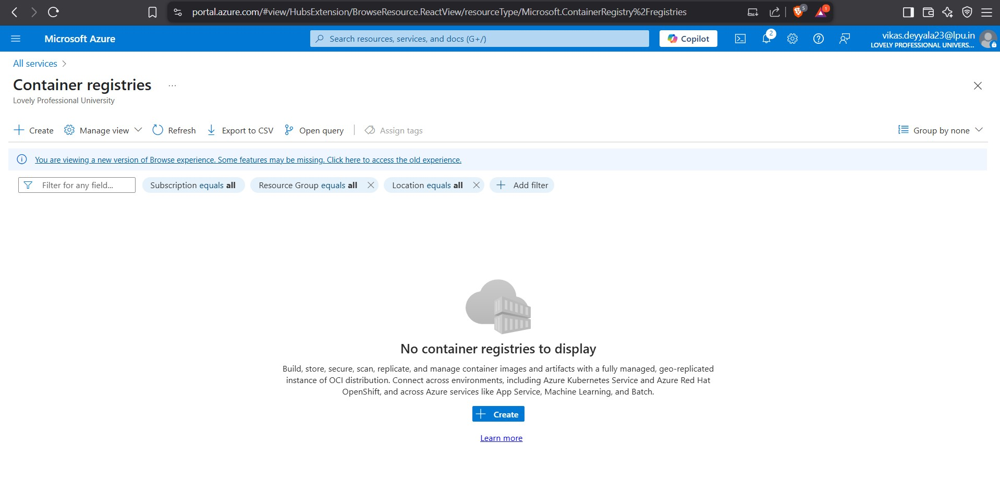

### Step 2: Create a New Azure Container Registry (ACR)

- Clicked on **Create**.
- Filled in the following configuration:
  - **Resource Group:** `csi_devops_acr`
  - **Registry Name:** `csitask3acr` *(unique name)*
  - **Location:** Central India
  - **SKU:** Basic (sufficient for this use case)

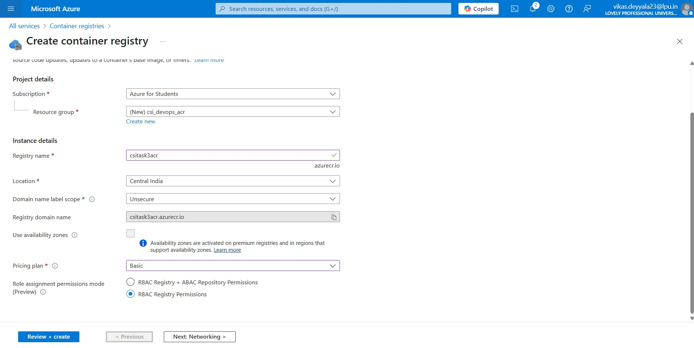

- After validating the details, I clicked **Review + Create**, then **Create**.

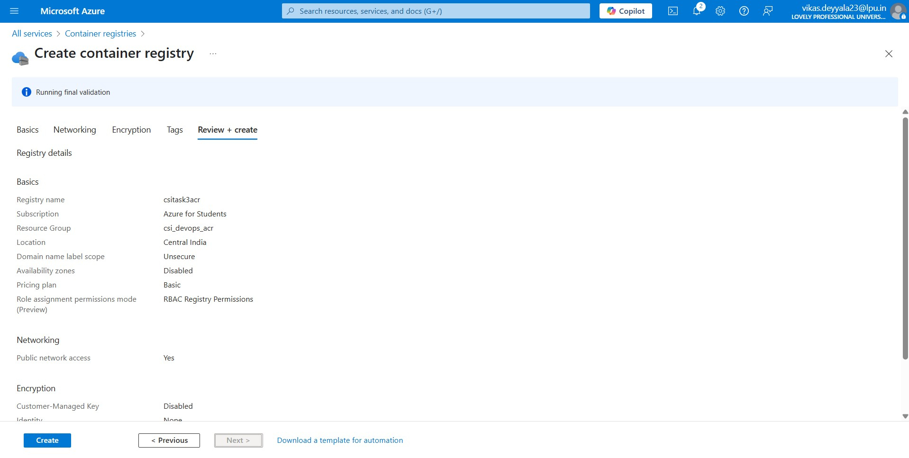

### Step 3: Log in to Azure & ACR

- Logged in to Azure using the CLI:

```bash
az login
```
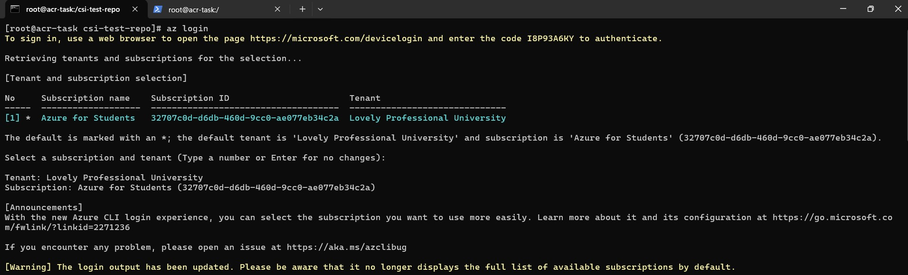

- Then, authenticated with my Container Registry:

```bash
az acr login --name csitask3acr
```

###  Step 4: Tag & Push Docker Image to ACR

- I had already built a custom Node.js image locally. I tagged it using the full ACR path and pushed it to ACR

```bash
podman tag csitask3image csitask3acr.azurecr.io/csitask3image:v1
podman push csitask3acr.azurecr.io/csitask3image:v1
```
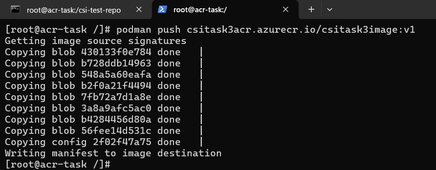

### Step 5: Verify Image in ACR
- After the push was successful, I verified the image inside the Azure Portal under the Repositories section of my registry.

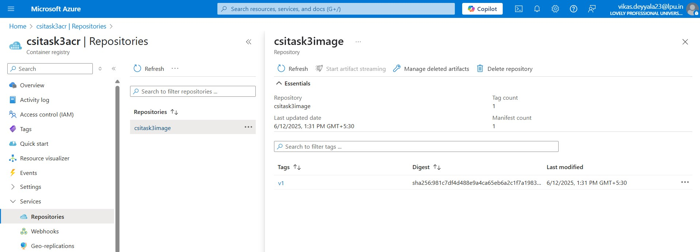

## Deploy Container from ACR in Linux VM & Azure Container Instances 

### Step 7: Deployed a Container on the VM

- I deployed a container inside the virtual machine using an image from Azure Container Registry (ACR):

```bash
podman run --name csi-task-container -d -p 3000:3000 csitask3acr.azurecr.io/csitask3image:v1
```

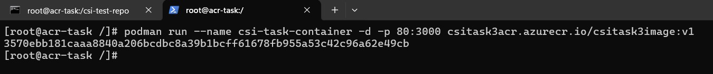

### Step 8: Create a Container Instance
- Navigated to Container Instances in the portal and initiated a new deployment:

  - **Container Name:** csitask3-container
  - **Image Source:** Azure Container Registry
  - **Image:** csitask3acr.azurecr.io/csitask3image:v1
  - **Port:** 3000 (used by my Node.js app)

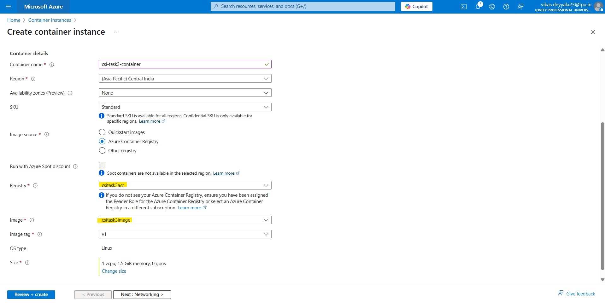

### Step 9: Review & Deploy
- Reviewed the configuration and clicked Create.

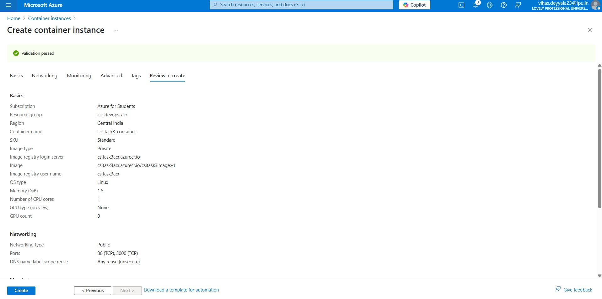

### Step 10: Container Deployed Successfully
- Once the deployment was complete, I navigated to the instance to confirm the status.

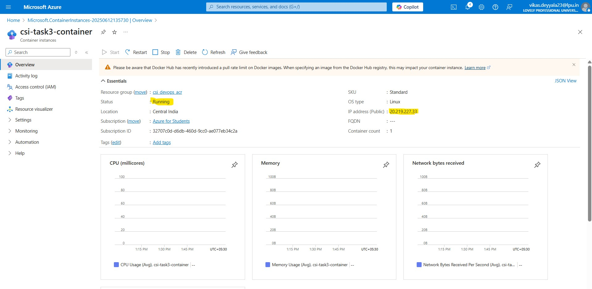

### Step 11: Verify Web Application
- Finally, I copied the container’s public IP address, opened it in a browser, and confirmed that my Node.js app (serving a static HTML page) was running successfully.

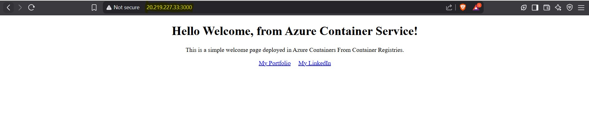

---

## Conclusion

This task helped me gain practical experience with managing container images using Azure Container Registry, and deploying them easily through Azure Container Instances.

---
