# 🐳 Week 2 – Azure Compute: Task 4

## 📌 Task: Deploy Docker App using Azure Container Instance & Container Groups

## 🎯 Objective

The goal of this task was to get hands-on experience with deploying containerized applications in Azure using **Azure Container Instances (ACI)**, and to explore how multiple containers can work together in a **Container Group**.

---

## Step-by-Step Implementation

### Step 1: Open Azure Container Instances

- From the Azure Portal, I searched for **Container Instances** and selected **Create**.
- This service allows us to quickly run Docker containers in a serverless environment without managing VMs.

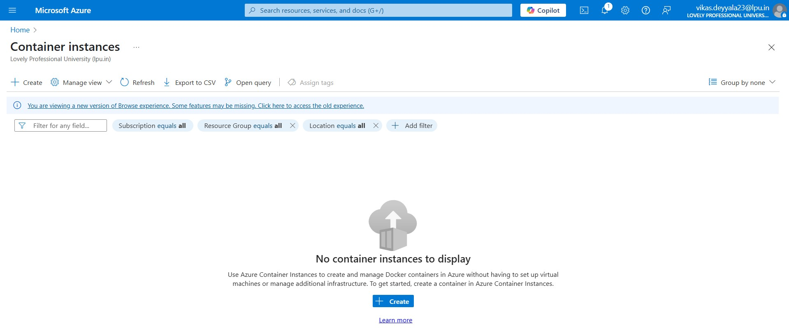

### Step 2: Configure the Container Instance

- I selected the **following basic settings**:

  - **Resource Group:** `csi-devops-container-rg`
  - **Container name:** `task4-csi-container`
  - **Region:** East US
  - **Image source:** _Docker Hub (Public)_
  - **Image:** `vikasprince/myapp:lts` _(A React Application )_
  - **OS type:** Linux
  - **CPU/Memory:** 1 vCPU, 1.5 GB RAM

> I had already experimented with deploying container images from **Azure Container Registry (ACR)** in a previous task.

> To explore all available options, this time I chose **Docker Hub** as the image source. I already have some custom images pushed to my Docker Hub account, so I used one of those (`vikasprince/myapp:lts`) for this deployment.

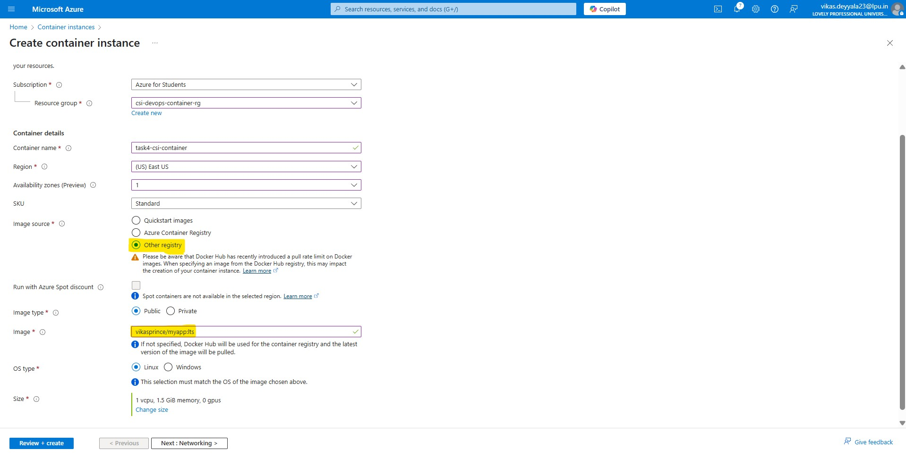

### Step 3: Configure Networking & Restart Policies

- Under the **Networking** tab:

  - Enabled **public access** to the container
  - Exposed **port 3000** on which react application will run
  - Set a custom **DNS name label** like `task4-csi-react-app`, which forms a public URL:
    `   http://task4-nginx-demo.centralindia.azurecontainer.io`
    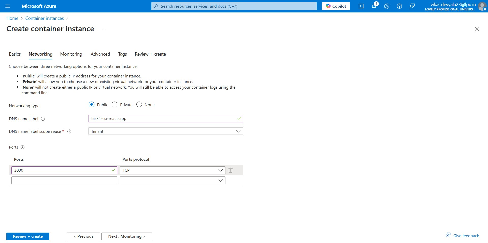

- Set the **Restart Policy** to restart the container automatically if it fails.
- I haven’t used any **environment variables** (like secrets) in this app, but this is the place where we can define them if needed.
- Additionally, we can also specify a **custom command override** here to control how the container starts.

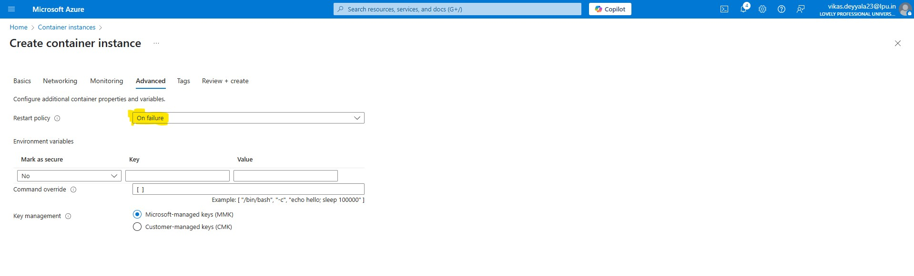

### Step 4: Review and Create

- After verifying all the settings, I clicked on **Review + Create**.
- Azure validated the configuration.
- I then clicked **Create** to start the deployment.

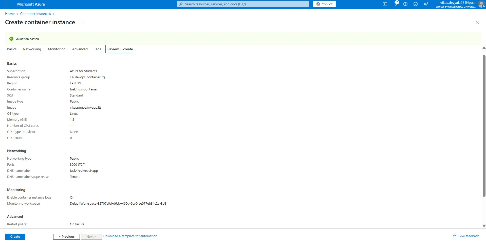

### Step 5: Container Deployed

After submitting the deployment, the container was successfully created. Azure assigned it a **public IP address** and a **fully qualified domain name (FQDN)** using the DNS label we set earlier. The container runs on **port 3000**, which is exposed for external access.

- We can now access our web application using either the container's **IP address** or the **DNS name**.

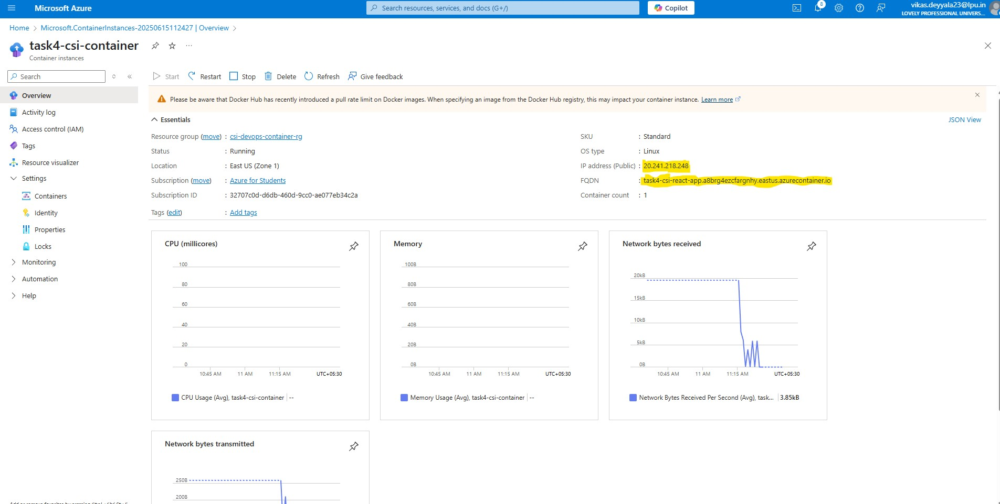

Azure also provides visibility into what's happening inside the container:

- **Container Events**: These show important actions like image pulling, container starting, and status updates.

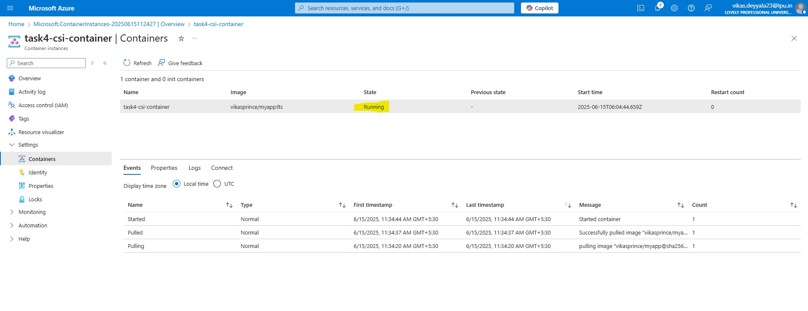

- **Container Logs**: Helpful for debugging and checking if the container app is running correctly. I checked the logs to verify that my application started without issues.

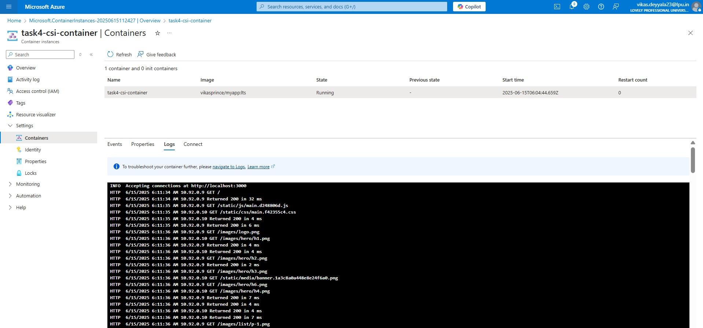

- **Container usage**: Displays visual metrics such as CPU, memory, and network usage over time. These performance graphs help monitor resource consumption and ensure the container remains within its allocated limits.

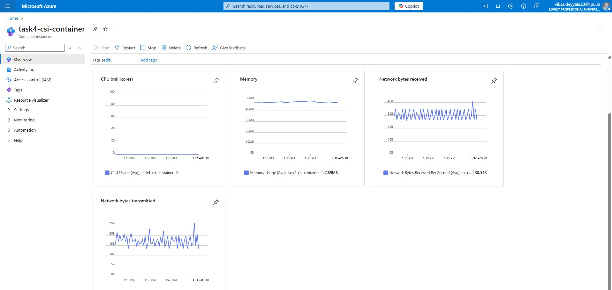

### Step 6: Verify Deployment

To confirm everything was working as expected, I tested access through:

- The container's **FQDN (DNS name)**
- The container's **Public IP**

I entered both into a browser, and the Node.js web application loaded successfully — this verified that the container was running and the image from Docker Hub was deployed properly.

- DNS Access:

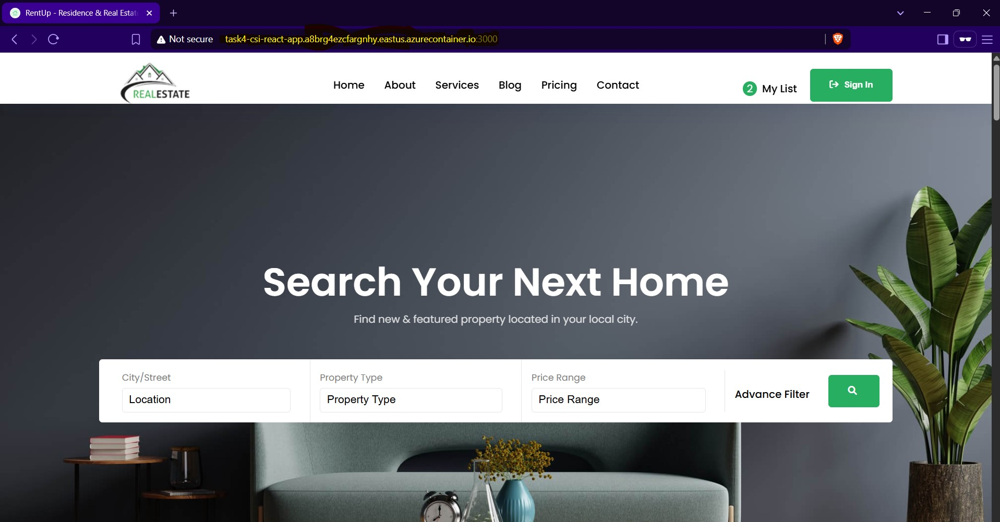

- IP Access:

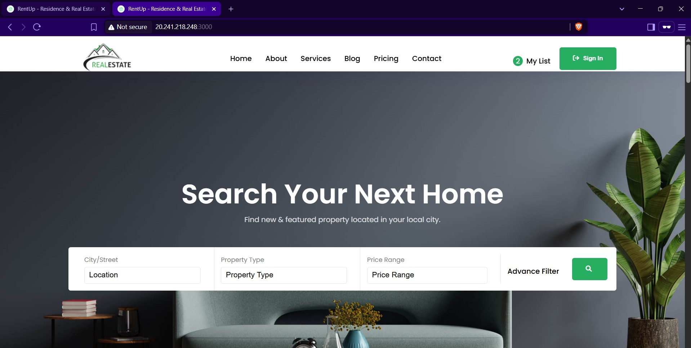

This successful test validated that the application was deployed and accessible over the internet via Azure Container Instances.

---

## Container Group

### Step 7: Deployed a Multi-Container Group

Since Azure Portal doesn't currently support GUI-based multi-container group creation, I used **Azure Cloud Shell** to deploy a container group with two containers.

A container group in Azure works like a Kubernetes Pod — all containers in a group share the same network, storage, and lifecycle.

- I connected to Azure Cloud Shell and created yaml file to deploy multi containers

#### YAML Template (multi-container.yml)

Here's the YAML file I created in Azure Cloud Shell:

```bash
apiVersion: 2019-12-01
location: eastus
name: task4-container-group
properties:
  containers:
  - name: nginx
    properties:
      image: nginx
      ports:
      - port: 80
      resources:
        requests:
          cpu: 1.0
          memoryInGb: 1.5
  - name: busybox
    properties:
      image: busybox
      command:
      - sh
      - -c
      - "while true; do echo Hello from BusyBox; sleep 10; done"
      resources:
        requests:
          cpu: 0.5
          memoryInGb: 0.5
  osType: Linux
  ipAddress:
    type: Public
    dnsNameLabel: task4-multicontainer-demo
    ports:
    - protocol: tcp
      port: 80
  restartPolicy: Always
type: Microsoft.ContainerInstance/containerGroups

```

> This defines a container group with:

- An nginx web server (accessible over port 80)
- A busybox sidecar that logs a message every 10 seconds

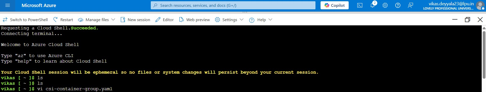

### Step 8: Deploy the Container Group

To deploy the YAML from Azure Cloud Shell, I ran the following command:

```bash
az container create --resource-group csi-devops-container-rg --file task4-multicontainer.yml
```

- Azure started provisioning the container group as specified

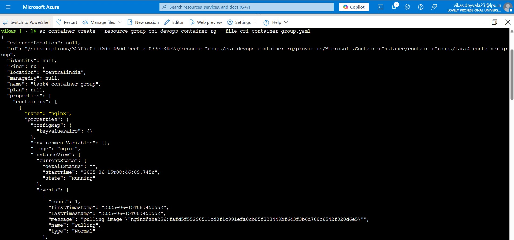

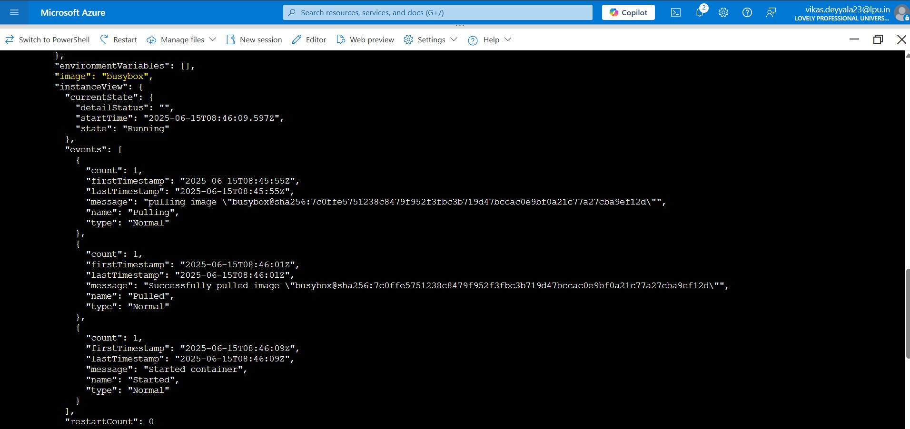

### Step 9: Verify Multi-Container Group

Once the deployment was complete, I verified that everything was functioning as expected:

- Both containers (`nginx` and `busybox`) were running successfully within the container group.

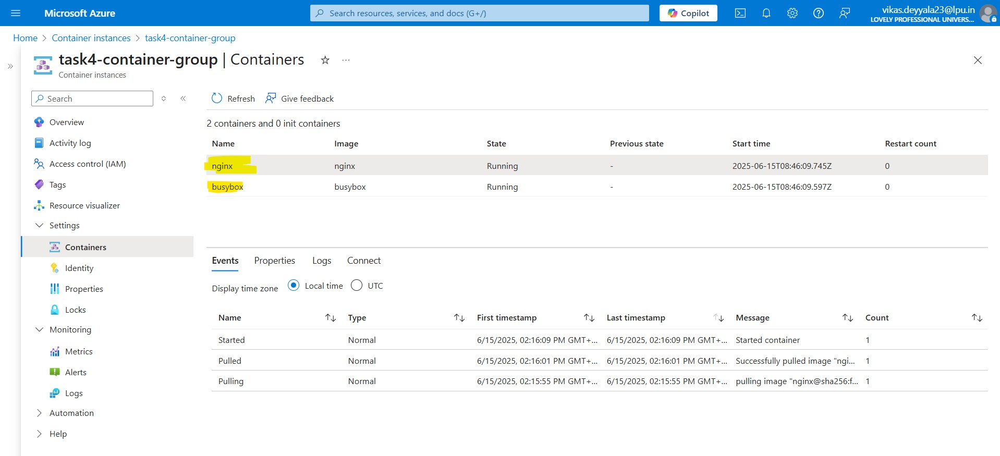

- The container group had a **public IP address** and was accessible via the assigned **DNS label**:

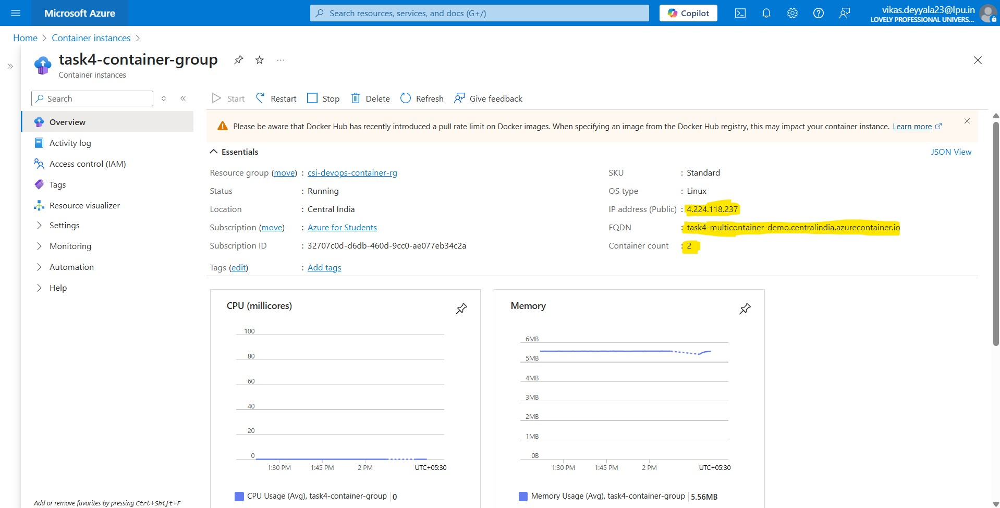

```bash
http://task4-multicontainer-demo.centralindia.azurecontainer.io
```

- Accessing the container group DNS in a browser returned the **NGINX welcome page**, confirming the frontend was working.

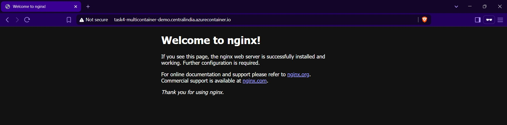

- The **busybox container** ran its looped shell script as expected, logging "Hello from BusyBox" every 10 seconds.

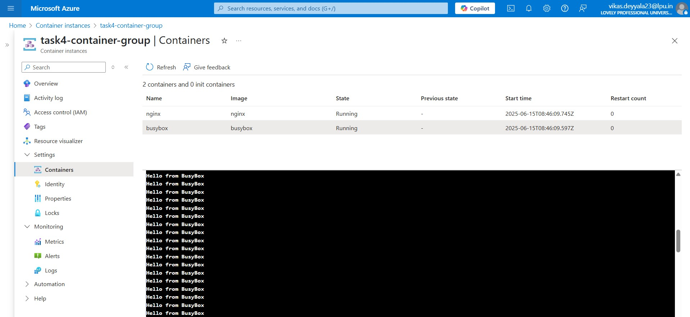

---

## Conclusion

This task gave me practical hands-on experience with deploying containers using Azure Container Instances. I explored both single-container deployments and multi-container setups using container groups.

---
