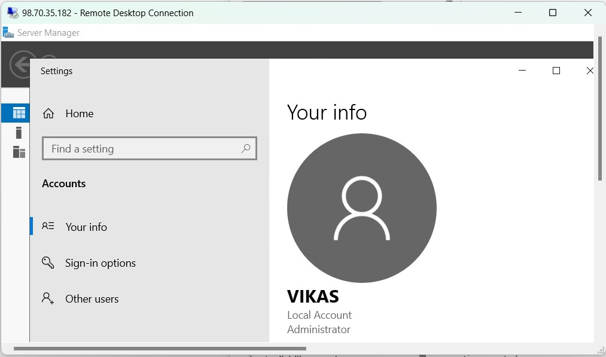
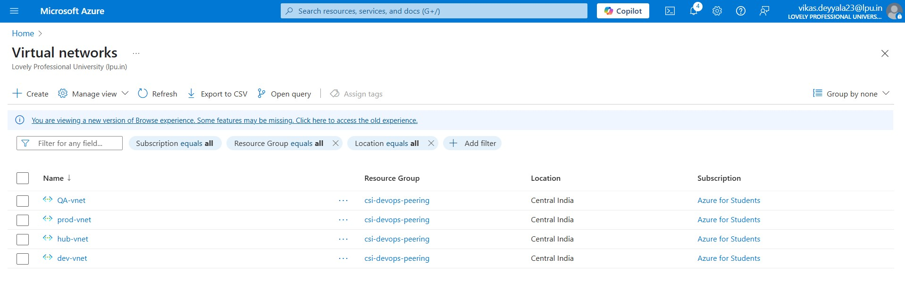

# 🌐 Week 2 – Azure Networking: Task 5

## 📌 Task

### A. Create a VNet with 2 Subnets
- **Subnet-1:** For Linux VM & Windows VM  
- **Subnet-2:** For SQL DB

### B. Create 4 VNets
1. **Management VNet (Hub)**
2. **Production VNet (Spoke)**
3. **Testing VNet (Spoke)**
4. **Development VNet (Spoke)**

> Configure **Hub-and-Spoke Architecture** and validate the setup by launching VMs in each VNet and verifying connectivity by **pinging all Spoke VMs from Management VM**.

---

## 🎯 Objective

To understand Azure Virtual Networking concepts and implement **Hub-and-Spoke topology**, enabling centralized access and monitoring, which is a common enterprise network design in real-world DevOps infrastructure.

---

## Part A: Single VNet with Two Subnets

### Step 1: Create a VNet with Two Subnets

- Navigated to **Azure Portal → Virtual Networks → Create**
- Gave the VNet name as `task5-vnet`, region as `Central India`
- Created:
  - **Subnet-1**: `vm-subnet` (for Linux & Windows VMs)
  - **Subnet-2**: `db-subnet` (for future SQL resources)


### Step 2: Deployed VMs into Subnet-1

- Created:
  - **Linux VM:** Redhat Linux using username and password

  

  

  - **Windows VM:** Windows Server 2019 using RDP

  

  

- Both VMs placed under `vm-subnet`

  

### Step 3: Verified Access

- Logged into Linux VM using SSH


- Logged into Windows VM using RDP (enabled port 3389)



- Ensured both were reachable and configured properly

## Azure SQL Databas
I provisioned an Azure SQL Database and connected to it using Azure Data Studio. Here's everything I did, step by step:

### Step 1: Created Azure SQL Server
I first searched for SQL Server in the Azure portal and clicked on Create.
I provided the following details:
- Server Name: `csi-devops-sql-server`
- Region: Central India
- Authentication: SQL Authentication
- Admin Username: `sqladmin`
- Password: secure password

> This server will act as a container for the database I create next.


### Step 2: Created SQL Database

Once the server was ready, I clicked on Create SQL Database and filled in the following:

- Resource Group: csi-devops
- Database Name: csi-devops-db
- Compute + Storage: General Purpose – Serverless (Gen5), 1 vCore, 32 GB
- Backup Redundancy: Geo-redundant (for high availability)


### Step 3: Configured SQL Server Firewall
Before connecting, I navigated to the Networking tab of the SQL Server and:

- Enabled access from Azure services
- Added my client IP to the firewall rules

### Step 4: Review the changes and create
After reviewing the changes, I clicked on Review + create to create the database.
> I also selected to use the sample database provided by Azure for testing.


- Successfully Deployed Sql Database


### Step 5: Connect to the database using Azure Data Studio
Once everything was ready, I opened Azure Data Studio and connected using:

- Server name: csi-devops-sql-server.database.windows.net
- Login: sqladmin
- Password: same as earlier


After logging in, I added my Azure account and verified that the csi-devops-db was listed.


Connection was established successfully and able to saw the databases


### Step 5: Queried the Sample Database

To validate the setup, I executed the following queries:

```bash
SELECT TOP 10 * FROM SalesLT.Customer;
SELECT * FROM SalesLT.SalesOrderHeader WHERE TotalDue > 1000;
```
- And it returned the expected results from the sample data, confirming a successful connection and working database.


---


## Part B: Hub-and-Spoke Architecture

### Step 1: Created 4 VNets

I created the following VNets, all in the **Central India** region:

| VNet Name   | Address Space | Purpose           |
| ----------- | ------------- | ----------------- |
| `hub-vnet`  | 10.0.0.0/16   | Management Hub    |
| `prod-vnet` | 10.1.0.0/16   | Production Apps   |
| `test-vnet` | 10.2.0.0/16   | Testing Workloads |
| `dev-vnet`  | 10.3.0.0/16   | Development       |




### Step 2: Configure Peering (Hub-and-Spoke)

- Peered:
  - `hub-vnet` → `prod-vnet`
  - `hub-vnet` → `test-vnet`
  - `hub-vnet` → `dev-vnet`
- Enabled **"Allow traffic to remote virtual network"**  in all peerings.


### Step 3: Deployed VMs in Each VNet

I deployed one **RedHat Linux VM** in each VNet:

| VNet        | VM Name   | Public IP |
| ----------- | --------- | --------- |
| `hub-vnet`  | `hub-vm`  | Yes       |
| `prod-vnet` | `prod-vm` | No        |
| `test-vnet` | `test-vm` | No        |
| `dev-vnet`  | `dev-vm`  | No        |

- Deployed Management Virtual Machine in `hub-vnet` with public IP


- Deployed A Development Virtual Machine in `dev-vnet` without public IP


- Deployed A Production Virtual Machine in `prod-vnet` without public IP


- Deployed A QA Virtual Machine in `QA-vnet` without public IP


---

### Step 4: Verified Connectivity from HUB VM

* I logged into the `hub-vm` from the `hub-vnet`
* Used `ping` to check connection to other VMs using their **private IPs**

```bash
ping dev-vm-private-ip
```


```bash
ping prod-vm-private-ip
```


```bash
ping test-vm-private-ip
```


All VMs responded, which confirmed that the **Hub-and-Spoke topology** was working as expected.

---

## Conclusion

This task helped me understand Azure networking by creating VNets, subnets, and setting up a Hub-and-Spoke architecture. I deployed VMs in each VNet, configured peering, and verified that all spoke VMs were reachable from the hub VM. I also set up an Azure SQL Database, connected to it, and ran basic queries to confirm everything was working. Overall, it was a good hands-on experience with Azure network setup and connectivity.

---