# ⚖️ Week 2 – Azure Networking: Task 6

## 📌 Task: Create an Internal and External Load Balancer

## 🎯 Objective

To understand how to distribute traffic efficiently within Azure using both **Internal** and **Public Load Balancers**. This setup helps in load distribution, high availability, and traffic management — key concepts every DevOps engineer must know.

---

## Implementation

### Step 0: Resource Group Setup

- Created a dedicated **Resource Group** to logically group and manage all the related resources used for this task.

### Step 1: Set Up VNet & Backend Virtual Machines

To prepare for load balancing:

- ✅ I deployed **two private Ubuntu VMs** in the same **VNet and subnet (`lb-subnet`)**
*This setup allows both VMs to communicate within the same network securely.*
- ✅ Allowed **port 80 (HTTP)** traffic through NSG
*Opening port 80 lets the web servers receive HTTP requests.*
- ✅ Attached a **NAT Gateway** so I could install necessary packages
*The NAT Gateway provides outbound internet access without exposing the VMs directly to the internet.*

- Instead of assigning public IPs (which is not a best practice for security), I used **Azure Bastion**. Bastion provides secure and seamless RDP/SSH connectivity to virtual machines directly from the Azure portal over SSL, without exposing the VMs to the public internet.

*This keeps the VMs secure by avoiding public IP exposure but still allows easy access for management.*

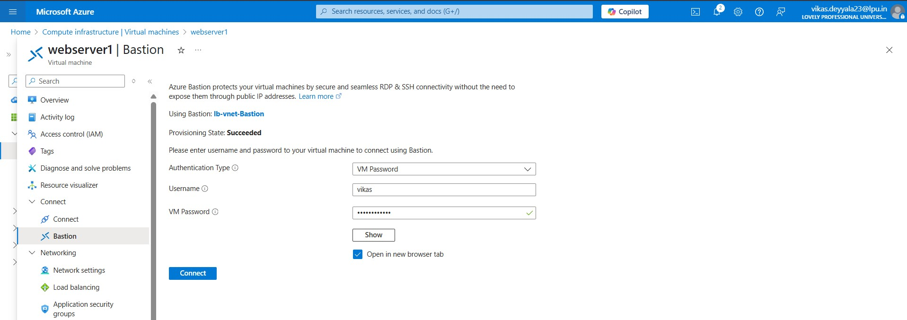

- I successfully logged into both vm's using bastion host

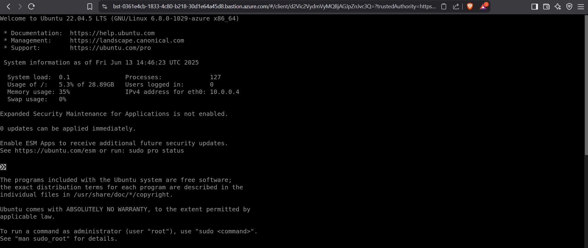

- Once connected, I installed **Apache Web Server** on both VMs as the sample application.

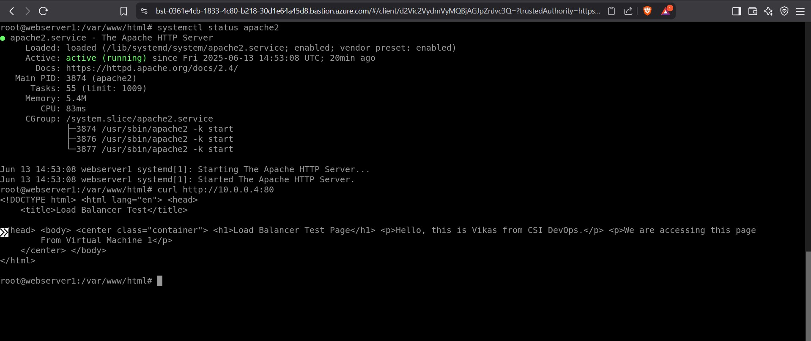

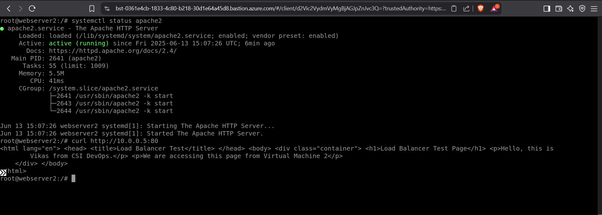

## Part A: External Load Balancer

### Step 2: Create Public IP

- Created a **Static Public IP** named `public-lb-ip`. This IP will be used as the frontend IP for the external load balancer. A static IP ensures the IP doesn’t change even if the load balancer is restarted.

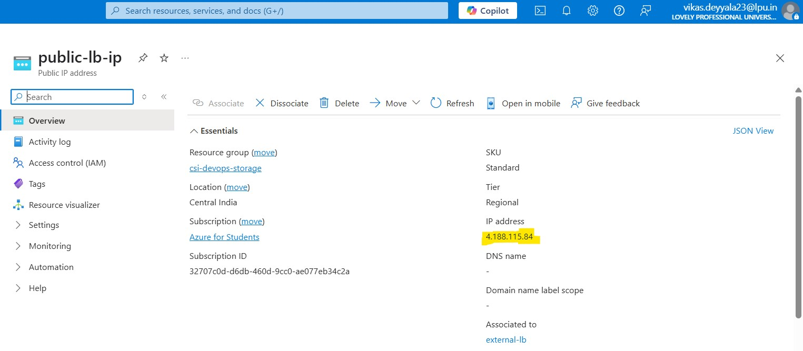

### Step 3: Create External Load Balancer
Creating the external load balancer allows incoming internet traffic to be distributed across backend VMs.
- Went to **Load Balancers → Create**
- Named it: `external-lb`
- Selected **Public** as the type
- Assigned the previously created **static public IP**
- Region: Central India
- SKU: Standard

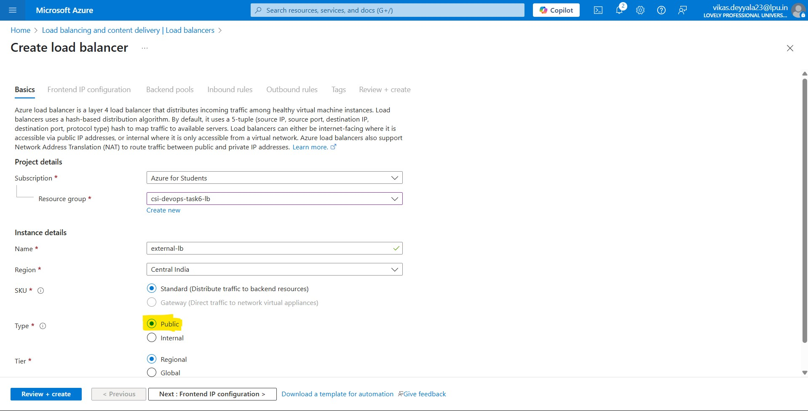


### Step 4: Frontend IP Configuration
- Configured the frontend with the previously created static public IP. This is the IP users will hit from the browser to access the application.

- This makes the load balancer accessible to external clients.

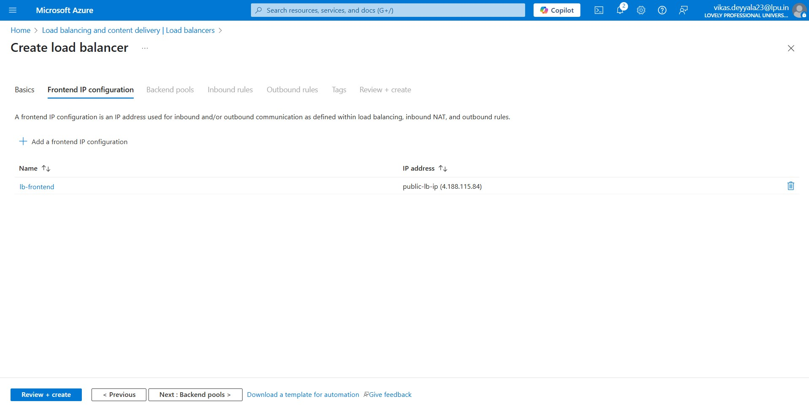

### Step 5: Backend Pool Configuration

- Added both Linux VMs manually to the **backend pool**. Selected the network interface (NIC) and IP configuration for each.

- The backend pool is where traffic will be distributed.

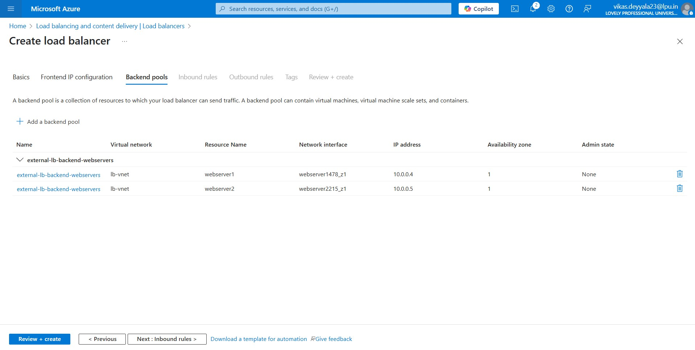

### Step 6: Load Balancing Rule

- Name: `lb-rule`
- Protocol: **TCP**
- Port: **80**
- Backend Port: **80**
- Associated the backend pool and health probe

### Step 5: Health Probe

- Created a health probe named `lb-health-probe` to continuously check if VMs are available and healthy on port 80. If a VM fails, traffic won’t be routed to it.
- Protocol: **TCP**
- Port: **80**
- Name: `lb-health-probe`

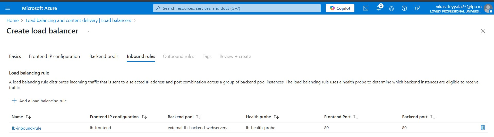

### Deployed Loadbalancer

- Successfully Deployed External Loadbalancer.
- The external load balancer is now ready to distribute traffic to backend VMs from the public internet.

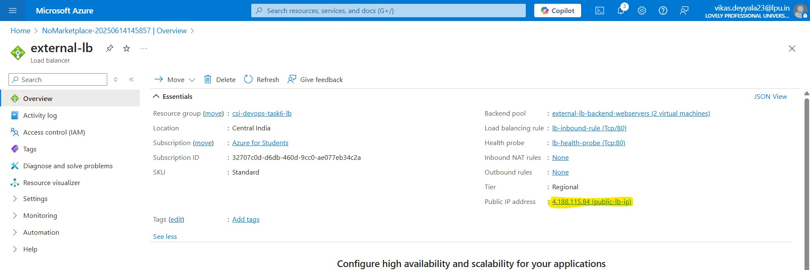

### Step 7: Testing External LB

- After deployment, I tested the setup by hitting the public IP in the browser. Refreshed multiple times traffic successfully distributed between the two VMs.
- Accessed using public IP from browser

[Watch loadbalancer testing](https://drive.google.com/file/d/1yhI5SvU3KAiVgkEn3nDpZAyD-vCfdOmo/view?usp=sharing)

## Part B: Internal Load Balancer

Internal Load Balancer distributes traffic only within the virtual network, useful for backend services.

### Step 1: Create Internal Load Balancer

- Navigated to **Load Balancers → Create**
- Named it: `internal-lb`
- Type: **Internal**
- Assigned a **Private IP address** within the subnet range (`lb-subnet`)
- Region: Central India

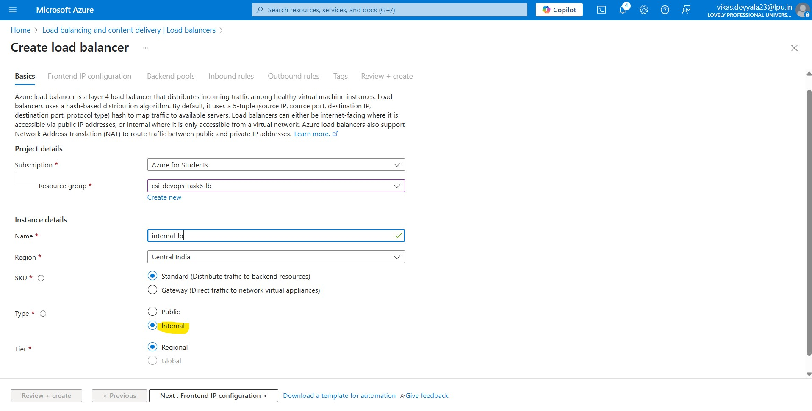

### Step 2: Frontend IP configuration

Assigned a Static IP to access the webserver later

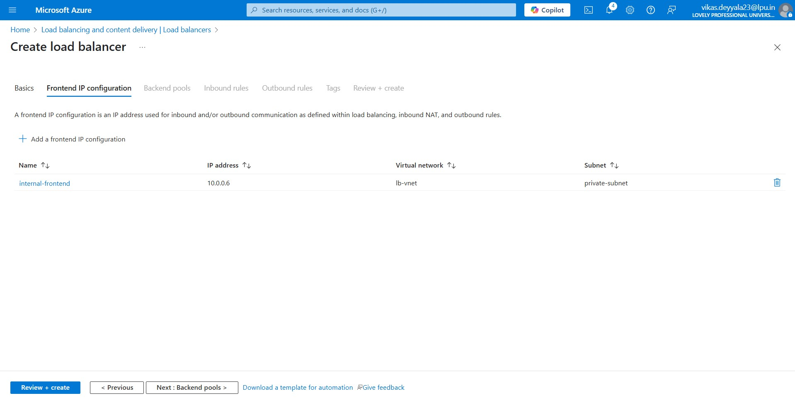

### Step 3: Backend Pool

- Used the same VMs as backend instances
- Ensured proper NSG rules allow internal traffic

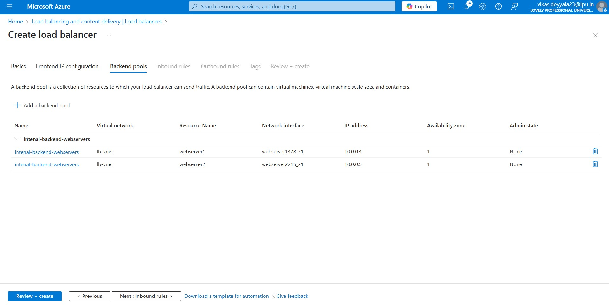

### Step 4: Internal Health Probe
Created a probe named `internal-health-probe` that checks for TCP connectivity on port 80.
- Protocol: **TCP**
- Port: **80**
- Named: `internal-health-probe`

### Step 5: Load Balancing Rule (Internal)
Configured a rule that distributes HTTP traffic (port 80) to backend pool members using the health probe.
- Protocol: **TCP**
- Port: **80**
- Associated backend pool and health probe

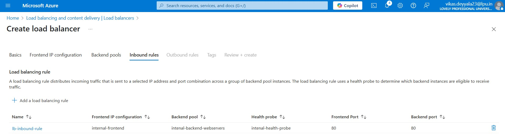

### Step 6: Successfully Deployed Internal Loadbalancer
Internal Load Balancer deployed successfully, ready to route traffic securely within the virtual network using .

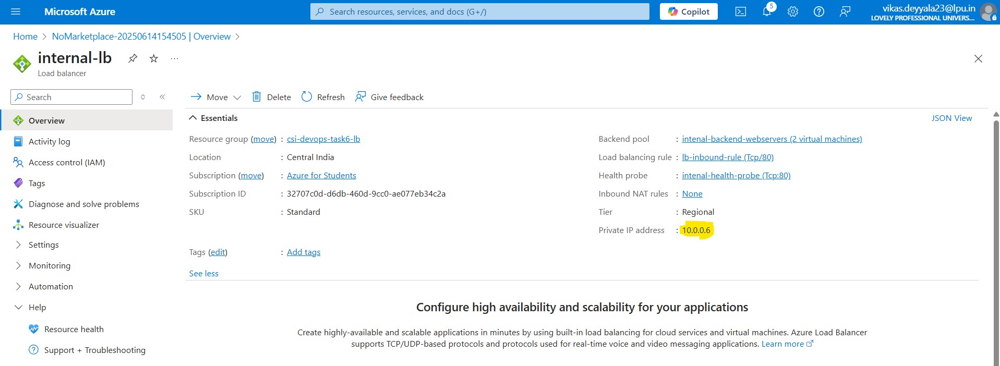


### 🧪 Step 5: Testing Internal LB

- Logged into one of the VMs
- Used `curl` command to hit internal load balancer's private IP:
```bash
curl http://<10.0.0.6:80>
```

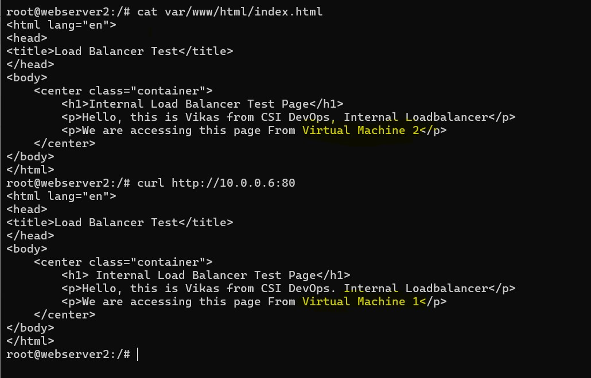
*Testing from inside the network confirms that the internal load balancer is correctly routing traffic.*

> **NOTE** We can access this from other VMs within the same virtual network as well.
---

## 🧾 Conclusion

This task was a great opportunity to get hands-on with Azure Load Balancers. I not only followed the core steps but also **enhanced the security aspect** by using **private instances and Bastion Host** access — even though it wasn’t explicitly required.

---