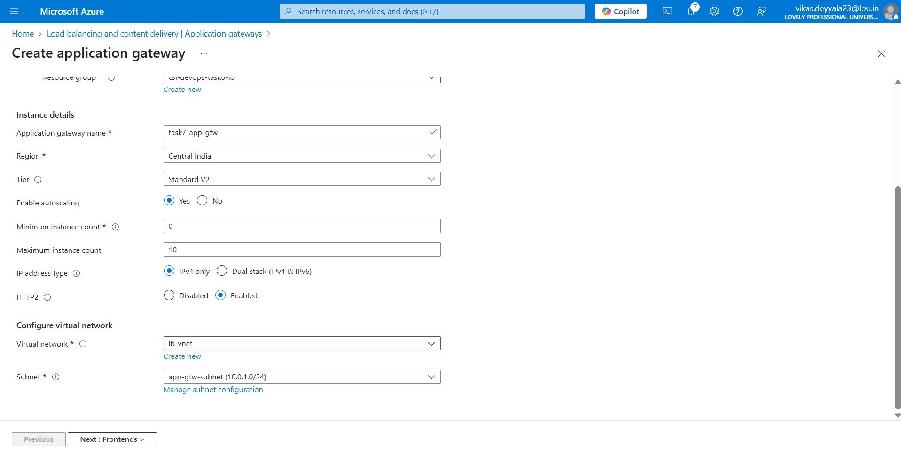
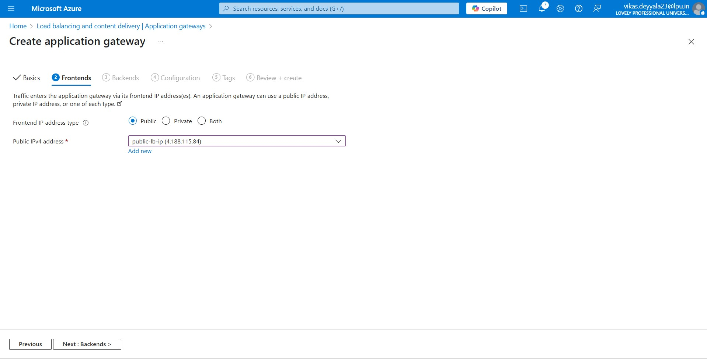
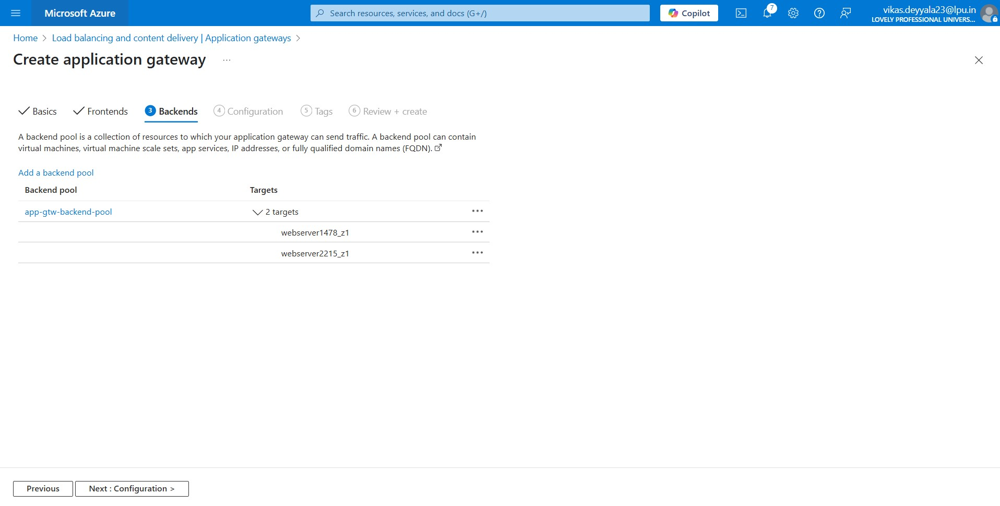
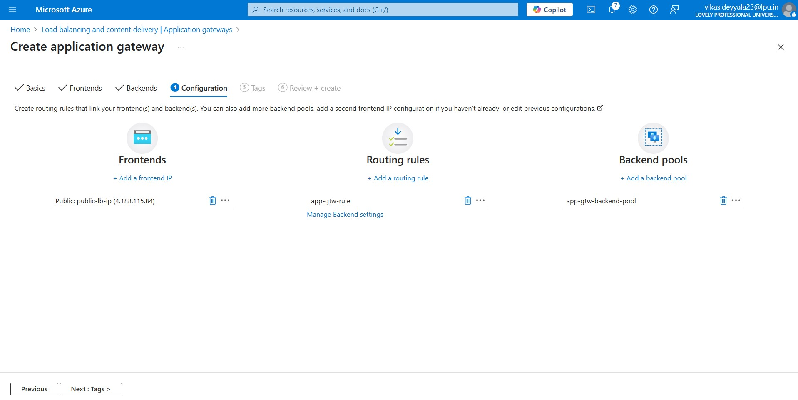
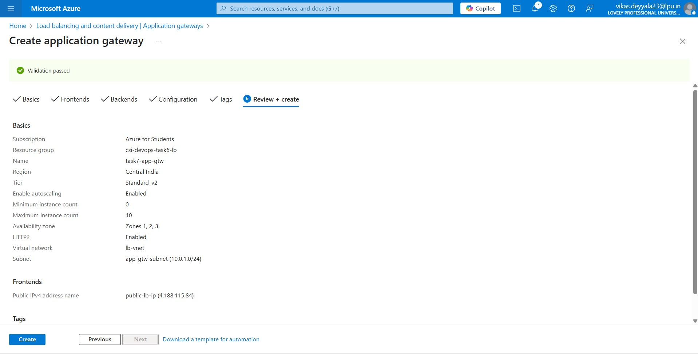
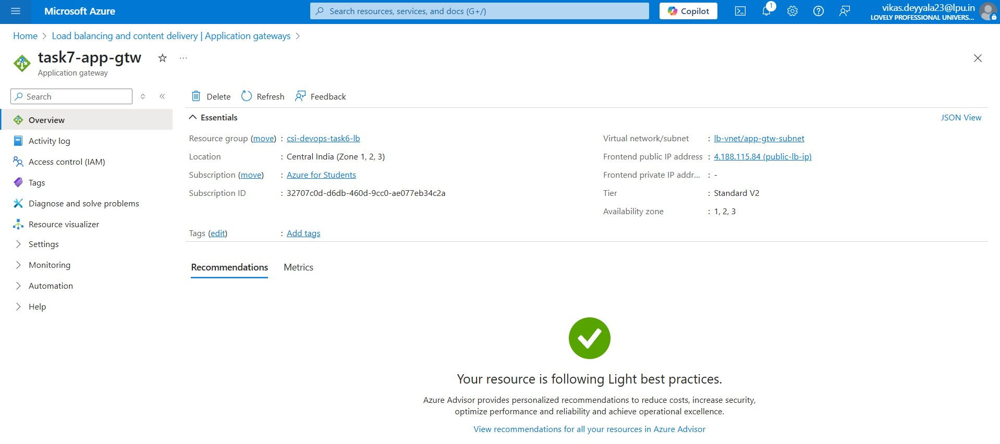

# 🌐 Week 2 – Azure Compute: Task 7

## 📌 Task: Create and Test Azure Application Gateway

---

## 🎯 Objective

The goal of this task is to understand and implement **Azure Application Gateway** to manage HTTP(S) traffic with load balancing, intelligent routing, and secure delivery to backend servers.

> In this task, I deployed and configured an **Azure Application Gateway** using **previously created infrastructure** (from the Load Balancer task), including VMs, Virtual Network, and Subnets. I configured routing, backend pools, and health probes and finally tested the setup by accessing a custom web page hosted on backend VMs through the Application Gateway.

## 🔧 Step-by-Step Guide

### Step 1: Used Existing Resources

I reused the following resources created during the Load Balancer task:

- **Virtual Network**: Includes two subnets:
  - `app-gtw-subnet`: dedicated for Application Gateway
  - `private-subnet`: contains backend web servers (VMs)
- **Web Servers (VMs)**: 2 Linux VMs already deployed in `private-subnet` with Apache Web Server installed
- **Public IP**: Used the same static public IP created earlier for external access

> **Note**: Application Gateway requires a dedicated subnet — it cannot share a subnet with backend VMs or other resources. So i created dedicated subnet only for application gateway

### Step 2: Web Server Configuration (Pre-existing Setup)

On both Linux VMs (in `private-subnet`), Apache was already installed with unique welcome messages on their `index.html` to help confirm load balancing:

```bash
sudo yum install httpd -y
sudo systemctl start httpd
sudo systemctl enable httpd
```

- Each VM served a different HTML message to identify which server responded during testing.

---

### ✅ Step 3: Create Application Gateway

Navigated to **Application Gateways** in Azure Portal and clicked **Create**:

- **Name:** `task7-app-gtw`
- **Region:** Central India
- **Tier:** Standard V2 (for better features and autoscaling)
- **VNet/Subnet:** Selected `app-gtw-subnet` under existing VNet



### ✅ Step 4: Configure Frontend and Backend

- **Frontend Configuration:**
  - elected the **existing public IP** for incoming traffic



- **Backend Pool:**
  - Configured with the **private IP addresses** of both VMs to distribute traffic via the Application Load Balancer.



- **Health Probe:**

  - Configured a custom HTTP probe to `/` on port `80`

- **Backend HTTP Setting:**

  - Port: 80
  - Protocol: HTTP
  - Enabled **cookie-based affinity** (optional)

- **Routing Rule:**
  - Listener: HTTP on port 80
  - Backend target: backend pool



### ✅ Step 5: Review and Create

- Clicked on **Review + Create**
- Waited for the deployment to complete (~10 minutes)



### Step 6: Deployed Application Loadbalancer

- Successfully deployed the Application Gateway.
- The Application Gateway is now accessible via the public IP address.



### ✅ Step 7: Test Application Gateway

- Copied the **public IP** of the Application Gateway
- Pasted in browser → Successfully saw the custom page
- Refreshed several times → Confirmed **load balancing** by seeing different VM messages

[Watch Application Gateway Testing](https://drive.google.com/file/d/1PYxqpVhif9LNPTK9FW3TBC0ZO7wrR5im/view?usp=sharing)

<video width="640" height="360" controls>
  <source src="https://drive.google.com/file/d/1PYxqpVhif9LNPTK9FW3TBC0ZO7wrR5im/view?usp=sharing" type="video/mp4">
</video>

> Application Gateway and Load Balancers can work together to handle traffic better by combining basic load distribution with smarter routing and security features.

---

## Conclusion

In this task, I successfully created and configured an Azure Application Gateway from scratch. I set up the frontend, backend pools, health probes, and routing rules, and tested the setup by accessing the application through the gateway. The load balancing worked as expected, distributing traffic across the backend VMs. This hands-on experience helped me gain practical knowledge of Azure’s application-level load balancing and traffic management.

---
