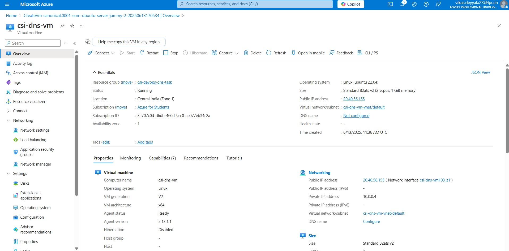
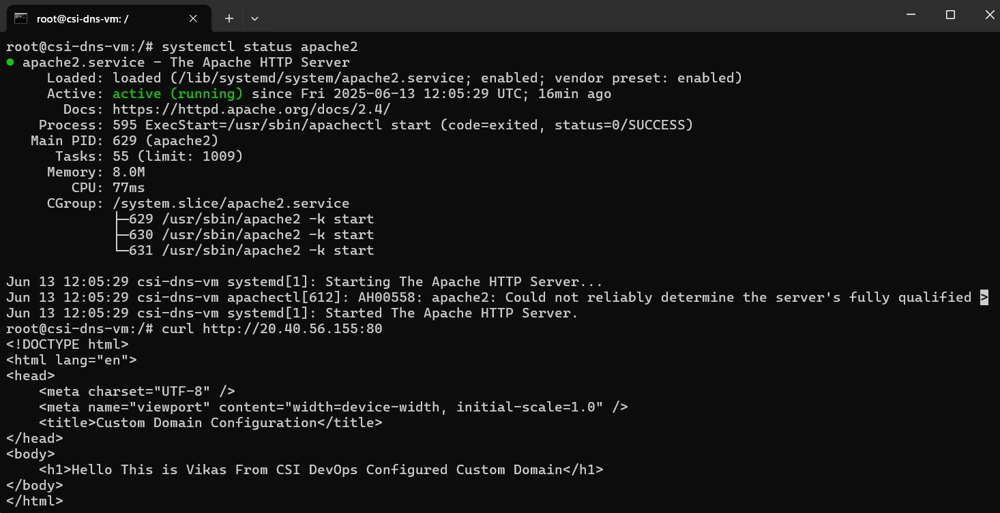
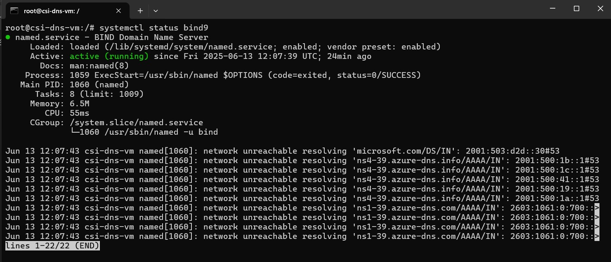
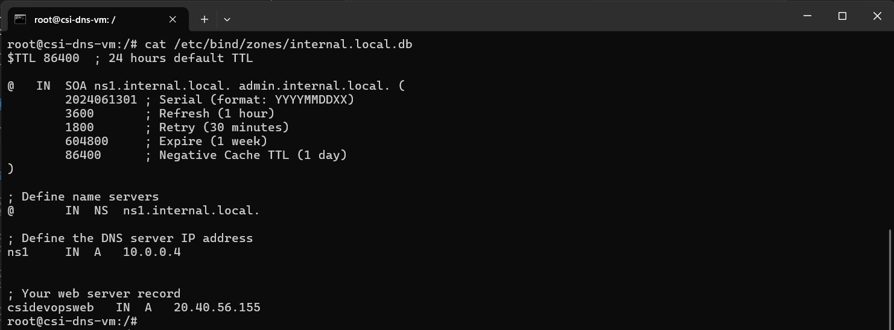
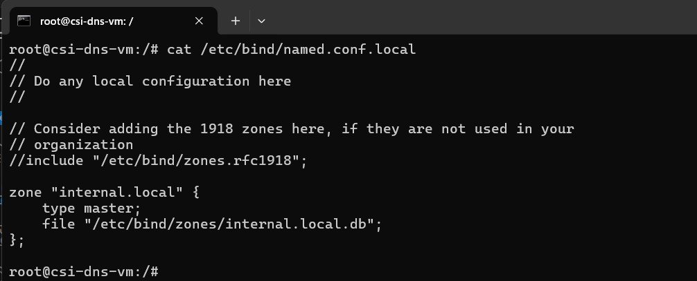
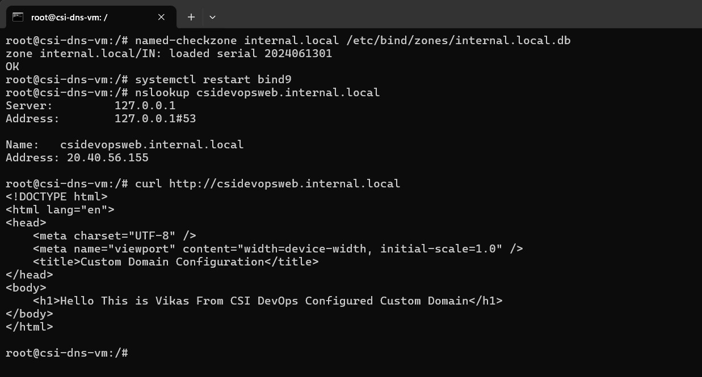
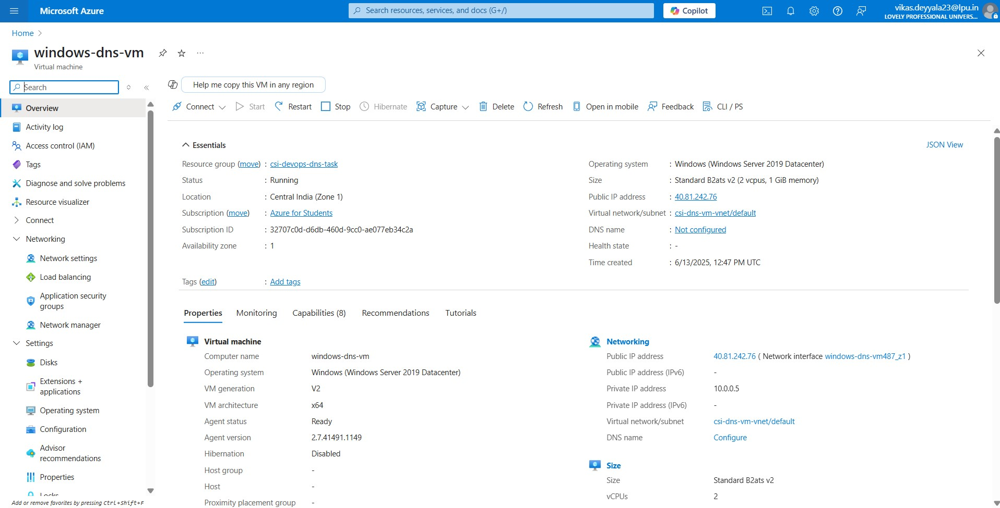
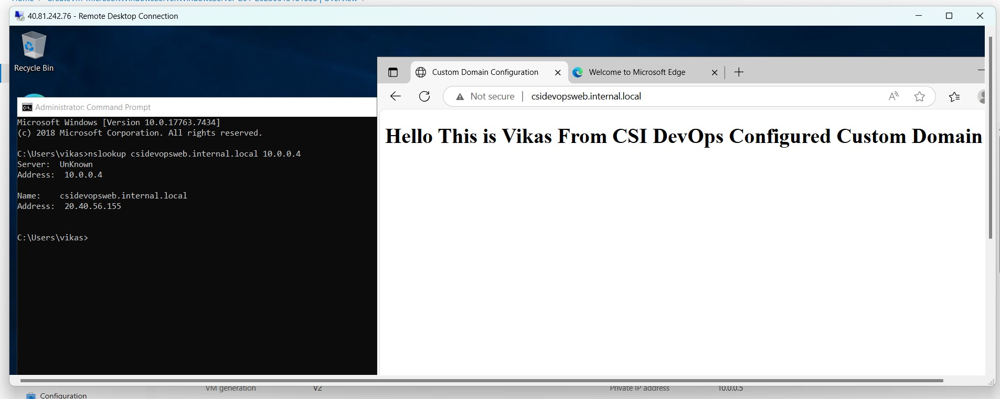

# Week 2 – Azure Networking: Task 8

## Task: Set Up a Domain, Configure a Web Server, and Route Traffic Using an Internal DNS Server

## Objective

In this task, I implemented a private DNS infrastructure in Azure using a Linux VM. The goal was to host a custom domain (`internal.local`) and route traffic internally to a web server through DNS resolution. This exercise closely simulates how DNS routing works in private enterprise environments and strengthens my understanding of cloud networking and name resolution in virtual networks.

---

## Step-by-Step Implementation

### Step 1: Provisioned a Linux VM (Ubuntu)

I provisioned a Linux-based VM using. This machine was used to install and run both the Apache web server and BIND9 DNS server.



### Step 2: Installed and Configured Apache Web Server

I connected to the VM via SSH and installed Apache2 as the web server:

```bash
sudo apt update
sudo apt install apache2 -y
systemctl status apache2 
```

I then created a simple `index.html` page to serve as the homepage.

Apache was up and running on port 80, successfully serving web content.




### Step 3: Installed and Configured BIND9 DNS Server

To simulate an internal DNS server, I installed **BIND9**:

```bash
sudo apt install bind9 bind9utils -y
```



I created a directory to store DNS zone files:

```bash
sudo mkdir -p /etc/bind/zones
```

### Step 4: Created the Forward DNS Zone

I created a forward zone file for the domain `internal.local`:

```bash
sudo nano /etc/bind/zones/internal.local.db
```

Inside the zone file, I defined the A record pointing the domain `csidevopsweb.internal.local` to the VM’s private IP.



### Step 5: Linked the Zone in BIND Configuration

I edited the `named.conf.local` file to include the new zone:

```bash
sudo nano /etc/bind/named.conf.local
```

I added a zone declaration that points to the zone file created above.



### Step 6: Verified Zone Syntax and Restarted BIND9

To ensure no syntax errors existed, I checked the zone file:

```bash
sudo named-checkzone internal.local /etc/bind/zones/internal.local.db
```

The output was **OK**.

Then, I restarted and enabled BIND9 to persist the service:

```bash
sudo systemctl restart bind9
sudo systemctl enable bind9
```

## Testing Domain Resolution

### Step 1: Local DNS Test with nslookup

I tested the DNS resolution directly on the DNS VM:

```bash
nslookup csidevopsweb.internal.local
```

It successfully returned the correct IP address.

### Step 2: Accessed Web Server Using Domain Name

To verify that DNS routing was working end-to-end, I used `curl` to fetch the web page using the domain name:

```bash
curl http://csidevopsweb.internal.local
```

✅ Response: `Hello This is Vikas From CSI DevOps Configured Custom Domain`



### Step 3: Verified from Another VM in Same VNet

To test cross-VM DNS resolution, I deployed a second VM in the same VNet (Windows).



I ran:

```bash
nslookup csidevopsweb.internal.local <DNS_VM_PRIVATE_IP>
```

✅ It resolved the domain successfully and loaded the web page.



---

## Conclusion

Through this hands-on task, I successfully configured a custom internal DNS using BIND9 on an Azure VM. I was able to create a DNS zone (`internal.local`), add domain records, and verify internal routing of web traffic to another VM using domain-based addressing.

---