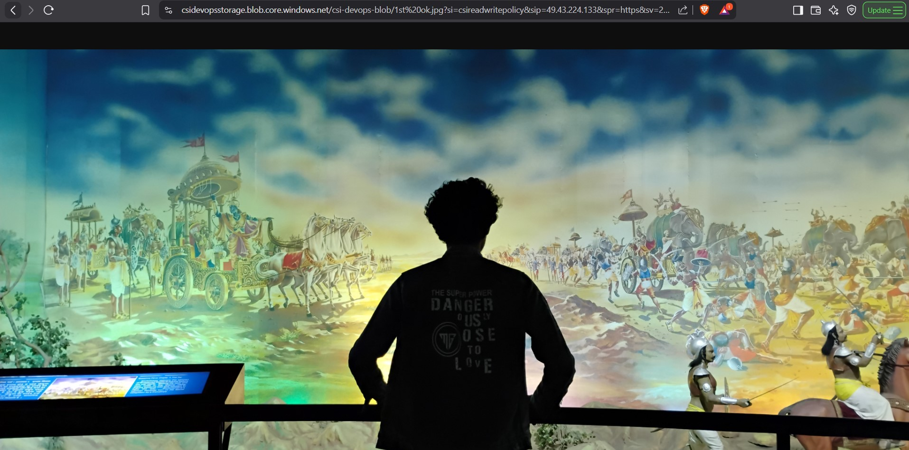

# 🌐 Week 2 – Azure Storage: Task 9

## 📆 Task: Explore Azure Storage Account Capabilities

In this task, I explored Azure Storage Account features such as blobs, file shares, access controls, tiers, lifecycle policies, replication, and Azure File Sync. Here's what I did step-by-step, with real hands-on execution.

---

## Step 1: Created a Storage Account

I Navigated to the Azure portal and started the process of creating a new Storage Account. I named it `csidevopsstorage` and selected `East-US` as the region to keep it local.

- I chosen the Standard performance tier for cost efficiency.

- For redundancy, I picked Read-access geo-redundant storage (RA-GRS) to make sure my data is highly available, even in case of regional outages.

- I left the default Access Tier as Hot since I wanted frequent access during testing.

Once created, the account was ready to host different types of data.

## Step 2: Created a Blob Container and Uploading Data

Next, I went to the storage account and navigated to Containers. I created a container named `csi-devops-blob` and set its access level to Private for now to keep data secure.

Then, I uploaded a test file called `week2.txt, vikas-resume.docx` into the container.

- The file uploaded successfully, and I could see it listed under blobs.

- I also checked blob properties and used the URL to confirm that access is restricted due to private mode.

## Step 3: Explored Authentication Techniques

To understand how access control works in Azure Storage, I tested multiple authentication methods.

### A. Using Access Keys & Viewed by Storage explorer

- I picked one of the two Access Keys available under the Access Keys tab.

- Then, I connected my storage account to Azure Storage Explorer using the key.

- Through this, I was able to upload and download blobs without issues.

### B. Using Shared Access Signature (SAS, Storage Account Level)

- I generated a SAS token with Read and Write permissions, a limited IP range, and a short expiration time.

- I tested the generated URL in the storage explorer, and it worked—only within the defined scope.

### C. Stored Access Policy + SAS (Container + Blob Level)

- I created a Stored Access Policy at the container level.

- Then, I generated a SAS token tied to that policy to access a specific blob if require we can generate SAS token for container level as well.

- This gave me more centralized control over the access scope and expiration.
- Now i can able to view the blob in browser

## Step 4: Access Tiers

- Switched between **Hot**, **Cool**, **Cold** and **Archive** tiers for uploaded blob
- Observed:

  - **Hot**: Fast access, higher cost, Ideal for frequently accessed data.
  - **Cool**: For infrequently accessed data but still needed online, cheaper.

  

  

  - **Cold**: For data that is rarely accessed, cheaper than Hot and Cool, but slower

  

  - **Archive**: Meant for long-term backup and is offline by default.

  

  - After moving to Archive, I tested rehydration to bring the blob back online, which took some time.

> Rehydration -> The process of transitioning an archived blob back to an online tier (Hot or Cool) so it becomes accessible again.

## Step 5: Lifecycle Management Policies

To automate data transitions and cleanup, I created a lifecycle management policy, So I configured a rule targeting **base blobs** (i.e., current active blobs), with the following actions:

- **Move to Cold** tier after **7 days**
- **Move to Archive** tier after **20 days**
- **Delete** the blob after **90 days**

This ensures my main blobs follow a cost-efficient storage path without managing snapshots or versions.

## Step 6: Blob Replication

I explored Object Replication to keep data in sync across regions.

- Created a two storage accounts named as `objectreplica1` `objectreplica2`.

- After that created two containers named as `replica1sourcecontaienr` `replica2destinationcontainer`.

- Enabled replication by configuring the source and destination pairing.

- Uploaded a file in the `objectreplica1` of `sourcereplicacontainer`

- Successfully replicated same file automatically into `objectreplica2` of `replica2destinationcontainer`

> If we want two-way replication, we have to set up another rule in the opposite direction as well.

## Step 7: Azure File Share & File Sync

### Created File Share

- Created a file share named `devopsfileshare` in the storage account.

- Uploaded `mylinkedin` Image directly through the **Azure Portal**.

### Connected via Azure File Sync

#### Windows Server Setup

- Deployed a **Windows Server VM**.

- Installed the **Azure File Sync**.

#### Sync Test

- Linked a local folder on the VM to the file share.
- Successfully tested **bi-directional sync**:
  - ✅ Files created in the file share appeared on the server.

  

  - ✅ Files added locally were synced back to Azure.

  

## Conclusion

This task gave me a complete overview of how Azure handles various types of storage needs. I tested authentication techniques, access tiers, policies, replication, and file synchronization. These are critical for managing enterprise data efficiently and securely.
