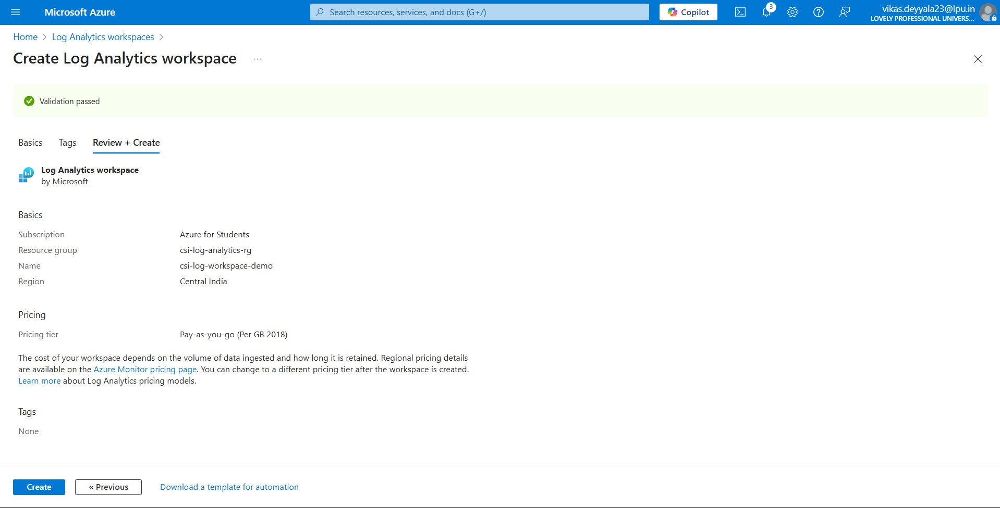
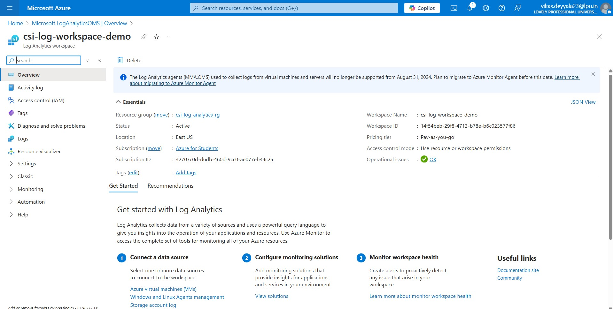
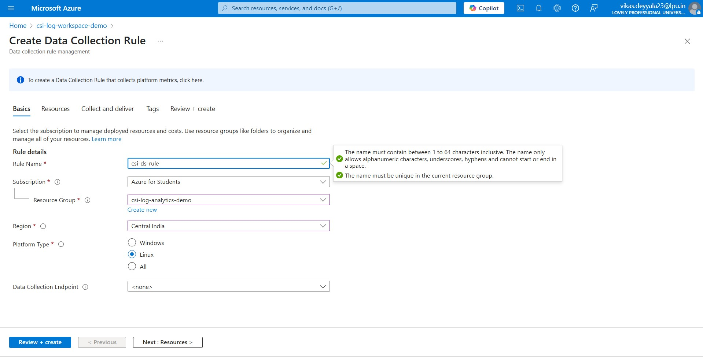
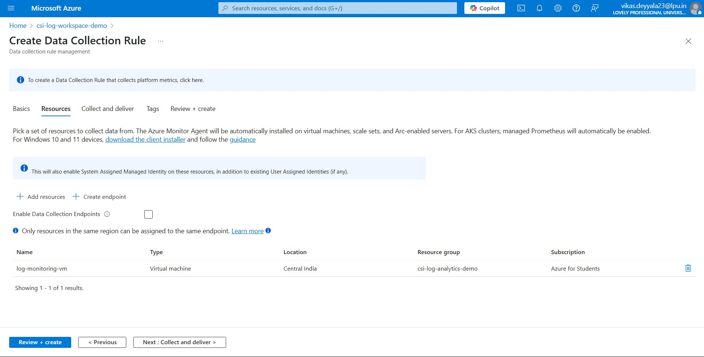
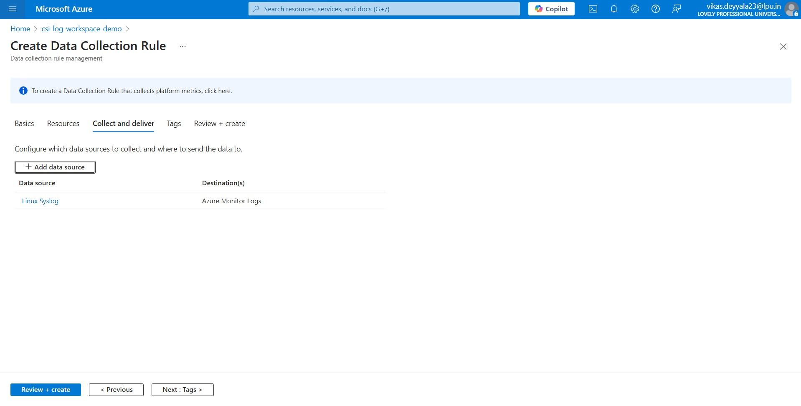
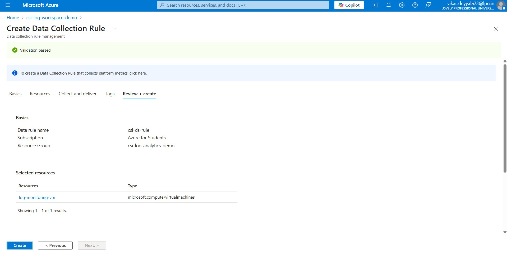
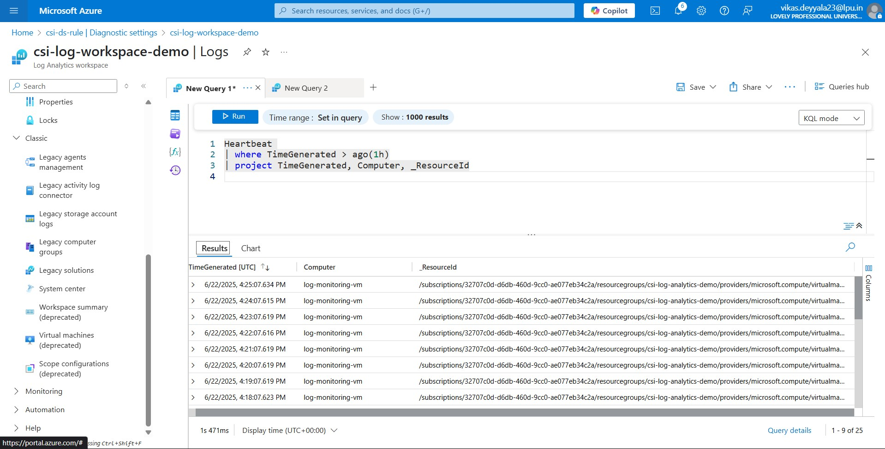
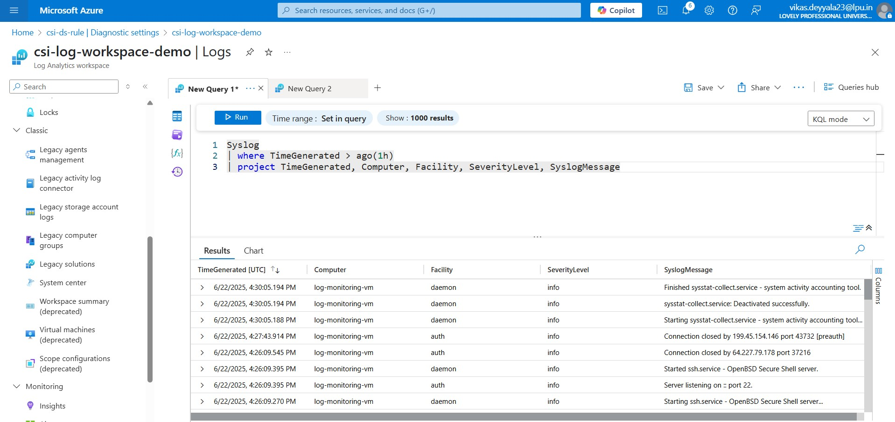

# 📊 Week 3 – Azure Log Analytics Workspace: Task 10

## 🎯 Objective

In this task, I explored **Log Analytics Workspace in Azure**. This workspace is a core component of Azure Monitor and is used to **collect, analyze, and query log and metric data** from various Azure resources like VMs, containers, and applications.

**Note**: This week, there were a few repeated questions and no specific task assigned on `Log Analytics Workspace`. So, I took the initiative to explore `Log Analytics Workspace` in depth to gain hands-on experience and a better understanding of how it works for collecting and analyzing logs across Azure resources.


> I referred to the official [Azure documentation on Log Analytics Workspace](https://learn.microsoft.com/en-us/azure/azure-monitor/logs/log-analytics-workspace-overview) for better understanding and guidance during implementation.

- Based on this understanding, I performed a small hands-on task to create a Log Analytics Workspace, connect it to a virtual machine, and query the collected logs.

---

## 🧩 What Is a Log Analytics Workspace?

A **Log Analytics Workspace** is an Azure resource that acts as a **central repository** for collecting and analyzing monitoring data. It enables you to:

- **Query logs** using Kusto Query Language (KQL)
- Monitor Azure VMs, Containers, and Apps
- Enable diagnostic settings for services
- Integrate with Azure Monitor, Azure Security Center, and Microsoft Sentinel

> Think of it as a "database for telemetry" where you can **analyze logs, performance data, and security events** all in one place.

## ✅ Step-by-Step Implementation

### Step 1: Navigate to Log Analytics Workspace

- From the [Azure Portal](https://portal.azure.com), I searched for **"Log Analytics workspaces"**.
- Clicked **"+ Create"** to start the setup process.



### Step 2: Create a New Log Analytics Workspace

I filled in the required information:

- **Subscription:** My Azure subscription
- **Resource Group:** `csi-log-analytics-rg`
- **Workspace Name:** `csi-workspace-demo`
- **Region:** Central India
- **Pricing Tier:** Pay-as-you-go (default)

Clicked **Review + Create** → **Create**

> 🛠️ The workspace takes a minute or two to provision.



### Step 3: Connect the Workspace to a Virtual Machine

To start collecting logs from a virtual machine, I needed to **create a data collection rule** and then link it with both the **VM** and the **Log Analytics Workspace**.

#### Create a Data Collection Rule (DCR)

I began by creating a new **Data Collection Rule**, which defines what data to collect and where to send it.

- Searched for **Data Collection Rules** from the Azure portal.
- Clicked **+ Create** to start a new rule.

In the creation wizard:

- **Rule name:** I named it `csi-ds-rule`
- **Region:** Central India  
- **Platform type:** Linux (since my VM was Ubuntu-based)  
- **Resource Group:** `csi-log-monitoring-rg`



#### Add Resources (VM)

After defining the rule basics, I added the target **VM** from which data will be collected:

- Selected `monitoring-vm` as the resource to apply this rule to.




#### Add a Data Source and Destination

Next, I configured **what type of data** to collect and **where** to send it:

- **Data source:** Chose **Syslog**
- Added facility and log levels (e.g., auth, daemon, error, warning)
- **Destination:** Selected **Azure Monitor / Log Analytics Workspace**
  - Target workspace: `csi-log-workspace`



#### Review and Create

- Clicked **Review + Create** to finalize the configuration.
- Azure validated the setup and created the rule successfully.



With this rule in place, my VM is now connected to the **Log Analytics Workspace**, and telemetry (like syslogs) will be collected automatically.

> Once connected, the VM starts sending log data (like syslog, performance counters, and heartbeat signals) to the workspace.


### Step 4: Run a KQL Query

Went to the **Logs** blade of the workspace to test queries.

**Sample Query:** View recent heartbeat logs

```bash
Heartbeat 
| where TimeGenerated > ago(1h)
| project TimeGenerated, Computer, _ResourceId
```

> This returned the list of all heartbeats received from connected resources in the past hour.




```bash
Syslog
| where TimeGenerated > ago(1h)
| project TimeGenerated, Computer, Facility, SeverityLevel, SyslogMessage
```

This query retrieves Linux Syslog entries from the last 1 hour, and displays the following key fields:

  - **TimeGenerated:** Timestamp of when the log was recorded
  - **Computer:** Name of the virtual machine or server
  - **Facility:** The system component that generated the log (e.g., auth, daemon)
  - **SeverityLevel:** Importance or severity of the message (e.g., info, warning, error)
  - **SyslogMessage:** The actual log message content



---

## Conclusion

This was a great hands-on exercise to understand how Log Analytics Workspace works in Azure. From creating the workspace to connecting my VM and running queries, the whole flow made it clear how logs are collected and analyzed in real time.

---