# Week 3 – Task 1: IAM Roles & RBAC in AWS (Azure Alternative)

> ⚠️ **Note:** Currently, I am using an **organizational Azure account** where **Azure Entra ID features are restricted**, and my **personal Azure subscription has expired**. Since I have strong familiarity with **AWS IAM and console**, I completed this task using **AWS services** to mirror the Azure Entra + RBAC task.

---

## 📌 Task: Manage IAM Users, Groups, Roles and Permissions in AWS

## 🎯 Objective

The goal was to simulate Azure Entra ID & RBAC functionalities by:

- Observed assigned account/subscription.
- Created a user group and IAM users.
- Assigned permissions via predefined and custom policies.
- Tested role-based access control.
- Created and attached a custom IAM policy.

---

### Azure to AWS Mapping Table

| **Azure**            | **AWS Equivalent**                             |
|----------------------|------------------------------------------------|
| Azure Subscription   | AWS Account                                    |
| Azure Entra ID       | AWS IAM                                        |
| Users                | IAM Users                                      |
| Groups               | IAM Groups                                     |
| RBAC Roles           | IAM Policies (attached to Groups or Users)     |
| Custom Role          | Custom IAM Policy                              |


## 🧩 Step-by-Step Implementation

### Step 1: Log in to AWS Management Console

Logged into the **AWS Console** using my root/administrator credentials.

- Go to: [https://console.aws.amazon.com/](https://console.aws.amazon.com/)

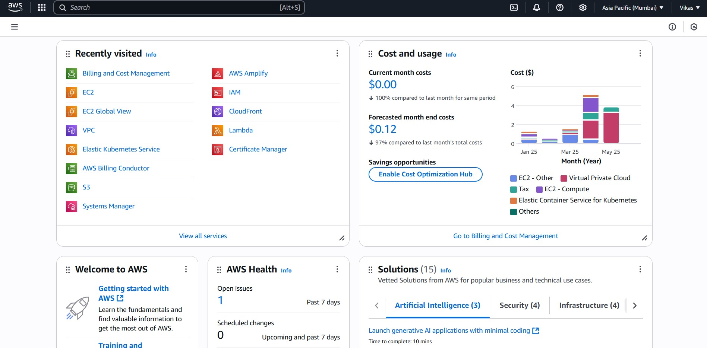

### Step 2: Navigated to IAM (Identity and Access Management)

Went to the **IAM Dashboard**:

- Services → IAM → Dashboard

- Viewed existing users, groups, and roles.

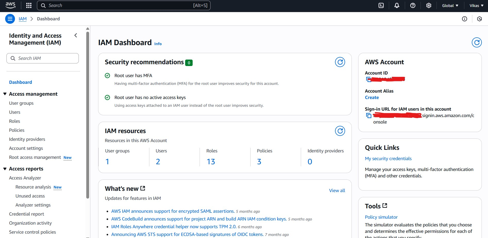

### Step 3: Created a New IAM Group

Created a group called `CSI-DevOps`.

- IAM → User groups → Create group
- Assigned existing policies like `AmazonEC2ReadOnlyAccess`

> Grouping users allows centralized permission management.

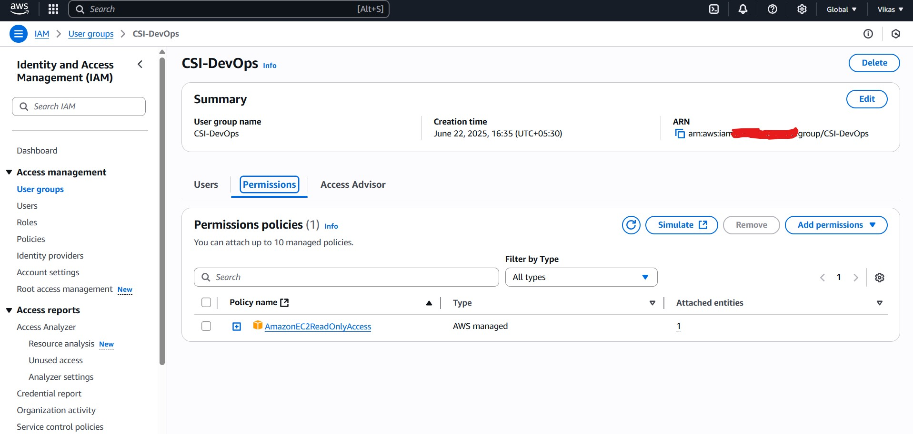

### Step 4: Created Two Test IAM Users

Created two users: `testuser1` and `testuser2`

- IAM → Users → Add users
- Selected **programmatic access + console access**

- Assigned both users to the `CSI-DevOps` group

> Enabled password login for console testing.

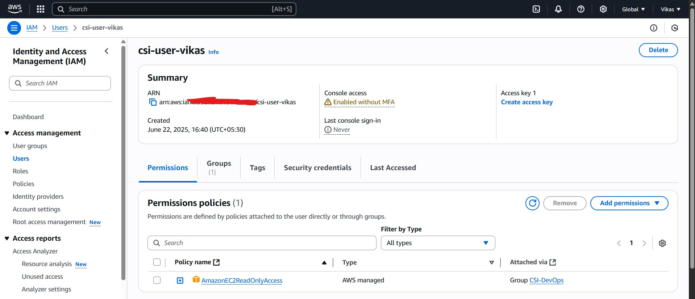

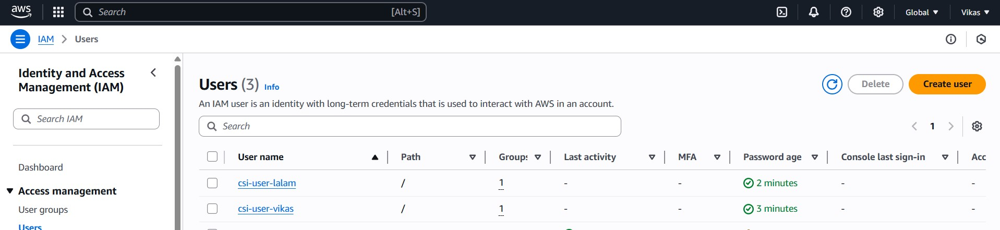

### Step 5: Tested Role-Based Access by Logging in as `CSI-User-Vikas`

Used the provided URL to login as `CSI-User-Vikas`.

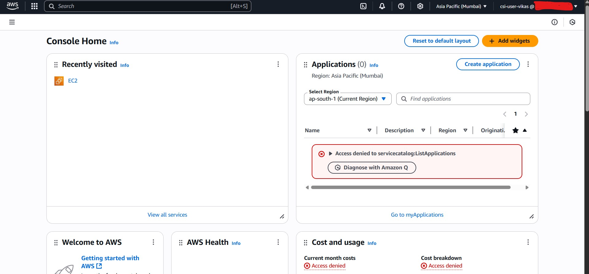

- Verified the user could **view EC2 instances**, but **couldn't launch or modify** them (due to ReadOnly policy).

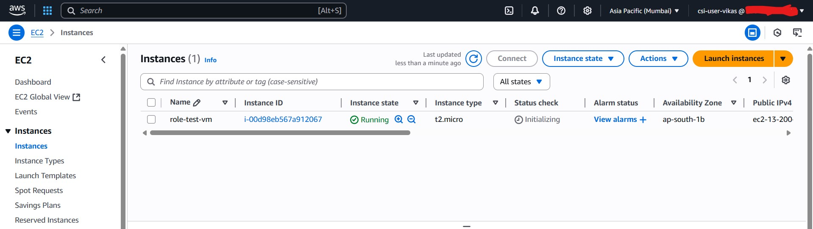

- RBAC Working as expected using AWS IAM Group Policies.

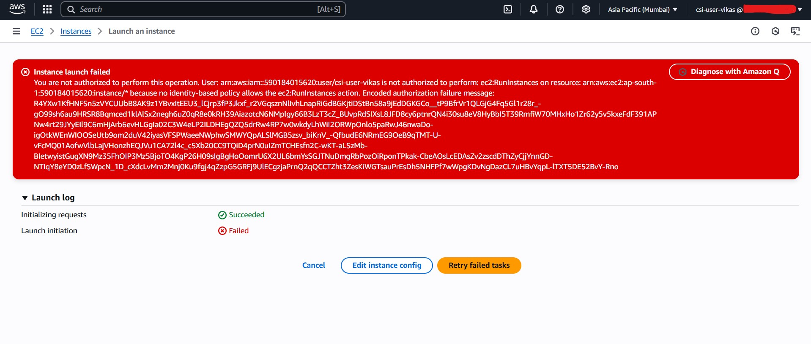


### Step 6: Created a Custom IAM Policy for EC2 Instances

Created a custom IAM policy named `CustomEC2ManagePolicy` to allow users limited EC2 instance management capabilities such as **starting**, **stopping**, and **describing** instances—without full admin privileges.

To create this:

- went to **IAM → Policies → Create policy → JSON**
- Used the following custom JSON policy:

```bash
{
  "Version": "2012-10-17",
  "Statement": [
    {
      "Sid": "EC2LimitedAccess",
      "Effect": "Allow",
      "Action": [
        "ec2:DescribeInstances",
        "ec2:StartInstances",
        "ec2:StopInstances"
      ],
      "Resource": "*"
    }
  ]
}
```

#### ✅ What the User/Role **Can Do**

| Action                 | Description                                      |
|------------------------|--------------------------------------------------|
| View EC2 Instances     | Allowed via `ec2:DescribeInstances`           |
| Start EC2 Instances    | Allowed via `ec2:StartInstances`              |
| Stop EC2 Instances     | Allowed via `ec2:StopInstances`               |

This means the assigned entity (user/group/role) can:
- Use the AWS Console or AWS CLI to manage instance state.
- View instance status, IDs, types, etc.
- Start stopped instances and stop running ones.

#### ❌ What the User/Role **Cannot Do**

| Action                         | Denied Because Not Included in Policy     |
|--------------------------------|-------------------------------------------|
| Terminate Instances            | Not allowed (no `ec2:TerminateInstances`) |
| Launch New Instances           | Not allowed (`ec2:RunInstances` missing) |
| Modify Instance Configurations | Not allowed                             |
| Attach/Detach EBS Volumes      | Not allowed                             |
| Manage Security Groups         | Not allowed                             |
| Access Billing & Pricing       | Not allowed                             |

This helps ensure:
- Instances aren't deleted or re-provisioned accidentally.
- Sensitive infrastructure settings stay protected.

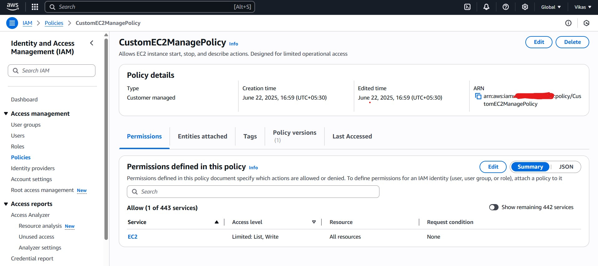


### Step 7: Attached Custom Policy to `csi-user-lalam`

After creating the `CustomEC2ManagePolicy`, I attached it directly to the IAM user `csi-user-lalam`.

**Steps:**

1. Navigate to: **IAM → Users → csi-user-lalam → Add permissions**
2. Choose **"Attach policies directly"**
3. Search for `CustomEC2ManagePolicy`
4. Select and attach the policy

> This gives `csi-user-lalam` the exact EC2 start, stop, and describe access we defined earlier.

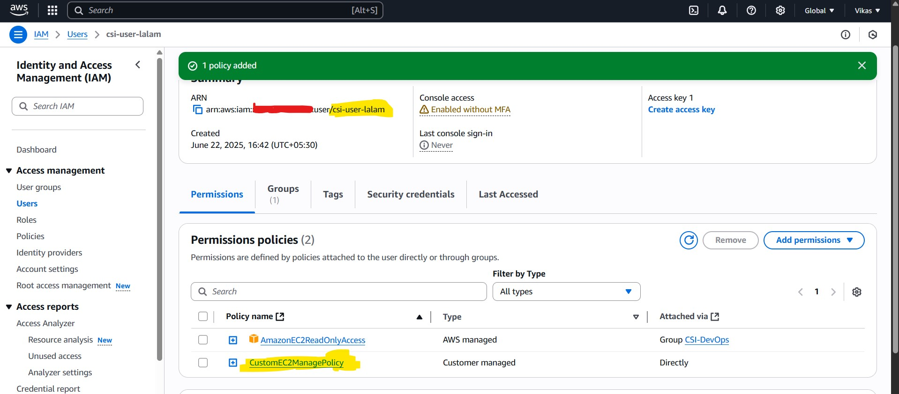


### Step 8: Verified Permissions for `csi-user-lalam`

Logged in to the AWS Console as `csi-user-lalam` using the provided IAM login URL.

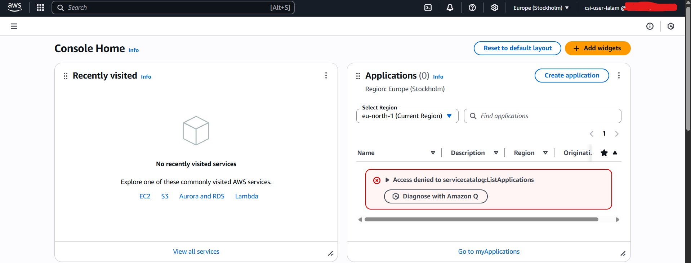

**Tested the following actions in EC2 Console:**

| Action             | Result    | Notes                                       |
|--------------------|-----------|---------------------------------------------|
| View EC2 Instances | Allowed | Able to see all running/stopped instances   |
| Start Instance     | Allowed | Could start stopped instances               |
| Stop Instance      | Allowed | Could stop running instances                |
| Terminate Instance | Denied  | Button was greyed out                       |
| Launch Instance    | Denied  | Blocked on instance creation                |

- Permissions applied exactly as expected. IAM role enforcement was successful.

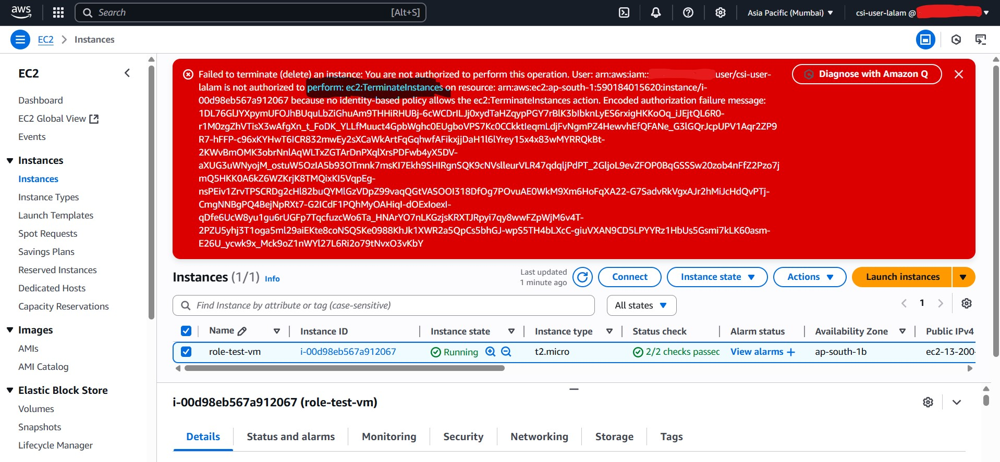

---

## Conclusion

This task helped me clearly understand how AWS IAM can mirror Azure Entra ID + RBAC behavior. I successfully created users, groups, and custom policies—then tested their permissions to validate real-world access control. Even without full access to Azure, I was able to simulate the same role-based concepts in AWS, making this exercise both practical and platform-independent.

---
