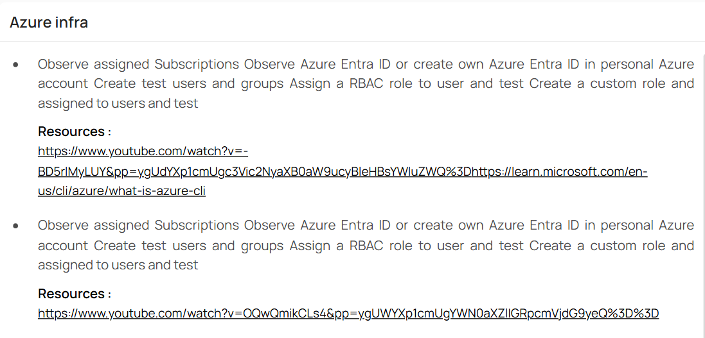

## 📌 Note: Task 1 and Task 2 Are the Same

Both Task 1 and Task 2, I noticed that the objectives are exactly the same. Both tasks focus on understanding how identity and access control works in Azure using Azure Entra ID and Role-Based Access Control (RBAC).

