# Week 3 – Azure CLI: Task 3

## 📌 Task: Create Virtual Machine and Virtual Network Using Azure CLI

## 🎯 Objective

The goal of this task was to create a virtual machine and its associated virtual network using **Azure CLI** instead of the Azure Portal. This helped me get familiar with scripting and automation in Azure, which is super useful for real-time DevOps projects.

---

## 🧩 Step-by-Step Implementation

### Step 1: Logged into Azure CLI

I opened **Azure Cloud Shell** from the portal (we can also use our local terminal if Azure CLI is installed) and ran:

```bash
az login
```

Since I was already using Cloud Shell, I didn’t need to authenticate again.

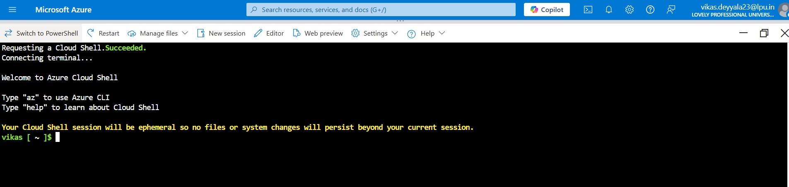

### Step 2: Created a Resource Group

Before creating anything, I made a new resource group to keep things organized:

```bash
az group create --name csi-week3-rg --location "Central India"
```

> Resource groups help us logically organize Azure resources. I always prefer to isolate tasks like this.

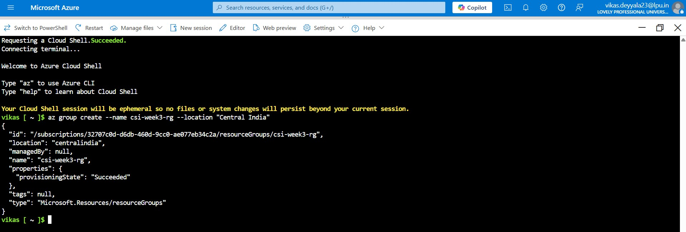

### Step 3: Created a Virtual Network (VNet)

Then, I created a virtual network along with a subnet:

```bash
az network vnet create \
  --name csi-vnet-task3 \
  --resource-group csi-week3-rg \
  --address-prefix 10.0.0.0/16 \
  --subnet-name csi-subnet-task3 \
  --subnet-prefix 10.0.1.0/24
```

> This VNet will act as the private network for the VM. I manually specified the address space to have more control over IP management.

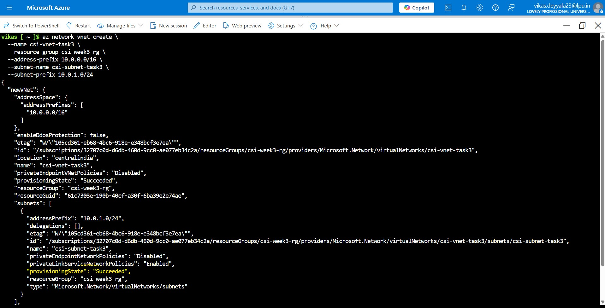

### Step 4: Created Public IP, Network Security Group & SSH Rule
Now, I needed a public IP so I could connect to the VM, and a Network Security Group (NSG) to define which ports are open.

```bash
az network public-ip create \
  --name csi-task3-pub-ip \
  --resource-group csi-week3-rg \
  --allocation-method Static
```

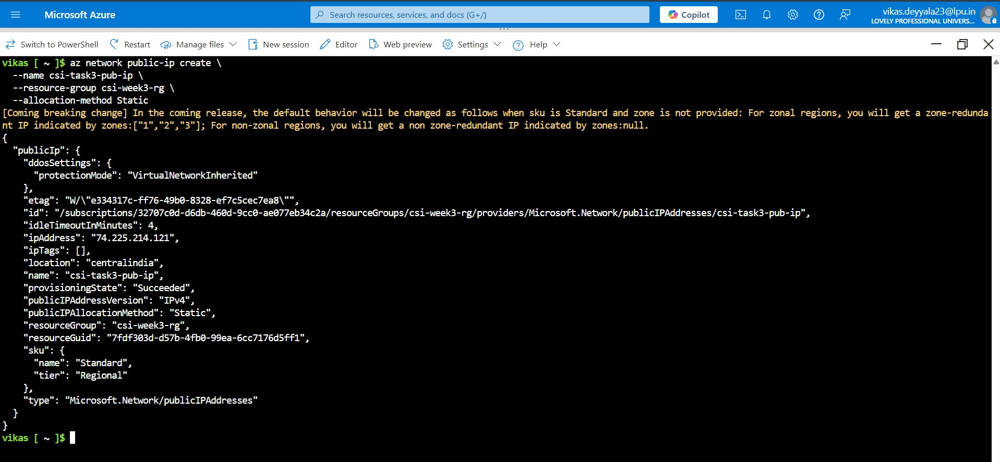

Then, I created the NSG:

```bash
az network nsg create \
  --resource-group csi-week3-rg \
  --name csi-task3-nsg \
  --location centralindia
```
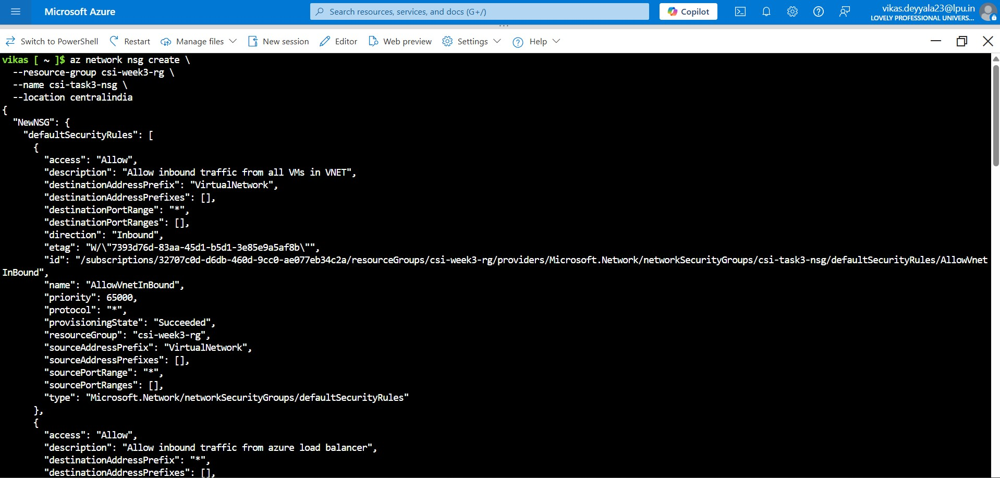

And I allowed SSH (port 22) access with this rule:

```bash
az network nsg rule create \
  --resource-group csi-week3-rg \
  --nsg-name csi-task3-nsg \
  --name Allow-SSH \
  --priority 1000 \
  --direction Inbound \
  --access Allow \
  --protocol Tcp \
  --destination-port-ranges 22
```
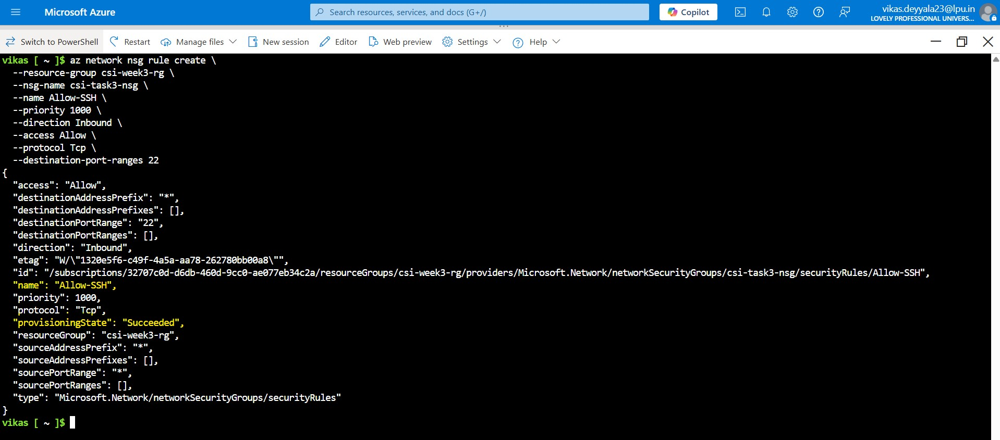

### Step 5: Created a Network Interface (NIC)

I created a NIC and connected it to the subnet and public ip we just made:

```bash
az network nic create \
  --resource-group csi-week3-rg \
  --name csi-task3-nic \
  --vnet-name csi-vnet-task3 \
  --subnet csi-subnet-task3 \
  --network-security-group csi-task3-nsg \
  --public-ip-address csi-task3-pub-ip
```

> 🔌 The NIC acts like a network adapter for our VM. Without this, the VM won’t be able to talk to the network.

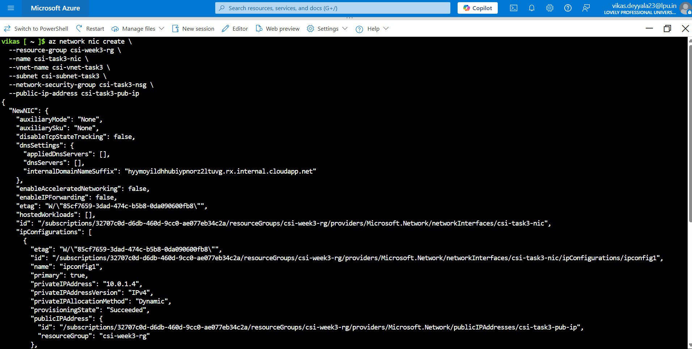

### Step 6: Created a Virtual Machine

Now the main step: I created a Linux VM using the above NIC:

```bash
az vm create \
  --resource-group csi-week3-rg \
  --name csi-task3-vm \
  --nics csi-task3-nic \
  --image Ubuntu2204 \
  --size Standard_B1s \
  --admin-username azureuser \
  --generate-ssh-keys \
  --zone 1
```

Options:

- `--image` can be UbuntuLTS, Win2022Datacenter, etc.
- `--generate-ssh-keys` creates SSH keys if not present.

  > This command automatically generated SSH keys for secure access and deployed the VM with an Ubuntu image.

- For password instead of SSH:

```bash
  --authentication-type password --admin-password "<my-password>"
```

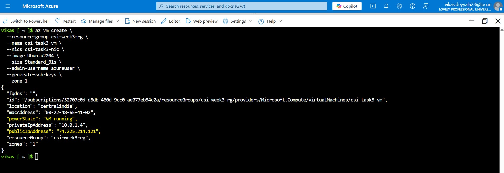

### Step 7: Verified Resources

I used the following command to confirm everything was created:

```bash
az vm list -o table
```
This gave me a nice tabular view of the VM.

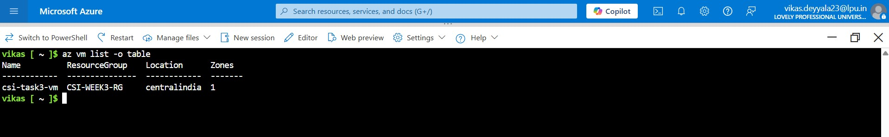

I also checked the network and IP configuration to make sure my NIC was properly attached:

```bash
az network nic show --name csi-task3-nic --resource-group csi-week3-rg
```

I also logged into the Azure Portal and checked vm creation.

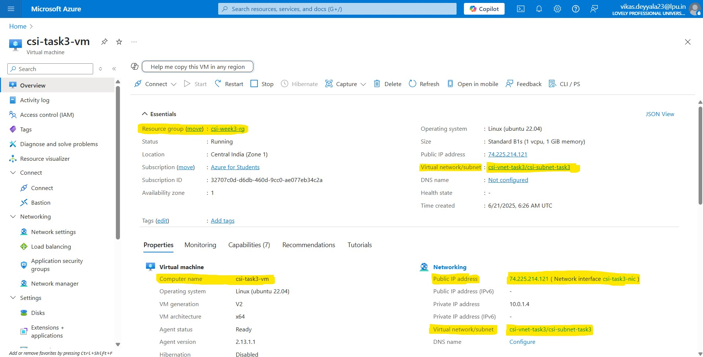

### Step 8: Open a Port for SSH

Just in case I want to run a web server later, I opened port 80:

```bash
az vm open-port --port 80 --resource-group csi-week3-rg --name csi-task3-vm
```
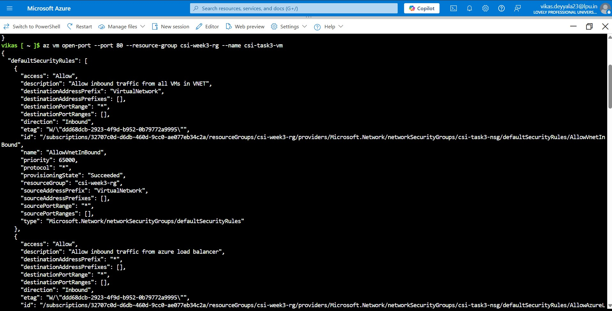

### Step 9: Verified Public IP

I ran below command to quickly check the public IP of my VM.

```bash
az vm list-ip-addresses --resource-group csi-week3-rg --name csi-task3-vm -o table
```

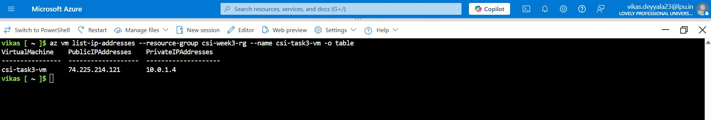

### Step 10: Connect to the VM

VM is up and running and the port is open, Now we can connect through SSH for Linux VMs or RDP for Windows VMs using the VM’s public IP address.

- Linux VM (SSH):

```bash
ssh azureuser@<public-ip>
```


- Windows VM (RDP):
  We have to use Remote Desktop to connect to <public-ip> with the username/password.

### Step 11: Verified and Clean Up Resource (Best Practice to optimize cost)

Before wrapping up, I listed all the resources in the `csi-week3-rg`:
```bash
az resource list --resource-group csi-week3-rg -o table
```

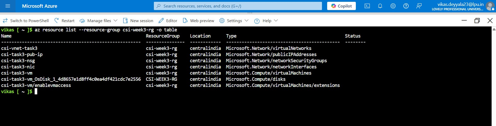

I removed everything created by using Azure CLI  to avoid unnecessary costs:

```bash
az group delete --name csi-week3-rg --yes --no-wait
```
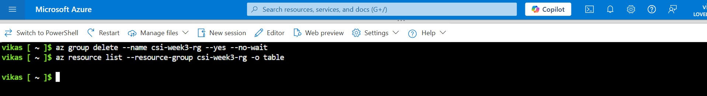


> **If we delete a resource group in Azure, it deletes everything inside it for good. There's no way to get it back unless we backed things up. So make sure that really don’t need anything in there before we delete it.**

---

## Optional Best Practice

It's always a good idea to automate setups like this with a Bash script it saves time, avoids mistakes, and makes it easy to reuse later.

```bash
#!/bin/bash

az group create --name csi-week3-rg --location "Central India"

az network vnet create \
  --name csi-vnet-task3 \
  --resource-group csi-week3-rg \
  --address-prefix 10.0.0.0/16 \
  --subnet-name csi-subnet-task3 \
  --subnet-prefix 10.0.1.0/24

az network public-ip create \
  --name csi-task3-pub-ip \
  --resource-group csi-week3-rg \
  --allocation-method Static

az network nsg create \
  --resource-group csi-week3-rg \
  --name csi-task3-nsg \
  --location centralindia

az network nic create \
  --resource-group csi-week3-rg \
  --name csi-task3-nic \
  --vnet-name csi-vnet-task3 \
  --subnet csi-subnet-task3

az network nsg rule create \
  --resource-group csi-week3-rg \
  --nsg-name csi-task3-nsg \
  --name Allow-SSH \
  --priority 1000 \
  --direction Inbound \
  --access Allow \
  --protocol Tcp \
  --destination-port-ranges 22

az network nic create \
  --resource-group csi-week3-rg \
  --name csi-task3-nic \
  --vnet-name csi-vnet-task3 \
  --subnet csi-subnet-task3 \
  --network-security-group csi-task3-nsg \
  --public-ip-address csi-task3-pub-ip

az vm create \
  --resource-group csi-week3-rg \
  --name csi-task3-vm \
  --nics csi-task3-nic \
  --image UbuntuLTS \
  --admin-username azureuser \
  --generate-ssh-keys

az vm create \
  --resource-group csi-week3-rg \
  --name csi-task3-vm \
  --nics csi-task3-nic \
  --image Ubuntu2204 \
  --size Standard_B1s \
  --admin-username azureuser \
  --generate-ssh-keys \
  --zone 1
```

> Super handy for repeating this setup or sharing it with our teammates.

- Just save the following as setup.sh and run it with bash:

```bash
./csi-task3-vm.sh
```

## ✅ Final Outcome

This task gave me real confidence in using **Azure CLI for infrastructure provisioning** and Creating VMs and networks manually through CLI.
