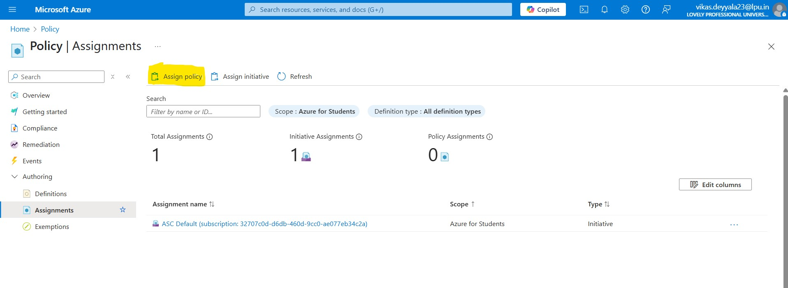
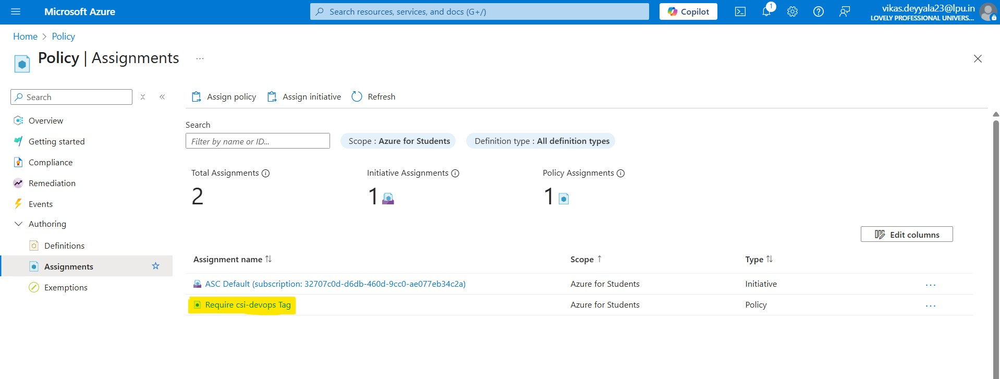
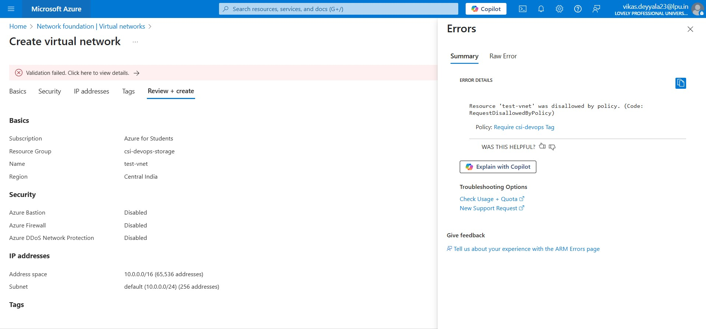

# 📜 Week 3 – Azure Governance: Task 3

## 📌 Task: Create and Assign a Policy at the Subscription Level

## 🎯 Objective

The goal of this task was to get practical experience using **Azure Policy** to enforce governance rules at the subscription level. Instead of using a built-in policy, I created a **custom policy** that makes sure every resource has a specific tag — `csi-devops` with the value `required`.

---

## 🧩 Step-by-Step Implementation

### Step 1: Navigated to Azure Policy

* From the Azure Portal home page, I searched and opened **Policy**.
* This took me to the Azure Policy dashboard where I could manage policies across my subscriptions.


### Step 2: Create a New Policy Definition to Require `csi-devops` Tag

Next, I created a custom policy to enforce the presence of the `csi-devops` tag.

- I clicked on **Definitions** on the left menu.
- Then clicked **+ Policy definition** to start a new policy.
- For **Definition location**, I picked my subscription.
- Named it something like `Require csi-devops Tag`.
- Added a description: 'csi-devops' tag with the value 'required' before it can be created or updated." 
- created a category of `CSI-Tagging` for this policy.
- Then, I put this JSON in the policy rule box. This policy checks if the `csi-devops` tag exists on any resource and denies creation or update if it’s missing:

```bash
{
  "mode": "All",
  "policyRule": {
    "if": {
      "anyOf": [
        {
          "field": "tags['csi-devops']",
          "exists": "false"
        },
        {
          "field": "tags['csi-devops']",
          "notEquals": "required"
        }
      ]
    },
    "then": {
      "effect": "deny"
    }
}
```

Finally I hit `Save`


## Step 3: Assignd a Policy

* Clicked on **Authoring** > **Assignments** > **+ Assign Policy**



- Clicked the **+ Assign Policy** button at the top.
- Under **Scope**, I selected my **Subscription** to apply the policy broadly.
- For **Policy definition**, I searched for and selected the `Require csi-devops Tag` policy I created earlier.
- I gave the assignment a clear name like `Require CSI DevOps Tag Assignment`.
- Since this policy doesn’t require parameters, I left those sections as default.
- Finally, I reviewed everything carefully and clicked **Create**.



### Step 4: Verifying That the Tag Policy Works (Tested with VNet)

After assigning the policy, I wanted to make sure it was actually enforcing the rule — that is, **blocking any resource that doesn’t have the `csi-devops` tag set to `required`**.

So I decided to test it using a **Virtual Network (VNet)** — here's what happened.

#### Tried Creating a VNet **Without Any Tags**

I went to the Azure Portal and tried creating a new VNet:

- Navigated to **Create a resource > Networking > Virtual Network**
- Filled out all the required fields (like name, region, address space)
- Skipped the **Tags** tab entirely
- Clicked **Review + Create** and then **Create**

**Result:**  
As expected, the deployment **failed** — Azure showed a policy error saying that the required tag `csi-devops` was missing.



---

## 🔍 Conclusion

This task gave me hands-on experience with Azure Policy governance features. By applying a **tag enforcement policy**.

> This skill is critical in enterprise environments where policy enforcement is a key component of security and governance strategies.

---