# 🛡️ Week 3 – Azure Key Vault: Task 5

## 📌 Task: Azure Key Vault Creation, Secrets Management, and Access Policies

## 🎯 Objective

The main goal of this task was to learn how to securely manage secrets using **Azure Key Vault**, both through the Azure Portal and Azure CLI. I explored how to create a Key Vault, set up role-based access (RBAC), store sensitive data like passwords, and retrieve it safely. The idea was to avoid hardcoding secrets in scripts or repositories, and instead rely on a more secure, centralized vault that integrates well with Azure services and DevOps workflows.

---

## 🧩 Step-by-Step Implementation through `AZ Portal`

### ✅ Step 1: Create a Resource Group

- Logged in to the [Azure Portal](https://portal.azure.com).
- Searched for **“Resource groups”** and clicked **“+ Create”**.
- Filled in the following details:
  - **Resource Group Name:** `csi-keyvault-rg-ui`
  - **Region:** `Central India`
- Clicked **“Review + Create”**, and then **“Create”** to deploy the resource group.

> 🔹 Using a separate resource group helps in organizing and securing secrets independently from other workloads.

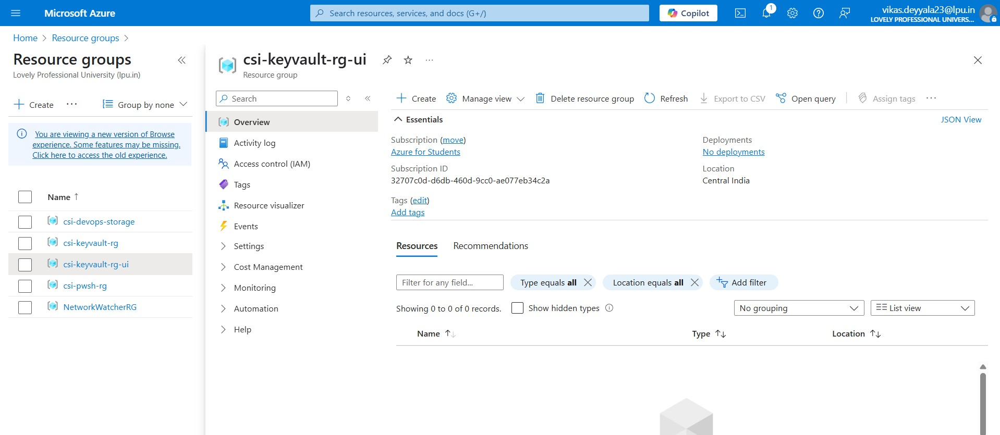

### ✅ Step 2: Create the Azure Key Vault

- In the Azure search bar, typed **“Key Vaults”** and clicked **“+ Create”**.

- On the **Basics** tab, I configured the following:
  - **Subscription:** Selected my active subscription
  - **Resource Group:** `csi-keyvault-rg-ui`
  - **Key Vault Name:** `task5-ui-kv`
  - **Region:** `Central India`
  - **Pricing Tier:** Standard
  - **Soft delete:** Enabled by default (helps with accidental deletions)
  - **Retention policy:** I set the retention period for deleted secrets to **90 days**, which means even if a secret is deleted, it can be recovered within that time.

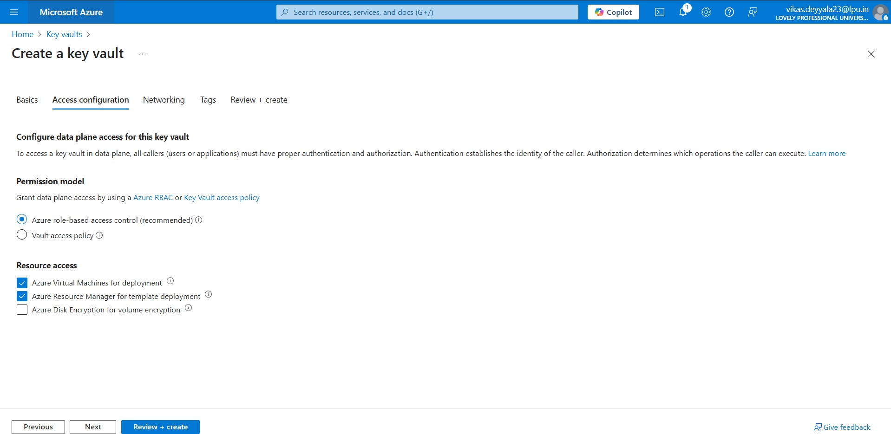

- Clicked **“Review + Create”** → **“Create”**.


> 🔐 The person who creates the vault automatically gets full permissions on it.

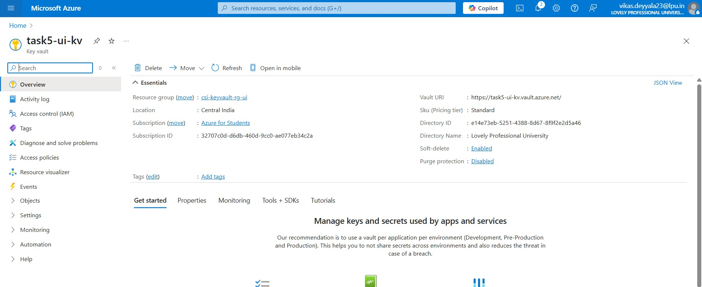

### ✅ Step 3: Used Azure RBAC Instead of Access Policies (Recommended Way)

Although the task originally mentioned using access policies to manage Key Vault permissions, I decided to go with Azure RBAC instead and here’s why:

- Azure now officially recommends RBAC over access policies for Key Vault
- RBAC is what Azure **officially recommends**, especially for enterprise-grade access control.
- It lets you manage permissions in a **centralized and scalable way** across all resources.
- Plus, it's way easier to audit and update through **IAM (Access Control)**.

So, in the **Access configuration** section of the Key Vault, I selected:

> **Permission model:** `Azure role-based access control (RBAC)`

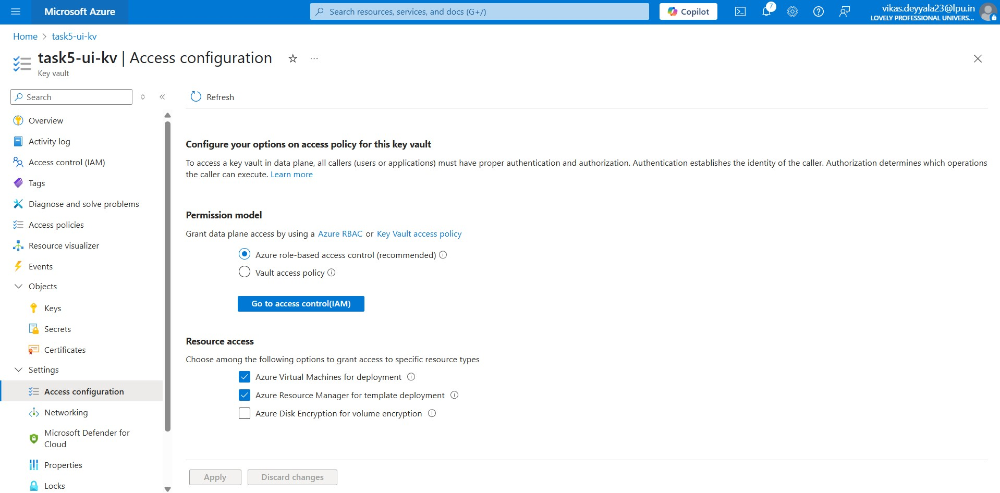

### ✅ Step 4: Assigned Myself the Right Role to Manage Secrets

After creating the vault, I wanted to store secrets (like DB passwords) but first, I needed to **give myself permission** to do that using RBAC.

Here’s how I did it:

- Opened the **Key Vault** (`csi-task5-kv`) in the Azure Portal
- Went to **Access control (IAM)** from the left menu
- Clicked **+ Add > Add role assignment**
- Selected the role:  
   🟢 **Key Vault Secrets Officer**

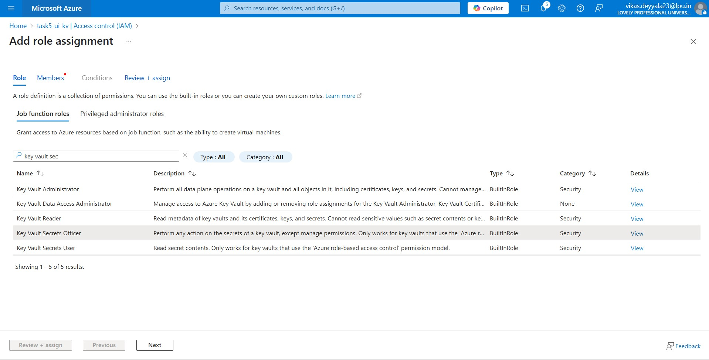

- Chose **User** and picked my own account from the directory

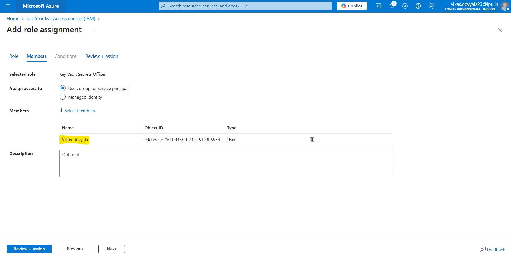

- Clicked **Review + assign**

> This role gives just enough permission to manage secrets but not keys or certificates. It’s a good security practice to assign only what’s needed.

### ✅ Step 5: Add a Secret to the Vault

- After the Key Vault was created, I opened it from the **resource list**.
- From the left-hand menu, selected **Secrets** → **“+ Generate/Import”** to add a new secret.
- I filled in the following details:
  - **Name:** `DbPassword`
  - **Value:** `Cs1@DevOps`
  - **Activation Date:** Set a date when the secret should start being usable
  - **Expiration Date:** Defined a future expiry to automatically disable the secret after a certain period.

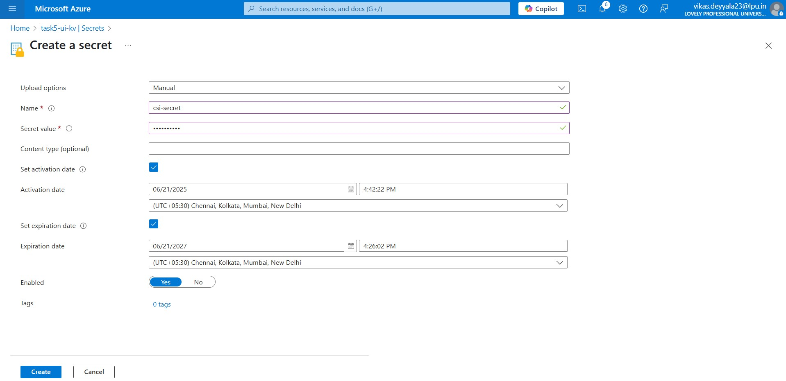

- Then clicked **“Create”** to store the secret securely.

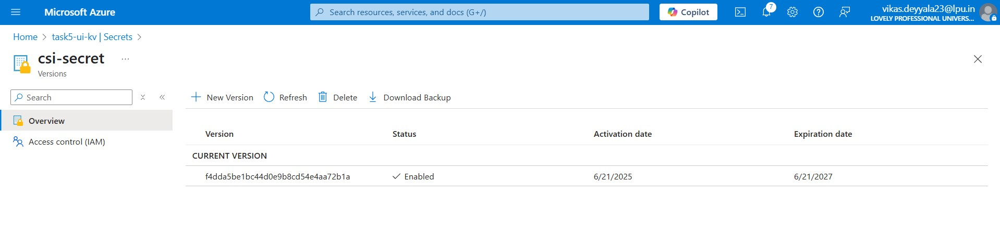

> Secrets in Azure Key Vault are stored as simple key-value pairs, which makes it a secure alternative to hardcoding sensitive information like passwords or API keys in your repositories.

### Step 6: Retrieving a Secret from Azure Key Vault Using Azure CLI

After successfully storing a secret in Azure Key Vault, I wanted to verify it by retrieving the value using Azure CLI. This step is useful to confirm that the secret is accessible and correctly configured — especially if it's going to be used in automation or application pipelines.

Before retrieving any secret, you need to have the right RBAC role assigned. I had already given myself the **Key Vault Secrets Officer** role earlier, which allows reading and managing secrets.

> If we missing the required permissions, you'll get a `Forbidden` error — so make sure that, role is correctly assigned and that the vault is using **Azure RBAC** (not access policies).

```bash
az keyvault secret show \
  --vault-name task5-ui-kv \
  --name csi-secret \
  --query value \
  --output tsv
```

- Above command returned the exact secret value I had stored earlier:

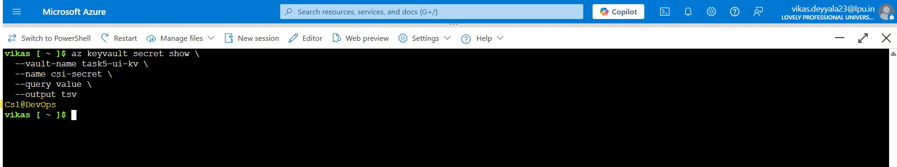

## Vault Creation using `Azure CLI`

### Step 1: Create a Resource Group

- I started by creating a dedicated resource group named csi-keyvault-rg.

```bash
az group create --name csi-keyvault-rg --location "Central India"
```

- Keeping Key Vault in a separate resource group is helpful for organizing and managing access securely.

### Step 2: Create a Key Vault

- Next, I created the actual Key Vault, naming it csi-task5-kv.

```bash
az keyvault create \
  --name csi-task5-kv \
  --resource-group csi-keyvault-rg \
  --location "Central India" \
  --sku standard
```

> `--name` must be globally unique. I used a name like `csi-task5-kv`.


### Step 3: Assign RBAC Role to Manage Secrets

To allow a user (in my case, myself) to manage secrets in the Key Vault using Azure CLI, I assigned the **Key Vault Secrets Officer** role using the following command:

```bash
az role assignment create \
  --assignee <object-id> \
  --role "Key Vault Secrets Officer" \
  --scope "/subscriptions/<subscription-id>/resourceGroups/csi-keyvault-rg/providers/Microsoft.KeyVault/vaults/csi-task5-kv"
```


### Step 4: Add a Secret to Key Vault

```bash
az keyvault secret set \
  --vault-name csi-task5-kv \
  --name "DbPassword" \
  --value "Cs1@assword"
```

- Here, I added a secret called `"DbPassword"` is the key, and the actual password is the value.
- Secrets are stored as key-value pairs, and this becomes a central place where applications or DevOps pipelines can pull sensitive configuration from.

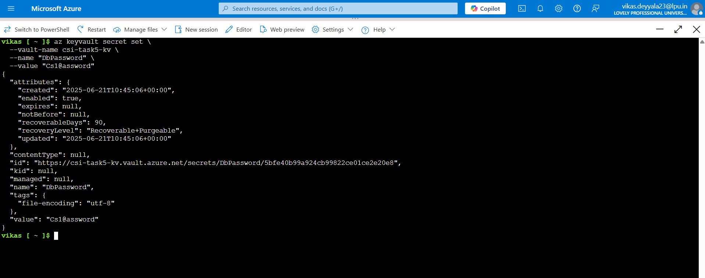

### Step 5: Retrieve the Secret from CLI

To verify that the secret was stored correctly, I retrieved it using the CLI.

```bash
az keyvault secret show \
  --vault-name csi-task5-kv \
  --name "DbPassword" \
  --query "value" \
  -o tsv
```

The --query "value" part extracts only the value of the secret, and `-o tsv` ensures it's displayed in plain text without any extra formatting (like quotes or JSON wrappers).

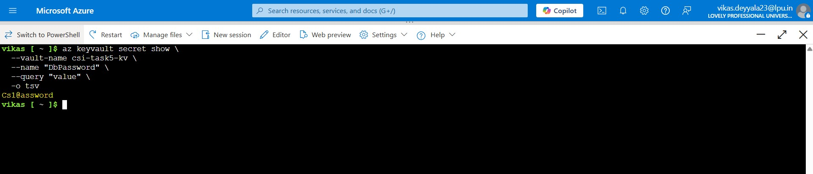

---

## Conclusion

This task gave me solid hands-on experience with Azure Key Vault and how it fits into secure DevOps practices. I not only created and configured a vault but also understood the importance of using RBAC over traditional access policies, especially when it comes to scalability and cleaner permission management.

---
