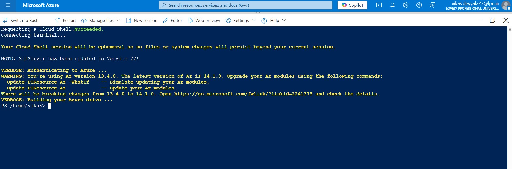
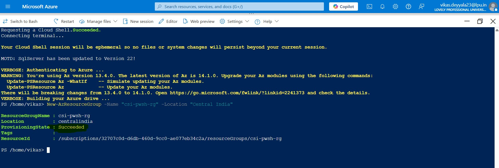
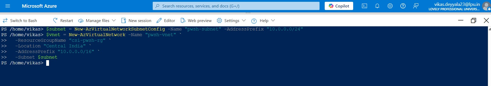
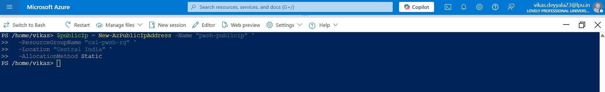
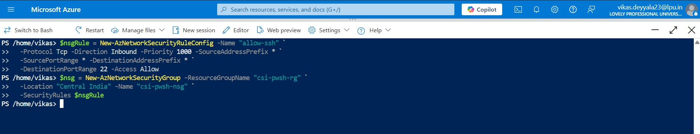
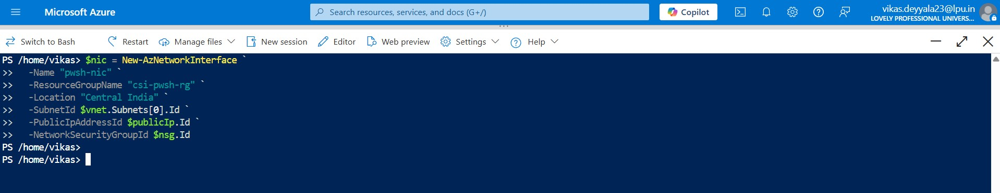
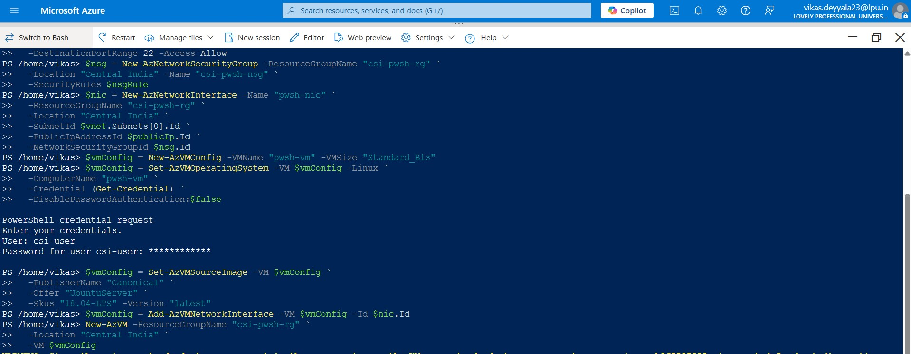
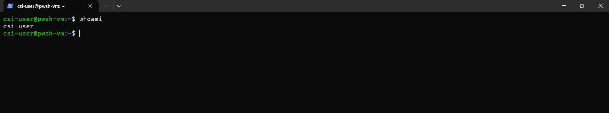
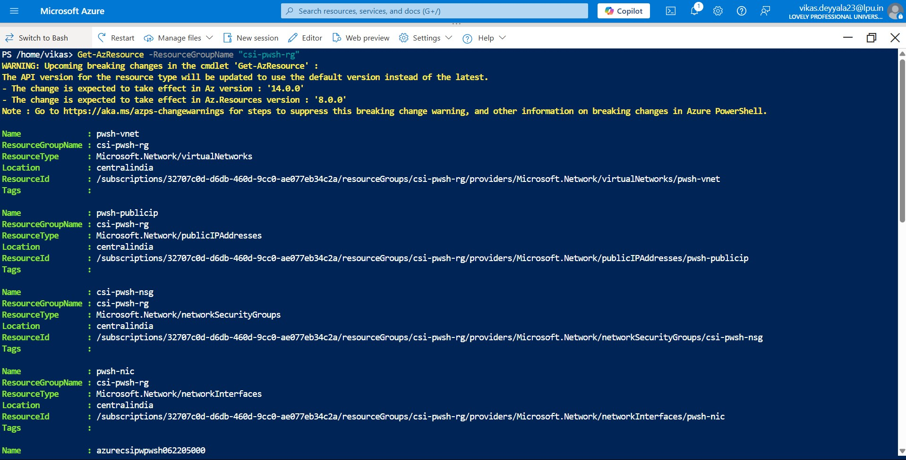
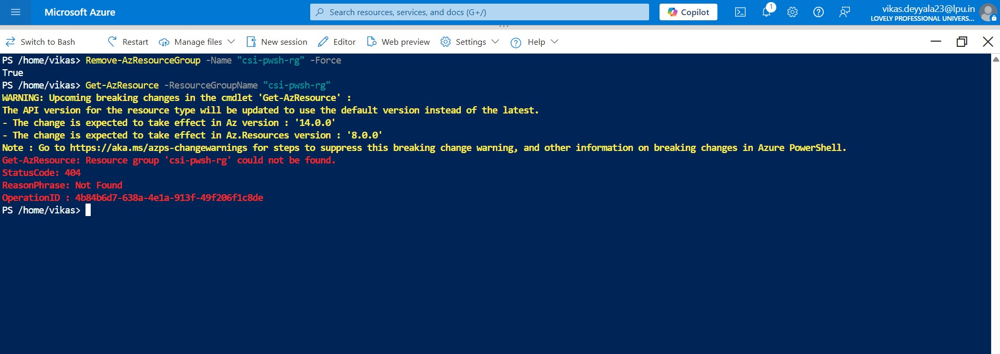

# Week 3 – Azure PowerShell: Task 6

## 📌 Task: Create a Virtual Machine Using Azure PowerShell

## 🎯 Objective

In this task, I explored how to create a **Virtual Machine in Azure using PowerShell**. Instead of relying on the Azure Portal or even CLI, I used Azure PowerShell commands to provision the full VM setup — including resource group, network configuration, and VM deployment.

>  I also referred to [Azure's official PowerShell documentation](https://learn.microsoft.com/powershell/azure/new-azureps-module-az) during the process to ensure I was following best practices and using the most up-to-date commands.

---

## 🧩 Step-by-Step Implementation

### Step 1: Launched Azure PowerShell Environment

I launched **Azure PowerShell** using the Cloud Shell available in the Azure Portal.  
We also use a local machine but make sure that `Az` module is installed and run:

```powershell
Connect-AzAccount
```

Here I've used Azure Powershell So, I was good to go!


### Step 2: Created a Resource Group

I started by creating a dedicated resource group to keep all related resources in one place:

```powershell
New-AzResourceGroup -Name "csi-pwsh-rg" -Location "Central India"
```


### Step 3: Created a Virtual Network and Subnet

Next, I created a VNet and a subnet that the VM would use:

```bash
$subnet = New-AzVirtualNetworkSubnetConfig -Name "pwsh-subnet" -AddressPrefix "10.0.0.0/24"
$vnet = New-AzVirtualNetwork -Name "pwsh-vnet" `
  -ResourceGroupName "csi-pwsh-rg" `
  -Location "Central India" `
  -AddressPrefix "10.0.0.0/16" `
  -Subnet $subnet
```
- *This created a clean network with one subnet that the NIC can connect to.*



### Step 4: Created a Public IP Address

This IP is necessary for accessing the VM over the internet:

```bash
$publicIp = New-AzPublicIpAddress -Name "pwsh-publicip" `
  -ResourceGroupName "csi-pwsh-rg" `
  -Location "Central India" `
  -AllocationMethod Static
```

I chose Static IP to ensure the VM's public IP doesn’t change across restarts.




### Step 5: Created a Network Security Group and Rule

To allow SSH (port 22), I created a security rule and associated it with a new NSG:

```bash
$nsgRule = New-AzNetworkSecurityRuleConfig -Name "allow-ssh" `
  -Protocol Tcp -Direction Inbound -Priority 1000 -SourceAddressPrefix * `
  -SourcePortRange * -DestinationAddressPrefix * `
  -DestinationPortRange 22 -Access Allow

$nsg = New-AzNetworkSecurityGroup -ResourceGroupName "csi-pwsh-rg" `
  -Location "Central India" -Name "csi-pwsh-nsg" `
  -SecurityRules $nsgRule
```

> *This allows us to SSH into the VM after creation.*



### Step 6: Created a Network Interface (NIC)

Then I created a NIC that connects the VM to the VNet and applies the public IP and NSG:

```bash
$nic = New-AzNetworkInterface -Name "pwsh-nic" `
  -ResourceGroupName "csi-pwsh-rg" `
  -Location "Central India" `
  -SubnetId $vnet.Subnets[0].Id `
  -PublicIpAddressId $publicIp.Id `
  -NetworkSecurityGroupId $nsg.Id
```

Every VM requires a NIC to communicate over the network. This step ties everything together.



### Step 7: Created the Virtual Machine

This was the final and most exciting part spinning up the actual VM:

```bash
$vmConfig = New-AzVMConfig -VMName "pwsh-vm" -VMSize "Standard_B1s"

$vmConfig = Set-AzVMOperatingSystem -VM $vmConfig -Linux `
  -ComputerName "pwsh-vm" `
  -Credential (Get-Credential) `
  -DisablePasswordAuthentication:$false

$vmConfig = Set-AzVMSourceImage -VM $vmConfig `
  -PublisherName "Canonical" `
  -Offer "UbuntuServer" `
  -Skus "18.04-LTS" -Version "latest"

$vmConfig = Add-AzVMNetworkInterface -VM $vmConfig -Id $nic.Id

New-AzVM -ResourceGroupName "csi-pwsh-rg" `
  -Location "Central India" `
  -VM $vmConfig
```

> I was prompted to enter a **username and password** during `Get-Credential`. SSH setup could also be used instead.

📦 After a few minutes, the VM was created successfully.



### Step 8: Connect to the VM

To get the public IP and SSH into the VM:

```powershell
Get-AzPublicIpAddress -ResourceGroupName "csi-pwsh-rg" -Name "pwsh-publicip"
```

```bash
ssh <username>@<public-ip>
```

I verified the connection and logged into the Linux VM!



### Step 9: Verify and Cleanup Resources (Optional)

To check everything I had created inside the resource group:

```bash
Get-AzResource -ResourceGroupName "csi-pwsh-rg" 
```
This command showed all the associated resources like VM, NIC, NSG, VNet, Public IP, etc. It helped confirm that everything was provisioned properly.



To avoid extra cost, I deleted everything at the end:

```powershell
Remove-AzResourceGroup -Name "csi-pwsh-rg" -Force
```
*This will permanently delete all resources inside the group.*



---

## ✅ Final Outcome

This task gave me solid hands-on experience with **Azure PowerShell**. I went through the complete process of setting up a VM infrastructure step by step all using PowerShell scripting, which is highly useful in automation or when working with Windows-centric environments.
