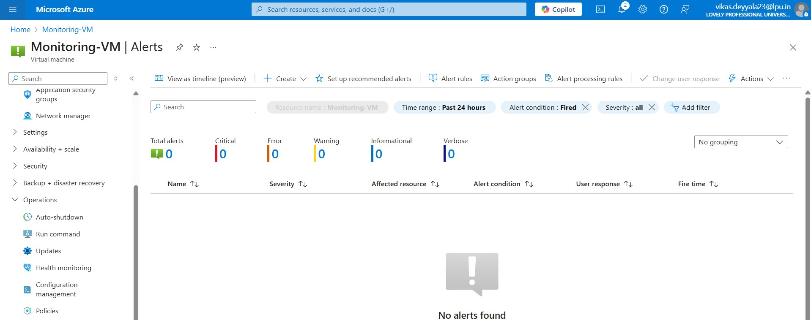
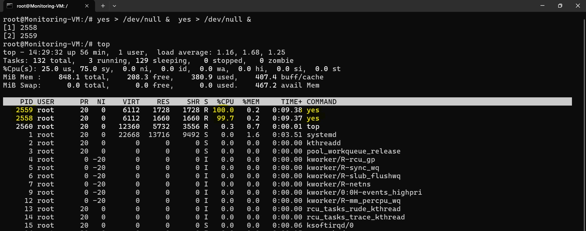

# Week 3 – Azure Monitoring & Backup: Task 7

## Task Overview

In this task, I focused on **monitoring and backing up virtual machines (VMs)** in Azure. Specifically, I did the following:

### Part A: Create an Alert Rule

* **Scenario:** Trigger an alert if a VM's CPU usage exceeds 80%.
* **Delivery:** Email notification when the threshold is breached.

### Part B: Provision Backups

* **Tool:** Azure Backup Center
* **Schedule:** Daily backups at **3:00 AM**
* **Retention Policy:** Custom policy to retain daily, weekly, and old backups

---

## Step-by-Step Implementation

### Part A: Create an Alert for VM CPU Usage > 80%

### Step 0: Created a Virtual Machine for Monitoring
Before creating the alert, I provisioned a Linux-based virtual machine in Azure named as**`Monitoring-VM`**

- Selected a `Ubuntu image`
- Region: `Central India`
- Size: `Standard B2s (2 vCPU, 1 GiB RAM)`

> This VM served as the target resource for CPU monitoring and alert testing.


### Step 1: Go to the Virtual Machine

- Navigated to the VM that I wanted to monitor.
- In the VM blade, selected **"Alerts" > "+ New Alert Rule"**


### Step 2: Define the Scope

- Azure automatically selected the **VM resource** as the scope since I started from the VM’s alert section.
- This ensures the alert will only apply to this specific virtual machine.

### Step 3: Add Condition

- Clicked on **“Add condition”** to define when the alert should be triggered.
- In the metric search, selected **“Percentage CPU”**.

- Then I configured the logic as follows:

  * **Operator:** Greater than
  * **Threshold Value:** `80`
  * **Aggregation Type:** Average
  * **Frequency (Check every):** `1 minutes`
  * **Period (Lookback window):** `5 minutes`

> This means: if the average CPU usage stays above 80% for 5 minutes, checked every 1 minutes, the alert will fire.


### Step 4: Define Action Group

To receive the alert, I created an action group that sends an **email notification**.

  - **Action Group Name:** `csi-alert-group`


  - Notifications: Email
  - Email used: `vikasprince30809@gmail.com`


### Step 5: Review + Create

- Gave the alert rule a name: `HighCPUAlert-VM`
- Set **Severity** to `2 (Warning)` to indicate it's important but not critical
- Reviewed the entire configuration and clicked **“Create”** to finalize the alert rule.


- Azure confirmed that the alert rule was successfully created. This rule continuously monitors the **CPU usage**, and if it remains above **80% for 5 minutes**, it will automatically send a **warning email** to the specified address. This setup helps in **proactive VM performance monitoring** and quick issue response.



### Step 6: Test the Alert by Stressing the CPU

- Logged in to the Linux VM using SSH.
- Stress the CPU using the `yes` command

```bash
yes > /dev/null &
yes > /dev/null &
```
- This started two CPU-intensive processes that pushed CPU usage to nearly 100% on a 2-core VM.



- After starting the CPU stress test on the VM using the `yes` command, the CPU usage quickly consume above the 80% threshold. Since the alert rule was configured to evaluate every 1 minutes over a 5 minute window, Azure Monitor detected the spike and triggered.


- As expected, I received a notification email from Azure, indicating that the **HighCPUAlert-VM** rule had been activated. The email clearly mentioned the resource ID, the metric that triggered the alert, and the timestamp when it was detected.


---

## Part B: Provision VM Backups via Backup Center

### Step 0: Reused Existing VM for Backup

Instead of creating a new virtual machine, I used the same VM that I had previously set up for monitoring and alert configuration.

- **VM Name:** `monitoring-vm`
- **OS:** Ubuntu Server
- **Region:** Central India
- **Size:** Standard B2 (2 vCPU, 1 GiB RAM)
- **Resource Group:** `monitoring-rg`

Since the VM was already running and actively used for testing alert rules, it made perfect sense to continue with it for this backup task. 

### Step 1: Open Backup Center & Create Vault

- From the [Azure Portal](https://portal.azure.com), searched for **Backup Center**.
- Opened **Backup Center** and navigated to **"Vaults"** in the left-hand menu.
- Clicked **"+ Backup vault"** to create a new vault.
- Here I am chosen **Recovery Services Vault**


####  Reason for Choosing Recovery Services Vault

While creating the vault, I realized that **Backup Vaults do not support full Virtual Machine backups** — they are more appropriate for backing up **Azure disks, blobs, or file shares**.

Since my intention was to protect **entire VMs** (including OS, data, configuration), I selected **Recovery Services Vault** instead of Backup Vault.

- **Vault Type Chosen:** `Recovery Services Vault`
- **Name:** `csi-devops-backup-vault`
- **Region:** Central India
- **Resource Group:** `csi-task7-rg`
- **Storage Redundancy:** Geo Redundant

Clicked **Review + Create** → **Create**


- Vault created successfully


### Step 2: Configure Backup for the Virtual Machine

- Opened the newly created `csi-devops-backup-vault`
- Selected **Backup** from the left-side blade
- In the prompt:
  - **Where is your workload running?** → Azure
  - **What do you want to back up?** → Virtual Machine

Clicked **Backup** to proceed.


### Step 3: Create and Assign Backup Policy

After VM selection, I created a **custom backup policy** to define backup timing and retention periods.

#### Backup Policy Details:

| Setting             | Value                |
|---------------------|----------------------|
| **Policy Name**     | `daily-3am-policy`   |
| **Backup Frequency**| Daily                |
| **Time**            | 3:00 AM              |
| **Instant Restore** | 1 day                |
| **Daily Retention** | 7 days               |
| **Weekly Retention**| 4 weeks              |
| **Monthly Retention**| 60 days             |

This policy ensures we can recover data from recent days, weekly restore points for rollback, and monthly snapshots for long-term reference.

### Step 4: Select the Target Virtual Machine

- In the next screen, I selected my VM `monitoring-vm` from the list
- Made sure that the VM's **region matches** the vault's region (Central India)
- Confirmed the selection and clicked **OK**


### Step 5: Enable Backup

- Returned to the **Backup** configuration page in the vault
- Selected the VM and assigned the newly created `daily-3am-policy`
- Clicked **Enable Backup** to finalize the setup

### Step 6: Verify VM Appears Under Backup Items

- After enabling the backup, I navigated to the vault’s left-side menu.
- Clicked on **"Backup Items"**


- Selected **"Azure Virtual Machine"** under the workload type


Here, I could see the `monitoring-vm` listed and confirming that the VM is now registered and backups are being managed as per the configured policy.

I also triggered the **initial backup** right after enabling it, to make sure the backup was configured correctly and recovery points started appearing.


> This view is useful for monitoring backup status, triggering manual backups, or initiating a restore operation if needed.


## ✅ Final Result: VM Backup Successfully Configured

The VM `monitoring-vm` was successfully registered with the Recovery Services Vault, and backup was enabled with the custom policy.

- **Daily backup scheduled at:** 3:00 AM  
- **Backup visibility:** Vault > Backup Items > Azure Virtual Machines  
- **Retention policy:** Applied as configured  
- **Instant restore availability:** 1 day  
- **Historical restore points:** Created automatically over time based on schedule


> **Note:** The backup is automatically triggered based on UTC time.
 
---

## Conclusion

I successfully set up CPU monitoring with alerts and configured daily VM backups using a Recovery Services Vault. This ensured both proactive performance tracking and reliable data protection for the virtual machine. Overall, it was a solid exercise in combining monitoring and backup to enhance VM resilience in Azure.

---