# 🛡️ Week 3 Task 8 – Azure Site Recovery (ASR)

## 🎯 Objective

In this task, I set up **Azure Site Recovery (ASR)** to enable disaster recovery for my existing VM (`monitoring-vm`). This ensures that, in case of a regional outage, the VM can be failed over to a secondary region with minimal downtime.

**Note**: In this week, there were a few repeated questions and no specific task assigned on Site Recovery. So, I took the initiative to explore Azure Site Recovery in depth to get hands on experience and better understanding about disaster recovery in Azure

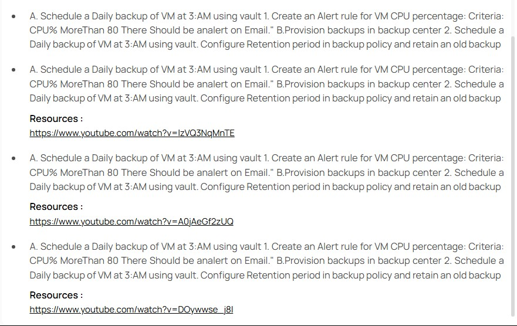

---

## ✅ Step-by-Step Implementation

### Step 0: Reuse VM for ASR Configuration

I reused the same VM (`monitoring-vm`) that I had created and used for monitoring and backup.

- **VM Name:** `monitoring-vm`
- **OS:** Ubuntu Server
- **Region:** Central India
- **Size:** Standard B2s (2 vCPU, 1 GiB RAM)
- **Resource Group:** `monitoring-rg`

This kept everything consistent and avoided extra provisioning steps.

### Step 1: Prepare Permissions and Infrastructure

Before proceeding, I made sure:

- My Azure account had **Owner/Contributor** access in both source and target subscriptions.
- I assigned the **Site Recovery Contributor** role to my account on the vault.
- The VM had the **Azure VM Agent** installed and outbound network access.

### Step 2: Create Recovery Services Vault for ASR

- Navigated to **Azure Portal → Recovery Services Vaults → + Create**
- Entered the following:

  - **Name:** `csi-devops-asr-vault`
  - **Resource Group:** `monitoring-rg`
  - **Region:** **West India** (a different region from the source)

- Clicked **Review + Create**, then **Create**
- Vault creation completed successfully

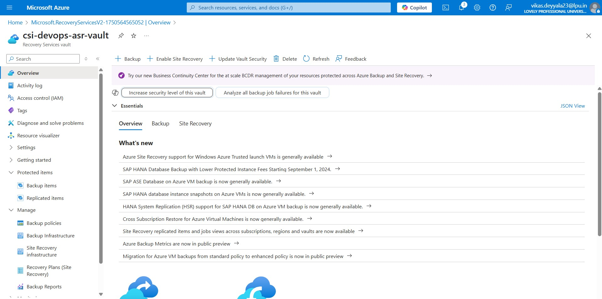

### Step 3: Enable Site Recovery

- Opened `csi-devops-asr-vault` → clicked **Site Recovery** → **Enable Replication**

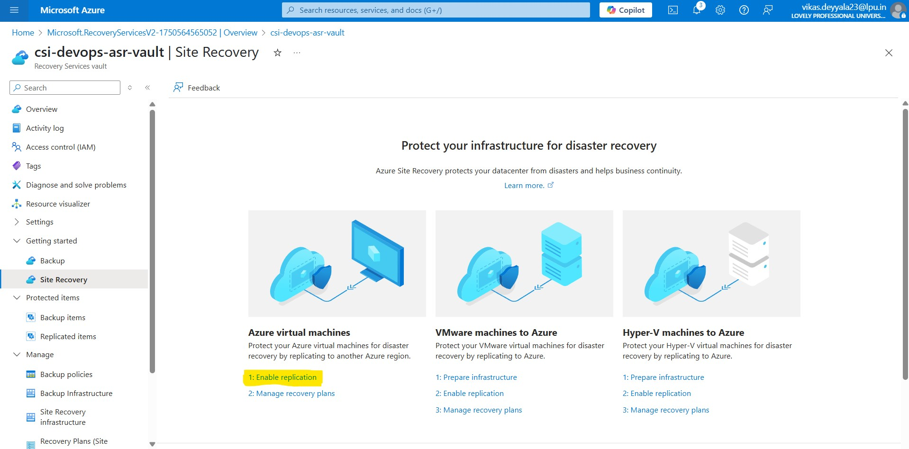

- Configured source settings as follows:

  - **Source Region:** Central India
  - **Subscription & Resource Group:** my existing ones
  - **Deployment Model:** Azure Resource Manager
  - **Replica Model:** No Availability Zone

Clicked **Next** to proceed.

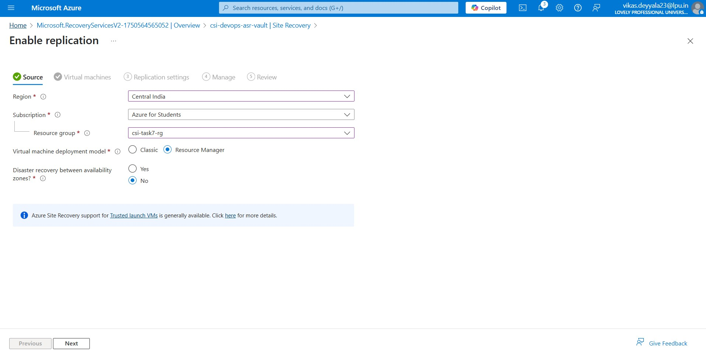

### Step 4: Select the Virtual Machine

- On the next screen, I selected the VM `monitoring-vm` to replicate
- Clicked **Next** to confirm the selection

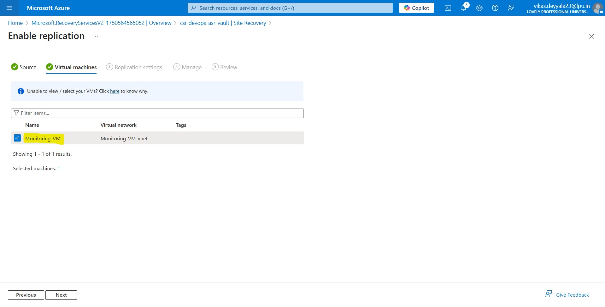

### Step 5: Configure Target Settings

- Selected **Target Subscription** and **EAST ASIA** region
- Chose a virtual network in East Asia for failover
- Accepted the automatic provisioning of the necessary storage account and network interfaces
- Clicked **Next**

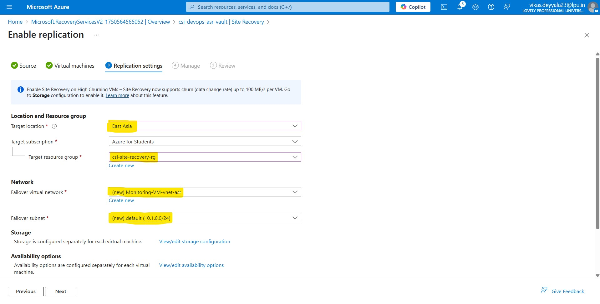

### Step 6: Adjust Replication Policy

- Viewed the default replication policy, which includes:

  - Application-consistent snapshot frequency
  - RPO retention (default 24 hours)

- I kept the default settings, which are suitable for my test environment
- Azure Site Recovery also supports using Replication Groups to group multiple VMs for coordinated replication and failover. However, for this task, I focused on replicating a single VM and did not configure a replication group.
- Clicked **Next** to move on

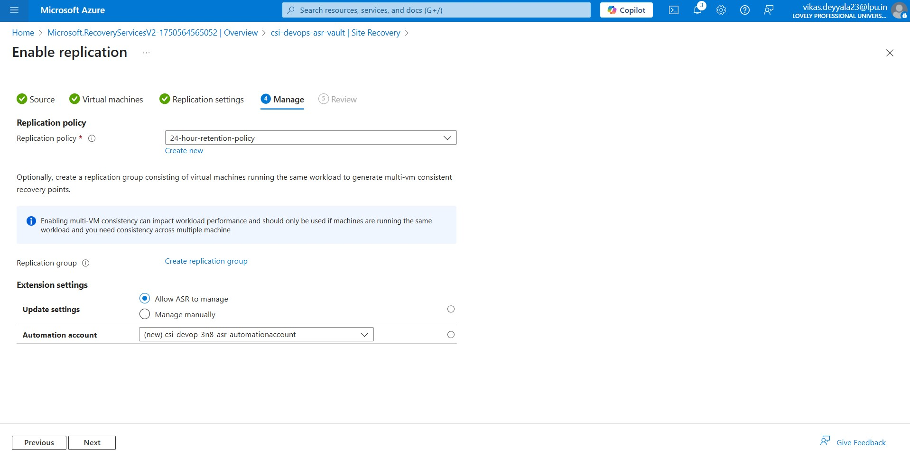

### Step 7: Enable Replication

- Reviewed all configurations

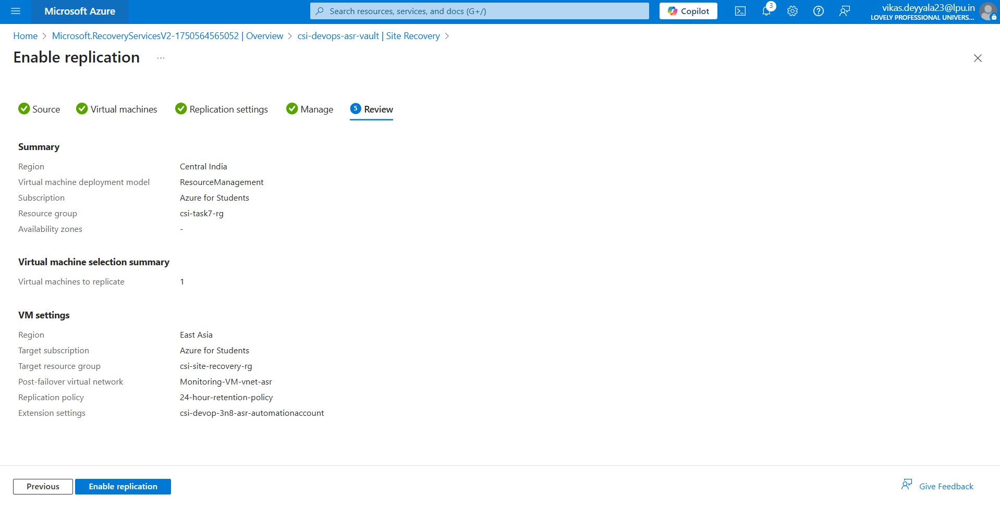

- Clicked **Enable Replication**
- Azure automatically installed the ASR Mobility agent on the VM, set up resources, and triggered the initial replication

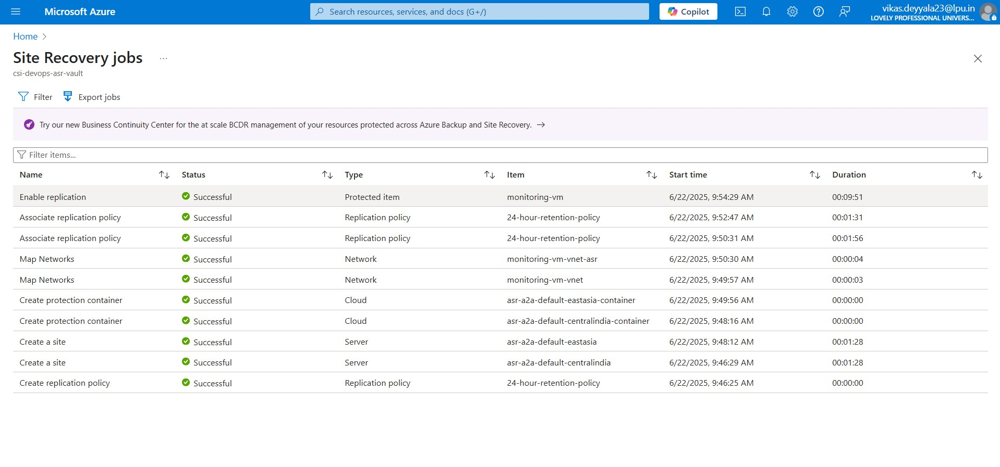

## Step 8: Confirm VM Is Replicating

- Once replication started, I checked **`Vault → Replicated Items`**
- The VM `monitoring-vm` appeared with a **Healthy** status.
- This confirms that the VM is actively replicating to the target region

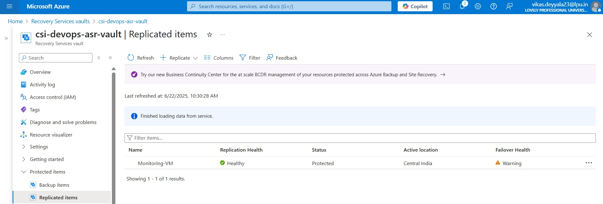

- Infrastructure view

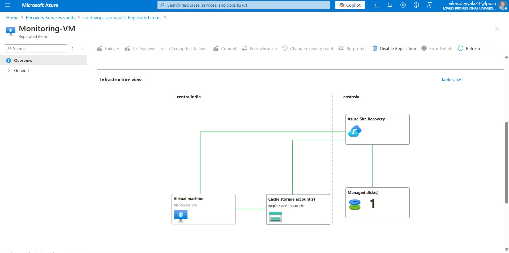

---

## Azure Site Recovery – Test Failover Validation

After setting up Azure Site Recovery for my VM `monitoring-vm`, I wanted to verify if everything works as expected in case of a disaster. So, I performed a **Test Failover** to validate the configuration without affecting my running production VM.

### Step 9: Run a Test Failover for `monitoring-vm`

Once replication was marked as healthy under the **Replicated Items** section of my Recovery Services Vault, I proceeded with a test failover.

### Why Run a Test Failover?

A test failover simulates a real disaster recovery scenario by spinning up a **temporary copy** of the VM in the **target region** (East Asia in my case), using the latest replicated data. It helps ensure:

- The VM boots up successfully
- Operating system and application layers function normally
- Networking and IP configurations are compatible

Most importantly, this test is isolated — it **does not impact the source VM**.

#### Start Test Failover

- Clicked on **Test Failover** at the top

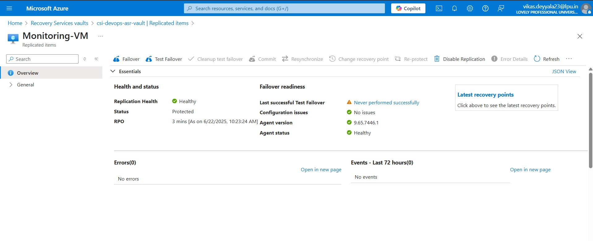

- Chose the following options:
  - **Recovery Point:** Latest processed
  - **Target Region:** Already set to East Asia
  - **Target VNet:** Selected the test failover VNet provisioned during replication

Then I clicked to initiate the failover.

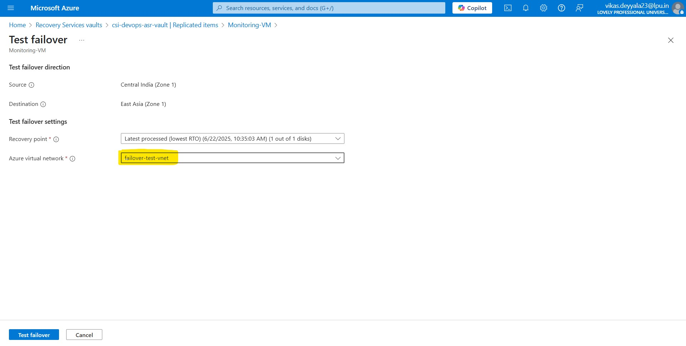

> Azure started the process of creating a temporary test VM in the East Asia region.

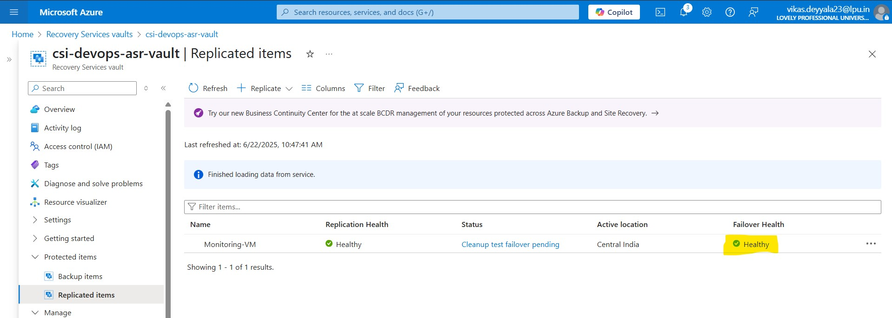

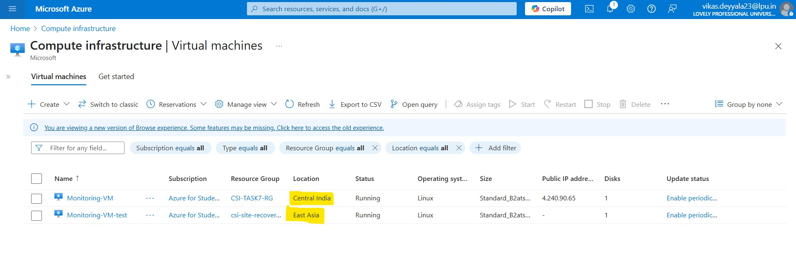

### Step 10: Clean Up Test Failover Resources

Since the test VM created during the failover is only for validation purposes, it's important to **clean up** these temporary resources to avoid **unnecessary costs** and **resource clutter**.

- Clicked on **"Cleanup Test Failover"** from the top menu

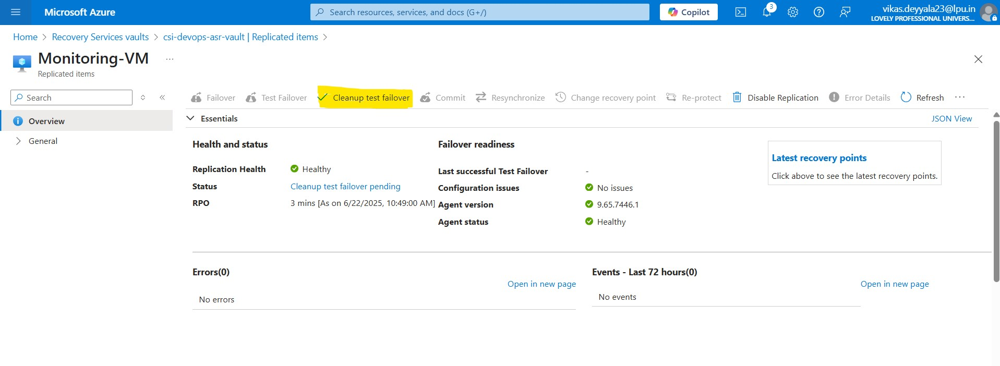

In the prompt:

- I entered the comment:
  > `"Test passed successfully"`
- Confirmed the cleanup

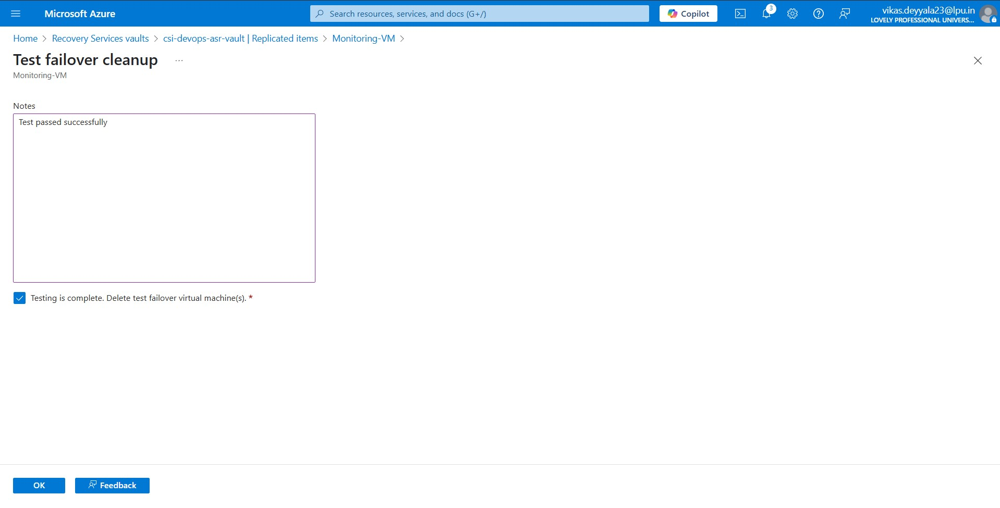

Azure automatically deleted the temporary test VM and associated resources from the **target region** (East Asia), ensuring everything is clean and no leftover test infrastructure remains.

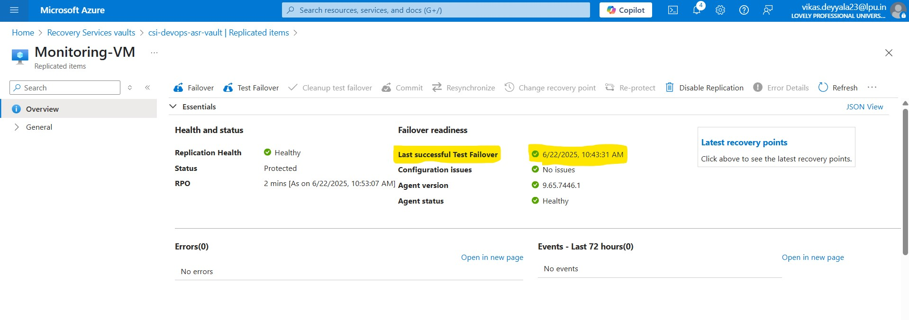

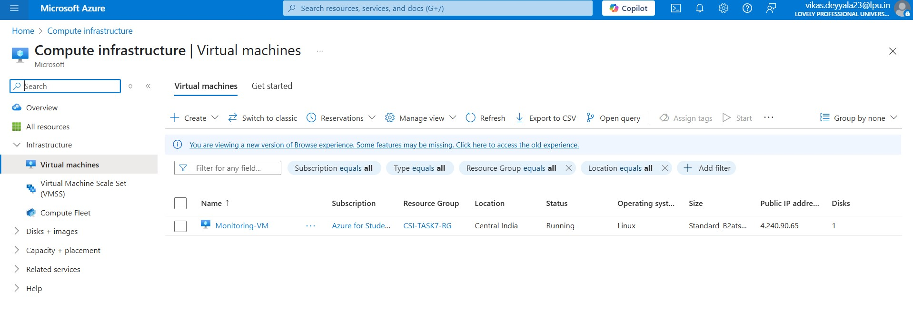

> ✅ This final step completed the test failover lifecycle and confirmed the replication setup works as expected.

---

## Conclusion

With Azure Site Recovery configured, my VM is now protected against regional outages. Replication is active, and I can easily initiate a test or actual failover when required, ensuring business continuity and minimal disruption.

---