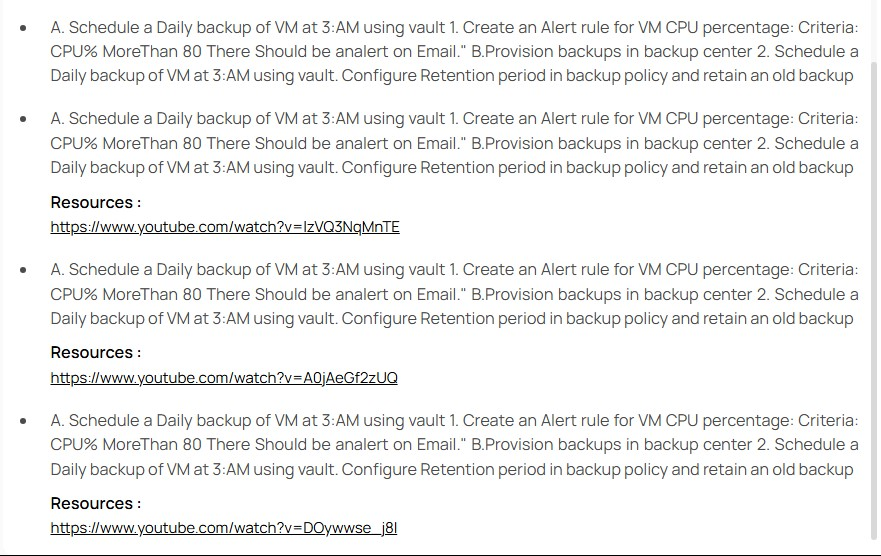
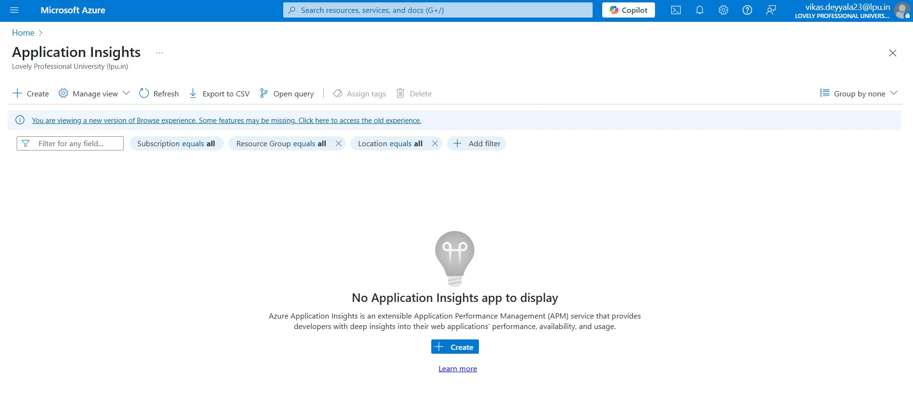
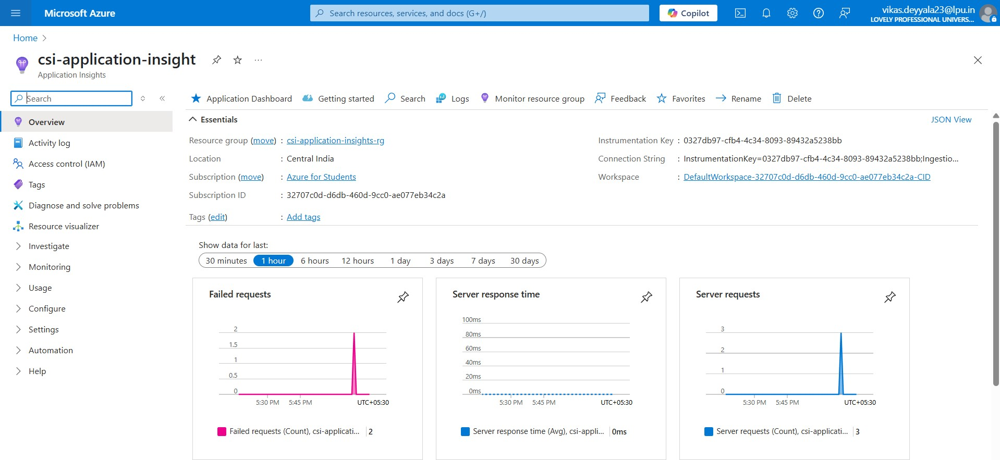
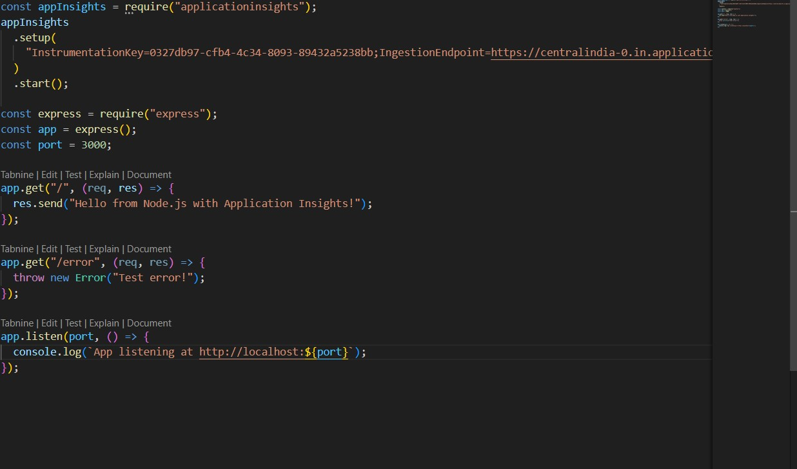
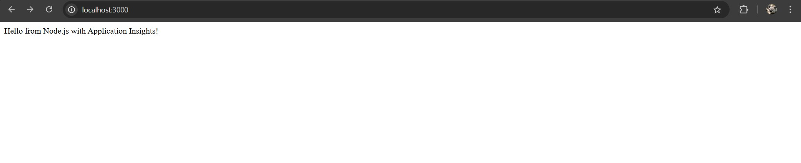
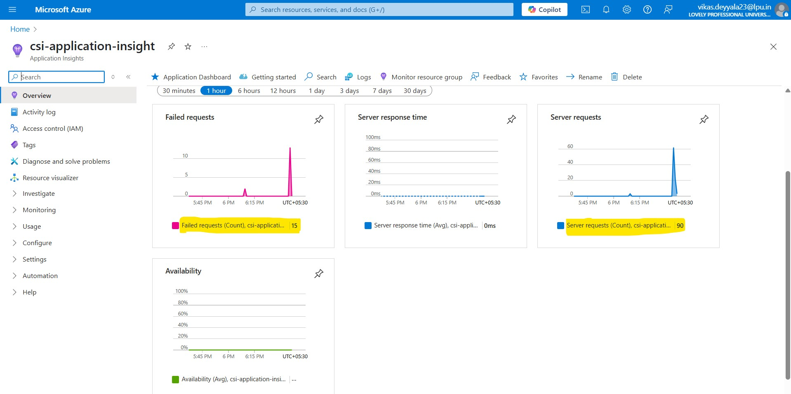
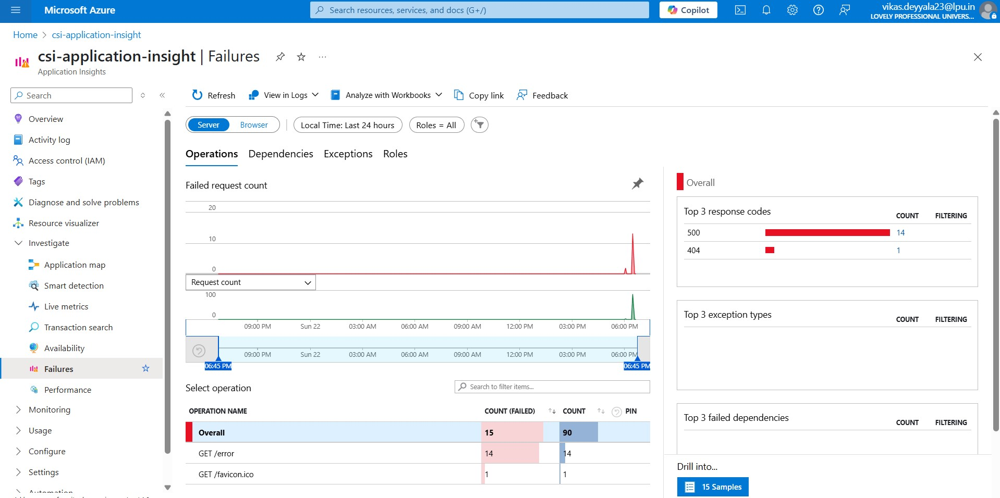
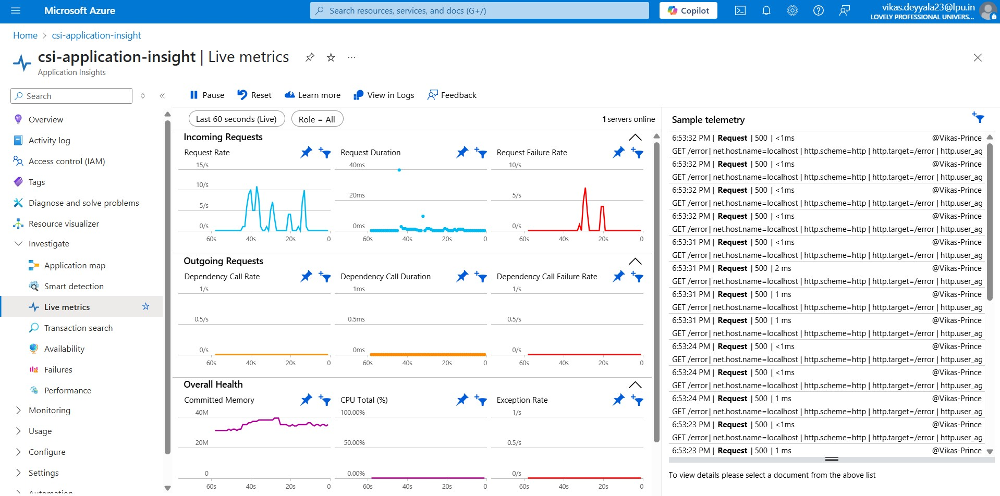
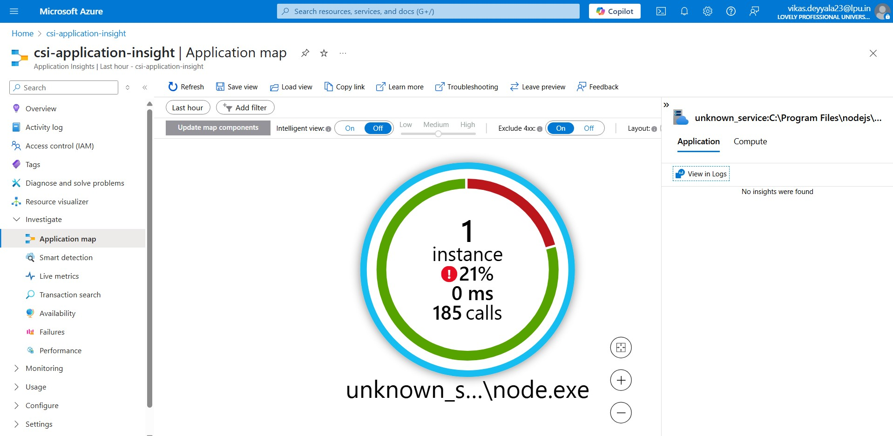

# Week 3: Task 9 - Application Insights

## Task: Exploring Azure Application Insights: Full Walkthrough & Usage

## Overview

I am sharing my hands-on experience exploring **Azure Application Insights**. This tool is part of Azure Monitor and is designed to help monitor, diagnose, and understand the behavior and health of web applications and services.

I walked through its core features, configurations, and practical uses to get a comprehensive understanding of how it supports application monitoring and diagnostics.

**Note**: In this week, there were a few repeated questions and no specific task assigned on `Application Insights`. So, I took the initiative to explore `Application Insights` in depth to get hands on experience and better understanding about App insights and monitoring

---

## What is Application Insights?

Azure Application Insights is an **Application Performance Management (APM)** service. It automatically collects telemetry data from your applications to help you:

- Monitor app performance
- Detect and diagnose issues
- Understand user interactions
- Ensure availability

It works for applications running in Azure, on-premises, or any other cloud platform.

---

## 🚀 Steps I Followed to Explore Application Insights

### Step 1: Create an Application Insights Resource

I started by logging into the Azure Portal and searching for **Application Insights** in the search bar. Once I found the Application Insights service, I clicked on it to navigate to the main page.

Next, I clicked on the **Create** button to start setting up a new Application Insights resource. In the creation form, I filled out the required details such as:

- **Name:** gave a unique as `csi-application-insight`
- **Subscription:** selected my Azure subscription
- **Resource Group:** I created new resource group named as `csi-application-insights-rg`
- **Region:** chosen `Central India`

After filling in all the necessary information, I clicked on **Review + create** to validate the settings. Once everything looked good, I clicked **Create**.

Within a few moments, the resource was successfully created.

This resource will now collect and analyze telemetry data from my application.

### Step 2: Instrument the Application

For integrating Application Insights with my app, there are a couple of ways depending on where our app is running:

- If our application is deployed on **Azure Web Apps**, we can enable **Application Insights integration** directly from the Web App’s **Monitoring** section in the Azure Portal. This allows telemetry to flow automatically without code changes.

- For custom applications or local testing, we need to instrument our app manually by adding the Application Insights SDK and `connection string`.

Since I was just experimenting and testing, I created a simple Node.js application on my local machine. I installed the `applicationinsights` package via npm and added the connection string from my Azure Application Insights resource into the Node.js app code. This setup allowed my local app to send telemetry data to Azure Application Insights.

### Step 3: Run the Application and Verify Telemetry

After adding Application Insights to my Node.js app, I ran the server locally and accessed the app on `http://localhost:3000`. The app was running smoothly, and I could see the homepage loading without any issues.

To test error tracking, I intentionally triggered an error by navigating to `http://localhost:3000/error/`. This endpoint was set up to throw an error so I could verify if Application Insights captures exceptions correctly.

A few seconds after running these tests, I checked the Azure Portal and opened my Application Insights resource. I could see the telemetry data flowing in, showing important metrics such as:

- **Request rate:** How many requests per minute
- **Failure rate:** Percentage of failed requests
- **Response time:** Average duration of requests
- **Users:** Number of active users and sessions

This dashboard gave me a clear and immediate view of the application’s health and usage patterns.

### Step 4: Explore Core Features

#### 1. **Performance Metrics**

- I looked at response times broken down by operation.
- Drill-downs showed which API calls or pages were slow.
- Dependency tracking showed external services called by my app, highlighting latency.

#### 2. **Failures & Exceptions**

- Automatic capture of exceptions with detailed stack traces.
- Failed requests listed with error codes and counts.
- Useful for debugging without needing to reproduce issues locally.

#### 3. **Live Metrics Stream**

- Real-time view of telemetry such as request rates and failures.
- Helpful for monitoring during deployments or traffic spikes.
- I could see live updates as users interacted with the app.

#### 5. **Availability Tests**

- Set up URL ping tests to check app availability from different regions.
- Alerts triggered if app was unreachable or too slow.
- Helps ensure SLA commitments and detect downtime quickly.

#### 4. **Application Map**

- I explored the **Application Map** feature which visually represents the components of my application and how they interact.
- It helped me quickly identify dependencies, bottlenecks, and failing components.
- This map gave a clear overview of the app’s architecture and highlighted any performance or failure hotspots.

### Step 5: Set Alerts and Notifications

To stay proactively informed about issues, I configured alert rules in Application Insights. These alerts monitor metrics like failure rates, response times, or availability tests.

- I set thresholds for important metrics to trigger alerts when something goes wrong.
- These alerts were linked to action groups that send notifications via email, SMS, or other channels.
- This way, I can get instant notifications and respond quickly to any problems before they impact users.

This alert setup is similar to what I did in previous monitoring tasks, ensuring I never miss critical issues.

---

## Conclusion

Worked with Azure Application Insights was straight forward and really insightful. Setting it up and seeing real-time data helped me understand how my app performs and where issues might be. The features like alerts, live metrics, and the application map make monitoring simple and effective.

---
