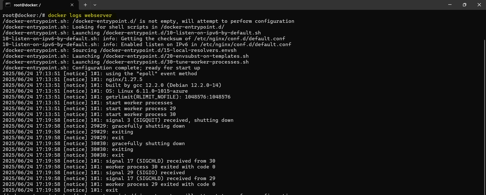

# Week 4 – Docker: Task 1

## 📌 Task: Introduction to Containerization and Docker Fundamentals

## 🎯 Objective

The goal of this task is to understand the fundamentals of containerization, how Docker fits into this paradigm, and to explore basic Docker CLI commands to manage containers and images. This marks the beginning of hands-on experience with Docker—one of the most essential tools in the DevOps toolchain.

---

## What is Containerization?

Containerization is a lightweight form of virtualization that allows applications to run in isolated environments called containers. Unlike virtual machines, containers share the same host OS kernel but package everything else the application needs to run — including libraries, binaries, and configurations.

This ensures that applications behave the same regardless of where they're deployed: on a developer's laptop, staging, or production.

---

## Why Docker?

Docker is an open-source platform that simplifies container creation, deployment, and management. It helps developers and sysadmins build, ship, and run applications as containers.

**Key benefits of Docker:**

* Consistent environments across dev, test, and prod
* Faster application delivery
* Easy rollback and replication
* Resource efficiency compared to VMs


## Docker Image vs Container

| Term          | Description                                                                                                            |
| ------------- | ---------------------------------------------------------------------------------------------------------------------- |
| **Image**     | A lightweight, standalone, and executable software package that includes everything needed to run a piece of software. |
| **Container** | A running instance of an image. It’s a live, executable environment.                                                   |


---

## 🔧 Environment Setup

I already had Docker installed on my local machine. If not, Docker can be installed by following the official guide:

[https://docs.docker.com/get-docker/](https://docs.docker.com/get-docker/)

To confirm that Docker is correctly installed, I ran the following command:

```bash
$ docker --version
Docker version 24.0.5, build ced0996
```


---

## 🔍 Basic Docker Commands

I worked with some essential Docker commands that are the foundation for container management. Here's a quick rundown of each:


### 1. Check Docker Info

It will provides an overview of the Docker daemon, the system’s configuration, and active Docker containers. A great first step to ensure everything is running smoothly.

```bash
docker info
```


### 2. Pull an Image from Docker Hub

It pulls the latest NGINX image from Docker Hub, Docker's public image registry. Docker Hub hosts thousands of pre-built images for all kinds of applications, ready to be used.

```bash
docker pull nginx
```


### 3. List all Images

```bash
docker images
```
This command lists all Docker images that are currently available on local system, including their repository names, tags, image IDs, and sizes.


### 4. Run a Container

```bash
docker run --name webserver -d -p 8080:80 nginx
```

* `-d`: Detached mode
* `-p`: Map port 8080 on host to port 80 in the container

This command runs the NGINX image in detached mode (-d), allowing the container to run in the background. It also maps port 8080 on my local machine to port 80 inside the container, making the web server accessible via http://<vm-ip>:8080.


### 5. List Running Containers

```bash
docker ps
```
This shows all currently running containers, including their IDs, names, status, and port mappings.


### 6. List All Containers (including stopped)

```bash
docker ps -a
```
Displays all containers, whether running or stopped. It's particularly useful for debugging and cleaning up old containers.


### 7. Stop a Container

```bash
docker stop <container_id>
```
Gracefully shuts down a running container. I can use this command to safely stop any active container.


### 8. Start Container

```bash
docker start <container_id>
```
By using this command to start an existing (but stopped) Docker container by specifying its container ID or name.


### 9. View Logs of a Container

```bash
docker logs <container_id>
```
By viewing a container’s logs, I can troubleshoot and debug issues within the application running inside the container.



### 10. Monitor Container Resource Usage

```bash
docker stats
```
This command provides a real-time stream of container resource usage, such as CPU and memory utilization. It’s essential for monitoring the health of containers and ensuring efficient resource allocation.


### 11. Inspect a Container

```bash
docker inspect <container_id>
```
This command gives me low-level details about a container in JSON format, which can be helpful for advanced debugging or gathering more information about container configuration.


### 12. Execute a Command in a Running Container

```bash
docker exec -it <container_id> /bin/bash
```
This command allows me to execute a command in a running container. Using the `-it` flags, I can open an interactive terminal session inside the container, such as `/bin/bash` for a shell.


### 13. Remove a Container

```bash
docker rm <container_id>
```
After stopping a container, I can remove it with this command to free up space and keep my environment clean.


### 14. Remove an Image

```bash
docker rmi <image_id>
```
This command allows me to remove an image from my local system, freeing up disk space when no longer needed.


---

## Conclusion

With this task, I’ve officially stepped into the world of containerization using Docker. From pulling an image to deploying a running container, I now feel comfortable with the Docker CLI and the fundamental concepts behind containers.

---

