# 🐳 Week 4 – Docker Basics: Task 2

## 📌 Task: Docker Installation, Basic Container Operations & Building a Custom Image

## 🎯 Objective

This task focused on hands-on installation of Docker, running basic containers, and building a custom Docker image using a Dockerfile. The goal was to gain confidence working with Docker as a foundational DevOps skill.

---


## Step 1: Installing Docker on Ubuntu

I began with a clean Ubuntu 20.04 virtual machine. Since Docker runs natively on Linux, I figured this was the most realistic environment to practice.

Here’s how I installed Docker, step by step:

### 🔹 Update the System

```bash
sudo apt update -y
```

I ran this to make sure my package list was up to date. It ensures I’m downloading the latest versions of everything in the upcoming steps.

### 🔹 Install Dependencies

```bash
sudo apt install apt-transport-https ca-certificates curl software-properties-common -y
```
These packages are needed to:

* Handle HTTPS-based repositories
* Add external Docker sources securely
* Use tools like curl to fetch remote files

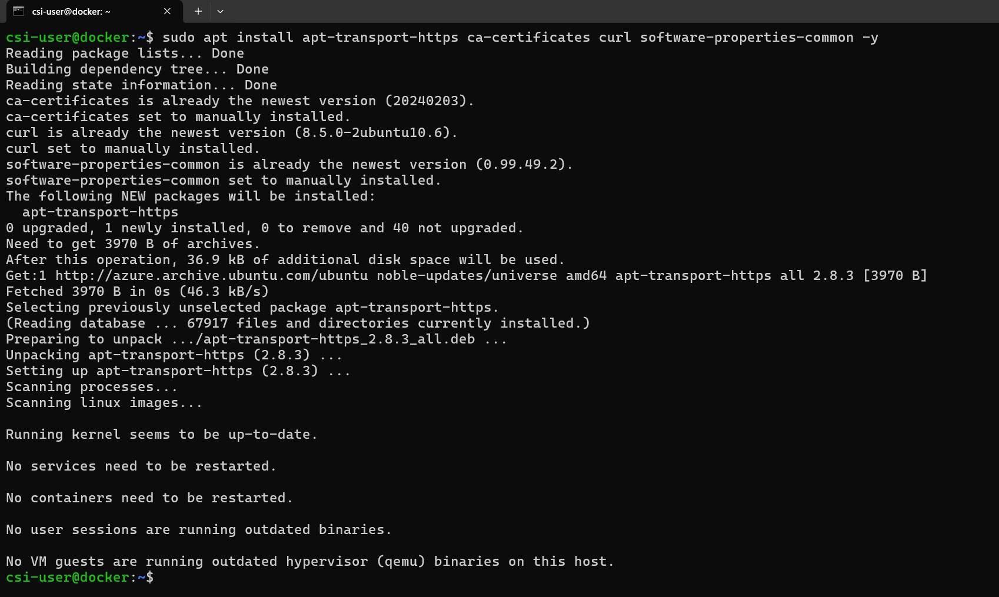

### 🔹 Add Docker’s GPG Key

```bash
curl -fsSL https://download.docker.com/linux/ubuntu/gpg | sudo gpg --dearmor -o /usr/share/keyrings/docker-archive-keyring.gpg
```

Docker signs its packages with a GPG key for security. This command downloads that key and stores it safely, so Ubuntu knows it's getting trusted software.

### 🔹 Add Docker’s Official Repository

```bash
echo \
  "deb [arch=$(dpkg --print-architecture) signed-by=/usr/share/keyrings/docker-archive-keyring.gpg] \
  https://download.docker.com/linux/ubuntu \
  $(lsb_release -cs) stable" | sudo tee /etc/apt/sources.list.d/docker.list > /dev/null
```

Here, I’m adding Docker’s official software repository to my system. This ensures I’m installing Docker straight from the source — not from Ubuntu’s default (and possibly outdated) repositories.

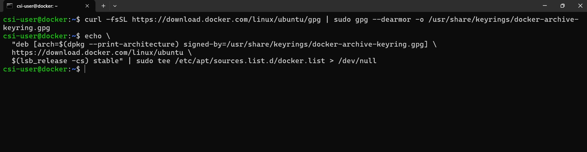

### 🔹 Install Docker Engine

```bash
sudo apt update
sudo apt install docker-ce docker-ce-cli containerd.io -y
```

I ran `apt update` again to refresh the package list now that Docker’s repo is added. Then I installed:

* `docker-ce`: the Docker engine itself
* `docker-ce-cli`: the command-line interface
* `containerd.io`: the runtime that actually runs containers under the hood

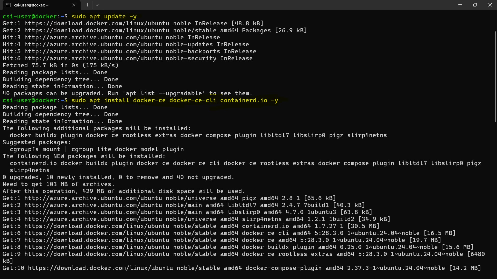

### 🔹 Verify Docker Installation

```bash
docker --version
```
This command checks if Docker is installed correctly and prints out the version number.

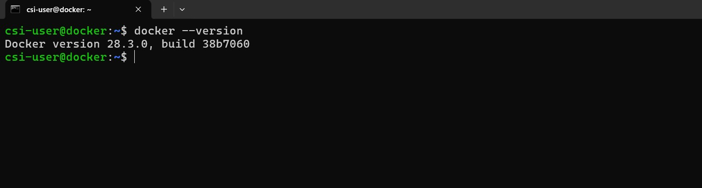

It was great to see Docker installed and ready to go!

### 🔹 Start and Enable Docker

```bash
sudo systemctl start docker
sudo systemctl enable docker
```

* The first command starts Docker right away.
* The second ensures Docker starts automatically every time the system boots up.

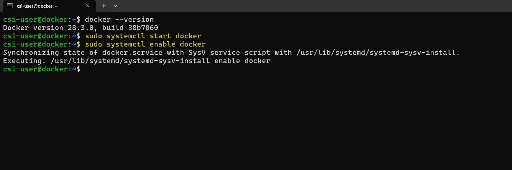

### 🔹 Run Docker Without sudo

```bash
sudo usermod -aG docker $USER
newgrp docker
```

By default, Docker needs root privileges. These commands add my user to the Docker group, allowing me to run Docker commands without `sudo`. I used `newgrp docker` to apply the group change immediately without needing to log out and log back in.

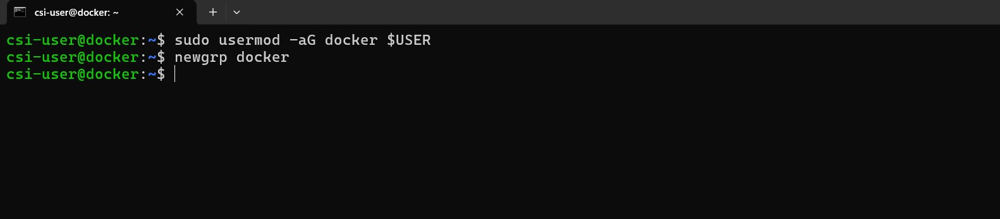

---

## Step 2: Running Basic Docker Commands

With Docker installed, I moved on to testing it by running a container.

### 🔹 Pull the NGINX Image

```bash
docker pull nginx
```

This command downloaded the official NGINX web server image from Docker Hub. It’s like getting a ready-to-use NGINX server in a box.

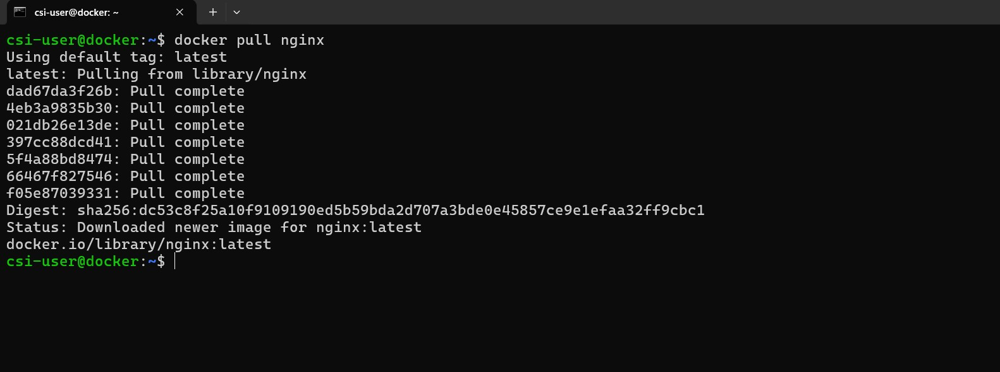

### 🔹 Run the NGINX Container

```bash
docker run -d --name csi-nginx -p 80:80 nginx
```

Let me break this down:

* `-d`: Runs the container in the background (detached mode)
* `--name mynginx`: Names the container so it’s easier to manage
* `-p 80:80`: Maps port 80 inside the container to port 8080 on my local machine
* `nginx`: The image to run

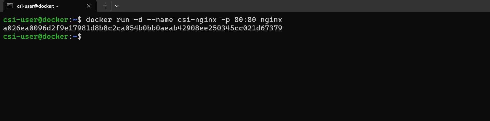

After running this, I opened my browser at [http://20.244.3.123:80/](http://20.244.3.123:80/) and saw the NGINX welcome page — success!

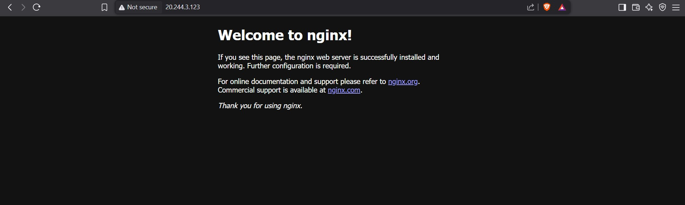

### 🔹 Interacting with the Container

```bash
docker ps
```

This listed the running containers. I used it to confirm that `csi-nginx` was active.


```bash
docker logs csi-nginx
```

This showed the logs from the NGINX container — super useful for checking what’s going on inside.

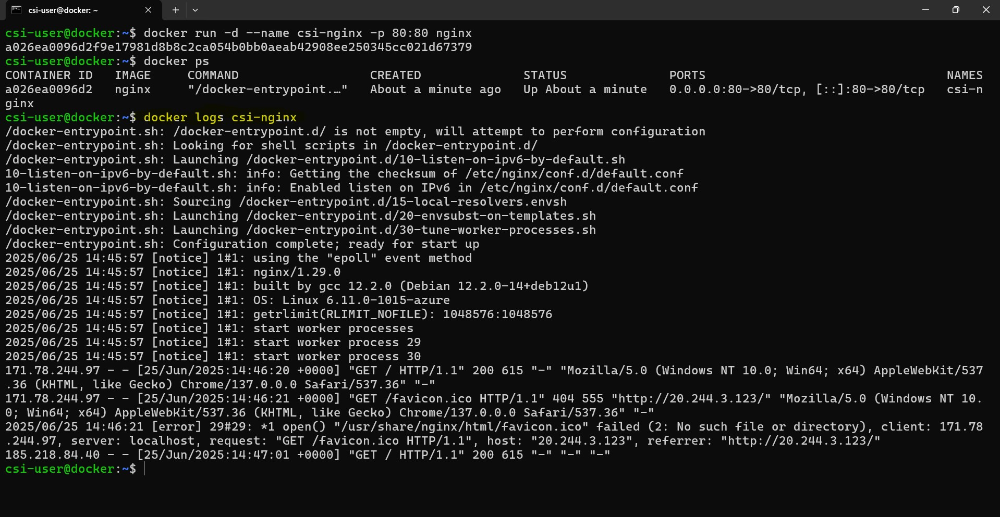


```bash
docker exec -it csi-nginx bash
```

This opened a shell inside the container. It felt like opening a tiny, isolated Linux machine — very cool!

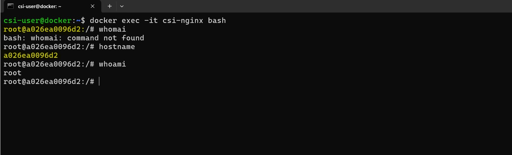


```bash
docker stop csi-nginx
docker rm csi-nginx
```

These two commands stopped and removed the container once I was done experimenting with it.

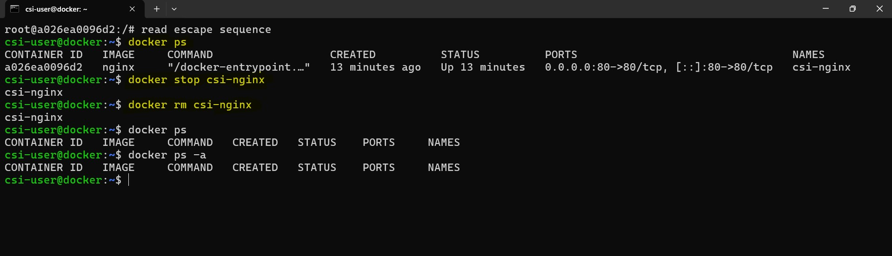

---

## Step 3: Building a Custom Docker Image

Now that I was comfortable running containers, I wanted to create my own image, which is a core skill in DevOps workflows.

### 🔹 Create a Project Directory

```bash
mkdir csi-docker-app
cd csi-docker-app
```

This was my workspace for the app and Dockerfile.


### 🔹 Write a Simple Node.js App

I created a file called `index.js` with this content:

```javascript
const http = require('http');

const server = http.createServer((req, res) => {
  res.end("Hello I am from custom Docker image!");
});

server.listen(3000, () => {
  console.log("Server running");
});
```
This is a basic Node.js web server. It responds with a message on every request.

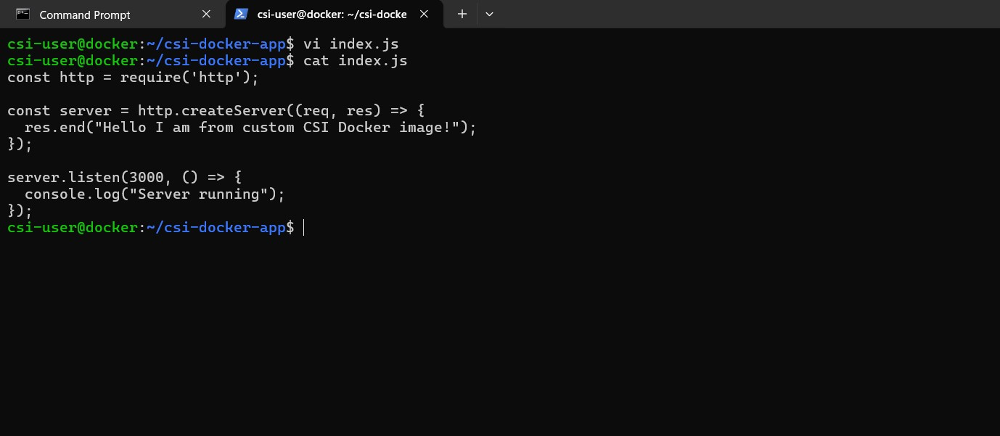

### 🔹 Create the Dockerfile

I created a file named `Dockerfile` in the same directory:

```Dockerfile
FROM node:18-alpine

WORKDIR /app
COPY . .
RUN npm install

EXPOSE 3000
CMD ["node", "index.js"]
```

Here’s what each line means:

* `FROM node:18-alpine`: Use a lightweight Node.js base image
* `WORKDIR /app`: Set the working directory inside the image
* `COPY . .`: Copy all files from my local directory into the image
* `RUN npm install`: Install dependencies (none for now, but this would cover future cases)
* `EXPOSE 3000`: Document that the app runs on port 3000
* `CMD ["node", "index.js"]`: The default command to run when a container starts

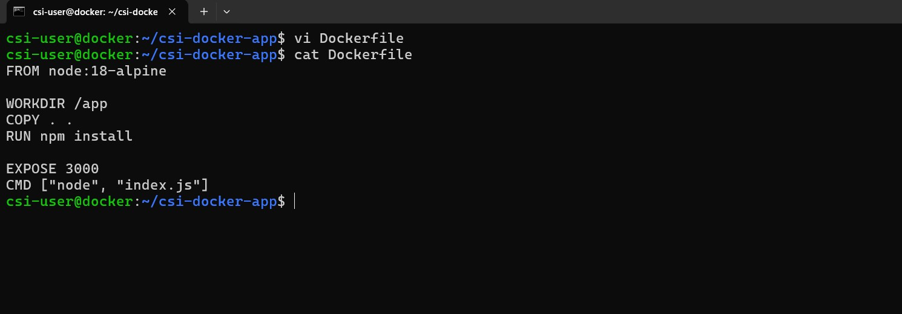

### 🔹 Build and Run the Image

```bash
docker build -t csi-node-app:v1 .
```

This built the image and tagged it as `csi-node-app:v1`.

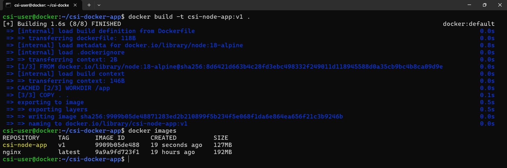

```bash
docker run -d -p 3000:3000 csi-node-app:v1
```

Then I ran the container, mapping the internal port 3000 to my local port 3000.

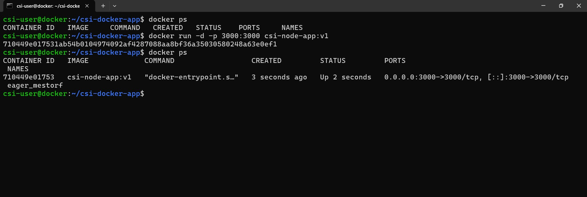

Visiting [http://20.244.3.123:3000](http://20.244.3.123:3000/) in the browser showed the message from my Node.js app, that was a great!

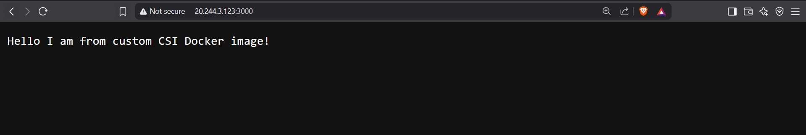

---

## Cleanup

To clean up my environment, I ran:

```bash
docker stop <container_id>
docker rm <container_id>
docker rmi my-node-app
```

This stops and removes both the container and the image I created. It's a good habit to avoid clutter and free up space.


---

## Conclusion

Working through this task gave me a clear understanding of how Docker works from the ground up. Installing it manually, running containers, and building my own image made the whole concept feel much more practical and real. It was satisfying to see my own app running inside a container, and I now feel more comfortable using Docker in everyday development or deployment work. This was a solid and valuable hands-on experience.

---