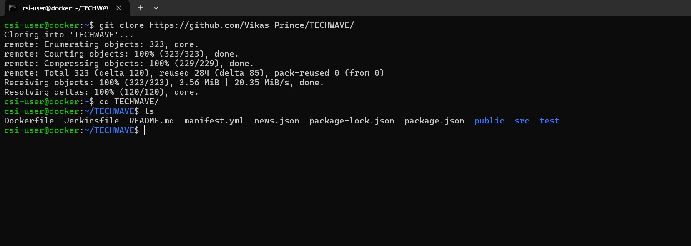
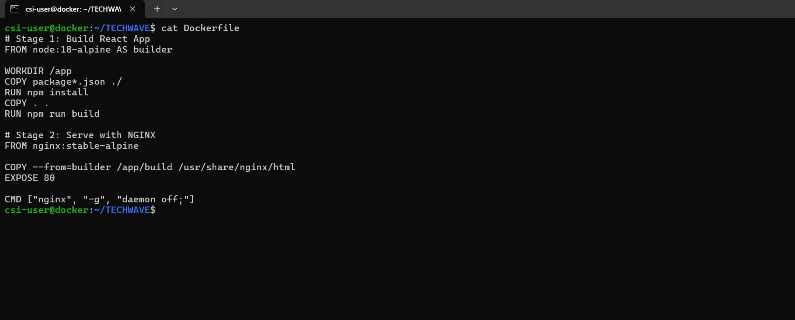
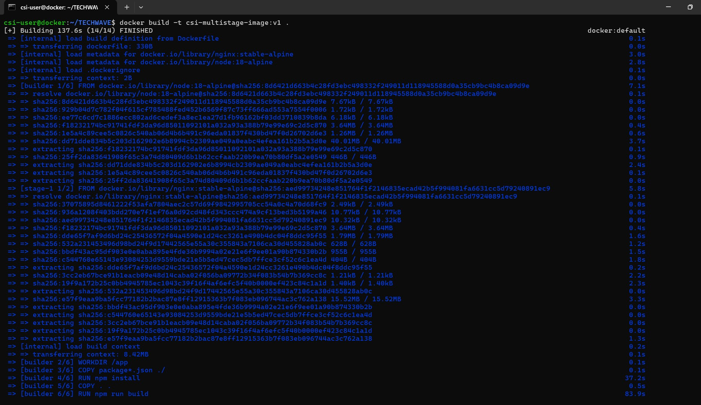
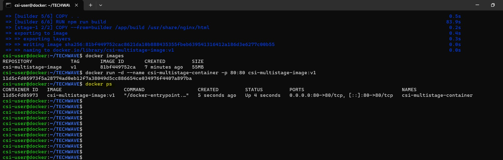
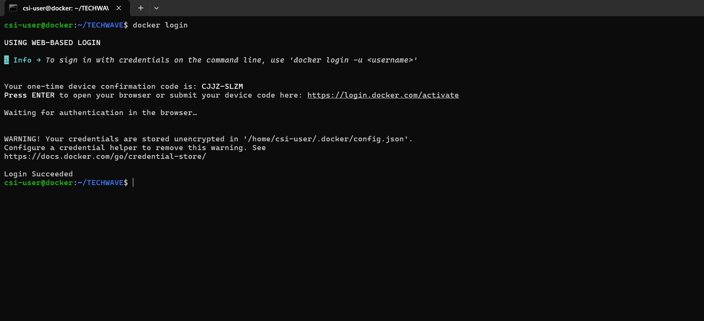
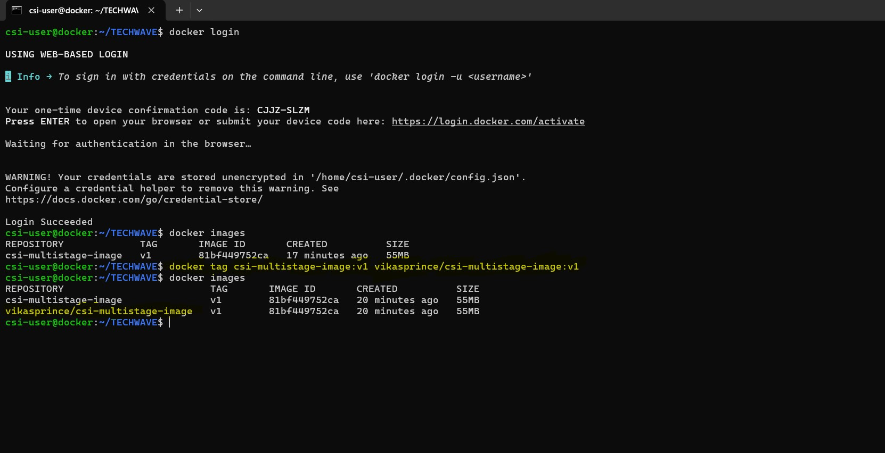
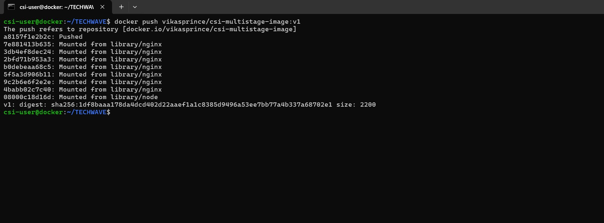
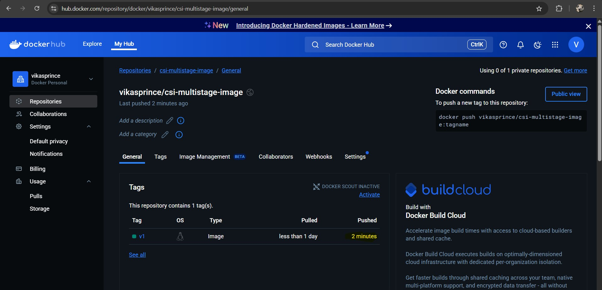
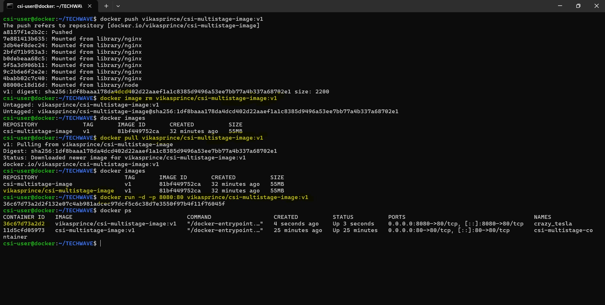

# 🐳 Week 4 – Docker Multi Stage Builds: Task 3

## 📌 DockerHub, Docker Registry & Multi-Stage Build with React App

### 🎯 Objective

In this task, I worked on containerizing a React application using `multi-stage Docker builds`, pushing the image to `DockerHub`, and serving the app with `NGINX` in a lightweight, production-ready Docker container. This exercise helped me better understand how Docker registries work and how to optimize Docker images for real-world deployments.

---

## Step-by-Step Implementation

### 🔹 Step 1: Created a React Application

I already had a React application built earlier, so instead of generating a new one using create-react-app, I simply cloned my existing project from GitHub:

```bash
https://github.com/Vikas-Prince/TECHWAVE/
cd TECHWAVE
```



> This saved time and let me work with a project I had already customized, making the Docker setup more realistic and closer to a production-ready scenario.

### 🔹 Step 2: Created a Multi-Stage Dockerfile

To build a clean and efficient production image, I used a multi-stage Docker build. Here's the Dockerfile I created in the root of the project:

```bash
# Stage 1: Build React App
FROM node:18-alpine AS builder

WORKDIR /app
COPY package*.json ./
RUN npm install
COPY . .
RUN npm run build

# Stage 2: Serve with NGINX
FROM nginx:stable-alpine

COPY --from=builder /app/build /usr/share/nginx/html
EXPOSE 80

CMD ["nginx", "-g", "daemon off;"]
```

####  Explanation:

#### **Stage 1 (`builder`)**
- Uses the lightweight **Node.js Alpine** image.
- Sets the working directory to `/app`.
- Copies the `package.json` and `package-lock.json` files to the container.
- Installs dependencies using `npm install`.
- Copies the rest of the app source code.
- Runs the React build command (`npm run build`) to generate static files in the `build/` folder.

#### **Stage 2 (Production)**
- Uses a minimal **NGINX Alpine** image.
- Copies only the compiled static files from the `build/` folder in the first stage.
- Places them in NGINX's default directory: `/usr/share/nginx/html`.
- Exposes port `80`.
- Starts the NGINX server using `CMD ["nginx", "-g", "daemon off;"]`.

A minimal, secure, and efficient production image.



### 🔹 Step 3: Built and Ran the Docker Image

I built the Docker image using the following command:

```bash
docker build -t react-multistage:v1 .
```

Thanks to the multi-stage build, the final image was around 50 MB, which is a big improvement over a standard Node-based image that often ends up being 300–600 MB. This makes it much more efficient for production use.



Then ran the container:

```bash
docker run -d --name react-multi-container -p 80:80 react-multistage:v1
```



To check if it was working, I opened `http://20.244.43.238:80/` in the browser and saw the React app served via NGINX.


The app was running successfully inside a container, served efficiently using NGINX.

### 🔹 Step 4: Pushed the Image to DockerHub

To make this image reusable across different environments, I pushed it to my DockerHub repository.

1. **Logged in to DockerHub**:

```bash
docker login
```



2. **Tagged the image**:

```bash
docker tag react-multistage:v1 vikasprince/csi-multistage-image:v1
```



3. **Pushed the image**:

```bash
docker push vikasprince/csi-multistage-image:v1
```



The image was available in my DockerHub repository.



### 🔹 Step 5: Pulled and Ran the Image from DockerHub (Validation)

To test image portability, I performed the following steps:

1. **Removed the local image**:

```bash
docker image rm vikasprince/csi-multistage-image:v1
```

2. **Pulled it back from DockerHub**:

```bash
docker pull vikasprince/csi-multistage-image:v1
```

3. **Ran the container again**:

```bash
docker run -d -p 8080:80 vikasprince/csi-multistage-image:v1
```

The app was successfully pulled and served, confirming registry integration.



---

## Conclusion

This task gave me hands-on experience with multi-stage Docker builds, serving a React app via NGINX, and working with DockerHub. Using my own project made it feel real, and pushing/pulling the image confirmed everything worked as expected. A solid step toward production-ready Docker workflows.

---
