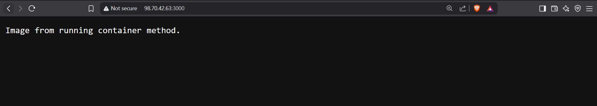

# Week 4 – Docker Basics: Task 4

## Task: Create a Docker Image Using Multiple Methods

## Objective

The goal of this task was to learn how to create Docker images using more than one approach, primarily using a `Dockerfile`, and also by committing from a running container. I wanted to understand both the declarative and manual ways of image creation, and how they fit into real-world workflows.

---

## Step 1: Create a Docker Image Using a Dockerfile

This method is the most common and automated way to build Docker images. I followed a similar pattern as the previous task, but the idea was to get more comfortable with customizing `Dockerfiles` and understanding what’s really happening at each layer.

### 🔹 Set Up Project Directory

```bash
mkdir task3-dockerfile-image
cd task3-dockerfile-image
```


This is where I placed my app files and the Dockerfile. I like keeping things organized in separate folders for each image or container.

### 🔹 Create a Basic Node.js App

I created a simple server again to keep things familiar. Here's the `index.js` file:

```bash
const http = require('http');

const server = http.createServer((req, res) => {
  res.end("Image created using Dockerfile method.");
});

server.listen(8080, () => {
  console.log("Server is running on port 8080");
});
```

The only change here is the port and response message — just to make it clear which image was built.


### 🔹 Write the Dockerfile

Created a Dockerfile for Sample Nodejs App

```Dockerfile
FROM node:18-alpine

WORKDIR /app

COPY . .

RUN npm install

EXPOSE 8080

CMD ["node", "index.js"]
```

Here’s a quick breakdown:

* `FROM node:18-alpine`: Lightweight and efficient Node.js base image.
* `WORKDIR /app`: All operations from here onward happen in `/app`.
* `COPY . .`: Copies all files into the container.
* `RUN npm install`: Installs dependencies (though none for now).
* `EXPOSE 4000`: This is just for documentation — it doesn’t actually publish the port.
* `CMD`: This tells Docker what command to run when the container starts.


### 🔹 Build and Run the Docker Image

```bash
docker build -t csi-dockerfile-method:v1 .
docker run --name csi-dockerfile-container -d -p 8080:8080 csi-dockerfile-method:v1
```


This built the image and ran it successfully. I opened my browser at `http://<vm-ip>:8080` and saw the custom message from the server a great sign that the image works exactly as expected.


---

## Step 2: Create a Docker Image from a Running Container

This method is more manual, but it's useful when we want to experiment interactively, then save work as an image.

### 🔹 Start a Base Container

```bash
docker run -it node:18-alpine sh
```

This opened a terminal inside a container running the base Node image. From here, I manually created and ran a mini Node.js app.

### 🔹 Inside the Container

I manually did the following:

```bash
mkdir /csi-app
cd /csi-app
```


Then I used `vi` to create `index.js` (or used `echo` for simpler editing):

```bash
const http = require("http");

const server = http.createServer((req, res) => {
  res.end("Image from running container method.");
});

server.listen(3000, () => { 
  console.log("Server running on port 3000"); 
});
```


Then initialized the app and installed Node.js dependencies:

```bash
npm init -y
```
And finally ran the app:

```bash
node index.js
```


Once I confirmed it worked inside the container, I exited:

```bash
ctrl p + ctrl q
```

### 🔹 Commit the Container as an Image

First, I found the container ID:

```bash
docker ps
```

Then committed it:

```bash
docker commit  --change='WORKDIR /csi-app' --change='CMD ["node", "index.js"]' 479ff06c0ed5 csi-manual-image:v1
```

- `--change='WORKDIR /csi-app':` Sets the working directory inside the new image to /csi-app, which is where I had placed my index.js file inside the container.
- `--change='CMD ["node", "index.js"]':` Sets the default command to run when a container is started from this image — in this case, it will launch the Node.js app.

This way, I make sure that the image starts correctly without having to manually change directories or specify the run command every time.


Now I had a new image built entirely from a running container, without writing a Dockerfile.

### 🔹 Run the Committed Image

```bash
docker run --name csi-manual-container -d -p 3000:3000 csi-manual-image:v1
```


I accessed it via `http://98.70.42.63:3000/` and saw the custom message — success again!



---

## Conclusion

This task gave me a solid understanding of two ways to create Docker images — using a Dockerfile and committing from a running container. The Dockerfile method felt clean and ideal for repeatable setups, while the manual method was useful for quick, interactive builds. Both approaches were straightforward once I understood the flow. It was great to see my app running successfully from images built in completely different ways.

---