# 🐳 Week 4 – Docker: Task 5

## 📌 Task: Push and Pull Image to Docker Hub and ACR

## 🎯 Objective

In this task, I wanted to understand how to **push Docker images to external registries** like Docker Hub and Azure Container Registry (ACR), and how to later pull and run them on any machine just like companies do to distribute application containers.

---

## Step 1: Built a Custom Docker Image

I started by using my own React project from GitHub. I cloned the repository like this:

```bash
git clone https://github.com/Vikas-Prince/TECHWAVE
```

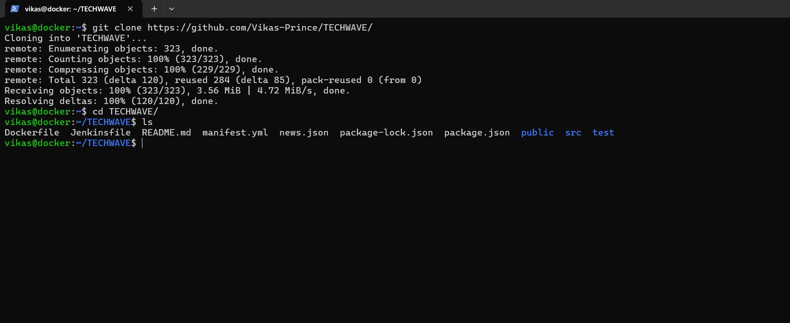

Once inside the project folder I already have Dockerfile So, I built a Docker image locally using:

```bash
docker build -t my-node-app:v1 .
```

This created a custom image with the tag `react-app:v1`. The build process completed successfully and I could see my image listed in docker images.

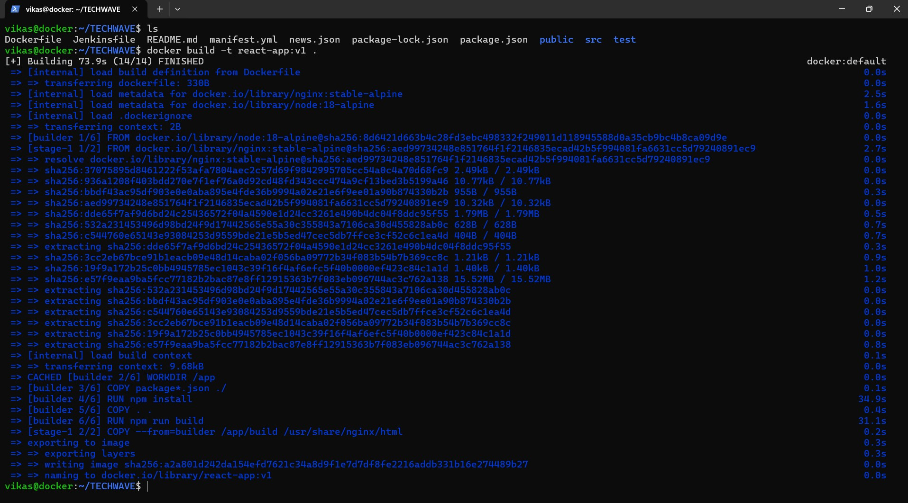

## Step 2: Pushed Image to Docker Hub

### 🔹 Logged into Docker Hub:

Before pushing, I logged into my Docker Hub account using the CLI:

```bash
docker login -u vikasprince
```

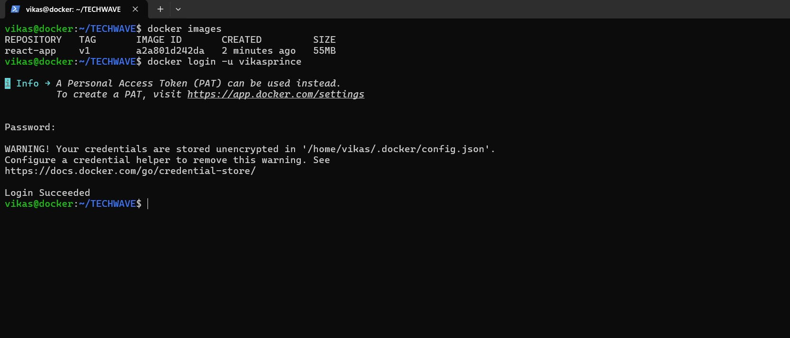

### 🔹 Tagged the image for Docker Hub:

Next, I tagged the image with my Docker Hub namespace so Docker knows where to push it:

```bash
docker tag react-app:v1 vikasprince/react-app:v1
```

### 🔹 Pushed to Docker Hub

Finally, I pushed the image:

```bash
docker push vikasprince/react-app:v1
```

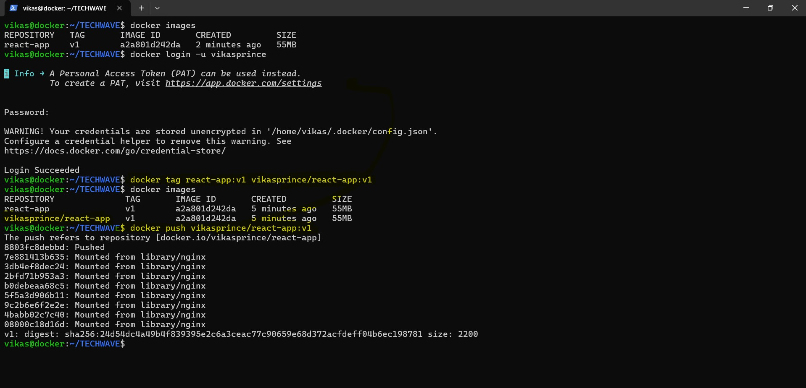

I went to [docker hub](https://hub.docker.com/) to double-check and yes, the image was listed under my repository.

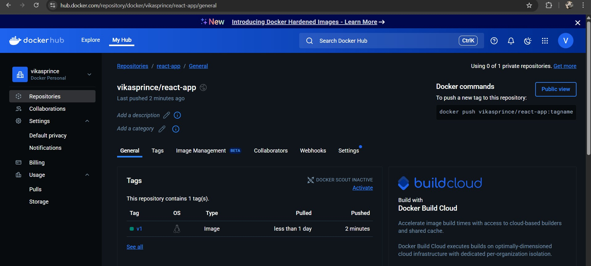

---

## Step 3: Pushed Image to Azure Container Registry (ACR)

To simulate a real-world enterprise setup, I decided to push the same image to a **private registry**  in this case, Azure Container Registry (ACR).

### 🔹 Created the ACR from Azure Portal

1. Logged into the [Azure Portal](https://portal.azure.com).
2. Searched for **"Container Registries"** and clicked **+ Create**.
3. Filled in the following details:
   - **Resource Group**: `my-rg`
   - **Registry Name**: `mycsiacr` (this has to be globally unique)
   - **Location**: `central-india`
   - **SKU**: Selected `premium` (for private access)
   - Since this was a private registry and I wanted to make access more secure, I also set up Private Endpoints. This allowed the ACR to be accessed only through my Azure Virtual Network, instead of exposing it over the public internet.

4. Hit **Review + Create**, then clicked **Create** to deploy.

The registry was ready in less than a minute.

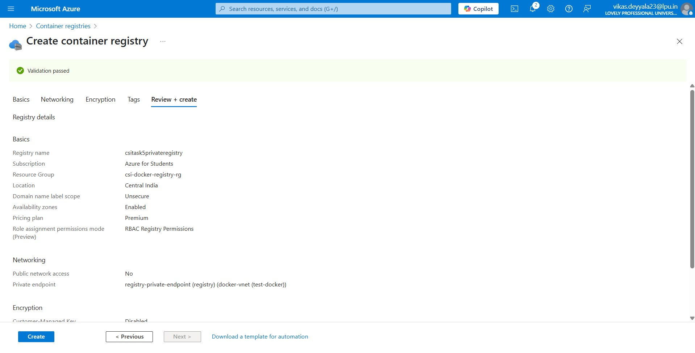

I successfully deployed a private `acr` registry.

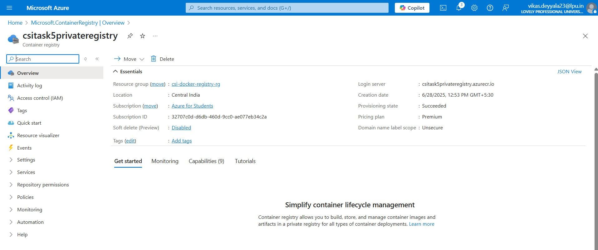

### 🔹 Enabled Admin Access (Temporarily)

To push images from my local machine, I temporarily enabled the **Admin user** setting:

1. Opened the `csitask5privateregistry` registry in the Portal.
2. Went to **Settings > Access Keys**.
3. Turned **Admin user** to **Enabled**.
4. Copied the **Login Server**, **Username**, and **Password** — needed these for the Docker login.

> Note: This is okay for testing, but in production, we should use service principals or managed identities instead of admin credentials.

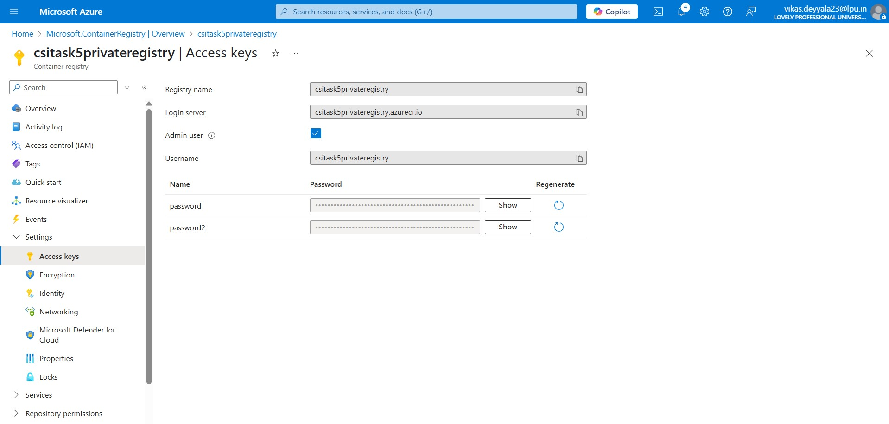


### 🔹 Logged in from Docker CLI

Using the login server, I authenticated from the terminal:

```bash
docker login csitask5privateregistry.azurecr.io
```

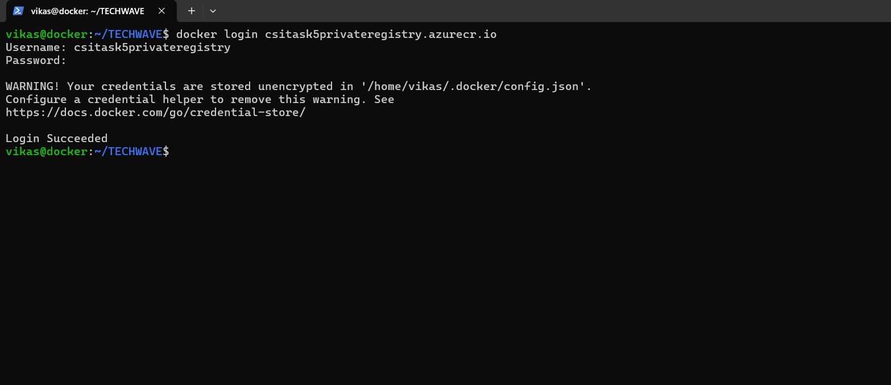

### 🔹 Tagged image for ACR:

I re-tagged the image for ACR:

```bash
docker tag react-app:v1 csitask5privateregistry.azurecr.io/react-app:v1
```

### 🔹 Pushed it to ACR:

And then I pushed to private registry acr:

```bash
docker push csitask5privateregistry.azurecr.io/react-app:v1
```

It showed that, confirming the private push was successful

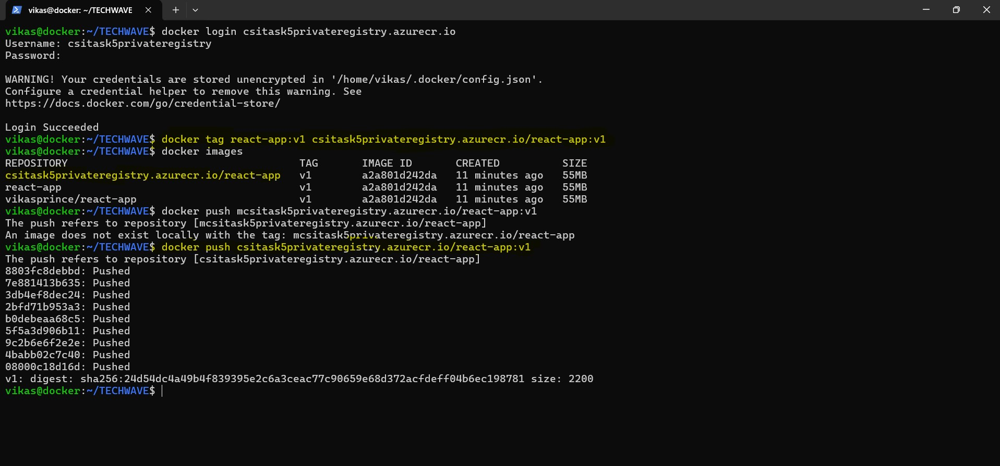

---

## Step 4: Pull and Run the Images

Instead of just pulling them on the same system, I intentionally removed all locally available images that I had previously built or pulled:

```bash
docker rmi vikasprince/react-app:v1
docker rmi csitask5privateregistry.azurecr.io/react-app:v1
```

This ensured that Docker wouldn’t use any cached image and it would have to download the image entirely from the registry.

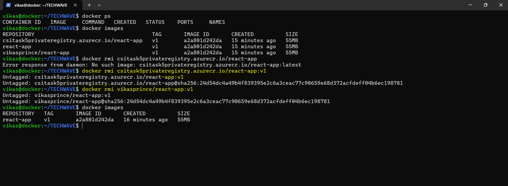

### 🔹 Pulling from Docker Hub

Once the images were removed, I pulled the image directly from Docker Hub:

```bash
docker pull vikasprince/react-app:v1
```

After the image was downloaded, I ran it as a container:

```bash
docker run --name dockerhub-container -d -p 3000:3000 vikasprince/react-app:v1
```

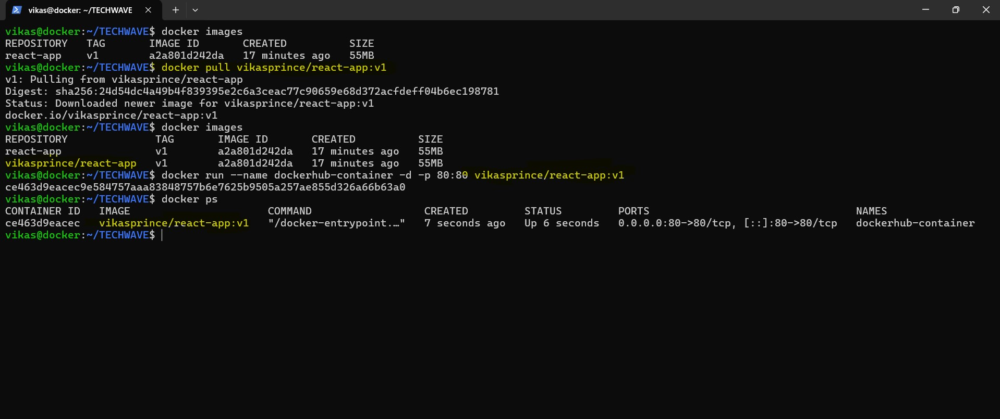

Everything started smoothly, the container was up and running, and the app was accessible on port 3000.

### 🔹 Pulling from Azure Container Registry (ACR)

Next, I did the same with the image stored in my private Azure Container Registry:

```bash
docker pull csitask5privateregistry.azurecr.io/react-app:v1
```

Then launched it using:

```bash
docker run --name ecr-container -d -p 8080:80 csitask5privateregistry.azurecr.io/react-app:v1
```

Just like with the Docker Hub version, this container ran without any issues. The app was working as expected on port 8080.

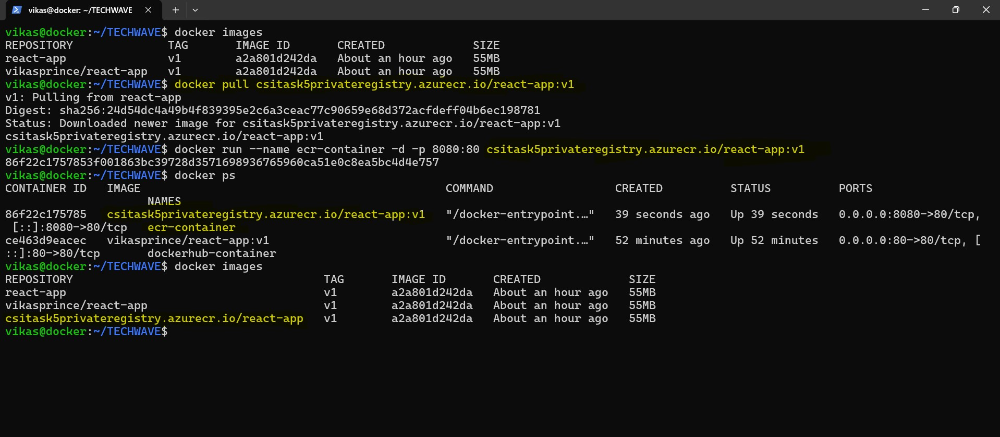

This confirmed my images could be distributed and run anywhere, just like production CI/CD pipelines do.

---

## Conclusion

This task gave me a complete hands-on understanding of how Docker images are built, tagged, and pushed to both public `(Docker Hub)` and private `(Azure Container Registry)` registries. I also verified that these images can be pulled and run from scratch on any system, proving they're fully portable and production-ready. 

---