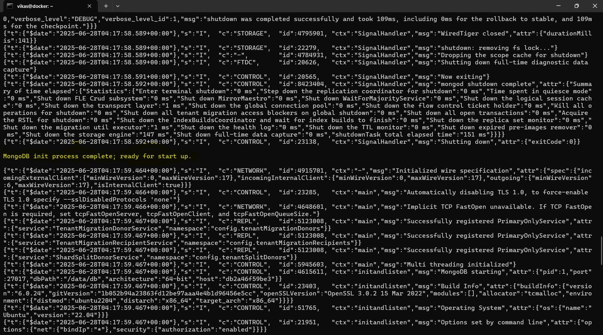

# 🐳 Week 4 – Docker: Task 7

## 📌 Task: Create a Docker Volume and Mount it to a Container

## 🎯 Objective

The main goal of this task was to understand how **Docker volumes** work by creating a named volume, mounting it to a container, and observing how data persists even after containers are removed. I wanted to approach this with a **real-world scenario** similar to what happens in actual production setups.

---

## 🚀 Scenario: Simulating a Persistent MongoDB Database

Instead of just creating a volume and attaching it to a generic container, I decided to do this with a **MongoDB database container**, which is extremely common in real-world DevOps work. This way, the volume stores database data, and even if the container crashes or is deleted, the data stays intact.

---

## 🧩 Step 1: Create a Docker Volume

Volumes in Docker are managed by Docker itself, decoupled from the container lifecycle. This makes them the standard choice for persistent data.

```bash
docker volume create csi_mongo_data
```

✅ After running this, I checked with:

```bash
docker volume ls
```

And saw `csi_mongo_data` listed. This volume will live outside any container, safe from deletions.


## 🛠 Step 2: Run a MongoDB Container with Volume Mounted

Now, I ran a MongoDB container and mounted the `csi_mongo_data` volume to `/data/db`, which is the directory where MongoDB stores its databases.

```bash
docker run -d \
  --name csimongo \
  -e MONGO_INITDB_ROOT_USERNAME=admin \
  -e MONGO_INITDB_ROOT_PASSWORD=csi@123 \
  -v csi_mongo_data:/data/db \
  mongo:6
```

- `-v csi_mongo_data:/data/db` mounts the Docker-managed volume inside the container at MongoDB's data directory.
- Even if this container is deleted later, the database files will remain inside `csi_mongo_data`.

I verified mounted volume by inspect container:

```bash
docker inspect csimongo
```


I verified it by checking container logs:

```bash
docker logs csimongo
```

Saw logs showing database initialization and readiness.



---

## 🔍 Step 3: Insert Data into the Database

Once I had the MongoDB container up and running, I connected to it using the Mongo shell:

```bash
docker exec -it csimongo mongosh -u admin -p csi@123
```
This gave me a shell inside the container, authenticated with the admin credentials I had set earlier.


### 🔸 Creating the Database

Inside the Mongo shell, I switched to a new database named `csidb`. MongoDB will automatically create it when we insert data into it:

```bash
use csidb;
```

I checked the employees collection (just to confirm it doesn’t exist yet):

```bash
db.employees.find();
```
At this point, the collection was empty as expected.


### 🔸 Inserting Sample Data

Next, I inserted multiple employee records into the `employees` collection using `insertMany()`:

```bash
db.employees.insertMany([
  {
    name: "Vikas",
    csiintern: true,
    domain: "DevOps",
    location: "Kakinada, Visakhapatnam"
  },
  {
    name: "Lala's Hymavati",
    csiintern: true,
    domain: "Cloud Infrastructure",
    location: "Visakhapatnam"
  },
   {
    name: "Prasanthy",
    csiintern: true,
    domain: "DevOps",
    location: "Visakhapatnam"
  },
  {
    name: "Greeshma",
    csiintern: true,
    domain: "DevOps",
    location: "Kakinada"
  },
  {
    name: "Venkat",
    csiintern: true,
    domain: "Python Backend",
    location: "Tirupati"
  },
  {
    name: "Suresh",
    csiintern: true,
    domain: "Frontend - React",
    location: "Kurnool"
  }
]);
```


Each document represents a CSI intern, along with their domain and location. This is realistic and useful if you're simulating a real-time database app or internal dashboard.


### 🔸 Verifying the Data

To confirm the documents were stored correctly, I ran the following:

```bash
db.employees.find({}, { name: 1, _id: 0 }).pretty() 
```
This query fetches only the name field of all documents, omitting the _id for readability.


The names were all there and data successfully inserted and retrievable

---

## 🔄 Step 4: Simulate Container Crash or Deletion

To test if the data would persist even if the container was removed, I first stopped and removed the container:

```bash
docker stop csimongo
docker rm csimongo
```

I verified that no MongoDB containers were running:

```bash
docker ps
```

Nothing was there. But the volume still exists:

```bash
docker volume ls
```


This confirmed that the volume is not tied to the container's lifecycle. The data inside it was safe and untouched.

---

## 🚀 Step 5: Start a New MongoDB Container with the Same Volume

Now to test the real value of Docker volumes — I started a brand new MongoDB container, but mounted the same volume `(csi_mongo_data)`:

```bash
docker run -d \
  --name csimongo2 \
  -e MONGO_INITDB_ROOT_USERNAME=admin \
  -e MONGO_INITDB_ROOT_PASSWORD=csi@123 \
  -v csi_mongo_data:/data/db \
  mongo:6
```

This effectively created a fresh container, but it reused the existing database files from the volume.


### 🔸 Logging into the New Container

I connected to this new container:

```bash
docker exec -it csimongo2 mongosh -u admin -p csi@123
```


### 🔸 Verifying Data is Still There

Once inside, I switched back to the same database and ran a query to check the data:

```bash
use csidb;
db.employees.find();
```


Hurray!!! The data was still there! This demonstrates how Docker volumes provide persistent storage completely independent of container lifecycles, exactly how production database setups are designed.

---

## 🧼 Step 6: Cleaning Up

To clean everything up after my tests, I removed the containers and then explicitly removed the volume:

```bash
docker stop mymongo2
docker rm mymongo2
docker volume rm csi_mongo_data
```

Checked to ensure everything was clean:

```bash
docker volume ls
```

---

## What About Bind Mounts?

I also came across another way to persist data using something called a **bind mount**, where you link a folder from your own machine directly into the container. It works, and it's simple — especially during local development.

But for this task, I didn’t go with that method because bind mounts aren’t ideal in real-world or production environments. They depend on your host system’s folder structure, which makes them harder to manage, less portable, and even a bit risky in terms of security.

That’s why I chose to use a **Docker volume** instead — it’s cleaner, safer, and much more suitable for things like databases that need reliable, persistent storage.

---

##  Conclusion

This task was a great hands-on way to understand how Docker volumes work. Setting up MongoDB with a volume showed me how data can stay safe even if a container is removed or crashes. It felt like a real-world setup, and seeing the data still there after starting a new container really proved the value of using volumes. Overall, this helped me get more comfortable with Docker and how persistent storage works in actual production-like environments.

---