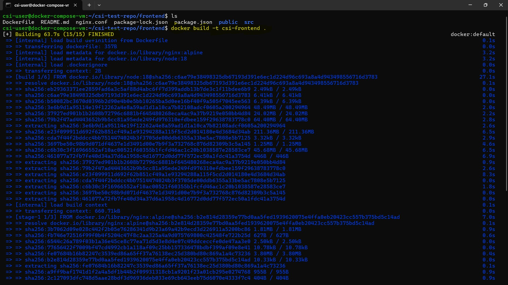
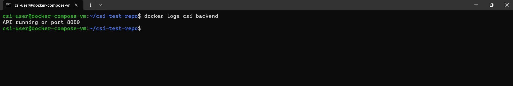
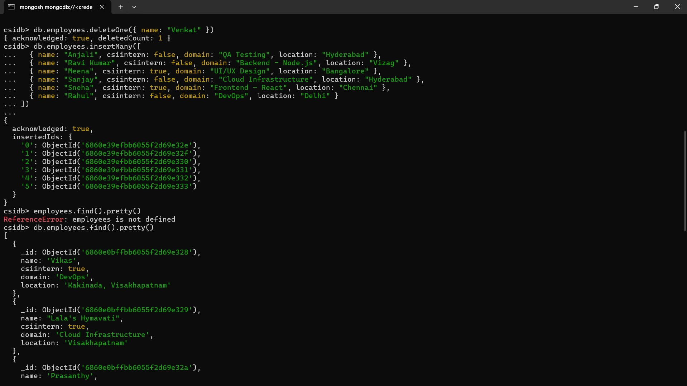
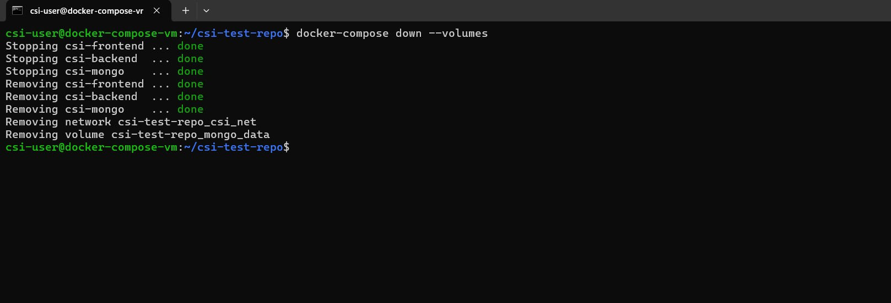

# 🐳 Week 4 – Docker Compose: Task 8

## 📌 Task: Deploy a Three-Tier Architecture using Docker Compose with Security Best Practices

## 🎯 Objective

In this task, I created a **three-tier architecture** using **Docker Compose** for deploying a **MERN stack application**. The goal was to deploy MongoDB, Node.js backend API, and React frontend in separate containers while ensuring **network isolation** and **persistent storage** using Docker best practices. The architecture includes:

- **MongoDB** as the database, running in a container with persistent storage.
- **Node.js backend API** developed with Express, which connects to MongoDB.
- **Frontend UI** built with React that interacts with the backend API. and displays it in a table.
- **Dockerfiles** for both backend and frontend.
- The backend API image was pushed to **Azure Container Registry (ACR)**, while the frontend React app was pushed to **Docker Hub**.
- All services are managed via **Docker Compose** for easy orchestration.

---

I covered all major Docker concepts and best practices, including:

  - **Dockerfile Creation** – Wrote Dockerfiles for both backend and frontend.
  - **Multi-Stage Builds** – Used multi-stage Docker builds for a lightweight and optimized frontend image.
  - **Image Optimization** – Ensured production-ready images with smaller size and efficient structure.
  - **Secure Networking** – Used custom user-defined networks (csi_net) for internal communication and network isolation.
  - **Service Orchestration** – Managed multiple services (MongoDB, backend, frontend) efficiently using Docker Compose.
  - **Environment Variable Management** – Passed sensitive data securely through environment variables.
  - **Persistent Storage** – Mounted Docker volumes to retain MongoDB data across container restarts.
  - **Image Publishing** – Pushed backend image to Azure Container Registry and frontend image to Docker Hub.

--- 

## Step 1. Developed Backend API with Express and MongoDB

I started by creating a simple Node.js backend using Express. The API connects to MongoDB to fetch employee data and serves it to the frontend.

The basic structure includes:

- Express app setup
- MongoDB connection using mongodb
- API endpoint `/` to return employee records


### 🔹 Dockerizing the Backend API

I dockerize the backend API (Node.js). I already had a Node.js application ready, and now I needed to create a Dockerfile to build the container image.

### 🔹 Backend Dockerfile

In the backend directory, I created a Dockerfile that defines the container image for my Node.js app:

```bash
FROM node:16-alpine
WORKDIR /app

COPY package*.json ./
RUN npm install
COPY . .

EXPOSE 8080

CMD ["node", "app.js"]
```


### 🔹 Build Backend Docker Image

I built the Docker image locally with:

```bash
docker build -t csi-backend:v1 .
```


### 🔹 Created Azure Container Registry and Login

First, I created an Azure Container Registry named `csiecr` in my Azure subscription to host the Docker images.


Next, I logged in to my Azure account using:

```bash
az login
```


### 🔹 Tag and Push the Backend Image to ACR

After successful login, I logged into the Azure Container Registry:

```bash
az acr login --name csiecr
```

I tagged the locally built backend image with the ACR registry login server:

```bash
docker tag csi-backend:v1 csiecr.azurecr.io/csi-backend:v1
```

I pushed the tagged image to the Azure Container Registry:

```bash
docker push csiecr.azurecr.io/csi-backend:v1
```


Finally I verified pushed Image in Container Registry Repositories


---

## Step 2: Developed the React app for Frontend

I developed the React frontend application to display CSI intern data fetched from the backend API in a clean tabular format.

The React app was built to call the backend API and show employee details dynamically.


### 🔹 Created Multi-Stage Dockerfile with Nginx Reverse Proxy

To optimize the image size and serve the React app efficiently, I created a multi-stage Dockerfile:

- Stage 1 builds the React app using the official Node.js image.
- Stage 2 serves the static build files using Nginx.
- Nginx is configured to act as a reverse proxy to forward API requests to the backend.
- The final image is smaller and more efficient for production use.


### 🔹 Build and Tag the Frontend Image

I built the Docker image locally with the following command:



After building, I tagged the image for pushing to Docker Hub:


### 🔹 Pushed the Frontend Image to Docker Hub

I logged into Docker Hub and pushed the tagged image:

```bash
docker login
docker push mydockerhub/csi-frontend:v1
```


### 🔹 Verified in DockerHub

Finally, I verified the uploaded image appeared in my Docker Hub repository.


---

## Step 3: Setting Up the Docker Compose File

Now that both the backend and frontend images were ready, I created a docker-compose.yml file to orchestrate the entire stack. `[docker-compose-file](./docker-compose.yml)`


### 🔹 Key Details

#### React Frontend Service:

- The React app is built and served using Nginx inside the container, serving static files on port 80.  
- It fetches employee data from the Node.js backend API at `http://backend:8080/` via the internal Docker network (`csi_net`).  
- The frontend depends on the backend to be running to retrieve and display data in a clean tabular format.

#### Backend Service:

- The **Node.js backend API** connects to **MongoDB**, and database credentials are passed via environment variables.
- It serves data from the **MongoDB database** via an API endpoint (e.g., `GET /`).
- The **backend service** depends on **MongoDB** being up and running first to ensure a successful connection to the database when it starts.

#### MongoDB Service:

- **MongoDB** runs as a service with persistent storage using the `mongo_data` volume.
- The database is securely connected to the **backend** using a custom network (**csi_net**), isolated from the external world.
- **MongoDB** uses the `MONGO_INITDB_ROOT_USERNAME` and `MONGO_INITDB_ROOT_PASSWORD` environment variables for authentication.

#### Networks:

- A **custom network** (`csi_net`) is created to isolate all services, ensuring secure communication between the **React frontend**, **backend**, and **MongoDB**.
- This custom network ensures that these services can communicate with each other internally, while not being exposed to the external network unless explicitly required.

#### Volumes:

- The **mongo_data** volume is created to persist **MongoDB** data. This ensures that the data survives even if the MongoDB container is restarted or destroyed.
- This persistent volume ensures the integrity and availability of the database even across container lifecycles.


### 🔹 Security Best Practices

To ensure the security of the application, I implemented the following best practices during the setup and deployment process:

#### Network Isolation

I created a **custom network** (`csi_prod_net`) for all the services to communicate over. This ensures that only the necessary services can interact with each other and that they are not exposed to the external network unless explicitly required. By isolating the services in this manner, I reduced the risk of accidental exposure or unauthorized access to internal services.

#### Environment Variables

To keep sensitive information secure, I passed database credentials and other sensitive data as **environment variables**. This approach avoids hardcoding any sensitive information directly in the codebase, making the project more secure and easier to maintain. Environment variables also allow for easier configuration changes without modifying the code.

#### No default bridge network: 

Created a custom Docker network to control communication between containers and prevent accidental exposure.

#### Persistent Volume for MongoDB

For **MongoDB**, I used Docker volumes to ensure that the database data is **persisted** across container restarts. The `mongo_data` volume ensures that even if the MongoDB container is stopped or removed, the data will not be lost. This is crucial for maintaining the integrity and availability of the database across container lifecycles.

---

## Step 4. Deployed MERN Stack using Docker-Compose

After configuring all the services and ensuring everything is properly set up, deploying the entire stack is straightforward using **Docker Compose**. Here's how I deployed the application:

### 🔹 Deployed with Docker Compose

I used the following command to build and start all the services in the background:

```bash
docker-compose up -d
```

This command Starts all services defined in the docker-compose.yml file in detached mode (-d), so it runs in the background.


### 🔹 Confirming All Containers Are Running

 I verified that all three essential containers MongoDB, Backend API, and Frontend were up and running smoothly by executing:

 ```bash
 docker ps
 ```

 The output confirmed that the containers named `csi-mongo`, `csi-backend`, and `csi-frontend` were running without any issues. Each container was correctly assigned and exposed on the intended ports, which reassured me that the initial deployment was successful.

 


### 🔹 Verifying the Custom Docker Network

Next, I ensured the network isolation and inter-container communication were set up properly. I listed all Docker networks:

```bash
docker network ls
```

Here I've seen the custom network csi_net and inspected its details with:

```bash
docker network inspect csi_net
```

This inspection showed that all three containers were connected to the csi_net bridge network, ensuring secure and isolated communication between services.


### 🔹 Checking Persistent Volume for MongoDB

To confirm data persistence, I listed the Docker volumes:

```bash
docker volume ls
```

I found the mongo_data volume created as expected. Inspecting the volume provided details confirming it was properly configured and mounted to the MongoDB container’s data directory, ensuring data durability beyond container lifecycle events.


### 🔹 Ensuring MongoDB Started Successfully

I reviewed the MongoDB container logs:

```bash
docker logs csi-mongo
```
The logs showed a clean startup without errors, confirming that the database service was operational and ready to accept connections.


### 🔹 Connecting to MongoDB

To interact with the database, I accessed the MongoDB shell inside the container using the configured credentials:

```bash
docker exec -it csi-mongo mongosh -u admin -p 'csi@123'
```


### 🔹 Validating Backend API Functionality

After confirming MongoDB, I checked the backend container logs:

```bash
docker logs csi-backend
```
The logs indicated the backend API was running without errors successfully running on port 8080.



#### **Internal-Only API Access**
It's important to note that the backend container is not exposed to the host machine or the internet. It does not publish any ports externally, which is intentional for security reasons.

Instead, it communicates only within the internal Docker network `(csi_net)`, where it can be accessed by other services like the frontend container. 

### 🔹 Verifying Frontend Container

I opened the frontend UI in my browser with my machine IP `http://4.240.88.24:80/`


At this initial stage, since no data existed in the MongoDB database, the React app loaded successfully but displayed an empty table with no employee records. This confirmed the frontend was correctly connected to the backend API but was reflecting the current empty state of the database.

### 🔹 Adding Data to MongoDB

I connected to the MongoDB container and added employee records as follows:

```bash
docker exec -it csi-mongo mongosh -u admin -p 'csi@123'
```

Inside the MongoDB shell, I created and switched to the csidb database, then inserted multiple employee records:

```bash
db.employees.insertMany([
  { name: "Vikas", csiintern: true, domain: "DevOps", location: "Kakinada, Visakhapatnam" },
  { name: "Lala's Hymavati", csiintern: true, domain: "Cloud Infrastructure", location: "Visakhapatnam" },
  { name: "Prasanthy", csiintern: true, domain: "DevOps", location: "Visakhapatnam" },
  { name: "Greeshma", csiintern: true, domain: "DevOps", location: "Kakinada" },
  { name: "Venkat", csiintern: true, domain: "Python Backend", location: "Tirupati" },
  { name: "Suresh", csiintern: true, domain: "Frontend - React", location: "Kurnool" }
]);
```

To ensure the records were successfully added.


### 🔹 Frontend Displays the Newly Added Data

With data now present in MongoDB, I refreshed the frontend browser `http://4.240.88.24/`


The React frontend immediately displayed a neatly formatted table containing the employee records fetched via the backend API.


### 🔹 Updating Employee Records in MongoDB

After initially inserting the first set of employee records, I decided to update the dataset by adding new employees and removing that ensure everything works smoothly.

```bash
db.employees.deleteOne({ name: "Venkat" })
```

This command removed the employee named Venkat from the collection.

Next, I added new employee records to reflect the latest team structure and roles:

```bash
db.employees.insertMany([
  { name: "Anjali", csiintern: false, domain: "QA Testing", location: "Hyderabad" },
  { name: "Ravi Kumar", csiintern: false, domain: "Backend - Node.js", location: "Vizag" },
  { name: "Meena", csiintern: true, domain: "UI/UX Design", location: "Bangalore" },
  { name: "Sanjay", csiintern: false, domain: "Cloud Infrastructure", location: "Hyderabad" },
  { name: "Sneha", csiintern: true, domain: "Frontend - React", location: "Chennai" },
  { name: "Rahul", csiintern: false, domain: "DevOps", location: "Delhi" }
])
```



### 🔹 Verifying Frontend UI After Data Update

With the MongoDB records updated, I returned to the browser and refreshed the frontend UI at `http://4.240.88.24:80/`


The React application reloaded successfully and displayed the newly added employee records in a clean tabular layout. The previously removed entry for Venkat no longer appeared, confirming that the frontend was correctly reflecting the updated database state via the backend API.


**This confirmed the entire data flow—from database to backend to frontend—was functioning perfectly and data changes in MongoDB were reflected in real-time on the UI.**

---

## Step 5: Cleanup Docker Environment

After finishing the deployment and testing, I cleaned up my Docker environment to free up system resources and remove the containers, networks, and volumes created during this task.

### 🔹 Stopped and Removed All Containers, Networks, and Volumes
I ran the following command to stop all the running services and remove the associated containers, the custom network, and the persistent MongoDB volume:

```bash
docker-compose down --volumes
```

This ensured that:
 - All the containers (csi-mongo, csi-backend, and csi-frontend) were stopped and removed.
 - The custom network csi_net created for service isolation was deleted.
 - The persistent volume mongo_data used by MongoDB was removed, cleaning up the stored database data.



---

## Conclusion

This project successfully demonstrated deploying a secure, scalable MERN stack using Docker Compose with best practices like network isolation and persistent storage. The seamless integration between MongoDB, backend API, and React frontend ensured smooth data flow and easy management. Cleaning up the environment afterward kept the system ready for future use. Overall, this setup provides a strong foundation for containerized full-stack applications.

---