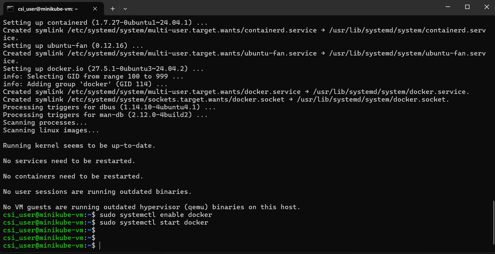
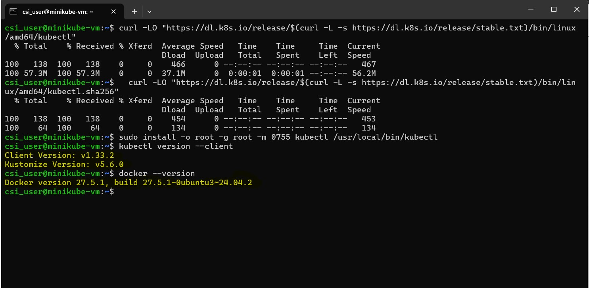
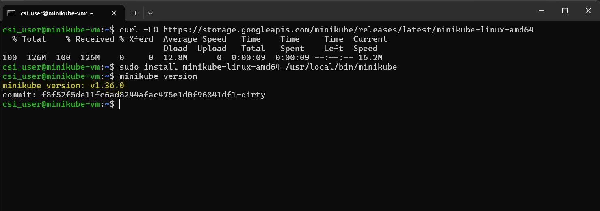
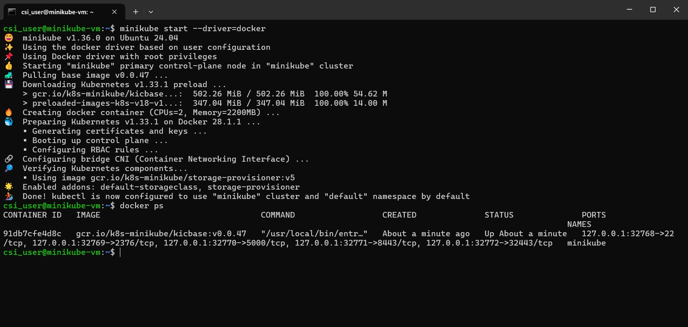
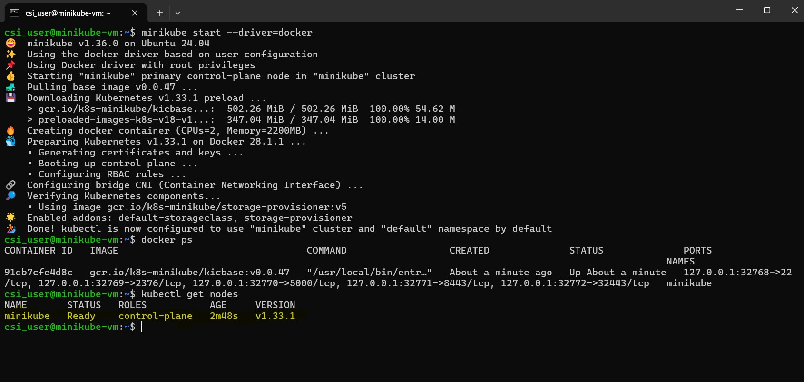
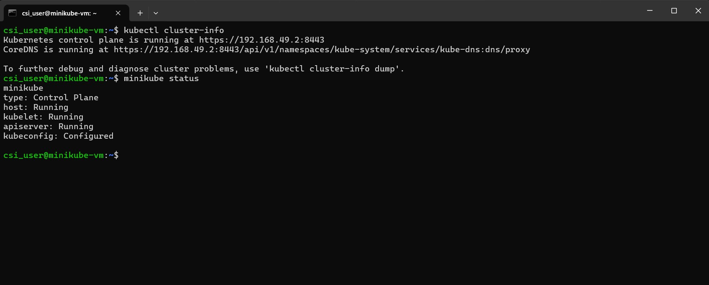
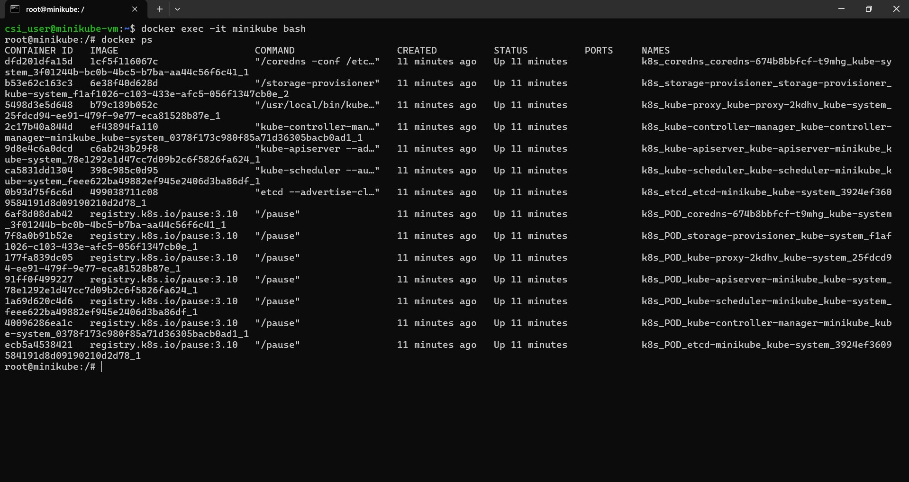
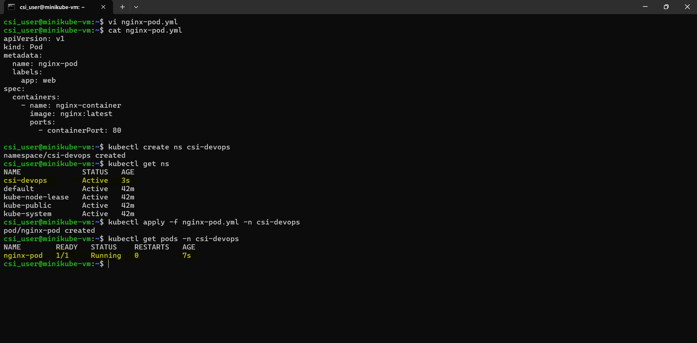

# ☸️ Week 5 – Kubernetes: Task 1

## 📌 Task: Create a Kubernetes Cluster using Minikube

## 🎯 Objective

The goal was to set up a working Kubernetes environment locally using **Minikube**. Instead of deploying on any  cloud solution, I chose Minikube as it allows me to simulate a full Kubernetes cluster on a single node. This gives me a good understanding of how cluster components behave and how to interact with Kubernetes using `kubectl` in a local, controlled environment.

---

## 📦 Prerequisites & System Requirements

Before jumping in, I made sure that my system met the minimum requirements:

* ✅ Minimum 4 GB RAM
* ✅ At least 2 CPUs

> Note: Minikube supports multiple drivers (VirtualBox, Docker, KVM, etc.). For simplicity and ease, I decided to use **Docker** as the VM driver since it integrates smoothly and doesn’t require any additional hypervisors.

---

## Step-by-Step Installation & Setup

### 🔹 Step 1: Install Docker (Container Runtime)

Since Kubernetes requires a container runtime to run containers, I installed Docker first:

```bash
sudo apt update
sudo apt install docker.io -y
sudo systemctl enable docker
sudo systemctl start docker
```



To confirm Docker is working:

```bash
docker --version
```

> Docker acts as the backend that Minikube will use to launch containers and pods. Without it, Minikube can't start with the Docker driver.

---

### 🔹 Step 2: Install `kubectl`

`kubectl` is the command-line utility that lets us interact with the Kubernetes API server.

```bash
sudo apt install -y apt-transport-https
curl -s https://packages.cloud.google.com/apt/doc/apt-key.gpg | sudo apt-key add -

echo "deb https://apt.kubernetes.io/ kubernetes-xenial main" | \
  sudo tee /etc/apt/sources.list.d/kubernetes.list

sudo apt update
sudo apt install -y kubectl
```

To test:

```bash
kubectl version --client
```



> This confirms we can send commands to the cluster once it’s up.

---

### 🔹 Step 3: Install Minikube

To install Minikube, I downloaded the binary and installed it globally:

```bash
curl -LO https://storage.googleapis.com/minikube/releases/latest/minikube-linux-amd64
sudo install minikube-linux-amd64 /usr/local/bin/minikube
```

Verify installation:

```bash
minikube version
```



> At this point, I had everything ready to initialize the cluster.

---

### 🔹 Step 4: Start the Kubernetes Cluster

Now came the exciting part — launching the local cluster with Docker as the driver:

```bash
minikube start --driver=docker
```

This took a few minutes as it downloaded the necessary Kubernetes binaries and images, and initialized the control plane.



---

### 🔹 Step 5: Verify the Cluster is Running

To make sure everything was running properly, I ran:

```bash
kubectl get nodes
```

And saw the node in a Ready state:

```bash
NAME       STATUS   ROLES           AGE   VERSION
minikube   Ready    control-plane   2m    v1.33.1
```



> Seeing the node in `Ready` state confirmed that the cluster was operational.

I also double-checked things with:

```bash
kubectl cluster-info
minikube status
```



And even peeked inside with Docker:

```bash
docker exec -it minikube bash
docker ps
```



All good — the cluster was up and running!

### Step 6: Deploy a sample nginx in pod using manifest file

To test out pod creation, I created a manifest file for a basic Nginx pod:

```bash
apiVersion: v1
kind: Pod
metadata:
  name: nginx-pod
  labels:
    app: web
spec:
  containers:
    - name: nginx-container
      image: nginx:latest
      ports:
        - containerPort: 80
```

Before applying the pod configuration, I created a separate namespace called `csi-devops` to keep things organized and scoped properly:

```bash
kubectl create ns csi-devops
```


Namespaces are super useful when we want to logically separate different environments or teams within the same cluster.

Then I applied the pod into the csi-devops namespace:

```bash
kubectl apply -f nginx-pod.yml -n csi-devops
```

To verify that the pod was created and running:

```bash
kubectl get pods -n csi-devops
```



With the pod up and running inside its own namespace, I was able to confirm that everything was working as expected.


---

### 🔹 Step 7: Stop or Delete the Cluster (Optional Cleanup)

To stop the running cluster:

```bash
minikube stop
```

To delete it entirely:

```bash
minikube delete
```

> Useful to avoid resource consumption when you’re not actively using the cluster.

---

## Conclusion

Setting up a local Kubernetes cluster with Minikube was a great way to get hands-on experience. It helped me understand how Kubernetes components work together and gave me confidence using tools like kubectl and writing manifest files. Having everything run locally made it easy to experiment and learn in a controlled environment.

---