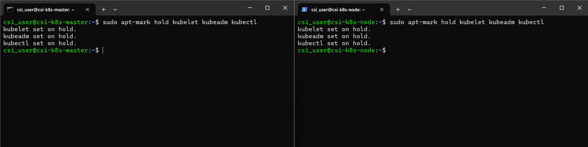

# Week 3 – Kubernetes: Task 2

## 📌 Task: Create a Kubernetes Cluster Using kubeadm

###  Objective

The goal of this task was to set up a basic Kubernetes cluster from scratch on Linux virtual machines using `kubeadm`. This exercise helped me understand the Kubernetes cluster initialization process, node joining, and cluster management — a crucial skill for DevOps and Cloud-native projects.

---

### Step-by-Step Implementation

#### Prerequisites

* At least 2 Linux machines (VMs ) — one master node and one worker node (Ubuntu 22.04 LTS)
  - System Requirements: Minimum 2 vCPU, 2GB RAM per VM
* Root or sudo access on both nodes
* Machines connected on the same network
* Internet access for downloading packages
* **Swap disabled** (required by Kubernetes)

---

### Step 0: Created Two Virtual MAchines

Before started the Kubernetes setup, I created two Ubuntu virtual machines, These VMs serve as the master and worker nodes for the cluster.


---

### Step 1: Set Hostnames and Prepare Both Nodes

Setting proper hostnames ensures clarity when managing or troubleshooting multiple machines.

```bash
# On the master node:
sudo hostnamectl set-hostname k8s-master

hostname
```


```bash
# On the worker node:
sudo hostnamectl set-hostname k8s-worker1

# Confirm hostnames:
hostname
```


---

### Step 2: Update and Install Required Packages

Updating and installing essential packages ensures the systems are ready to communicate securely and install Kubernetes components.

```bash
sudo apt-get update && sudo apt-get upgrade -y
sudo apt-get install -y apt-transport-https ca-certificates curl software-properties-common
```


---

### Step 3: Disable Swap on Both Nodes

Kubernetes requires swap to be disabled to ensure consistent performance and prevent scheduling issues.

```bash
sudo swapoff -a
sudo sed -i '/ swap / s/^/#/' /etc/fstab
```

This command permanently disables swap by commenting out any line in the `/etc/fstab` file that refers to a swap partition.

`sed` is used here as a stream editor.

`-i` means "edit the file in-place."

The regular expression `'/ swap / s/^/#/'` searches for lines containing `" swap "` and adds a `#` at the beginning of those lines, effectively disabling them.

This ensures that swap is both disabled now and stays disabled after a reboot — which is mandatory for a stable Kubernetes environment.


---

### Step 4: Add Kubernetes APT Repository and Install kubeadm, kubelet, kubectl

These components are essential for setting up and managing the Kubernetes cluster.

```bash
# Download and add the Kubernetes GPG key as a keyring file:
sudo gpg --dearmor -o /etc/apt/keyrings/kubernetes-apt-keyring.gpg

# Add the Kubernetes APT repository with the signed-by option:
echo 'deb [signed-by=/etc/apt/keyrings/kubernetes-apt-keyring.gpg] https://pkgs.k8s.io/core:/stable:/v1.33/deb/ /' | sudo tee /etc/apt/sources.list.d/kubernetes.list

```


#### Update package list and install components

```bash
sudo apt-get update
sudo apt-get install -y kubelet kubeadm kubectl
```


```bash
sudo apt-mark hold kubelet kubeadm kubectl
```



Marking them on hold ensures they don’t get unintentionally upgraded in the background.

---

### Step 5: Enable and Start kubelet Service
 
The kubelet is the agent that runs on each node in the cluster. It must be active before initializing or joining the cluster.

```bash
sudo systemctl enable kubelet
sudo systemctl start kubelet
```


---

### Step 6: Install and Configure Container Runtime (containerd)

Kubernetes needs a container runtime, and I chose containerd for this setup.

```bash
sudo apt-get install -y containerd
sudo systemctl restart containerd
sudo systemctl enable containerd
```


### Step 7:  Check network forwarding and sysctl settings

Networking is key in Kubernetes. I checked that IP forwarding was enabled, especially on the worker node:

```bash
sudo sysctl net.ipv4.ip_forward
net.ipv4.ip_forward = 1
```


### Step 8: Initialize Kubernetes Master Node (k8s-master)

This command sets up the control plane, which is responsible for managing the Kubernetes cluster.

```bash
sudo kubeadm init --pod-network-cidr=192.168.0.0/16
```
Once initialization is complete, I configured my kubectl access:

```bash
mkdir -p $HOME/.kube
sudo cp -i /etc/kubernetes/admin.conf $HOME/.kube/config
sudo chown $(id -u):$(id -g) $HOME/.kube/config
```


---

### Step 9: Install a Pod Network Add-on (Calico)

A network add-on like Calico is required so that pods running on different nodes can communicate with each other.

```bash
kubectl apply -f https://docs.projectcalico.org/manifests/calico.yaml
```


---

### Step 8: Verify Master Node is Ready

After giving it a few minutes, I verified that the control plane node is ready:

```bash
kubectl get nodes
```


Expected output showed the master node in Ready state.

---

### Step 9: Join Worker Node(s) to the Cluster

This command connects the worker node(s) to the control plane using a secure token.

```bash
sudo kubeadm join 20.244.46.220:6443 --token hklq52.a6alyfxyoj9rz9ym --discovery-token-ca-cert-hash sha256:fab32f10898cfe0e547734ca105a7254cb710f9e0b0782042298d9b9092ff752
```


---

### Step 10: Verify the Worker Node Joined Successfully

This confirms that the worker node has successfully joined the cluster and is ready to run workloads.

```bash
kubectl get nodes
```
---

### Step 11:  Deployed a Test NginxPod

Deployed a sample pod, helps to validate that the cluster is working as expected.

```bash
vi pod.yml

apiVersion: v1
kind: Pod
metadata:
  name: test-nginx
  labels:
    app: nginx
spec:
  containers:
  - name: nginx
    image: nginx:latest
    ports:
    - containerPort: 80
```

I applied using kubectl

```bash
kubectl apply -f pod.yml
```


This confirmed that the cluster could successfully schedule and run a pod.


---

## ✅ Final Outcome

By the end of this task, I had a fully functional Kubernetes cluster set up manually using kubeadm. It included one master node and one worker node, connected via Calico networking. I also deployed a test NGINX pod to verify everything was working as expected.

---