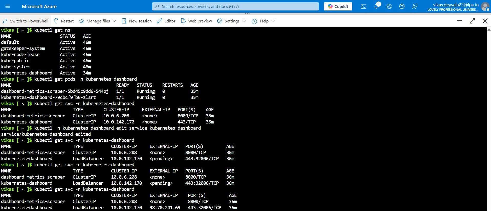

# ☸️ Week 5 – Task 3: Deploy AKS via Azure Portal, Access Dashboard & Setup RBAC

## 🎯 Objective

For this task, I decided to go beyond just spinning up a Kubernetes cluster. I wanted to **simulate how teams in organizations set up managed Kubernetes on Azure (AKS), access its dashboard, and configure role-based access for multiple users.**

The goal was to:

* Provision a production-grade AKS cluster using the **Azure Portal**.
* Access the Kubernetes dashboard for cluster visualization and management.
* Create multiple **RBAC roles** and assign them to different users, mimicking real-world scenarios where DevOps, Developers, and QA teams have varying levels of access.

---

## Step 1: Prepare the Environment

Before starting, I made sure that:

* I had an **Active Azure subscription**.
* I was logged into the Azure Portal with an account having **Owner/Contributor** rights.

I also created a dedicated **resource group** for AKS to keep everything organized.

* **Resource Group:** `csi-aks-rg`
* **Region:** `Central India`


This keeps things clean and makes it easier to tear down resources later to avoid unnecessary costs.

---

## Step 2: Create AKS Cluster via Azure Portal

### Navigate to AKS

* Went to **Azure Portal → Kubernetes services → + Create → Kubernetes cluster**.


### Basics Tab

* **Resource Group:** `aks-devops-rg`
* **Cluster Name:** `csi-aks-cluster`
* **Region:** `Central India`
* **Kubernetes version:** Left to default stable.


### Authentication

* Selected **System-assigned Managed Identity** for simplicity.
* Enabled **Role-based access control (RBAC)**.

### Node Pools

* Used the default system node pool:

  * **Node Size:** Standard DS2 v2
  * **Node Count:** 2 (enough for test workloads)


### Review + Create

* Validated and clicked **Create**.

It took around **7-8 mins** to provision the AKS cluster.


* Successfully Created AKS Cluster


---

## Step 3: Connect to AKS via Cloud Shell

Once the cluster was ready, I opened the Azure Cloud Shell (Bash) and connected to the AKS cluster using:

```bash
az aks get-credentials --resource-group csi-aks-rg --name csi-aks-cluster
```
This updated my ~/.kube/config file with the cluster context, allowing me to use kubectl locally.

This fetched my `kubeconfig` so I could interact with the cluster using `kubectl`.

To test:

```bash
kubectl get nodes
```

And I saw both nodes listed and in Ready state. So everything was working as expected.


---

## Step 4: Access Kubernetes Dashboard

Since AKS doesn’t deploy the Kubernetes Dashboard by default (for security reasons), I deployed it manually using:

```bash
kubectl apply -f https://raw.githubusercontent.com/kubernetes/dashboard/v2.7.0/aio/deploy/recommended.yaml
```
This set up all the necessary resources, including the kubernetes-dashboard namespace, service, deployment, etc.


This deployed everything into the kubernetes-dashboard namespace: the service, deployment, role bindings, and more.

```bash
kubectl get all -n kubernetes-dashboard
```


### Edit the Dashboard Service (Expose via LoadBalancer)

By default, the dashboard service is of type ClusterIP, which is not accessible externally. I edited it to change the type to LoadBalancer so I could access it securely from a browser.

```bash
kubectl edit svc kubernetes-dashboard -n kubernetes-dashboard
```

In the YAML editor, I changed this `type: ClusterIP` to `type: LoadBalancer`


his tells Kubernetes to provision an external IP.

### Get the LoadBalancer External IP

After updating the service, I ran

```bash
kubectl get svc -n kubernetes-dashboard
```


Now the Dashboard was accessible securely in Browser

### Create a Token for Login
To log in securely, I needed an authentication token. Since I had already granted cluster-admin privileges to the dashboard's service account using the following:

```bash
apiVersion: rbac.authorization.k8s.io/v1
kind: ClusterRoleBinding
metadata:
  name: dashboard-admin
roleRef:
  apiGroup: rbac.authorization.k8s.io
  kind: ClusterRole
  name: cluster-admin
subjects:
- kind: ServiceAccount
  name: kubernetes-dashboard
  namespace: kubernetes-dashboard
```

I simply retrieved the token using:

```bash
kubectl -n kubernetes-dashboard create token kubernetes-dashboard
```


This returned a long JWT token which I copied for login.

### Login via Token over HTTPS

Once I had the token and the LoadBalancer IP, I opened in browser


## 👥 Step 5: Configure Roles for Multiple Users

To mimic a real company scenario, I created different RBAC roles.


### DevOps - Full Cluster Admin Access

```bash
apiVersion: rbac.authorization.k8s.io/v1
kind: ClusterRoleBinding
metadata:
  name: devops-admin
subjects:
- kind: User
  name: devops@example.com
  apiGroup: rbac.authorization.k8s.io
roleRef:
  kind: ClusterRole
  name: cluster-admin
  apiGroup: rbac.authorization.k8s.io
```
This gives devops@example.com full control over the cluster — perfect for operations and infrastructure roles.


### Developer - View-Only Access (Default Namespace)

```bash
apiVersion: rbac.authorization.k8s.io/v1
kind: RoleBinding
metadata:
  name: developer-read
  namespace: default
subjects:
- kind: User
  name: developer@example.com
  apiGroup: rbac.authorization.k8s.io
roleRef:
  kind: Role
  name: view
  apiGroup: rbac.authorization.k8s.io
```

This role restricts the developer to view-only access in the default namespace, which is a common real-world setup to avoid accidental disruptions.


### QA Team Namespace Role - Read-Only Access to QA Namespace

```bash
apiVersion: rbac.authorization.k8s.io/v1
kind: RoleBinding
metadata:
  name: qa-read
  namespace: qa-environment
subjects:
- kind: User
  name: qa@example.com
  apiGroup: rbac.authorization.k8s.io
roleRef:
  kind: Role
  name: view
  apiGroup: rbac.authorization.k8s.io
```

This grants QA users read-only access to the qa-environment namespace — useful for verifying deployments and debugging without having write access.


---

## Conclusion

In this task, I successfully provisioned a production-grade AKS cluster on Azure and accessed the Kubernetes Dashboard. I also simulated a real-world scenario by configuring RBAC roles for different users—granting full admin access to DevOps, view-only access to Developers, and read-only access to QA.

---