# Week 5 – Kubernetes & CI/CD: Task 4

## 📌 Task: Deploy a microservice application on AKS cluster and access it using public internet

## 🌟 Objective

Rather than simply deploying the Google Boutique microservices manually, I took this task to the next level by integrating Jenkins to implement a fully automated CI/CD pipeline

In this task, I deployed the **Google Boutique microservices application** on an existing AKS (Azure Kubernetes Service) cluster, orchestrated via Jenkins running inside a Docker container on a dedicated VM.

The goal was to implement a robust, automated CI/CD pipeline using Jenkins multibranch pipelines — enabling parallel builds and deployments of individual microservices hosted in separate Git branches — and expose the frontend service publicly through AKS LoadBalancer.

---

## 🔍 Initial Setup & Architecture

* **AKS cluster:** Already provisioned and configured.
* **Jenkins:** Running inside a Docker container on a dedicated VM.
* This VM serves as the Jenkins master node and also acts as an agent (slave) node to run pipeline jobs.
* I installed all required Jenkins plugins (Kubernetes, Docker Pipeline, Git, Multibranch Pipeline, etc.) after logging into Jenkins via the VM IP.
* Created a Jenkins agent (slave) node on the VM itself to execute build steps, allowing docker builds and kubectl commands to run locally on the VM.

---

## 🧙️‍⚖️ Step-by-Step Implementation

---

###  Step 1: Azure VM Setup for Jenkins
Before installing Jenkins, I provisioned a dedicated Linux VM on Azure to act as the Jenkins master and agent node.

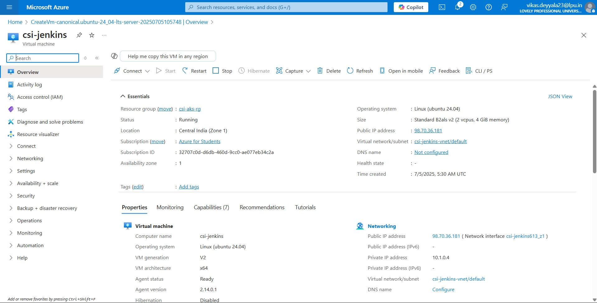

- Installed Azure CLI and kubectl on the VM:
- Logged in to Azure via CLI and set AKS context:

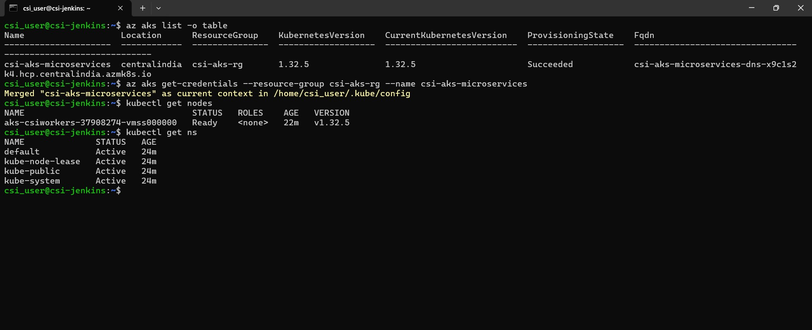

This confirmed that the VM had full kubectl access to the AKS cluster and was ready for CI/CD operations.


### Step 2: Setup Jenkins Container on VM and Login

* Deployed Jenkins as a Docker container on the VM.

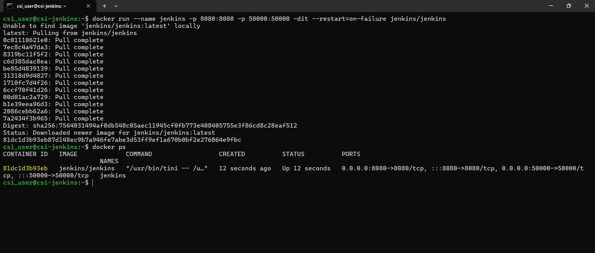

* Retrieved the initial admin password from Jenkins secrets inside the container.

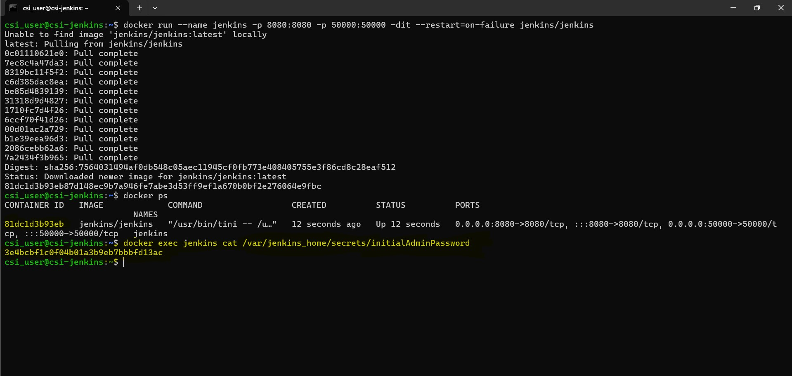

* Used the password to log in to Jenkins via the VM's IP address in a web browser.

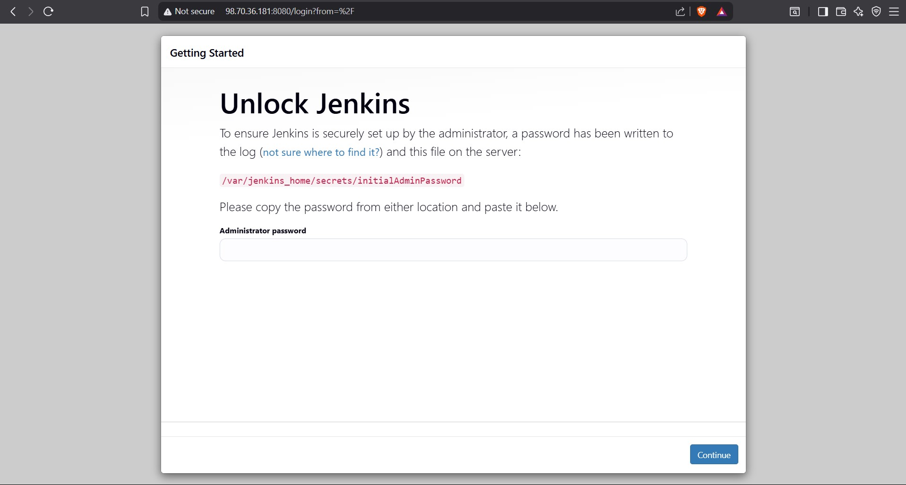

* Accessed Jenkins UI by browsing to `http://<vm-ip>:8080`.

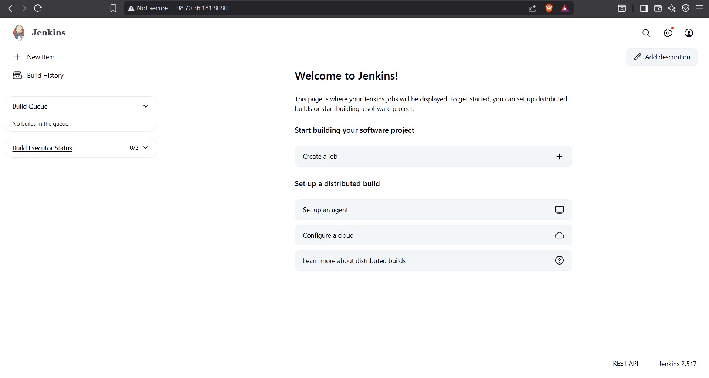

* Installed all necessary plugins to support Git, Docker, Kubernetes, and multibranch pipeline functionalities.

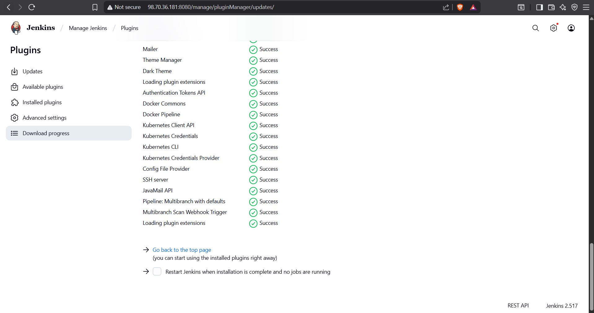

---

### Step 3: Created Jenkins Agent (Slave) on VM

* Configured the VM as a Jenkins agent node so all pipeline jobs run on this VM.

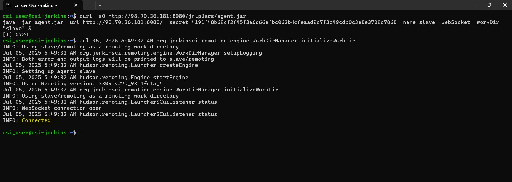

* This allows for local execution of Docker builds and kubectl commands on the VM.

* Ensured the agent node was online and ready.

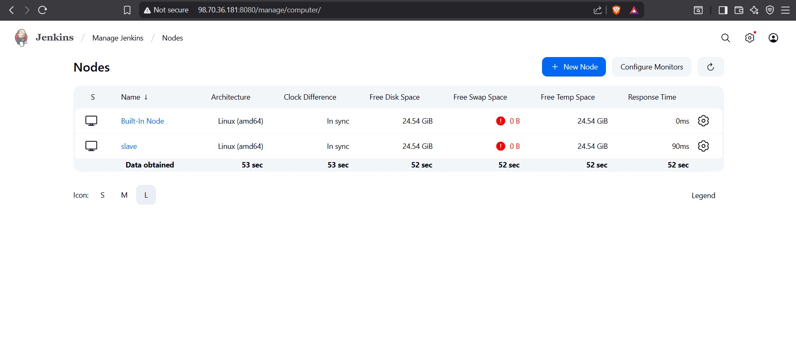

---

### Step 4: Create Kubernetes Service Account, Role, and RoleBinding for Jenkins

To enable Jenkins to interact securely and with appropriate permissions on the AKS cluster, I created a dedicated Kubernetes Service Account with an RBAC Role and RoleBinding.

This ensures Jenkins pipelines can deploy and manage resources without overprivileged access.

#### 4.1 Create a Service Account for Jenkins in the `microservices` namespace:

```bash
apiVersion: v1
kind: ServiceAccount
metadata:
  name: jenkins
  namespace: microservices
```

Apply it using:

```bash
kubectl apply -f jenkins-serviceaccount.yaml
```

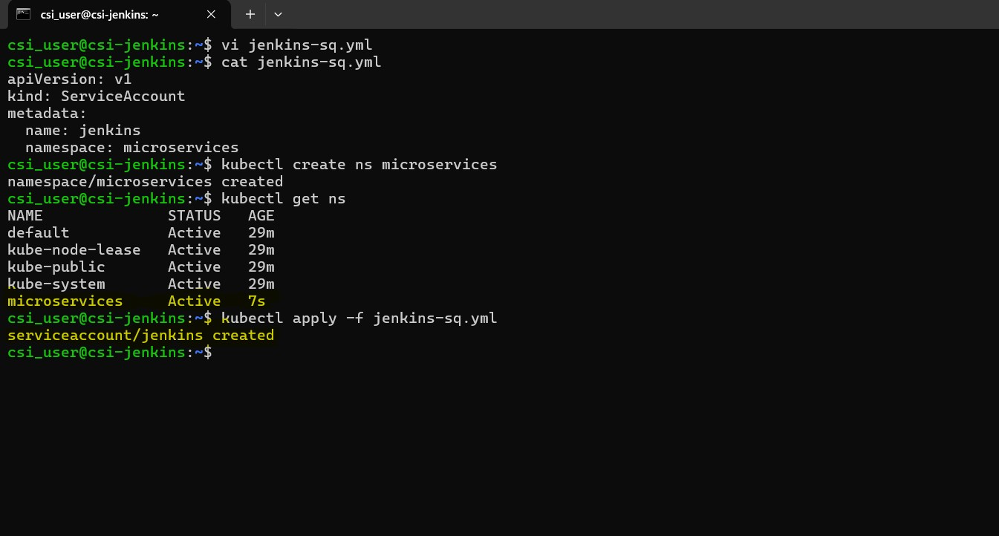

#### 4.2 Define a Role with specific permissions scoped to the microservices namespace:

```bash
apiVersion: rbac.authorization.k8s.io/v1
kind: Role
metadata:
  name: app-role
  namespace: microservices
rules:
  - apiGroups:
      - ""
      - apps
      - autoscaling
      - batch
      - extensions
      - policy
      - rbac.authorization.k8s.io
    resources:
      - pods
      - componentstatuses
      - configmaps
      - daemonsets
      - deployments
      - events
      - endpoints
      - horizontalpodautoscalers
      - ingress
      - jobs
      - limitranges
      - namespaces
      - nodes
      - persistentvolumes
      - persistentvolumeclaims
      - resourcequotas
      - replicasets
      - replicationcontrollers
      - serviceaccounts
      - services
    verbs:
      - get
      - list
      - watch
      - create
      - update
      - patch
      - delete
```

Apply with:

```bash
kubectl apply -f jenkins-role.yaml
```

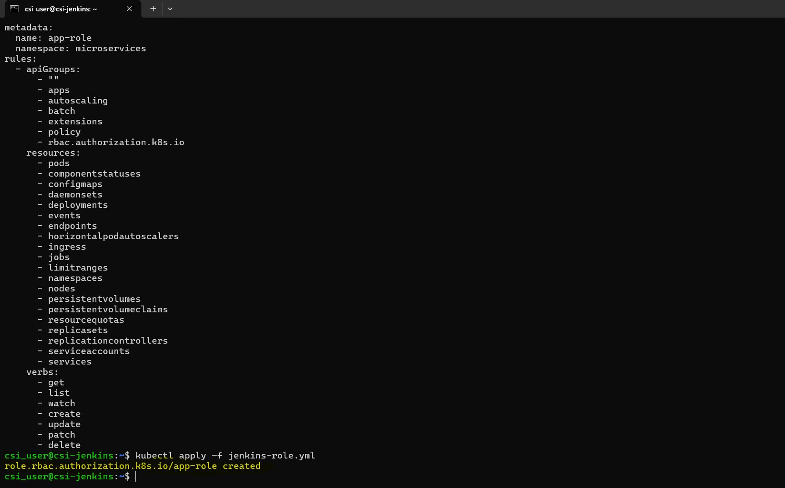

#### 4.3 Bind the Role to the Jenkins Service Account:

```bash
apiVersion: rbac.authorization.k8s.io/v1
kind: RoleBinding
metadata:
  name: jenkins-rolebinding
  namespace: microservices
roleRef:
  apiGroup: rbac.authorization.k8s.io
  kind: Role
  name: app-role
subjects:
  - kind: ServiceAccount
    name: jenkins
    namespace: microservices
```

Apply with:

```bash
kubectl apply -f jenkins-rolebinding.yaml
```

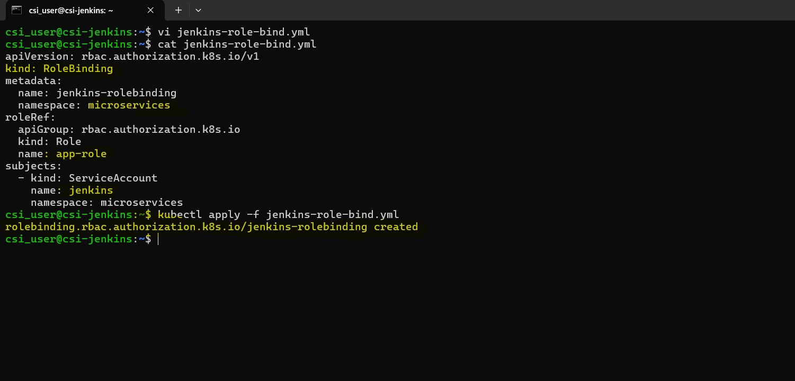

---

### Step 5: Generate Authentication Token for Jenkins Service Account

To allow Jenkins to authenticate with the AKS cluster via kubectl commands in the pipeline, I generated a service account token stored as a Kubernetes secret:

```bash
apiVersion: v1
kind: Secret
type: kubernetes.io/service-account-token
metadata:
  name: jenkins-secret
  namespace: microservices
  annotations:
    kubernetes.io/service-account.name: jenkins
```

Apply this manifest:

```bash
kubectl apply -f jenkins-secret.yaml
```

Then, I retrieved the token and CA certificate from the secret using:

```bash
kubectl describe secret jenkins-secret -n microservices
```
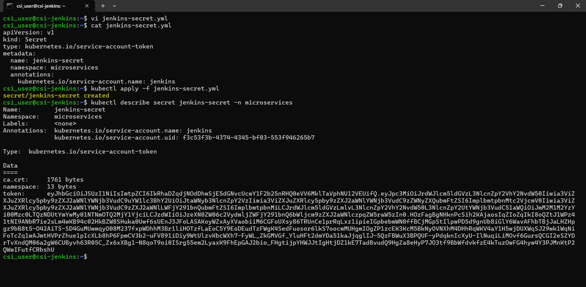

I configured Jenkins with this token to authenticate securely to the AKS cluster from the pipeline jobs.

---

### Step 6: Created DockerHub and Kubernetes Secrets in Jenkins
 * Created Jenkins credentials for DockerHub (dockerhub-creds) to securely login and push images.
 * Created a Kubernetes kubeconfig secret using the service account token (jenkins-secret) with appropriate RBAC permissions in AKS, and added it as a Jenkins credential (aks-kubeconfig).
 * These secrets are used by Jenkins pipeline for authentication to DockerHub and AKS.

### Step 7: Prepared Jenkins Multibranch Pipeline Job
 * Configured a multibranch pipeline job pointing to the microservices Git repository.
 * Each microservice is maintained in its own Git branch.
 * Jenkins automatically scans branches and triggers pipeline jobs in parallel for each microservice.

 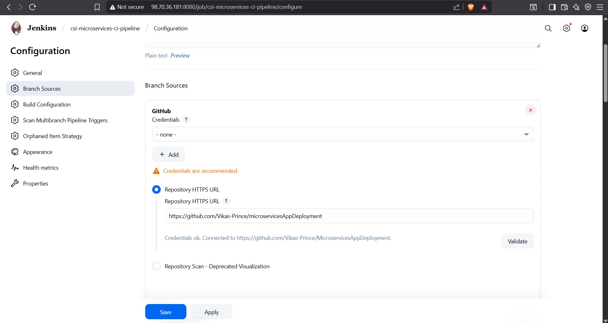

### Step 8: Jenkinsfile CI/CD Pipeline Overview

* **CI pipeline stages:**

  * Checkout the branch code.
  * Build Docker image tagged with branch name.
  * Login and push Docker image to DockerHub using stored credentials.

```bash
pipeline {
    agent {
        label 'slave'
    }

    stages {
        stage('Build & Tag Docker Image') {
            steps {
                script {
                    withDockerRegistry(credentialsId: 'docker-cred', toolName: 'docker') {
                        sh "docker build -t vikasprince/adservice:latest ."
                    }
                }
            }
        }
        
        stage('Push Docker Image') {
            steps {
                script {
                    withDockerRegistry(credentialsId: 'docker-cred', toolName: 'docker') {
                        sh "docker push vikasprince/adservice:latest "
                    }
                }
            }
        }
    }
}
```

* **CD pipeline stages:**

  * Use the Kubernetes kubeconfig secret to authenticate with AKS.
  * Deploy or update microservices on AKS by applying Kubernetes manifests from the repo.
* The Jenkinsfile was updated to include the AKS cluster API server URL to ensure `kubectl` commands target the correct cluster.

Here’s a simplified Jenkinsfile outline:

```groovy
pipeline {
    agent {
        label 'slave'
    }

    stages {
        stage('Deploy To Kubernetes manifest files') {
            steps {
                withKubeCredentials(kubectlCredentials: [[
                    credentialsId: 'k8s-token',
                    clusterName: 'csi-aks-microservices',
                    namespace: 'microservices',
                    serverUrl: 'https://csi-aks-microservices-dns-x9c1s2k4.hcp.centralindia.azmk8s.io'
                ]]) {
                    sh "kubectl apply -f k8sdeployment-service.yml"
                }
            }
        }
        
        stage('Verify Pods') {
            steps {
                withKubeCredentials(kubectlCredentials: [[
                    credentialsId: 'k8s-token',
                    clusterName: 'csi-aks-microservices',
                    namespace: 'microservices',
                    serverUrl: 'https://csi-aks-microservices-dns-x9c1s2k4.hcp.centralindia.azmk8s.io'
                ]]) {
                    sh "kubectl get pods -n microservices"
                }
            }
        }

        stage('Verify Services') {
            steps {
                withKubeCredentials(kubectlCredentials: [[
                    credentialsId: 'k8s-token',
                    clusterName: 'csi-aks-microservices',
                    namespace: 'microservices',
                    serverUrl: 'https://csi-aks-microservices-dns-x9c1s2k4.hcp.centralindia.azmk8s.io'
                ]]) {
                    sh "kubectl get svc -n microservices"
                }
            }
        }
    }
}
```

### Step 9: Kubernetes Deployment Manifests

Each microservice had its own deployment and service kept in k8s-deployment.yml.

LoadBalancer service type was used for frontend microservice to expose it publicly on the internet.

Internal microservices used ClusterIP as appropriate.

---


### Step 10: View Build Logs in Jenkins

After triggering the Jenkins multibranch pipeline for the microservice branches, Jenkins executed the CI/CD stages.

Here’s a screenshot showing the **console output** of a successful pipeline build:

* The logs confirm:
  - Successful Docker image build
  - Authentication with DockerHub
  - Image push completed
  - `kubectl apply` successfully applied manifests to AKS
  - Kubernetes pods and services were verified

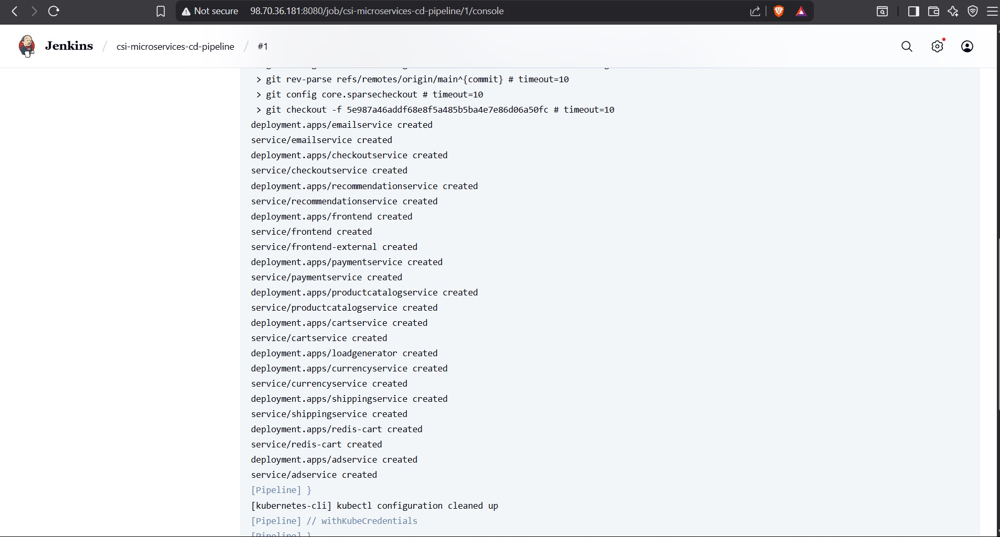

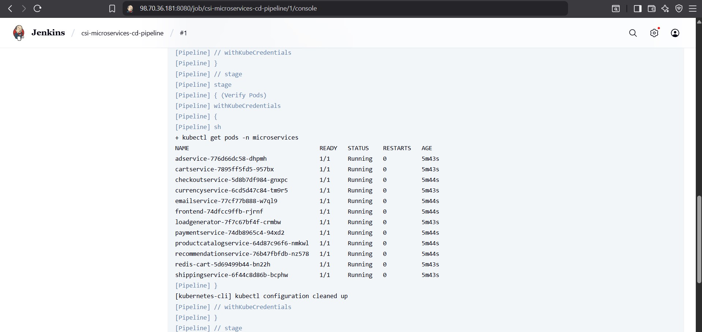

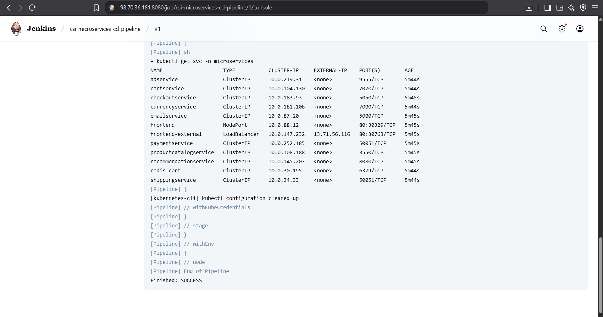


---

### Step 10: Verifying Pods and Services on AKS from VM

After the pipeline completed, I verified the deployments and service status manually using kubectl on the VM.

#### 🔸 List all pods:

```bash
kubectl get pods -n microservices
```

#### 🔸 List all services:

```bash
kubectl get svc -n microservices
```


The frontend service is exposed via a LoadBalancer with an external IP assigned by Azure

### Step 11: Access the Boutique App in Browser

To verify the full deployment, I opened a browser and navigated to the LoadBalancer external IP:

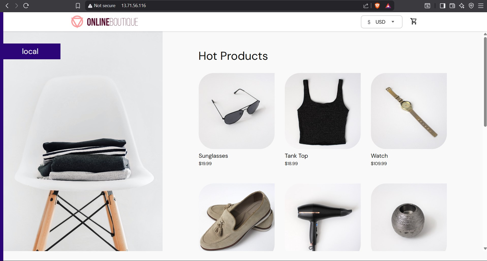

The Online Boutique microservices demo app loaded successfully:
  - Product listing, cart, checkout, and search functions were responsive and confirmed the internal microservices were working correctly.

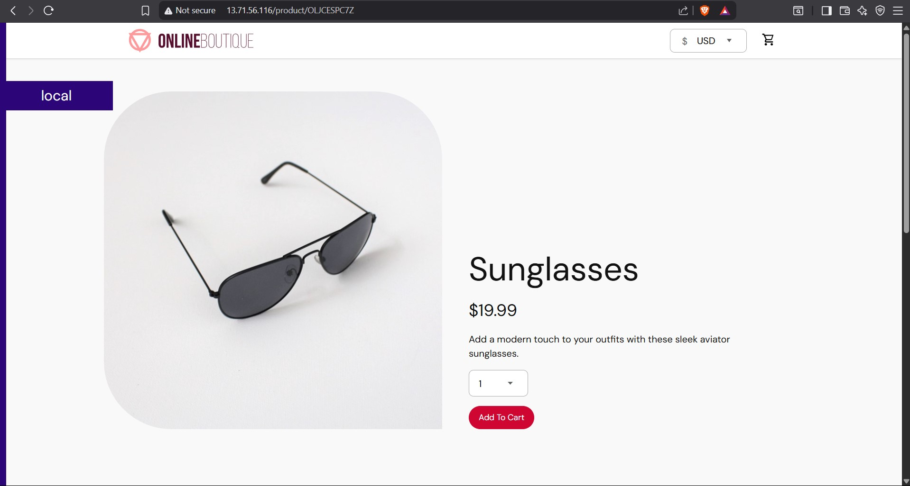


---

## Conclusion

Successfully automated the CI/CD pipeline using Jenkins for deploying Google Boutique microservices on AKS. The app was deployed, exposed via LoadBalancer, and verified to be fully functional end-to-end.

---