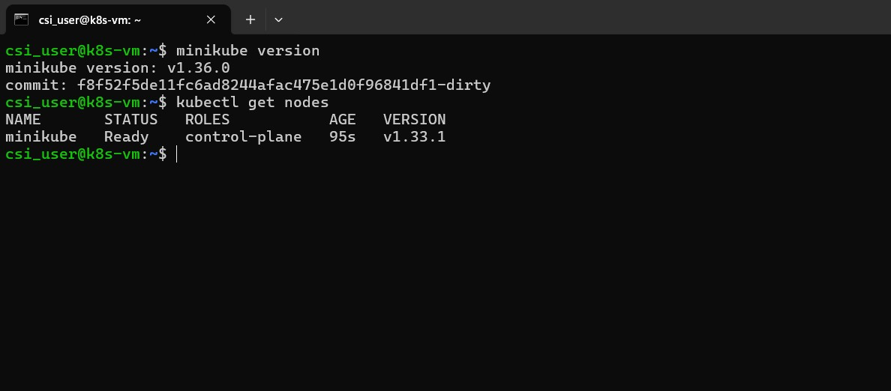

# 🐳 Week 6 – Kubernetes: Task 1

## Task: Deploying ReplicaSet, Replication Controller & Deployment

## 📌 Task Overview
I worked on exploring different methods to manage and scale applications in Kubernetes. The focus was on deploying **ReplicaSet**, **Replication Controller**, and **Deployment** resources.

---

## Setup Environment

To get started, I created a **Minikube cluster** locally. This was used as the base environment to simulate the Kubernetes cluster.

Minikube provided an isolated and consistent setup for testing various Kubernetes objects without needing a full-scale cloud setup.



## Scenario: Scalable Web Application

I designed a simple scenario to simulate a scalable web application. The goal was to deploy the application using three different Kubernetes objects:

- **ReplicaSet** – Ensures a consistent number of pod replicas are running.
- **Replication Controller** – Older version of ReplicaSet, used for legacy comparisons.
- **Deployment** – Most advanced, supports rolling updates and rollback functionality.

Each approach was tested individually with the base application (vikasprince/multistage-image and nginx container).

---

## Step 1: ReplicaSet

A ReplicaSet is a fundamental Kubernetes object responsible for maintaining a stable set of replica pods. If a pod dies, the ReplicaSet automatically creates a new pod to ensure the desired state is maintained.


```bash
apiVersion: apps/v1
kind: ReplicaSet
metadata:
  name: csi-app-replicaset
spec:
  replicas: 3
  selector:
    matchLabels:
      app: csi-app
  template:
    metadata:
      labels:
        app: csi-app
    spec:
      containers:
      - name: csi-app
        image: vikasprince/csi-multistage-image:v1
        ports:
        - containerPort: 80
```


I applied kubectl command to create replica set

```bash
kubectl apply -f replicaset.yaml
kubectl get replicasets
kubectl get pods -l app=csi-app
```


The ReplicaSet successfully ensured that 3 identical pods were running at all times.

---

## Step 2: Replication Controller

The Replication Controller is the predecessor to ReplicaSet. It provides similar functionality to ReplicaSet, ensuring that the correct number of pod replicas are running. However, Replication Controllers are now deprecated, and ReplicaSets are recommended for newer deployments.

---

## Step 3: Created a DeploymentSet

A Deployment in Kubernetes offers advanced features like rolling updates, rollback capabilities, and auto-scaling. It automatically manages ReplicaSets and provides a more comprehensive solution for managing containerized applications in a production environment.

```bash
apiVersion: apps/v1
kind: Deployment
metadata:
  name: csi-app-deployment
spec:
  replicas: 3
  selector:
    matchLabels:
      app: csi-app
  template:
    metadata:
      labels:
        app: csi-app
    spec:
      containers:
      - name: csi-app
        image: nginx:latest
        ports:
        - containerPort: 80
```


I applied above deployment set using `kubectl` and verified deployment and pods

```bash
kubectl apply -f deployment.yaml
kubectl get deployments
kubectl get pods -l app=csi-app
```


### Rolling Update Simulation

I tested the rolling update feature of the Deployment by updating the NGINX version from the latest to a specific version (1.21).

```bash
kubectl set image deployment/csi-app-deployment csi-app=nginx:1.21
kubectl rollout status deployment/csi-app-deployment
```


he Deployment handled the rolling update smoothly. Kubernetes gradually replaced old pods with new ones, ensuring that there was no downtime during the update. I also tested a rollback by using:

```bash
kubectl rollout undo deployment/csi-app-deployment
```


This demonstrated how Deployments support versioning, rollback, and gradual updates.

---

## Step 4: Scaling the Application with DeploymentSet

Scaling the application was an important aspect of this task. I tested how each resource handled scaling operations.

### Deployment Scaling

I scaled the Deployment from 3 replicas to 5 replicas:

```bash
kubectl scale deployment csi-app-deployment --replicas=5
```

After scaling, I checked the state of the pods:

```bash
kubectl get pods
```


The Deployment handled scaling very well, including managing new pods efficiently while maintaining the rolling update process.

---

## Step 5: Healing the Application with Deployment

One of the key advantages of using Kubernetes Deployments is its self-healing ability. This ensures that if any of your application pods fail, Kubernetes will automatically replace them to maintain the desired number of replicas. In this section, we’ll walk through how Kubernetes automatically heals the application when a pod is deleted or fails.

### Deployment Healing

To test the self-healing mechanism, I manually deleted one of the running pods. Kubernetes immediately detected the failure and recreated the pod to restore the desired state.

#### 1. Check the Current State of Pods

First, we’ll check the current state of our pods. This will give us a clear view of the pods running with the desired number of replicas.

```bash
kubectl get pods
```

#### 2. Delete a Pod to Simulate Failure

Next, I simulated a failure by manually deleting one of the pods.

```bash
kubectl delete pod csi-app-deployment-55c4bb948c-q54tg
```

#### 3. Watch Kubernetes Heal the Application
Once I deleted I again checked the running pods by using

```bash
kubectl get pods --watch
```


Within a second, Kubernetes launched a new pod to maintain the desired number of replicas.

---

## Comparative Summary

### ReplicaSet
- ✅ Maintains replica count effectively.
- ❌ Manual update process; lacks rollout features.

### Replication Controller
- ✅ Simple and effective for older versions.
- ❌ Deprecated, lacks support for rolling updates.

### Deployment
- ✅ Feature-rich (rolling updates, rollback, versioning).
- ✅ Manages ReplicaSets automatically.

---

## Conclusion

Overall, this task was an excellent practical exercise to understand Kubernetes pod management strategies. Working with **ReplicaSets** and **Deployments** gave me a deeper understanding of their differences and use cases.

---