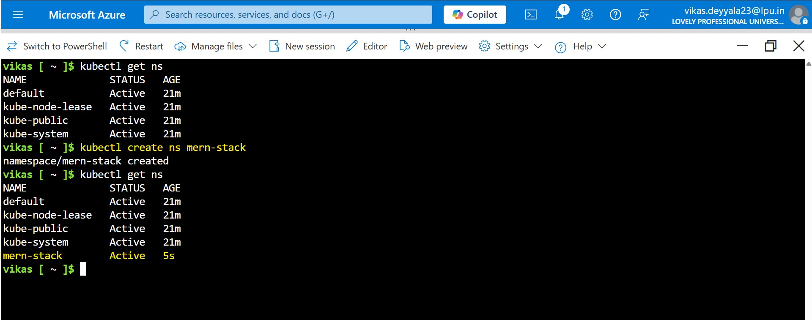
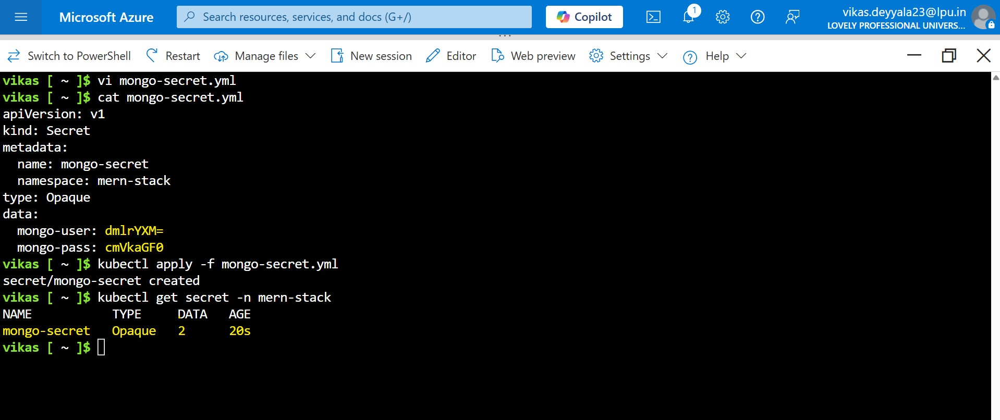
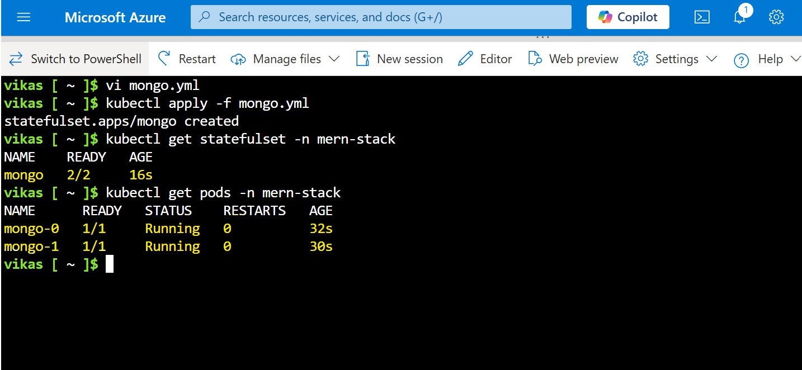
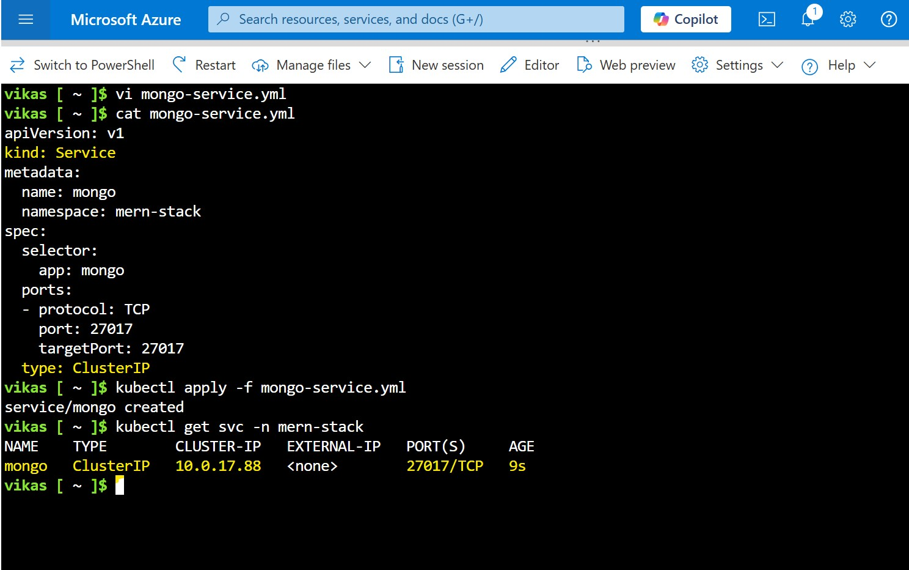
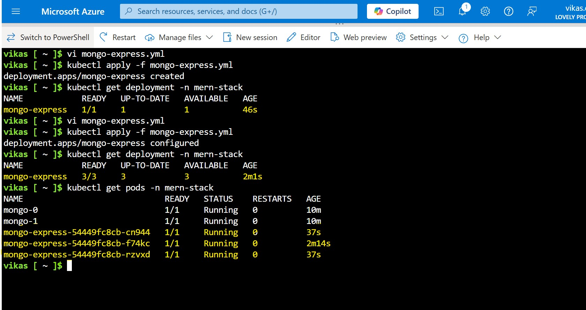
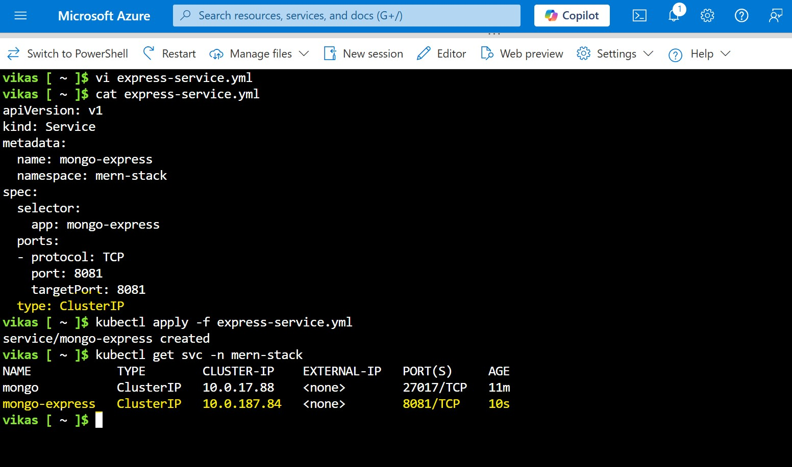
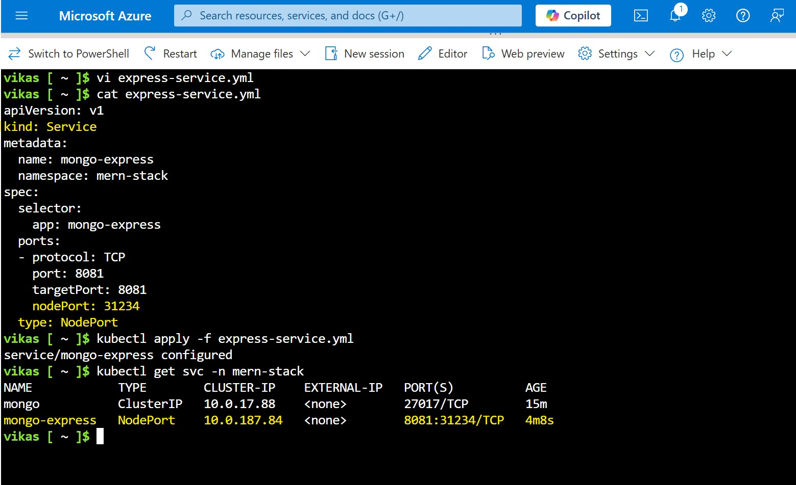
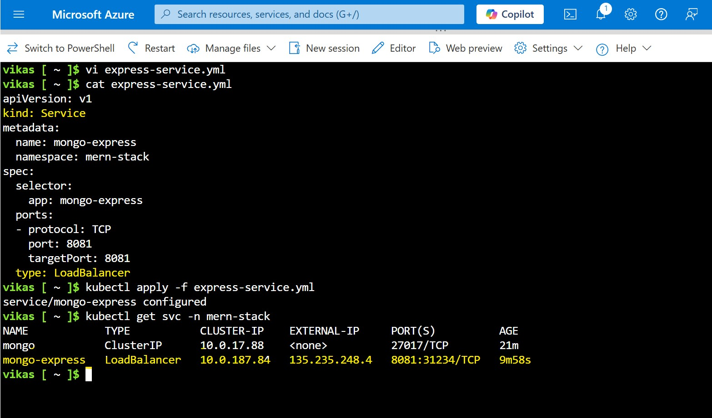
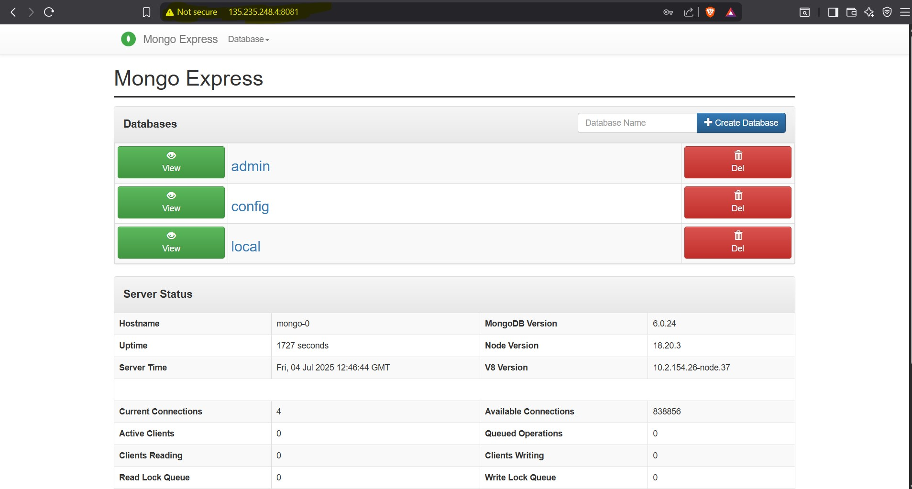
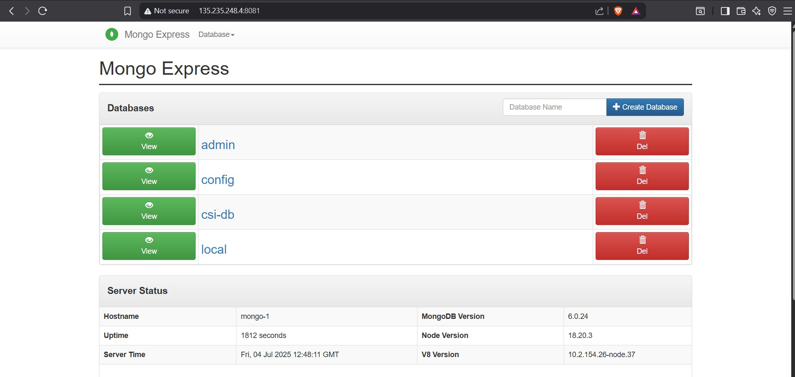

# Week 5 – Kubernetes: Task 2

## 📌 Task: Expose services in the cluster with node port, cluster IP, load balancer

## Objective

In this task, I deployed a simple **MERN-like stack** on my Aks Cluster — specifically:

* **MongoDB** as the database backend
* **mongo-express** as a lightweight, web-based UI for MongoDB management

The goal was to explore how to expose these components using different Kubernetes service types (**ClusterIP**, **NodePort**, and **LoadBalancer**), mimicking an enterprise-grade environment where databases are typically internal-only (ClusterIP), while UI or API services might be exposed externally.

---

## 🔍 What I deployed?

* **MongoDB (mongo)**: The NoSQL database storing application data. It is deployed as a stateful service to ensure data durability. MongoDB usually should be internal-only, restricted to trusted applications.

* **mongo-express**: A web-based MongoDB admin UI built with Node.js and Express. It provides CRUD capabilities for database collections via a simple browser interface. It connects to MongoDB internally and can be exposed externally for management.

Both services use official Docker images from Docker Hub, making this deployment reliable and enterprise-ready.

---

## Step-by-Step Implementation

---

### Step 1: Created a Namespace for Isolation

For better resource organization and security, I first created a separate namespace for this project. Namespaces are vital in Kubernetes, especially in larger environments, as they help isolate and manage resources effectively.

```bash
kubectl create namespace mern-stack
```

This helps in ensuring that all resources related to the application (e.g., MongoDB, mongo-express) are contained within their own scope and don't interfere with other deployments or services in the cluster.



---

### Step 2: Create the Secret

Before deploying MongoDB, I ensured that sensitive data like the database username and password were securely stored as Kubernetes Secrets.

Here’s the Secret I created:

```bash
apiVersion: v1
kind: Secret
metadata:
  name: mongo-secret
  namespace: mern-stack
type: Opaque
data:
  mongo-user: dmlrYXM=  # "dmlyYXM" is "myuser" encoded in base64
  mongo-pass: cmVkaGF0  # "cmVkaGF0" is "redhat" encoded in base64
```

This `mongo-secret` contains the base64-encoded MongoDB username and password. It ensures that sensitive credentials are not stored directly in plaintext within Kubernetes configuration files.



### Step 3: Deployed MongoDB with Persistent Storage

MongoDB was deployed using a StatefulSet, which guarantees that the database pods will have stable, unique network identities. 

Here’s the YAML snippet for the MongoDB StatefulSet:

**mongo-statefulset.yaml (snippet):**

```bash
apiVersion: apps/v1
kind: StatefulSet
metadata:
  name: mongo
  namespace: mern-stack
spec:
  replicas: 2
  selector:
    matchLabels:
      app: mongo
  template:
    metadata:
      labels:
        app: mongo
    spec:
      containers:
      - name: mongo
        image: mongo:6.0
        ports:
          - containerPort: 27017
        env:
          - name: MONGO_INITDB_ROOT_USERNAME
            valueFrom:
              secretKeyRef:
                name: mongo-secret
                key: mongo-user
          - name: MONGO_INITDB_ROOT_PASSWORD
            valueFrom:
              secretKeyRef:
                name: mongo-secret
                key: mongo-pass
```

I then applied the configuration:

```bash
kubectl apply -f mongo.yaml
```

To verify that the MongoDB pods are running correctly:

```bash
kubectl get pods -n mern-stack
```



---

### Step 4: Exposed MongoDB Internally Using ClusterIP Service

As a database, MongoDB should only be accessible within the cluster for security reasons. I exposed MongoDB via a ClusterIP service type, which is the default service type in Kubernetes. This ensures that MongoDB is accessible only from within the cluster.

```bash
apiVersion: v1
kind: Service
metadata:
  name: mongo
  namespace: mern-stack
spec:
  selector:
    app: mongo
  ports:
  - protocol: TCP
    port: 27017
    targetPort: 27017
  type: ClusterIP
```

I then applied the service configuration:

```bash
kubectl apply -f mongo-service.yaml
```

To check that the service was created correctly:

```bash
kubectl get svc -n mern-stack mongo
```



---

### Step 5: Deployed mongo-express for UI Access

Next, I deployed mongo-express, a web-based MongoDB management UI that allows me to interact with the MongoDB instance via a browser. `mongo-express` connects to MongoDB using the credentials stored in the mongo-secret Kubernetes secret.

Here’s the mongo-express Deployment YAML:

**mongo-express-deployment.yaml (snippet):**

```bash
apiVersion: apps/v1
kind: Deployment
metadata:
  name: mongo-express
  namespace: mern-stack
spec:
  replicas: 1
  selector:
    matchLabels:
      app: mongo-express
  template:
    metadata:
      labels:
        app: mongo-express
    spec:
      containers:
      - name: mongo-express
        image: mongo-express:latest
        ports:
        - containerPort: 8081
        env:
          - name: ME_CONFIG_MONGODB_ADMINUSERNAME
            valueFrom:
              secretKeyRef:
                name: mongo-secret
                key: mongo-user
          - name: ME_CONFIG_MONGODB_ADMINPASSWORD
            valueFrom:
              secretKeyRef:
                name: mongo-secret
                key: mongo-pass
          - name: ME_CONFIG_MONGODB_SERVER
            value: mongo
```

After applying it with:

```bash
kubectl apply -f mongo-express.yaml
```

I checked the pod status:

```bash
kubectl get pods -n mern-stack
```


---

### Step 6: Created ClusterIP Service for mongo-express

Since mongo-express is not a critical service like MongoDB, I first exposed it within the cluster using a ClusterIP service. This is fine for internal access.

Here’s the ClusterIP service YAML for mongo-express:

```bash
apiVersion: v1
kind: Service
metadata:
  name: mongo-express
  namespace: mern-stack
spec:
  selector:
    app: mongo-express
  ports:
  - protocol: TCP
    port: 8081
    targetPort: 8081
  type: ClusterIP
```

I applied the service:

```bash
kubectl apply -f express-service.yaml
```

To confirm it was created successfully:

```bash
kubectl get svc -n mern-stack
```



---

### Step 7: Exposing mongo-express Externally Using NodePort

At this point, I wanted to expose mongo-express externally so I could access it via a browser. To do this, I changed the service type to NodePort, which allows external access to the service on a specific port (usually in the range of 30000-32767).

```bash
kubectl patch svc mongo-express -n mern-stack -p '{"spec": {"type": "NodePort"}}'
```

Then, I retrieved the assigned NodePort

```bash
kubectl get svc mongo-express -n mern-stack
```



---


### Step 8: Exposing mongo-express Using LoadBalancer (Cloud Native)

In a production environment (especially in cloud providers like AWS or Azure), it's more common to expose services via a LoadBalancer service type. This automatically provisions an external IP and balances traffic between multiple instances if necessary.

To expose mongo-express via a LoadBalancer, I applied the following change:

```bash
kubectl patch svc mongo-express -n mern-stack -p '{"spec": {"type": "LoadBalancer"}}'
```

Then, I waited for the EXTERNAL-IP to be assigned:

```bash
kubectl get svc mongo-express -n mern-stack
```



After the LoadBalancer service was provisioned, I could simply visit the EXTERNAL-IP of the service in my browser and access the MongoDB management UI.



This would be the typical interface for performing CRUD operations on MongoDB:
Here, I can interact with the database collections, manipulate data, and manage the MongoDB instance.



This would provide external access without exposing NodePorts manually a preferred option in production cloud environments.

---

### Step 9: Exposing Services via Ingress

In Kubernetes, **Ingress** provides a clean and efficient way to manage external access to services, especially when dealing with multiple microservices. Instead of exposing each service individually using **LoadBalancer**, Ingress allows you to define a single entry point that routes external traffic to different services in your cluster.

#### Why Use Ingress?

- **Single Entry Point**: Instead of manually exposing multiple services, Ingress routes all external traffic through one IP or DNS.
- **Microservices Friendly**: In a microservices setup, Ingress helps direct traffic to different services based on URL paths or hostnames.
- **Simplified SSL Management**: Ingress controllers can handle SSL/TLS termination, so you don’t need to manage it separately for each service.

#### In Simple Terms:
Ingress acts like a reverse proxy, forwarding external requests to the correct service within the cluster based on the rules you set. It’s particularly useful for organizing access to multiple services while keeping things neat and manageable.

---

## Conclusion

In this task, I deployed a simple MERN-like stack on Kubernetes with MongoDB and mongo-express. I explored different ways to expose these services using ClusterIP, NodePort, and LoadBalancer.

---