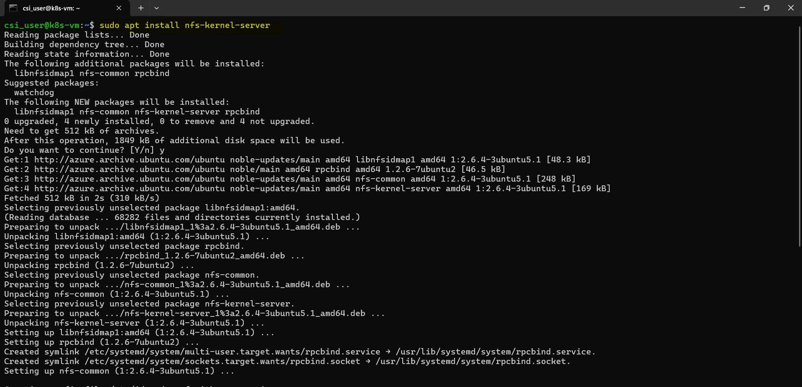
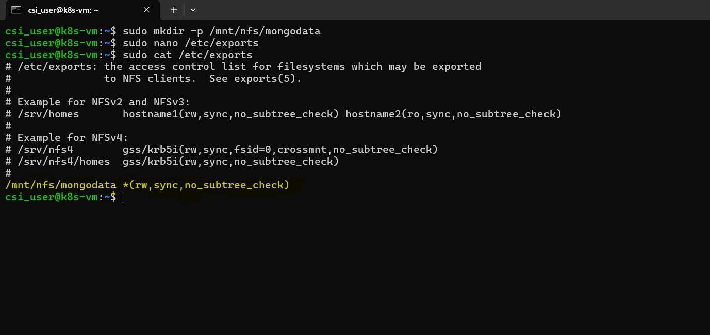
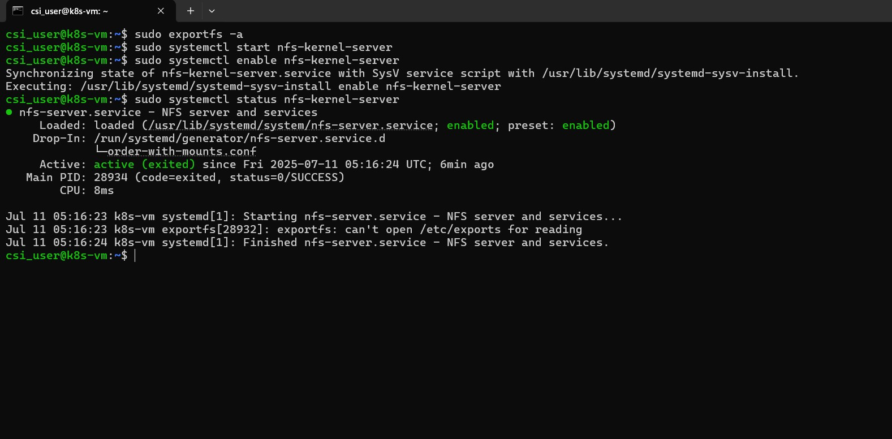
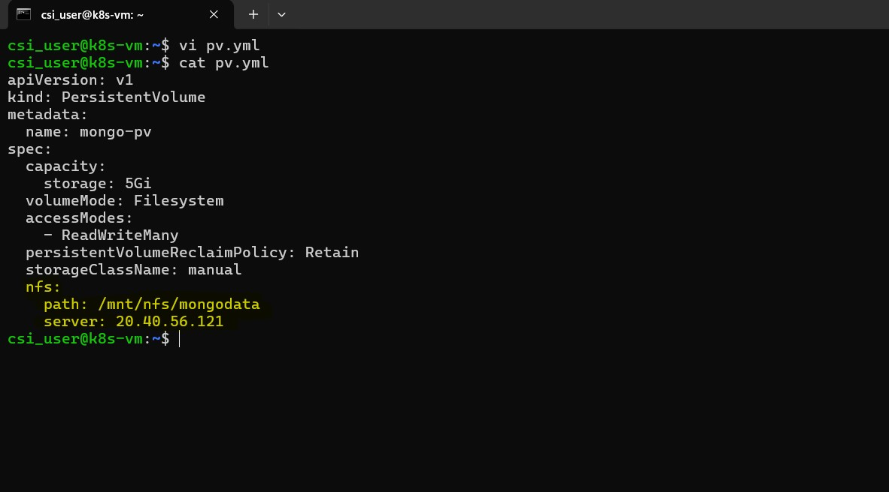
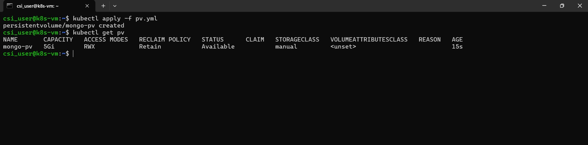
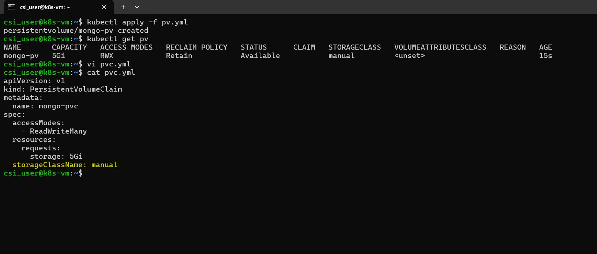
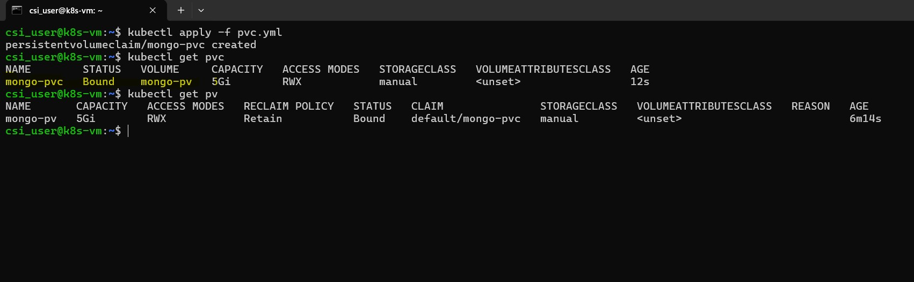

# 🐳 Week 6 – Kubernetes: Task 3

## Task: Persistent Volumes (PV) & Persistent Volume Claims (PVC)

## Task Overview

In this task, I explored how to configure **Persistent Volumes (PV)** and **Persistent Volume Claims (PVC)** in Kubernetes. Rather than simply creating a PV and PVC for a single application, I focused on setting up a **Network File System (NFS) server** to serve as a backend storage provider that could be shared across multiple virtual machines (VMs), including the Kubernetes cluster.

---

## Step 1: Set Up an NFS Server

Before diving into Kubernetes resources, I set up an NFS server to serve as the persistent storage backend.

### Install and Configure NFS on a Linux Machine

The first thing I did was install the necessary NFS server packages on my Linux machine. This can be done easily using the package manager apt:

```bash
sudo apt update
sudo apt install nfs-kernel-server
```



This command installs the NFS kernel server, which will allow the machine to share directories over the network.

### Create Export Directory

Once NFS was installed, I created a directory on the server where the MongoDB data would be stored. This directory is what Kubernetes will later mount as a Persistent Volume (PV):

```bash
sudo mkdir -p /mnt/nfs/mongodata
```

Here, I created the directory /mnt/nfs/mongodata, but you can choose any directory path that suits your needs. This will be the location where MongoDB’s data files will be stored, and Kubernetes will mount this directory as its persistent storage.

### Update Exports File

Now that the directory was created, I needed to configure the NFS server to share it with other machines. This is done by editing the /etc/exports file, which contains the list of directories that NFS shares with clients.

```bash
sudo nano /etc/exports
```

I added the following line to the file:

```bash
/mnt/nfs/mongodata *(rw,sync,no_subtree_check)
```

This line tells the NFS server to export the /mnt/nfs/mongodata directory with read/write permissions (rw) to any client (indicated by *). The options sync and no_subtree_check are recommended for performance and consistency.



### Apply Config and Start Server

Once the /etc/exports file was updated, I needed to export the shared directory and start the NFS server:

```bash
sudo exportfs -a

sudo systemctl start nfs-kernel-server
sudo systemctl enable nfs-kernel-server
```



---

## Step 2: Create PersistentVolume (PV)

The next step was to create a PersistentVolume (PV) that points to the NFS share. This represents the physical storage resources in Kubernetes.

### Created a PV Using the NFS Server

Here’s how I created the PersistentVolume:

```bash
apiVersion: v1
kind: PersistentVolume
metadata:
  name: mongo-pv
spec:
  capacity:
    storage: 5Gi
  volumeMode: Filesystem
  accessModes:
    - ReadWriteMany
  persistentVolumeReclaimPolicy: Retain
  storageClassName: manual
  nfs:
    path: /mnt/nfs/mongodata
    server: 20.40.56.121
```



Explanation:

  - **capacity:** I specified that the PV should have 5Gi of storage.
  - **accessModes:** ReadWriteMany is specified because NFS allows multiple clients to read and write simultaneously, which is ideal for a shared volume.
  - **nfs:** This is where I specify the path to the NFS directory and the NFS server's IP address.

  - **persistentVolumeReclaimPolicy:** Set to Retain because once the PV is released, I want to manually clean it up.


Apply the PersistentVolume by using Kubectl

```bash
kubectl apply -f pv.yml
```

Verify that the PersistentVolume is created:

```bash
kubectl get pv mongo-pv
```

I saw the PV listed with the capacity, access mode, and the NFS server path.



---

## Step 3: Create PersistentVolumeClaim (PVC)

Now that the PersistentVolume (PV) is set up, the next step was to create a PersistentVolumeClaim (PVC). This is how applications (pods) request storage from the available PVs.

#### MongoDB PVC Manifest

```bash
apiVersion: v1
kind: PersistentVolumeClaim
metadata:
  name: mongo-pvc
spec:
  accessModes:
    - ReadWriteMany
  resources:
    requests:
      storage: 5Gi
  storageClassName: manual
```



Explanation:

  - **accessModes:** The PVC also requests ReadWriteMany because the application will need shared access to the volume.
  - **resources.requests.storage:** I requested 5Gi of storage, matching the PV’s capacity.
  - **storageClassName:** Set to manual to match the storage class defined in the PV.

Applied the PersistentVolumeClaim:

```bash
kubectl apply -f mongo-pvc.yaml
```

Verified the created PVC

```bash
kubectl get pvc mongo-pvc
```



This confirms that the PVC was successfully created and is bound to the nfs-pv.

---

## Conclusion

This task was a great way to get hands-on with **Persistent Volumes** and **Persistent Volume Claims** in Kubernetes. By using an **NFS server** for persistent storage, I not only made the data accessible to Kubernetes, but also to other Kubernetes clusters in my environment.

---
