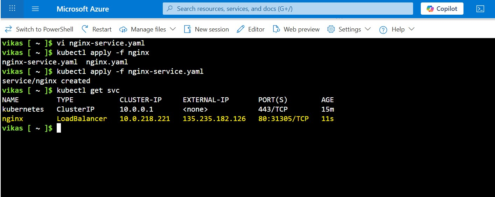
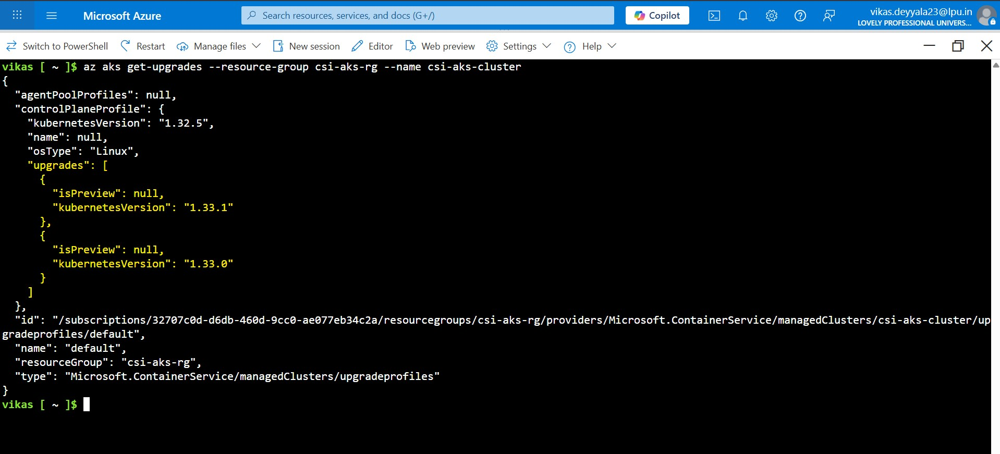

# 🚀 Week 6 – Kubernetes: Task 4

## 📌 Task: Managing Kubernetes with Azure Kubernetes Service (AKS)

## 🎯 Objective

For this task, I focused on taking a hands-on approach to **managing Kubernetes clusters using AKS (Azure Kubernetes Service)**. I didn’t just want to create a cluster, but also:

- Deploy workloads, scale them, and expose them to the internet
- Scaling both the applications and the cluster nodes
- Upgrade the Kubernetes version in a rolling fashion
- Implement RBAC for multi-user scenarios

This mirrors exactly how companies run production workloads on AKS.

---

## Step 1: Setting up the Environment

First, I created a dedicated resource group to keep everything neatly organized and scoped:

```bash
az group create --name csi-aks-rg --location centralindia
```


I always prefer creating a dedicated resource group. It keeps billing, access control, and eventual cleanup super clean.

---

## Step 2: Creating the AKS Cluster

Next, I provisioned the actual AKS cluster. I chose to start with 2 nodes, enabled the monitoring addon (which integrates with Azure Monitor), and let Azure generate SSH keys automatically:

```bash
az aks create \
  --resource-group csi-aks-rg \
  --name csi-aks-cluster \
  --node-count 2 \
  --node-vm-size Standard_A2_v2 \
  --enable-addons monitoring \
  --generate-ssh-keys

```


Azure handles the control plane, etcd, and Kubernetes API server — so as a user, I only need to manage worker nodes and workloads. The cluster was up in just a few minutes.


---

## Step 3: Connecting to the Cluster

To interact with the AKS cluster using `kubectl`, I retrieved the `kubeconfig`:

```bash
az aks get-credentials --resource-group csi-aks-rg --name csi-aks-cluster
```

Then I verified the connection:

```bash
kubectl get nodes
```
Cluster up and running, and both nodes are ready to take workloads.


---

## Step 4: Deploying a Sample Workload

To test the cluster, I deployed a basic NGINX application:

```bash
apiVersion: apps/v1
kind: Deployment
metadata:
  name: nginx
spec:
  replicas: 1
  selector:
    matchLabels:
      app: nginx
  template:
    metadata:
      labels:
        app: nginx
    spec:
      containers:
      - name: nginx
        image: nginx
        ports:
        - containerPort: 80
```


Then I exposed it via a LoadBalancer service so it could be accessed from the internet:

```bash
apiVersion: v1
kind: Service
metadata:
  name: nginx
spec:
  type: LoadBalancer
  selector:
    app: nginx
  ports:
  - protocol: TCP
    port: 80
    targetPort: 80
```

After a short wait, an external IP appeared:

```bash
kubectl get svc
```



I visited the IP in my browser and — boom! The default NGINX welcome page confirmed the app was live and reachable.


---

## Step 5: Scaling the Cluster & Workloads

### Scaling the Infrastructure (Nodes)

To simulate resource changes, I initially planned to scale up the cluster to handle higher load. However, due to limited vCPU quota in the Central India region under my Azure subscription, I had to scale down the cluster instead reducing the number of nodes from 2 to 1:

```bash
az aks scale --resource-group csi-aks-rg --name csi-aks-cluster --node-count 1
```


Azure took care of adding more VMs to the underlying VM scale set.

### Scaling the Application (Pods)

Then I scaled the NGINX deployment to 6 pods:

```bash
kubectl scale deployment nginx --replicas=6
```

And confirmed distribution across nodes:

```bash
kubectl get pods -o wide
```


This is exactly what companies do — scale the infra when expecting traffic spikes, then autoscale or manually adjust deployments.

### Autoscaling (HPA & VPA)
Although I scaled manually here for demonstration purposes, in real-world production, autoscalers like Horizontal Pod Autoscaler (HPA) and Vertical Pod Autoscaler (VPA) come into play:

- HPA automatically adjusts the number of pod replicas based on CPU/memory usage or custom metrics.

- VPA adjusts the pod’s resource requests/limits based on observed usage over time.

Similarly, AKS also supports Cluster Autoscaler, which automatically scales node pools up/down based on pending pods.

#### Enabling Cluster Autoscaler
To simulate automatic infrastructure scaling, I enabled the Cluster Autoscaler on the node pool. This allows AKS to automatically add or remove nodes based on pending pod demands:
```bash
az aks nodepool update \
  --resource-group csi-aks-rg \
  --cluster-name csi-aks-cluster \
  --name nodepool1 \
  --enable-cluster-autoscaler \
  --min-count 2 \
  --max-count 5
```

Now, when workload demands increase (e.g., more pods scheduled than current node capacity), AKS will automatically add nodes up to 5. When demand drops, it scales back down — optimizing cost and performance.

> In production, autoscaling is crucial for handling unpredictable workloads efficiently.

---

## 🔄 Step 6: Upgrading the AKS Cluster

Upgrading Kubernetes is essential for getting the latest features and patching security vulnerabilities.

Before upgrading, we need to see if newer Kubernetes versions are available for the cluster:


```bash
az aks get-upgrades --resource-group csi-aks-rg --name csi-aks-cluster
```

This command returns a list of versions you can upgrade to.
In our case, the current version is 1.32.5, and upgrades are available to:
- 1.33.0
- 1.33.1 (latest)



We chose to upgrade directly to the latest stable version, 1.33.1:

```bash
az aks upgrade --resource-group csi-aks-rg --name csi-aks-cluster --kubernetes-version 1.33.1 --yes
```

Azure performed a **rolling upgrade**, gracefully draining and upgrading one node at a time. My workloads (NGINX service) continued running without downtime. This really highlights the strength of Kubernetes in maintaining high availability.

After the upgrade completes, verify both the control plane and the nodes are running the new version.

```bash
az aks show \
  --resource-group csi-aks-rg \
  --name csi-aks-cluster \
  --query kubernetesVersion \
  --output table
```


>  In production, we typically test the upgrade in staging first and review API deprecations, workload compatibility, and third-party integrations before proceeding.

## Real Production Upgrades Are a Different Story

While this task involved a basic AKS upgrade for testing purposes, **upgrading Kubernetes clusters in production environments** is a much more sensitive and critical activity.

With **2.5+ years of industry experience at Infosys**, I've been part of several production-grade Kubernetes upgrades (EKS), and I can confidently say — **it requires careful planning, testing, and execution to avoid downtime or disruption**.

---

## Pre-Upgrade Planning & Prerequisites

Before any upgrade, we ensure a set of checks and validations are completed:

#### Read Release Notes Carefully

We always begin by reading the **official Kubernetes and cloud provider release notes** to understand:

- Deprecated APIs
- Breaking changes
- Security patches
- New features

This helps us plan any required changes to manifests, Helm charts, or custom workloads.

#### Test in Lower Environments First

We never upgrade production clusters directly.

We **mirror the upgrade in dev/staging environments** and let it run for 1–2 weeks to:

- Validate workload compatibility
- Test third-party integrations (e.g., logging/monitoring)
- Observe autoscaler behavior

#### Cordon the Nodes

To safely upgrade node pools, we prevent new workloads from being scheduled onto nodes:

```bash
kubectl cordon <node-name>
```
This ensures only existing pods are gracefully drained or evicted during rollout.

#### Control Plane and Data Plane Compatibility

We always ensure that:

- **Worker nodes (data plane)** are compatible with the upgraded control plane version.
- **AKS supports n-1 minor version skew**, meaning worker nodes can lag behind the control plane by one minor version — but long-term version drift can lead to instability, unsupported behavior, or upgrade failures.


#### Understand One-Way Upgrades

A **Kubernetes upgrade is a one-way operation** — once you upgrade to a new version, **you cannot downgrade**.

If rollback is absolutely required, the only option is to create a **fresh cluster** and migrate workloads manually.

> Because of this, we always allow a **grace period of 1–2 weeks** in non-production environments after a successful upgrade before we promote it to production.


#### Cluster Autoscaler & Kubelet Compatibility

After the control plane is upgraded, we make sure:

- The **Cluster Autoscaler** version is compatible with the new Kubernetes version.
- The **Kubelet** running on worker nodes either matches or falls within the supported version range of the control plane.

These components must be version-aligned to ensure:

- **Stable autoscaling behavior**
- **Proper node lifecycle management**
- **Compatibility with cloud provider integrations**


### Upgrade Process – 3 Main Phases

#### Control Plane Upgrade (Managed by Azure)
Since AKS is a managed service, Azure handles the control plane upgrade.

Azure ensures:

- High availability of the Kubernetes API server
- Safe upgrade without impacting workloads


#### Node Pool (Data Plane) Upgrade – Our Responsibility

Upgrading the **worker nodes (data plane)** is not handled automatically by Azure — it's our responsibility.

Depending on the environment and criticality, we choose between two approaches:

##### In-Place Rolling Upgrade

- Azure upgrades the node pool **one node at a time**.
- During this, **pods are drained** and automatically **rescheduled to other available nodes**.
- Minimal manual intervention, but some risk if workloads aren’t designed for disruption.

##### Blue-Green Upgrade (Preferred for Production)

This approach offers more control and rollback capability:

- Create a **new node pool** using the target Kubernetes version.
- Use **taints and labels** to control which workloads are scheduled on it.
- **Migrate workloads gradually** by updating node selectors or affinity rules.
- **Monitor the new node pool** for stability and performance.
- Once validated, **decommission the old node pool** safely.

> This reduces the blast radius of potential issues and provides a safer rollback option if needed.

---

During either upgrade strategy, we always **drain nodes gracefully** to avoid abrupt pod terminations:

```bash
kubectl drain <node-name> --ignore-daemonsets --delete-emptydir-data
```

We also ensure that Pod Disruption Budgets (PDBs) are respected for critical applications to maintain availability throughout the upgrade.

#### Add-ons Upgrade

Once both the **control plane** and **data plane (node pools)** have been successfully upgraded, the final step is to upgrade the **Kubernetes add-ons** to ensure full compatibility and cluster stability.

The key add-ons include:

- **CoreDNS** – Responsible for internal service discovery
- **kube-proxy** – Handles networking rules for services and pods
- **CNI Plugin** (e.g., Azure CNI or Kubenet) – Manages pod network interfaces
- **Monitoring/Logging Agents** – Tools like Prometheus, Grafana, Fluent Bit, Azure Monitor
- **Ingress Controllers** – Like NGINX, Traefik, or Azure Application Gateway Ingress Controller
- **Service Meshes** – If used, e.g., Istio, Linkerd, etc.

> It's essential to upgrade these components because they often rely on specific Kubernetes APIs or behavior. Keeping them out-of-sync with the cluster version may lead to failed workloads, logging gaps, or network issues.

Make sure to:
- Check version compatibility with the Kubernetes release.
- Follow official upgrade guides for each component.
- Monitor post-upgrade behavior using logs, alerts, and health checks.

---

## Step 7: Setting up RBAC for Multiple Users

To mimic how devs and ops have different access, I created a `Role` and `RoleBinding` for read-only access in the default namespace.

```bash
apiVersion: rbac.authorization.k8s.io/v1
kind: Role
metadata:
  namespace: default
  name: dev-readonly
rules:
- apiGroups: [""]
  resources: ["pods", "services"]
  verbs: ["get", "list"]
---
apiVersion: rbac.authorization.k8s.io/v1
kind: RoleBinding
metadata:
  name: dev-readonly-binding
  namespace: default
subjects:
- kind: User
  name: "devuser@company.com"
  apiGroup: rbac.authorization.k8s.io
roleRef:
  kind: Role
  name: dev-readonly
  apiGroup: rbac.authorization.k8s.io
```

Applied this with:

```bash
kubectl apply -f rbac.yaml
```

✅ Now `devuser@company.com` could view pods and services, but couldn’t change anything.


---

## Step 8: Cleaning Up – Deleting the AKS Cluster

Once we are done with work, it’s a good practice to delete unused resources to avoid unnecessary charges.

```bash
az aks delete --resource-group csi-aks-rg --name csi-aks-cluster --yes
```


---

## Conclusion

Working hands-on with Azure Kubernetes Service (AKS) gave me real-world insights into how production-grade Kubernetes clusters are managed in the cloud. From provisioning and deploying workloads, to scaling, upgrading, enabling autoscaling, and implementing RBAC I was able to touch every aspect of AKS that modern DevOps teams use daily.

--