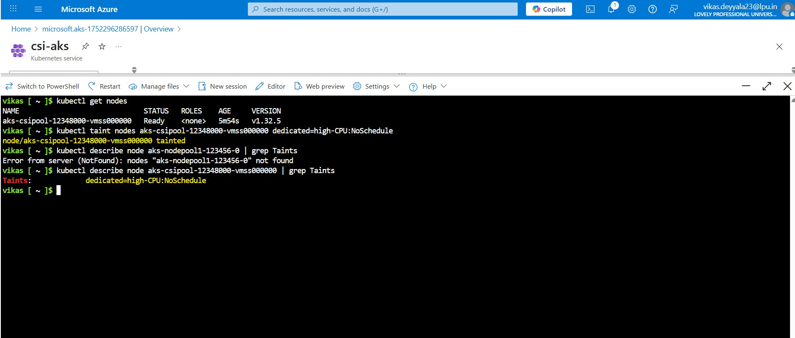

# 🐳 Week 6 – Kubernetes: Task 6

## Task: Configure Taints and Tolerations in Kubernetes

## Objective

This task revolved around configuring Taints and Tolerations in Kubernetes, which are essential for ensuring that pods are scheduled onto the right nodes under the right conditions.

In a production-grade Kubernetes environment, it is need to isolate workloads based on node capabilities, resources, or other factors. Taints and Tolerations are the perfect tools for this scenario. By using them, we can control where pods get scheduled, helping us create more robust and fault-tolerant clusters.

## What Are Taints and Tolerations?

**Taints:** These are applied to nodes and prevent pods from being scheduled onto those nodes unless they have a matching toleration.

**Tolerations:** These are applied to pods, allowing them to tolerate (or be scheduled onto) nodes with specific taints.

The goal was to set up a scenario where only specific workloads (pods) could be scheduled onto particular nodes based on custom taints, simulating a production-grade requirement where, for example, certain nodes are designated for specialized workloads (like high-CPU or high-memory).

---


## Step 1: Created Taints on Nodes

First, I needed to create taints on specific nodes in my cluster. In this case, I decided to taint one node to only accept workloads that require extra resources.

### Applied a Taint to a Node

I used the `kubectl taint nodes` command to add a taint. Here’s the exact command I used:

```bash
kubectl taint nodes <node-name> key=value:NoSchedule
```

`<node-name>`: The name of the node I wanted to taint. I fetched this using `kubectl get nodes` and picked a node (for example, `aks-nodepool1-123456-0`).

`key=value`: The key and value that I assigned for the taint. This could represent anything that makes sense in my cluster’s context.

`NoSchedule`: The effect of the taint. In this case, it means that no pod can be scheduled onto this node unless it has a matching toleration.

For example, I added the following taint to my node `aks-nodepool1-123456-0`:

```bash
kubectl taint nodes aks-csipool-12348000-vmss000000 dedicated=high-CPU:NoSchedule
```

This means that only pods with a toleration for the `dedicated=high-CPU` taint would be scheduled on this node.

### Verified the Taint

To verify that the taint was applied successfully, I ran:

```bash
kubectl describe node aks-csipool-12348000-vmss000000 | grep Taints
```

I saw the taint `dedicated=high-CPU:NoSchedule` listed under the node's description, confirming it was applied correctly.



---

## Step 2: Created Tolerations for Pods

Now that I had a taint on the node, I needed to create tolerations on the pods that would need to be scheduled onto this node. Tolerations allow a pod to “tolerate” a taint.

### Defined Tolerations in the Pod Manifest

I updated the pod manifest to include the appropriate tolerations. Here’s an example manifest:

```bash
apiVersion: v1
kind: Pod
metadata:
  name: high-cpu-app
spec:
  containers:
  - name: app-container
    image: nginx:latest
    ports:
    - containerPort: 80
  tolerations:
  - key: "dedicated"
    operator: "Equal"
    value: "high-CPU"
    effect: "NoSchedule"
```


After I added the toleration, I applied the updated manifest:

```bash
kubectl apply -f high-cpu-app.yaml
```

I then used the following command to check where the pod was scheduled:

```bash
kubectl get pods -o wide
```

I checked the NODE column to ensure that my `high-cpu-app` pod was scheduled on the tainted node `aks-nodepool1-123456-0`.


---

## Step 3: Simulated Pod Not Matching the Taint

To verify the behavior of taints and tolerations, I created another pod without the necessary toleration. This would demonstrate what happens when a pod doesn't match the node's taint.

#### Pod Manifest Without Toleration

Here’s an example of the manifest for a pod that does not have the toleration:

```bash
apiVersion: v1
kind: Pod
metadata:
  name: regular-app
spec:
  containers:
  - name: app-container
    image: nginx:latest
    ports:
    - containerPort: 80
```
Notice that there’s no tolerations section in this manifest.


I applied the pod manifest for the regular app:

```bash
kubectl apply -f regular-app.yaml
```


I used the following command to check the status of the pod:

```bash
kubectl describe pod regular-app
```


In the pod description, I saw that it wasn’t scheduled onto the tainted node. Kubernetes had scheduled it onto one of the other available nodes without the taint.

This confirmed that the pod was correctly not scheduled on the node with the taint because it didn’t have the matching toleration.

---

## Step 4: Removed the Taint

Once I finished testing, I wanted to clean up the setup. I removed the taint from the node using the following command:

```bash
kubectl taint nodes aks-csipool-12348000-vmss000000 dedicated:NoSchedule-
```

This command removes the `dedicated=high-CPU:NoSchedule` taint from the node, allowing any pod to be scheduled onto it.

### Verified Taint Removal

To confirm that the taint was removed, I ran:

```bash
kubectl describe node aks-csipool-12348000-vmss000000 | grep Taints
```


The taint was no longer present, confirming that the node was now available for all pods to be scheduled.

---

## Conclusion

Configuring taints and tolerations in Kubernetes is a powerful way to control where our workloads are scheduled. In this task, I successfully set up taints on a node to isolate specific workloads that required high CPU resources, and applied matching tolerations to pods to ensure they were scheduled on the correct nodes.

---