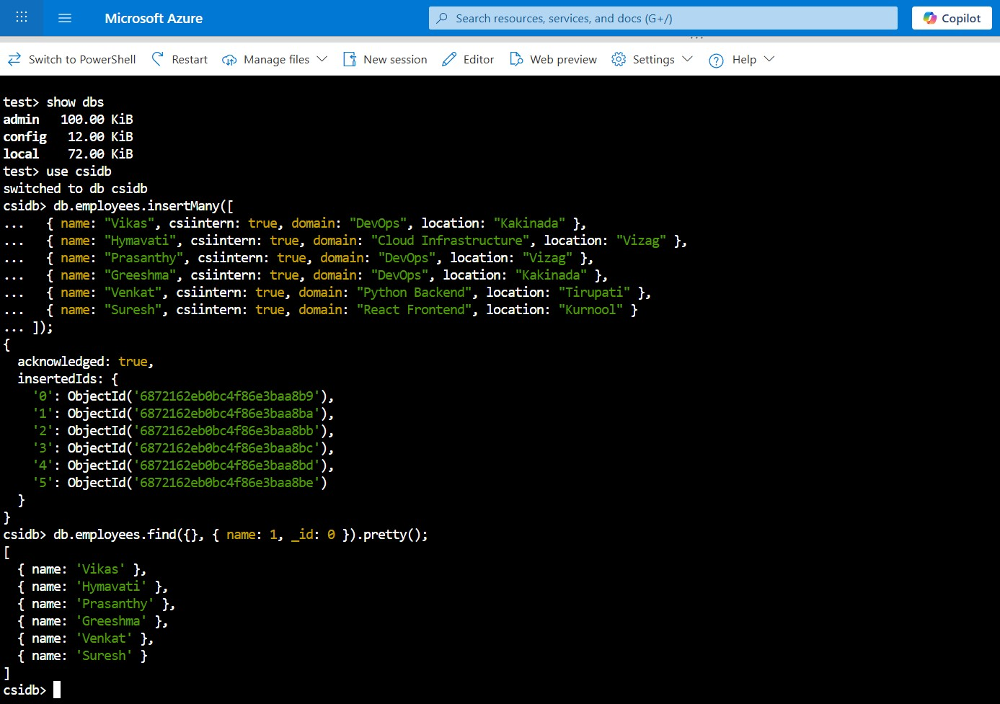

# Week 5 – Kubernetes: Task 7

## 📌 Task: Creating and Attaching Persistent Volume Claims (PVCs) to Pods

### 🎯 Objective

The main goal of this task was to get hands-on experience with persistent storage in Kubernetes using Persistent Volumes (PV) and Persistent Volume Claims (PVC). Instead of going with a basic or dummy setup, I decided to simulate a real-world use case by deploying MongoDB a stateful application and backing it with persistent storage. The idea was to ensure that MongoDB data persists even if the pod gets deleted or recreated, just like it would in a real production environment.

---

### Step 1: Creating a Persistent Volume Claim (PVC) with Dynamic Provisioning on AKS

Since I’m using an AKS (Azure Kubernetes Service) cluster, I used dynamic provisioning with the built-in **StorageClass** `managed-premium`. This is a standard approach in AKS that automatically provisions an **Azure Disk** and its corresponding **PersistentVolume (PV)** behind the scenes no need to create a PV manually.

#### csi-mongo-pvc.yaml

```bash
apiVersion: v1
kind: PersistentVolumeClaim
metadata:
  name: csi-mongo-pvc
spec:
  accessModes:
    - ReadWriteOnce
  resources:
    requests:
      storage: 1Gi
  storageClassName: managed-premium
```

#### Command to apply:

```bash
kubectl apply -f csi-mongo-pvc.yaml
```

#### Verification:

```bash
kubectl get pvc
```


Initially, the PVC appeared in the Pending state. This is expected it waits for a pod to be scheduled that actually uses the claim. Once the pod is created and scheduled on a node, Kubernetes dynamically provisions an Azure Disk, creates the PersistentVolume, and binds it to the PVC.


No need to manually create a PersistentVolume, AKS handles it automatically through the StorageClass.

---

### Step 2: Deploying the MongoDB Pod with the PVC Attached

Now that the storage was ready and claimed, I created a MongoDB pod that would use the claimed storage by mounting it at `/data/db`, which is MongoDB’s default data directory.

>  **Note:** As mentioned earlier, the PVC was in a `Pending` state initially because the dynamic provisioning in AKS (managed-premium StorageClass) follows a `WaitForFirstConsumer` binding mode. This means the actual Azure Disk (PV) is not created until a pod referencing the PVC is scheduled on a node. Once the pod is created, Kubernetes dynamically provisions the PersistentVolume and binds it to the PVC automatically.

#### mongo-deployment.yaml

```bash
apiVersion: v1
kind: Pod
metadata:
  name: csi-mongo-pod
spec:
  containers:
    - name: mongodb
      image: mongo:6
      ports:
        - containerPort: 27017
      env:
        - name: MONGO_INITDB_ROOT_USERNAME
          value: admin
        - name: MONGO_INITDB_ROOT_PASSWORD
          value: csi123
      volumeMounts:
        - mountPath: /data/db
          name: csi-mongo-storage
  volumes:
    - name: csi-mongo-storage
      persistentVolumeClaim:
        claimName: csi-mongo-pvc
```

#### Deployed with:

```bash
kubectl apply -f csi-mongo-pod.yaml
```

#### Verified the pod and persistent volume:

```bash
kubectl get pods
kubectl get pvc
kubectl get pv
```


After the pod was created, the PVC status changed from Pending to Bound, and the associated PersistentVolume was automatically created and attached.

To confirm the volume mount:

```bash
kubectl describe pod mongo-pod
```

The volume was successfully mounted inside the container at /data/db, confirming that dynamic provisioning worked as expected.


---

### Step 3: Inserting Data into MongoDB

Once the pod was up and running, I wanted to test if the storage was really working. So, I connected to the MongoDB shell inside the pod using:

```bash
kubectl exec -it mongo-pod -- mongosh -u admin -p csi123
```


Inside the Mongo shell, I created a new database called `csidb` and inserted some sample documents into a collection named `employees`:

```js
use csidb;

db.employees.insertMany([
  { name: "Vikas", csiintern: true, domain: "DevOps", location: "Kakinada" },
  { name: "Hymavati", csiintern: true, domain: "Cloud Infrastructure", location: "Vizag" },
  { name: "Prasanthy", csiintern: true, domain: "DevOps", location: "Vizag" },
  { name: "Greeshma", csiintern: true, domain: "DevOps", location: "Kakinada" },
  { name: "Venkat", csiintern: true, domain: "Python Backend", location: "Tirupati" },
  { name: "Suresh", csiintern: true, domain: "React Frontend", location: "Kurnool" }
]);
```

#### Verified data:

```js
db.employees.find({}, { name: 1, _id: 0 }).pretty();
```



All names were displayed, confirming that the database and insertions were working perfectly. Everything was working smoothly so far!

---

### Step 4: Testing Persistence by Deleting the Pod

Now came the real test, I wanted to see if the data would survive a pod deletion. In real-world production environments, pods can crash or get recreated for various reasons, so persistent storage should ensure that no data is lost.

I started by deleting the MongoDB pod:

```bash
kubectl delete pod csi-mongo-pod
```

In production, a StatefulSet would typically be used to manage stateful applications like MongoDB. It provides features like stable network identity, persistent storage, and automatic pod recreation (self-healing) through its built-in ReplicaSet controller. However, for simplicity, I used a basic Pod object in this setup. That means if the pod is deleted, it won’t come back automatically. I have to manually reapply the same YAML to recreate it.

re-created it using the same manifest:

```bash
kubectl apply -f csi-mongo-po.yaml
```

Once the pod came back up, I logged into MongoDB again:

```bash
kubectl exec -it csi-mongo-pod -- mongosh -u admin -p csi123
```


I switched to the same csidb database and ran a quick query to check if my previously inserted documents were still there:

```js
use csidb;
db.employees.find().pretty();
```


🎉 All previously inserted records were still present! This confirmed that the data was not tied to the pod lifecycle but persisted in the mounted volume exactly as expected from a PVC-backed storage system.

---

### Conclusion

This task really helped reinforce my understanding of how Kubernetes handles persistent storage. Using a real database like MongoDB made the exercise feel much more production-like. The biggest takeaway was seeing how PVCs help decouple storage from pod lifecycle, which is absolutely critical when managing stateful workloads in Kubernetes.

---
