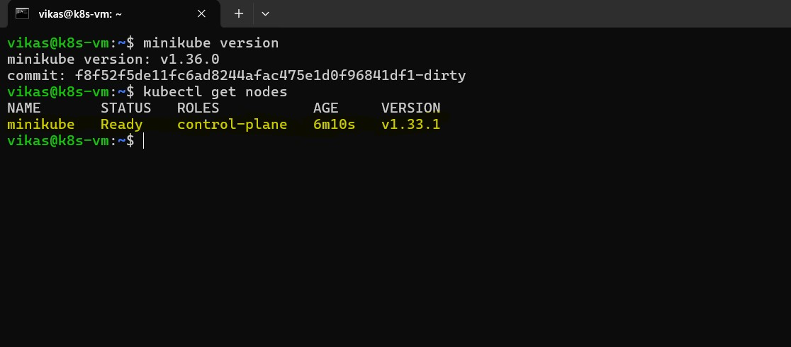
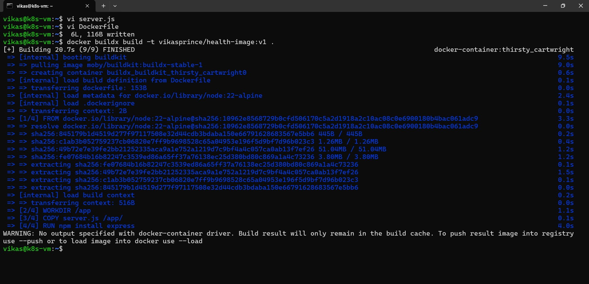
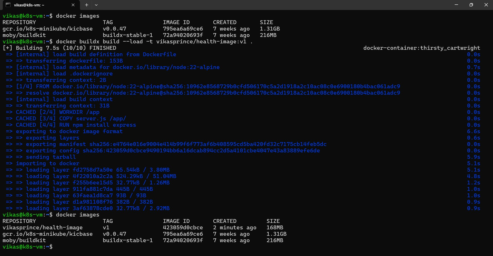
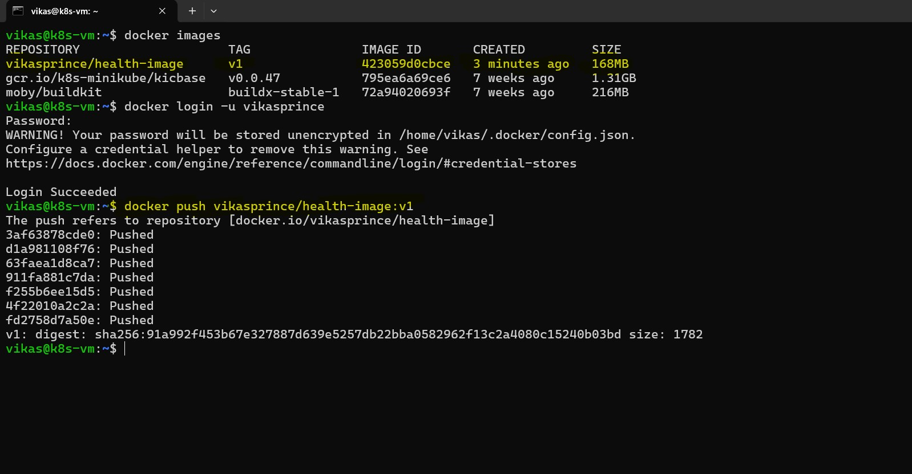
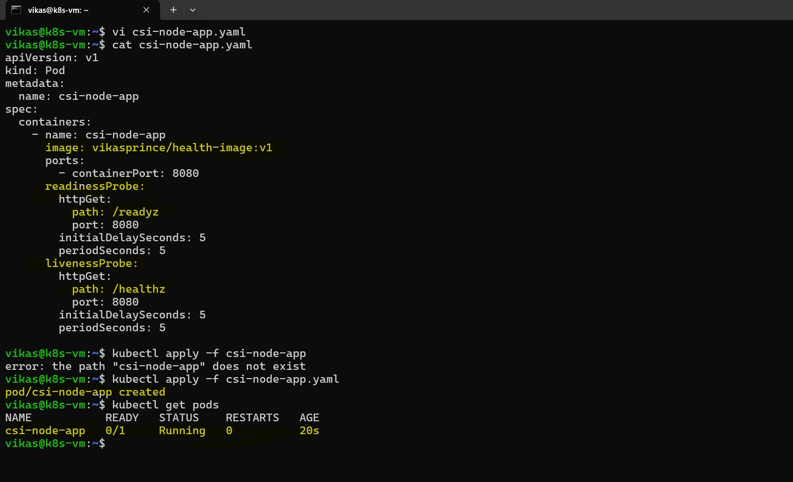
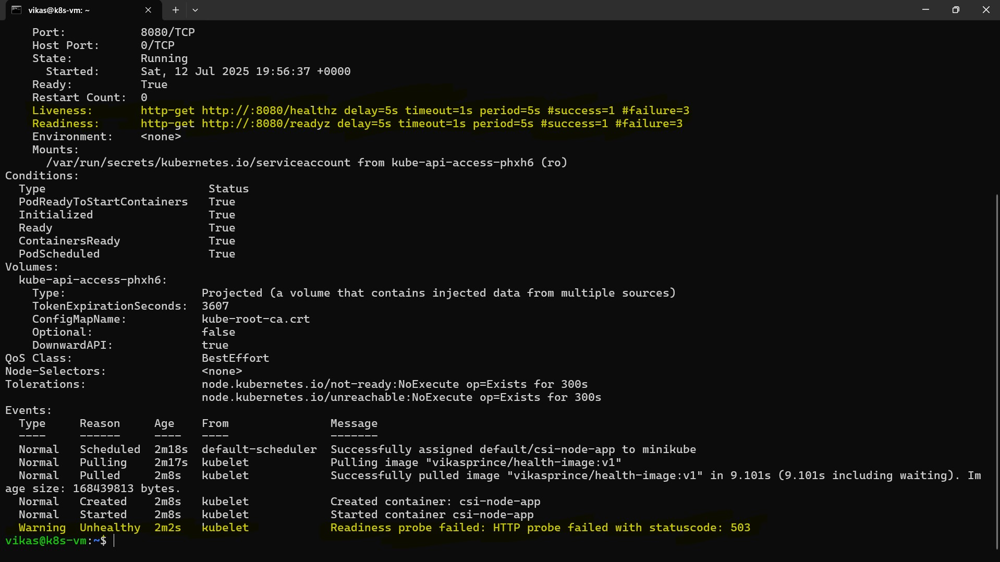
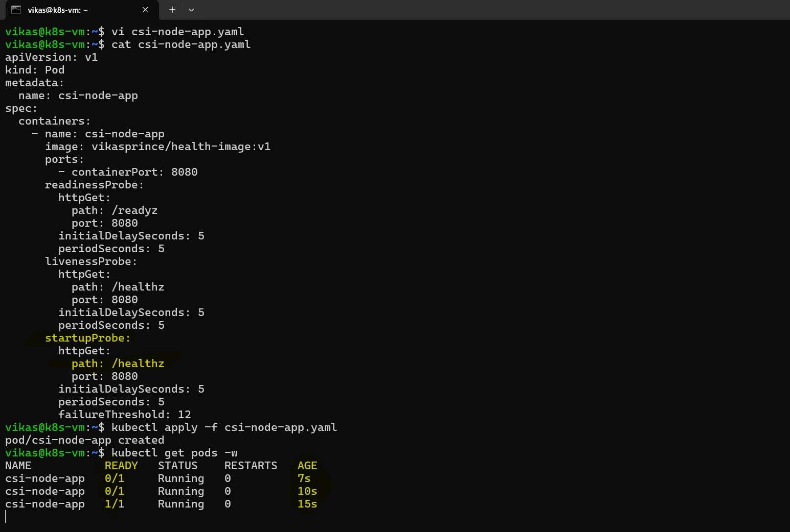
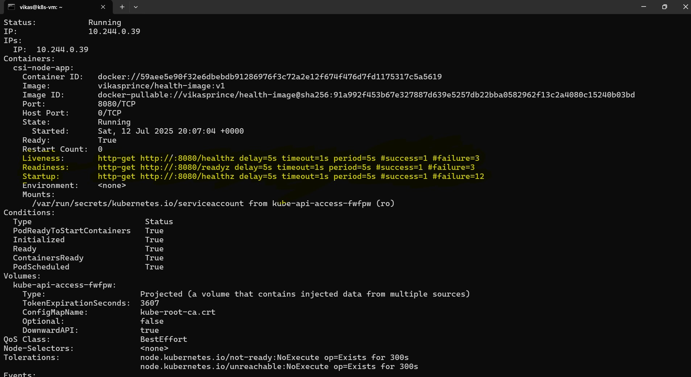

# 🐳 Week 6 – Kubernetes: Task 8

## Task: Configure Liveness and Readiness Probes for Pods in Minikube Cluster

## Objective

In this task, I configured Liveness and Readiness probes for pods in minikube cluster. These probes are essential for ensuring the health of the application and maintaining continuous operation by allowing Kubernetes to intelligently manage pod restarts and traffic routing. I will walk you through the steps I took to implement these probes using a simple Node.js application.

## What Are Probes?

**Liveness Probe:** Checks whether the container is running. If the liveness probe fails, Kubernetes will kill the container and try to restart it.  

**Readiness Probe:** Checks whether the container is ready to start accepting traffic. If the readiness probe fails, the pod will not receive traffic, but it won’t be killed.

In this task, I focused on configuring both probes for my application running inside an Minikube cluster.

---

## Step 1: Prepare Minikube Cluster

First, I made sure my Minikube cluster was up and running. I configured kubectl to interact with my local Minikube cluster:

To confirm that the cluster was accessible and operational, I ran:

```bash
kubectl get nodes
```



This confirmed that the Minikube node was available and operational, so I was ready to proceed with configuring the probes.

---

### Step 2: Create the Simple server.js Application

I created a basic Node.js application `(server.js)` that would act as the backend for testing the readiness and liveness probes. Here’s the content of the `server.js` file:

This application exposes two endpoints:

  - **/readyz:** Simulates a readiness probe that will respond with 200 OK after 10 seconds.

  - **/healthz:** Simulates a liveness probe that always responds with 200 OK.


### Step 3: Create Dockerfile and Build the Image
Next, I created a Dockerfile to containerize my server.js application:

```bash
FROM node:22-alpine
WORKDIR /app
COPY server.js /app/
RUN npm install express
EXPOSE 8080
CMD ["node", "server.js"]
```

#### Building the Docker Image Using Buildx

After creating the `Dockerfile`, I built the Docker image using Docker `Buildx`, which is the modern replacement for the legacy Docker builder.

```bash
docker buildx build -t vikasprince/health-app:v1 .
```

This command created an image called `health-app:v1`, which would be used in the Kubernetes pod manifest.



This command builds the image using BuildKit but does not automatically make it available to the local Docker environment (like docker images), unless you specify an output method.

#### Loading the Image into the Local Docker Daemon

To use the built image locally (for running or referencing in Kubernetes pods), I re-ran the build with the --load flag:

```bash
docker buildx build --load -t vikasprince/health-image:v1 .
```

This step ensures that the image is available for use with Kubernetes manifests or local testing.



### Step 4: Push the Docker Image to a Container Registry

Once the Docker image was built, I pushed it to Azure Container Registry (ACR) to make it accessible for the Kubernetes cluster.

```bash
docker push vikasprince/health-image:v1
```
This made the csi-node-app image available in the docker repository for use in minikube.



## Step 5: Created the Kubernetes Pod Manifest

Now that the Docker image was ready, I created a Kubernetes pod manifest `(csi-node-app.yaml)` to deploy the app into my minikube cluster. I configured both the `readiness` and `liveness probes` in the manifest as follows:

```bash
apiVersion: v1
kind: Pod
metadata:
  name: csi-node-app
spec:
  containers:
    - name: csi-node-app
      image: node:14
      ports:
        - containerPort: 8080
      readinessProbe:
        httpGet:
          path: /readyz
          port: 8080
        initialDelaySeconds: 5
        periodSeconds: 5
      livenessProbe:
        httpGet:
          path: /healthz
          port: 8080
        initialDelaySeconds: 5
        periodSeconds: 5
```

Here’s what each part of the manifest means:  
- `readinessProbe` and `livenessProbe` are the two sections where I defined the probes for the app.  
- `httpGet` defines that the probe will make an HTTP GET request to the `/health` endpoint on port `8080` of the container.  
- `initialDelaySeconds` sets how long Kubernetes will wait after starting the container before performing the first probe.  
- `periodSeconds` defines how often the probe should be executed.

---

## Step 3: Deploy the Pod
With the manifest ready, I deployed the pod to the minikube cluster:

```bash
kubectl apply -f csi-node-app.yaml
```

This created the pod in the kubernetes cluster. To verify the pod was up and running, I used the following command:

```bash
kubectl get pods
```



The pod was running, but the readiness probe would initially fail because the app was simulating a delay in readiness.

---

## Step 7: Test the Readiness Probe

To test the `Readiness Probe`, I waited for the 10-second delay to pass (as specified in the `server.js` file) before the `/readyz` endpoint responded with `200 OK.`

I described the pod to observe its status:

```bash
kubectl describe pod csi-node-app
```

Initially, the pod was marked as `NotReady`. After the readiness delay, the status transitioned to `Ready`, confirming that Kubernetes correctly handled the readiness check.



## Step 8: Test the Liveness Probe

Next, I tested the `Liveness Probe`. To simulate a failure, I manually triggered an error in the application by stopping the Node.js server:

```bash
kubectl delete pod csi-node-app
```

This caused the pod to enter a` CrashLoopBackOff` state, meaning Kubernetes attempted to restart the pod but the liveness check continued to fail. I observed this state by running:

```bash
kubectl get pods
```

Once Kubernetes restarted the pod and it passed the health checks, the pod was back to a Running state.

---

## Step 9: Adding the Startup Probe

At this point, the application seemed to be working well with the adjusted Readiness and Liveness probes. However, I realized that the `Startup Probe` might still be necessary if the application had a longer initialization period. This would prevent Kubernetes from prematurely starting the Readiness and Liveness probes, especially if the app takes longer to initialize.

- A Startup Probe is useful when the application has a long startup time (e.g., takes more than 10 seconds). Without it, Kubernetes might start checking the Readiness and Liveness probes too early, causing false failures.

I would add the Startup Probe like this:

```bash
startupProbe:
  httpGet:
    path: /healthz
    port: 8080
  initialDelaySeconds: 5
  periodSeconds: 5
  failureThreshold: 12  # Allows for a longer startup time before failing
```

## Step 11: Test the Adjusted Setup

Once I added the Startup Probe, I redeployed the pod:

```bash
kubectl apply -f csi-node-app.yaml
```

I then checked the pod’s status to confirm everything was running properly:

```bash
kubectl get pods
```



After the pod was `Running`, I verified the probe status with:

```bash
kubectl describe pod csi-node-app
```

I made sure that the Startup Probe was functioning correctly, ensuring Kubernetes waited for the application to complete its startup process before checking the other probes.



---

## Conclusion

Configuring Liveness and Readiness probes was a crucial step to ensure that my application remains healthy and that Kubernetes can intelligently manage pod restarts and traffic routing. By simulating failures in both probes, I was able to confirm that Kubernetes responds appropriately by restarting unhealthy containers and ensuring that only ready containers receive traffic.

---