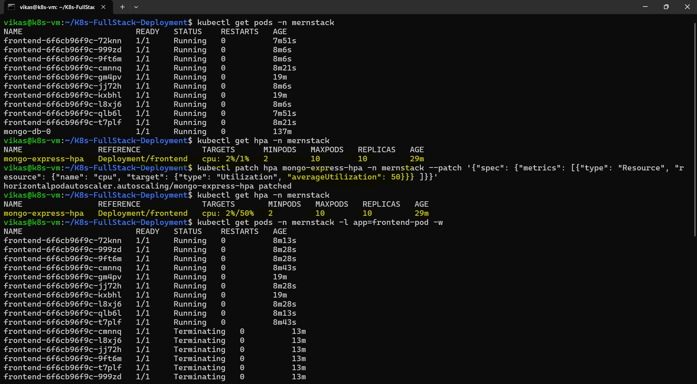

# 🚀 Week 4 – Kubernetes: Task 9
## 📌 Task: Configure autoscaling in your cluster (Horizontal scaling) ? No!!! Deploying a Full-Stack Application with Autoscaling

For this week’s task, rather than just configuring a simple **Horizontal Pod Autoscaler (HPA)**, I decided to **take it to the next level** by combining all Kubernetes concepts and deploying a complete full-stack **Full Stack** application using **MongoDB** and **Mongo Express** official Images.

This application setup involves **CRUD operations** and integrates multiple key Kubernetes features such as:

- **Replicas and StatefulSets** for handling MongoDB and Mongo Express
- **Persistent storage** with PV and PVC for MongoDB data
- **Secrets and ConfigMaps** to manage sensitive data and configuration
- **Health probes** (Liveness and Readiness) to ensure the application is healthy and ready for traffic
- **Horizontal Pod Autoscaling (HPA)** to automatically scale Mongo Express based on resource usage (like CPU utilization) and **many more...**

In this project, I’m combining **all the tasks and concepts** from previous weeks into a **real-world application scenario** to simulate a dynamic, scalable, and production-ready environment.

---

# Full Stack Application Deployment on Kubernetes

Deploying a full stack application on a Kubernetes Minikube cluster. This project utilizes official Docker images for MongoDB **mongo**, for UI by using Node and express **mongo-express**, enabling CRUD operations with a simple setup.

## Kubernetes Resources Used in Deployment

This deployment utilizes the following Kubernetes resources:

- **Deployment**: Manages the Mongo Express application deployment, ensuring the desired number of replicas.

- **StatefulSet**: Used for managing MongoDB instances, providing stable network identities and persistent storage.

- **Horizontal Pod Autoscaler**: Automatically scales the number of Mongo Express pods based on CPU utilization.

- **Service**: Exposes both MongoDB and Mongo Express applications, enabling communication between them and external access.

- **Secrets**: Stores sensitive data, such as MongoDB credentials, securely.

- **ConfigMaps**: Manages configuration data for Mongo Express, allowing for dynamic configuration updates.

- **Persistent Volume (PV)**: Represents storage resources for MongoDB data, ensuring data persistence.

- **Persistent Volume Claim (PVC)**: Requests storage resources defined by the Persistent Volume for MongoDB.

- **Namespaces**: Organizes resources within a specific namespace for better management and isolation.

- **Readiness Probes**: Checks the readiness of Mongo Express pods before routing traffic to them.

- **Liveness Probes**: Monitors the health of Mongo Express pods to ensure they are running properly.

- **Resource Quota**: Limits the resource usage for the namespace to prevent resource contention.

- **Deployment Strategies**: Defines how updates are applied to the deployment, ensuring minimal downtime.

- **Replicas**: Specifies the number of pod replicas for both MongoDB and Mongo Express to ensure availability.


These resources work together to provide a robust, scalable, and maintainable deployment for the Full stack application.

## Architecture

Below is the architecture of this application, illustrating its key components and how they interact.


### Step 1: Setting Up the Kubernetes Environment

First things first: I made sure that Minikube and kubectl were set up and running on my local machine. Since I wanted to replicate a production environment, I also ensured that my Kubernetes cluster was ready to handle multiple resources, including persistent storage, secrets, and replicas.


### Step 2: Cloning the Repository and Preparing Kubernetes Resources

After getting Minikube and kubectl set up, I cloned the repository that contains all the necessary Kubernetes manifests for the MERN stack deployment. This repository has the following key components:

```bash
git clone https://github.com/Vikas-Prince/K8s-FullStack-Deployment.git
cd K8s-FullStack-Deployment
```


### Step 3: Creating a Namespace

I created a separate namespace to ensure the resources for this deployment are isolated from other applications running in the same cluster. This step helps in organizing and managing Kubernetes resources more effectively.

```bash
kubectl apply -f namespace.yml
kubectl get ns
```


### Step 4: Setting Up Persistent Volumes and Persistent Volume Claims

Next, I set up the Persistent Volumes (PVs) and Persistent Volume Claims (PVCs) for MongoDB data. This is critical since MongoDB is a stateful application, and I need the data to persist across pod restarts.

```bash
cd database
kubectl apply -f persistent-volume.yml
kubectl apply -f persistent-volume-claim.yml
```

I made sure the PVC was properly bound to the Persistent Volume, which allows MongoDB to store its data even if the pod restarts or crashes.


### Step 5: Creating Secrets and ConfigMaps

Since MongoDB requires sensitive credentials, I created a Secret to store the MongoDB credentials securely. I also created a ConfigMap to store the service name for Mongo.

```bash
kubectl apply -f mongo-secret.yml
kubectl apply -f mongo-config.yml
```

These resources ensure that my Mongo Express and MongoDB applications can function properly without hardcoding sensitive information.


### Step 6: Deploying MongoDB

Next, I deployed MongoDB using a StatefulSet to ensure data persistence and stable network identities. I also created a service for MongoDB so it could be accessed by other pods (like Mongo Express).

```bash
kubectl apply -f mongo-statefulset.yml
kubectl apply -f mongo-service.yml
```

The StatefulSet is crucial here because it manages the MongoDB pod’s lifecycle, ensuring the data remains persistent and the pod’s identity remains stable.


### Step 7: Deploying Mongo Express

Now that MongoDB was up and running, I deployed the Mongo Express application, which provides a simple UI to interact with the MongoDB database. I also created a service to expose Mongo Express so I could access it externally.

```bash
kubectl apply -f mongo-express-deployment.yml
kubectl apply -f mongo-express-service.yml
```


### Step 8: Configuring Horizontal Pod Autoscaling (HPA)

The next step was to enable Horizontal Pod Autoscaling for Mongo Express to automatically scale based on resource usage, like CPU utilization. To do this, I first made sure the Metrics Server was installed, as it collects resource metrics for autoscaling.

```bash
kubectl apply -f https://github.com/kubernetes-sigs/metrics-server/releases/latest/download/components.yaml
```


After installing the Metrics Server, I modified its deployment to allow insecure TLS communication with Kubelets:

```bash
kubectl edit deployment metrics-server -n kube-system
```

Then I added the following flags:

```bash
--kubelet-insecure-tls
--kubelet-preferred-address-types=InternalIP,ExternalIP,Hostname
```

After restarting the Metrics Server, I applied the HPA configuration for Mongo Express:

```bash
kubectl apply -f mongo-express-hpa.yml
```

This step ensures that Mongo Express will scale automatically depending on the resource utilization.


### Step 9: Verifying the Deployment

Once everything was deployed, I verified the status of my pods and services to ensure everything was working as expected.

```bash
kubectl get pods -n mernstack
kubectl get services -n mernstack
```

This allowed me to check if all the components (MongoDB, Mongo Express, HPA, etc.) were up and running.

### Step 10: Accessing Mongo Express

Now that Mongo Express was running, I needed to access it through the web interface. I used the socat script to expose the Mongo Express UI externally.

```bash
chmod +x socat.sh
./socat.sh
```

Once the script was running, I accessed the Mongo Express web interface at the public IP with the designated port. The login credentials for Mongo Express were:

- Username: `admin`
- Password: `pass`


## Step 11: Verifying Horizontal Pod Autoscaling (HPA)

###  Initial HPA Setup and Pod Status

Initially, the frontend deployment (running the `Mongo Express` interface) is configured with `2 replicas`, and the HPA `(mongo-express-hpa)` is set with the following specs:
- `minReplicas:` 2
- `maxReplicas:` 10
- Target CPU utilization: 85%

```bash
kubectl get pods -n mernstack
kubectl get hpa -n mernstack
```


At this stage, the pods are consuming very little CPU (around 2%), so no scaling occurs — the deployment remains at 2 pods.

###  Triggering Autoscaling with Lower Threshold

To test whether autoscaling works, I temporarily patched the HPA to lower the CPU threshold to **1%**, which is below the current CPU usage of the pods **(~2%)**. This forces the HPA controller to scale up the pods.

**Patch the HPA to 1%:**

```bash
kubectl patch hpa mongo-express-hpa -n mernstack \
--patch '{"spec": {"metrics": [{"type": "Resource", "resource": {"name": "cpu", "target": {"type": "Utilization", "averageUtilization": 1}}}]}}'
```

### Monitor Autoscaling in Action

After running the load test, I checked the HPA status again to see if the number of pods had increased in response to the higher CPU usage:

```bash
kubectl get hpa -n mernstack
```

Then, I monitored the pod count to see the HPA in action:

```bash
kubectl get pods -n mernstack -l app=frontend-pod -w
```

Over time, the pod count increased, scaling up to as many as 10 pods, since the usage exceeded the new threshold of 1%.


### Testing Scale-Down Behavior

Once I confirmed that scaling up worked, I patched the HPA again to a more reasonable threshold (e.g., 50% CPU) to test scale-down behavior:

**Patch the HPA to 50%:**

```bash
kubectl patch hpa mongo-express-hpa -n mernstack \
--patch '{"spec": {"metrics": [{"type": "Resource", "resource": {"name": "cpu", "target": {"type": "Utilization", "averageUtilization": 50}}}]}}'
```

Since actual CPU usage is still low (~2%), HPA begins gradually scaling the pod count back down toward the minimum replica count (2 pods).

Again, I monitored the pod activity using:

```bash
kubectl get pods -n mernstack -w
```




Finally, once the load dropped and the target CPU utilization was patched back to a realistic threshold (50%), the HPA gradually scaled down the number of pods. Eventually, the deployment returned to the desired minimum replica count of 2, confirming that both scale-up and scale-down functionalities are working as expected.


---

## Conclusion

By combining all the key Kubernetes concepts from StatefulSets, Persistent Volumes, and Secrets to HPA and health probes I’ve gone beyond a basic autoscaler setup and built a fully functional, scalable, and production-like Full stack deployment. This project not only tested my knowledge from previous weeks but brought everything together into a real-world scenario.

---