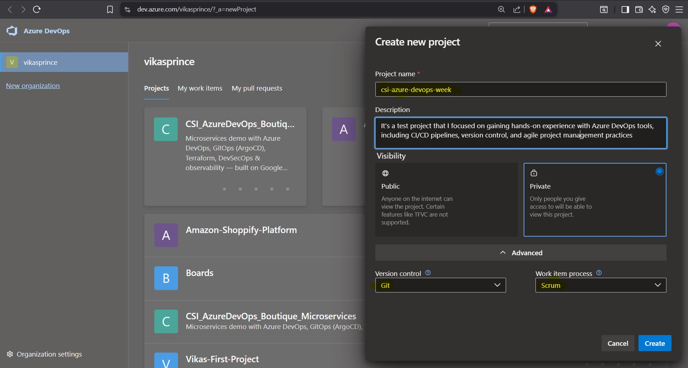
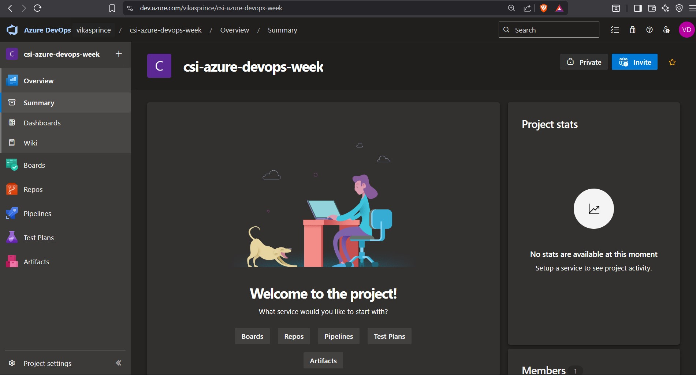
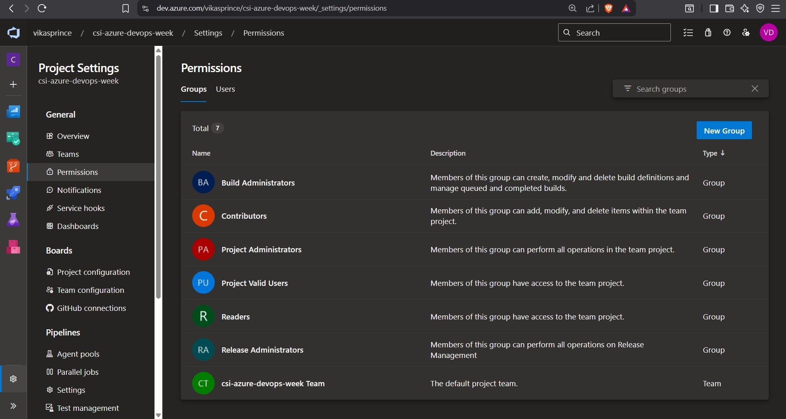
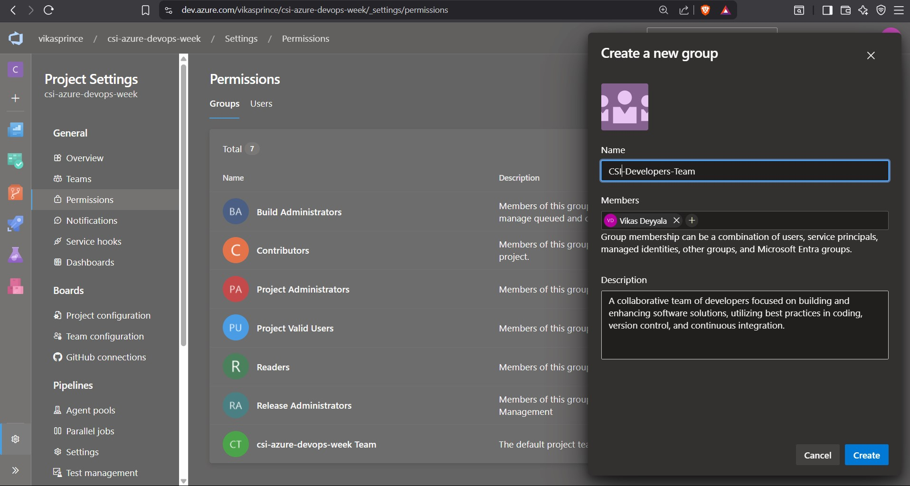
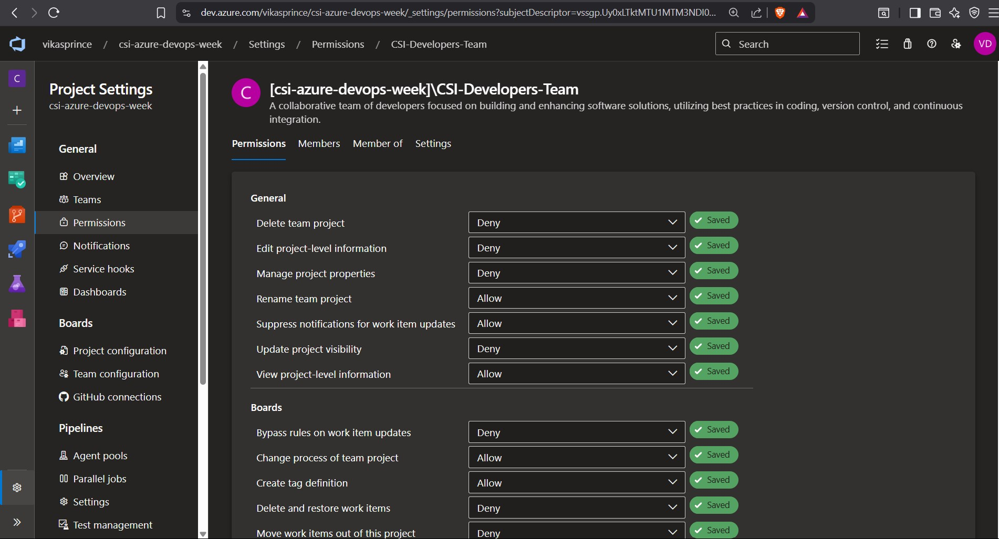
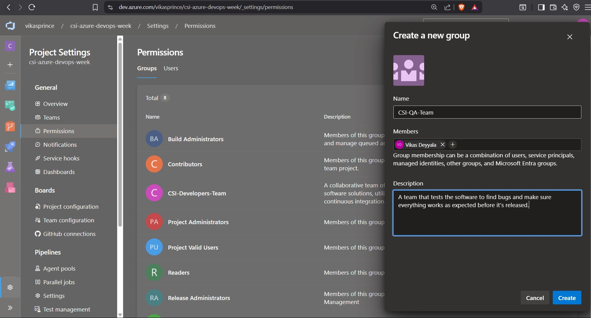
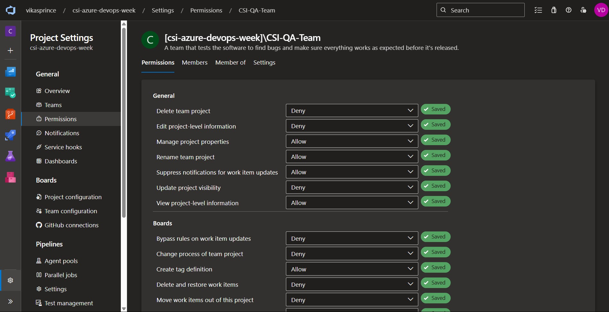
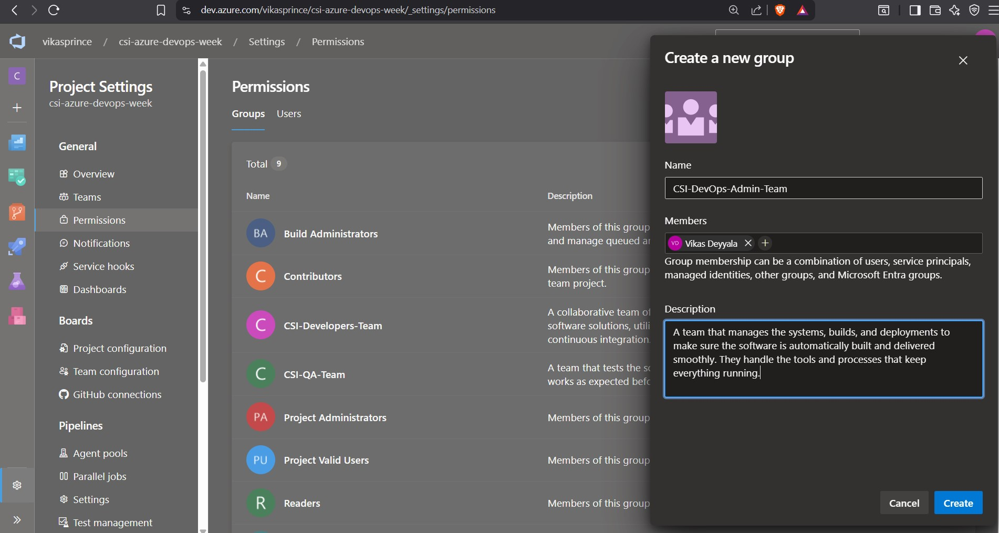
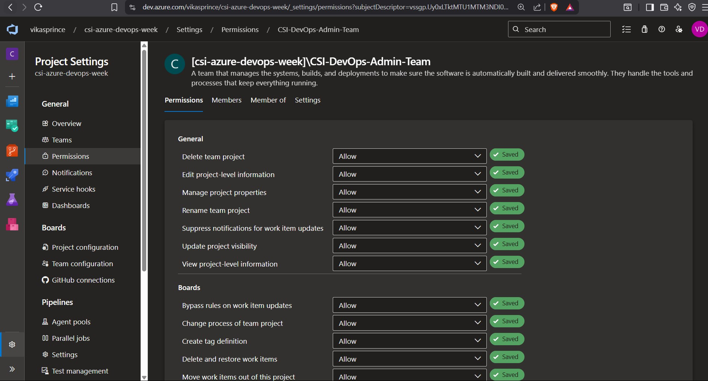

# Week 7 – Task 1: Azure DevOps

## Task: Project Creation & Group Policy Implementation

## Task Overview:
As part of Week 7 Task1, I explored the core project and permission management features of **Azure DevOps**. The focus was on **creating a new project**, **defining user groups**, and **applying proper group permissions** just like how it's done in real-time DevOps teams for maintaining access control, compliance, and collaboration.

---

## Objective:
- Create a new Azure DevOps project.
- Define multiple user groups (e.g., Developers, QA, Admins).
- Assign meaningful permissions to each group.
- Apply policies to restrict access or grant elevated roles where necessary.

---

## Step-by-Step Execution:

### Logged in to Azure DevOps Portal
- Accessed [https://dev.azure.com](https://dev.azure.com).
- Used my organizational credentials to log in.
- Selected the appropriate Azure DevOps **Organization** under which this new project will reside.

### Created a New Project
- Clicked on the **“New Project”** button on the Azure DevOps homepage.
- **Project Name:** `csi-azure-devops-week`
- **Visibility:** Kept it **Private** (since we want only internal team members to access it).
- **Advanced Options:**
  - Version Control: `Git`
  - Work Item Process: `Scrum`

 Clicked **Create** and waited for the project workspace to initialize.

---

### Navigated to Project Settings
- Once the project was created, went to the **Project Settings** located at the bottom left corner of the screen.
- From here, began managing **Permissions**, **Groups**.

---

### Created Custom User Groups
Azure DevOps provides default groups (Project Administrators, Contributors, Readers..), but I created specific custom groups for clearer access control:

#### Developers Group
- Created a group named `CSI-Developers-Team`
- Members: Added Myself as a Member

#### General Permissions:
- **Delete team project**: Not allowed
- **Edit project-level information**: Not allowed
- **View project-level information**: Allowed
- **Update project visibility**: Not allowed

#### Boards:
- **Create tag definition**: Allowed
- **Bypass rules on work item updates**: Not allowed
- **Delete and restore work items**: Not allowed
- **Move work items out of this project**: Not allowed
- **Permanently delete work items**: Not allowed

#### Analytics:
- **View analytics**: Allowed
- **Edit shared Analytics views**: Not allowed
- **Delete shared Analytics views**: Not allowed

#### Test Plans:
- **Create test runs**: Allowed
- **Delete test runs**: Not allowed
- **Manage test configurations**: Not allowed
- **View test runs**: Allowed

#### Other:
- **Manage delivery plans**: Not allowed

#### QA Group
- Created a group named `CSI-QA-Team`

- Members: Added Myself as a Tester

#### Admin Group
- Created a group named `CSI-DevOps-Admin-Team`

- Members: Only leads/senior engineers (Added my self again)
- Permissions:
  - **Full Access:** 
  - Includes managing repos, policies, pipelines, boards, and artifacts.

  

> Each group was created under **Project Settings > Permissions > New Group**, and the necessary permissions were selected appropriately.

---

### Conclusion

In this task, I created a new Azure DevOps project and set up three user groups: Developers, QA, and Admins. Each group was assigned specific permissions tailored to their roles. Developers have limited permissions, QA can manage test runs, and Admins have full control over the project. This setup ensures proper access control and collaboration within the team.

---